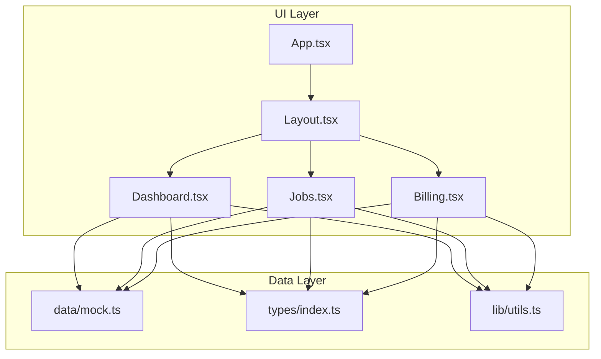
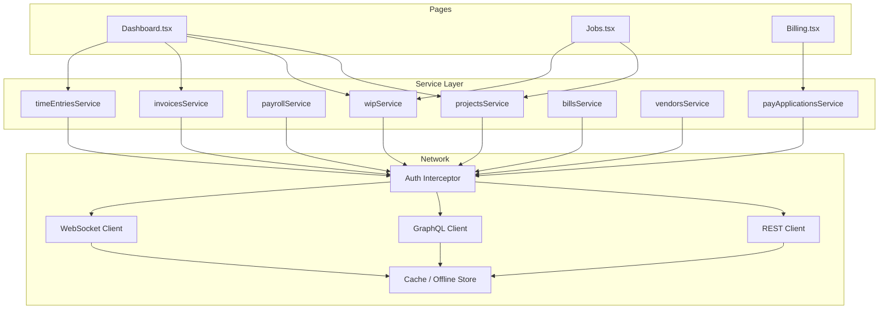
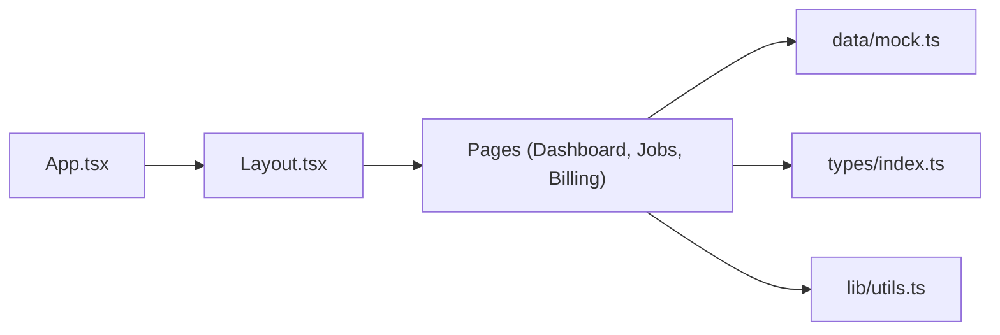
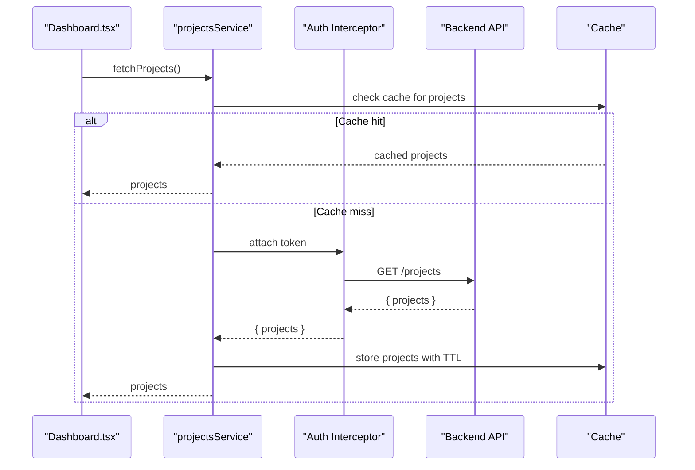
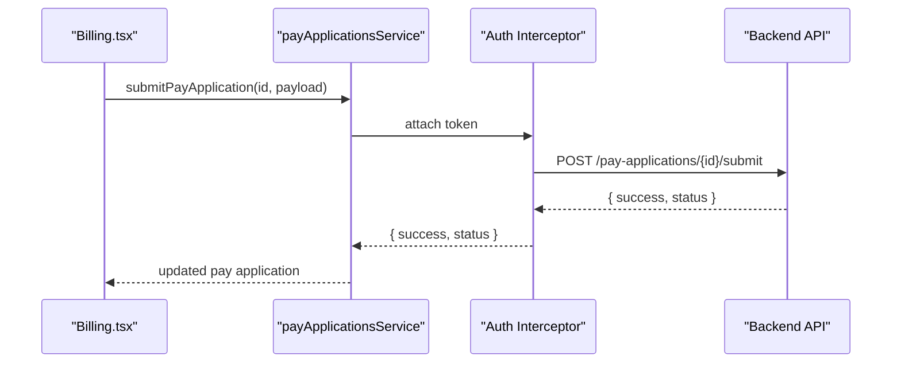
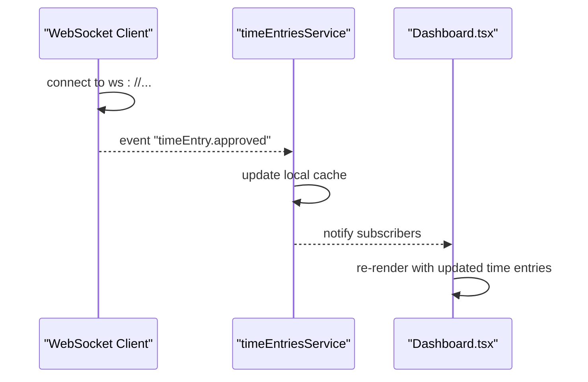

# API Integration Guide

<cite>
**Referenced Files in This Document**
- [mock.ts](file://app/src/data/mock.ts)
- [index.ts](file://app/src/types/index.ts)
- [Dashboard.tsx](file://app/src/pages/Dashboard.tsx)
- [Jobs.tsx](file://app/src/pages/Jobs.tsx)
- [Billing.tsx](file://app/src/pages/Billing.tsx)
- [App.tsx](file://app/src/App.tsx)
- [Layout.tsx](file://app/src/components/layout/Layout.tsx)
- [utils.ts](file://app/src/lib/utils.ts)
- [package.json](file://app/package.json)
</cite>

## Table of Contents
1. [Introduction](#introduction)
2. [Project Structure](#project-structure)
3. [Core Components](#core-components)
4. [Architecture Overview](#architecture-overview)
5. [Detailed Component Analysis](#detailed-component-analysis)
6. [Dependency Analysis](#dependency-analysis)
7. [Performance Considerations](#performance-considerations)
8. [Troubleshooting Guide](#troubleshooting-guide)
9. [Conclusion](#conclusion)
10. [Appendices](#appendices)

## Introduction
This guide explains how to integrate the frontend with backend services by replacing the current mock data layer with a robust service layer that handles API requests, error handling, and data transformation. It covers authentication and authorization patterns, request/response formats, retry mechanisms, REST/GraphQL/WebSocket integration, data synchronization, offline considerations, caching strategies, testing approaches, migration steps from mock data to production APIs, and security best practices.

The application currently uses static mock data for all pages and features. The goal is to introduce a typed, centralized service layer that abstracts network calls while preserving the existing UI behavior and type contracts.

## Project Structure
The app is a React + TypeScript Vite project organized into:
- Pages: feature screens (Dashboard, Jobs, Billing, etc.)
- Data: mock datasets used by pages
- Types: shared domain types defining the shape of entities
- Components: reusable UI components and layout shell
- Lib: utilities for formatting and class merging

**Diagram sources**
- [App.tsx:1-78](file://app/src/App.tsx#L1-L78)
- [Layout.tsx:1-77](file://app/src/components/layout/Layout.tsx#L1-L77)
- [Dashboard.tsx:1-259](file://app/src/pages/Dashboard.tsx#L1-L259)
- [Jobs.tsx:1-200](file://app/src/pages/Jobs.tsx#L1-L200)
- [Billing.tsx:1-163](file://app/src/pages/Billing.tsx#L1-L163)
- [mock.ts:1-246](file://app/src/data/mock.ts#L1-L246)
- [index.ts:1-255](file://app/src/types/index.ts#L1-L255)
- [utils.ts:1-45](file://app/src/lib/utils.ts#L1-L45)

**Section sources**
- [App.tsx:1-78](file://app/src/App.tsx#L1-L78)
- [package.json:1-44](file://app/package.json#L1-L44)

## Core Components
- Types define the domain model used across the app: projects, employees, time entries, payroll runs, pay applications, change orders, WIP entities, GL accounts, invoices, bills, vendors, and dashboard KPIs.
- Mock data provides arrays of these entities consumed directly by pages.
- Pages render UI using this data without any network abstraction today.

Key responsibilities:
- Types: enforce consistent shapes for API responses and local state.
- Mock: provide sample data for development and UI prototyping.
- Pages: present data and handle user interactions; currently no API logic.

**Section sources**
- [index.ts:1-255](file://app/src/types/index.ts#L1-L255)
- [mock.ts:1-246](file://app/src/data/mock.ts#L1-L246)
- [Dashboard.tsx:1-259](file://app/src/pages/Dashboard.tsx#L1-L259)
- [Jobs.tsx:1-200](file://app/src/pages/Jobs.tsx#L1-L200)
- [Billing.tsx:1-163](file://app/src/pages/Billing.tsx#L1-L163)

## Architecture Overview
Current architecture:
- Pages import mock data and render it directly.
- No service layer or HTTP client exists yet.

Target architecture:
- Introduce a service layer that encapsulates API calls for each domain resource.
- Pages will call service methods instead of importing mock data.
- Centralized error handling, retries, and caching will be implemented at the service layer.
- Authentication tokens will be attached to requests via an interceptor or wrapper.
- Optional GraphQL client can coexist alongside REST if needed.

[No sources needed since this diagram shows conceptual architecture, not actual code structure]

## Detailed Component Analysis

### Current Mock Data Usage
- Dashboard consumes projects, wipData, invoices, timeEntries, and changeOrders to compute KPIs and charts.
- Jobs filters and renders projects with associated WIP and change orders.
- Billing lists pay applications and their schedule of values.

Migration strategy:
- Replace direct imports of mock arrays with service method calls.
- Keep page-level state for UI concerns (filters, view modes).
- Fetch data on mount or when dependencies change; cache results to avoid redundant requests.

**Section sources**
- [Dashboard.tsx:1-259](file://app/src/pages/Dashboard.tsx#L1-L259)
- [Jobs.tsx:1-200](file://app/src/pages/Jobs.tsx#L1-L200)
- [Billing.tsx:1-163](file://app/src/pages/Billing.tsx#L1-L163)
- [mock.ts:1-246](file://app/src/data/mock.ts#L1-L246)

### Service Layer Pattern
Recommended structure:
- Create a services directory with one file per domain resource (e.g., projectsService.ts).
- Each service exposes functions like fetchProjects(), createProject(), updateProject(), deleteProject().
- Use a base HTTP client with interceptors for auth, retries, and error normalization.
- Transform server payloads to match the app’s types before returning to pages.

Example responsibilities:
- Request building: URL construction, query parameters, headers, body serialization.
- Response mapping: convert server fields to domain types defined in types/index.ts.
- Error handling: normalize errors, surface user-friendly messages, and trigger retries where appropriate.
- Caching: implement in-memory cache with TTL and invalidation hooks.
- Offline support: queue mutations and sync when connectivity resumes.

**Section sources**
- [index.ts:1-255](file://app/src/types/index.ts#L1-L255)

### Authentication and Authorization
Patterns:
- Token management: store access tokens securely (e.g., httpOnly cookies or secure storage), refresh automatically on expiry.
- Interceptors: attach Authorization header to every request; handle 401/403 by refreshing token or redirecting to login.
- Role-based access: enforce permissions server-side; gate UI actions based on roles returned after authentication.
- Secure communication: enforce HTTPS/TLS; validate certificates; sanitize inputs on both client and server.

Implementation notes:
- Wrap fetch or HTTP client with an auth-aware function that injects tokens and handles refresh flows.
- Provide a useAuth hook or context to expose authenticated state and logout actions.
- For GraphQL, configure auth headers and WebSocket connection params similarly.

**Section sources**
- [package.json:1-44](file://app/package.json#L1-L44)

### Request/Response Formats
- REST: JSON payloads with standard status codes; include pagination, filtering, and sorting via query parameters.
- GraphQL: schema-driven queries/mutations; leverage fragments for reuse; handle partial data and errors via extensions.
- WebSocket: event-driven updates for real-time notifications (e.g., new time entries, approval status changes).

Normalization:
- Ensure responses conform to types/index.ts; map nested structures and enums consistently.
- Provide utility mappers to transform API-specific fields to domain fields.

**Section sources**
- [index.ts:1-255](file://app/src/types/index.ts#L1-L255)

### Error Handling Strategies
- Network errors: detect timeouts, DNS failures, and transport issues; show user feedback and offer retry.
- Server errors: map HTTP status codes to actionable messages; log detailed diagnostics in dev mode.
- Validation errors: return field-level errors; display inline messages next to inputs.
- Retry policy: exponential backoff with jitter for transient errors; limit max retries; distinguish idempotent vs non-idempotent operations.

**Section sources**
- [package.json:1-44](file://app/package.json#L1-L44)

### Retry Mechanisms
- Implement retry at the service layer for GET requests and safe mutations.
- Use exponential backoff with jitter; respect server Retry-After headers when available.
- Cancel in-flight requests on component unmount or when dependencies change to prevent stale updates.

**Section sources**
- [package.json:1-44](file://app/package.json#L1-L44)

### Integrating with RESTful APIs
- Define endpoints per domain (e.g., GET /projects, POST /projects, PUT /projects/:id, DELETE /projects/:id).
- Build service methods that wrap HTTP calls and return typed results.
- Handle pagination and filtering via query params; cache list results keyed by filter sets.

**Section sources**
- [index.ts:1-255](file://app/src/types/index.ts#L1-L255)

### Integrating with GraphQL Endpoints
- Define queries and mutations matching domain needs (e.g., getProjects, createTimeEntry, submitPayApplication).
- Use fragments to compose responses efficiently; handle partial data gracefully.
- Manage subscriptions for real-time updates (e.g., approvals, new invoices).

**Section sources**
- [index.ts:1-255](file://app/src/types/index.ts#L1-L255)

### WebSocket Connections for Real-Time Updates
- Establish persistent connections for live events (e.g., time entry approvals, billing status changes).
- Reconnect on disconnect with exponential backoff; maintain message queues until reconnected.
- Update local cache upon receiving events to keep UI in sync.

**Section sources**
- [package.json:1-44](file://app/package.json#L1-L44)

### Data Synchronization Patterns
- Optimistic updates: apply UI changes immediately; revert on failure; reconcile with server state.
- Conflict resolution: merge server deltas with local changes; prompt user for ambiguous conflicts.
- Background sync: queue writes when offline; process queue when connectivity resumes.

**Section sources**
- [package.json:1-44](file://app/package.json#L1-L44)

### Offline Capability Considerations
- Cache critical reads (projects, employees, GL accounts) with TTL and versioning.
- Persist pending mutations in a local store; sync when online.
- Gracefully degrade UI when offline; indicate connectivity status.

**Section sources**
- [package.json:1-44](file://app/package.json#L1-L44)

### Caching Strategies
- In-memory cache: store recent responses keyed by request signature; invalidate on mutations.
- Stale-while-revalidate: serve cached data immediately while fetching fresh data in background.
- Persistence: optionally persist cache to localStorage/sessionStorage for faster cold starts.

**Section sources**
- [package.json:1-44](file://app/package.json#L1-L44)

### Testing Approaches
- Unit tests: validate service methods’ transformations and error handling using mocks/stubs.
- Integration tests: test against a test server or API contract tests; assert response mappings.
- E2E tests: simulate user flows with mocked network layers; verify UI states and navigation.
- Contract tests: ensure frontend types align with backend schemas; fail builds on mismatches.

**Section sources**
- [package.json:1-44](file://app/package.json#L1-L44)

### Migration Guide: From Mock Data to Production APIs
Step-by-step:
1. Identify all mock imports in pages (Dashboard, Jobs, Billing, etc.).
2. Create service files for each domain resource; implement fetchers and mutations.
3. Add an HTTP client wrapper with auth, retries, and error normalization.
4. Replace mock imports with service calls; preserve page state for UI only.
5. Map server responses to types/index.ts; add transformers as needed.
6. Implement caching and offline support incrementally.
7. Add tests for services and key flows; validate with contract tests.
8. Gradually enable real endpoints behind feature flags; monitor errors and performance.

**Section sources**
- [Dashboard.tsx:1-259](file://app/src/pages/Dashboard.tsx#L1-L259)
- [Jobs.tsx:1-200](file://app/src/pages/Jobs.tsx#L1-L200)
- [Billing.tsx:1-163](file://app/src/pages/Billing.tsx#L1-L163)
- [mock.ts:1-246](file://app/src/data/mock.ts#L1-L246)
- [index.ts:1-255](file://app/src/types/index.ts#L1-L255)

### Security Considerations
- Token management: use secure storage; rotate tokens; handle refresh flows transparently.
- Input validation: validate all user inputs client-side and server-side; sanitize outputs.
- Secure protocols: enforce HTTPS; validate certificates; avoid logging sensitive data.
- CSRF/XSS protection: use anti-CSRF tokens; sanitize dynamic content; set secure headers.
- Least privilege: restrict API access by role; validate permissions server-side.

**Section sources**
- [package.json:1-44](file://app/package.json#L1-L44)

## Dependency Analysis
Current dependencies are minimal and focused on UI and routing. There is no HTTP client or data fetching library included yet.

**Diagram sources**
- [App.tsx:1-78](file://app/src/App.tsx#L1-L78)
- [Layout.tsx:1-77](file://app/src/components/layout/Layout.tsx#L1-L77)
- [Dashboard.tsx:1-259](file://app/src/pages/Dashboard.tsx#L1-L259)
- [Jobs.tsx:1-200](file://app/src/pages/Jobs.tsx#L1-L200)
- [Billing.tsx:1-163](file://app/src/pages/Billing.tsx#L1-L163)
- [mock.ts:1-246](file://app/src/data/mock.ts#L1-L246)
- [index.ts:1-255](file://app/src/types/index.ts#L1-L255)
- [utils.ts:1-45](file://app/src/lib/utils.ts#L1-L45)

**Section sources**
- [package.json:1-44](file://app/package.json#L1-L44)

## Performance Considerations
- Avoid unnecessary re-renders by memoizing derived data and stabilizing props.
- Paginate large lists and virtualize long tables.
- Debounce search inputs and throttle frequent updates.
- Use efficient chart libraries and limit data points rendered.
- Implement caching to reduce network overhead and improve perceived performance.

[No sources needed since this section provides general guidance]

## Troubleshooting Guide
Common issues and resolutions:
- Network failures: implement retries and fallback UI; log diagnostic info.
- Auth errors: handle token expiration and refresh; redirect to login on 401/403.
- Data mismatches: validate server responses against types; add transformers to normalize fields.
- Stale data: invalidate caches on mutations; refetch when dependencies change.
- Offline mode: queue mutations; show connectivity status; allow manual sync.

**Section sources**
- [package.json:1-44](file://app/package.json#L1-L44)

## Conclusion
Transitioning from mock data to a production-ready service layer will make the application scalable, maintainable, and resilient. By centralizing API logic, enforcing strong types, implementing robust error handling and caching, and securing communications, the frontend can reliably interact with backend services while preserving a smooth user experience.

[No sources needed since this section summarizes without analyzing specific files]

## Appendices

### Example Flow: Fetching Projects via Service Layer

**Diagram sources**
- [Dashboard.tsx:1-259](file://app/src/pages/Dashboard.tsx#L1-L259)
- [package.json:1-44](file://app/package.json#L1-L44)

### Example Flow: Submitting Pay Application

**Diagram sources**
- [Billing.tsx:1-163](file://app/src/pages/Billing.tsx#L1-L163)
- [package.json:1-44](file://app/package.json#L1-L44)

### Example Flow: Real-Time Time Entry Approval via WebSocket

**Diagram sources**
- [Dashboard.tsx:1-259](file://app/src/pages/Dashboard.tsx#L1-L259)
- [package.json:1-44](file://app/package.json#L1-L44)