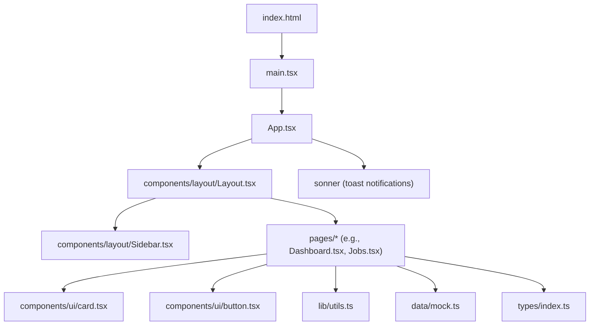
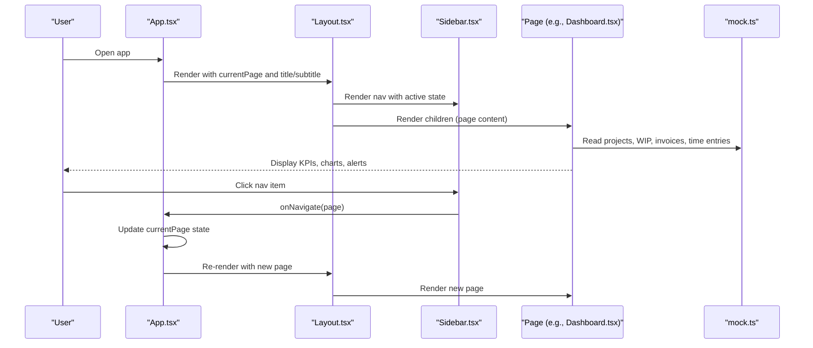
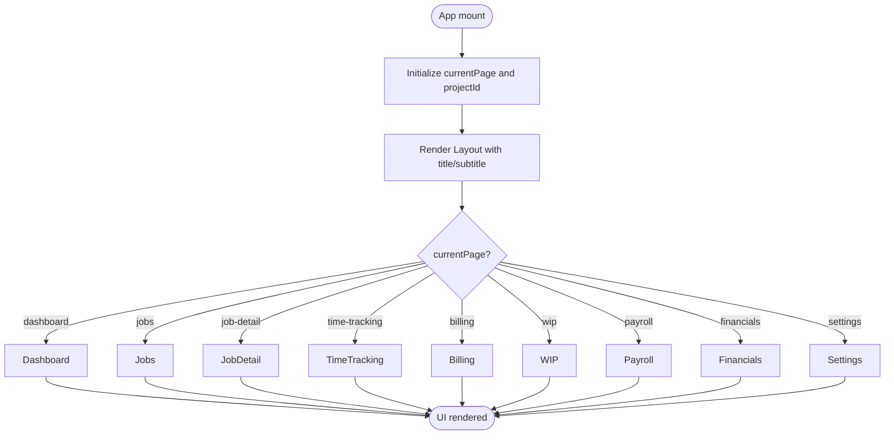
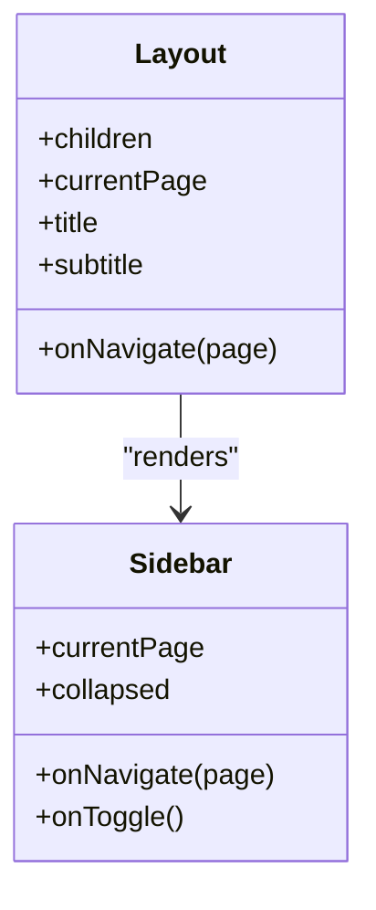
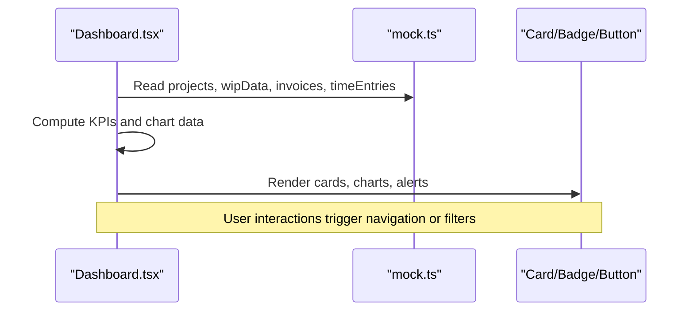
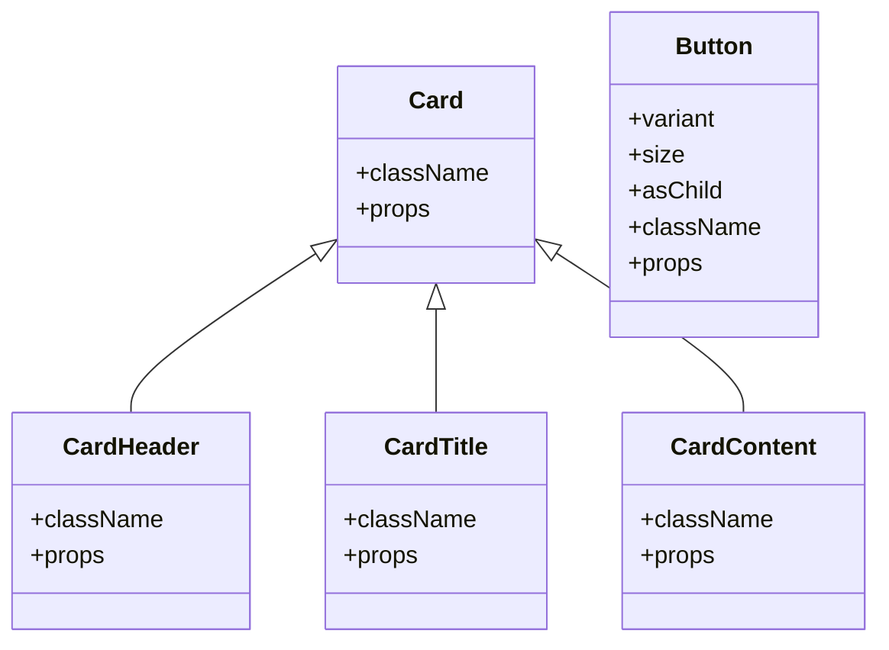
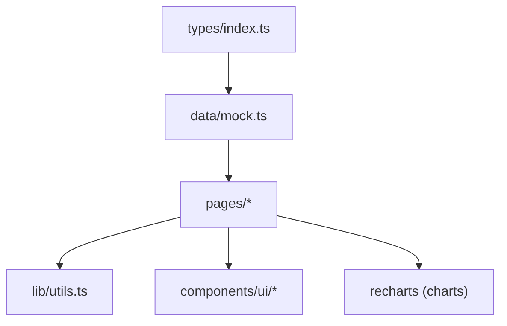
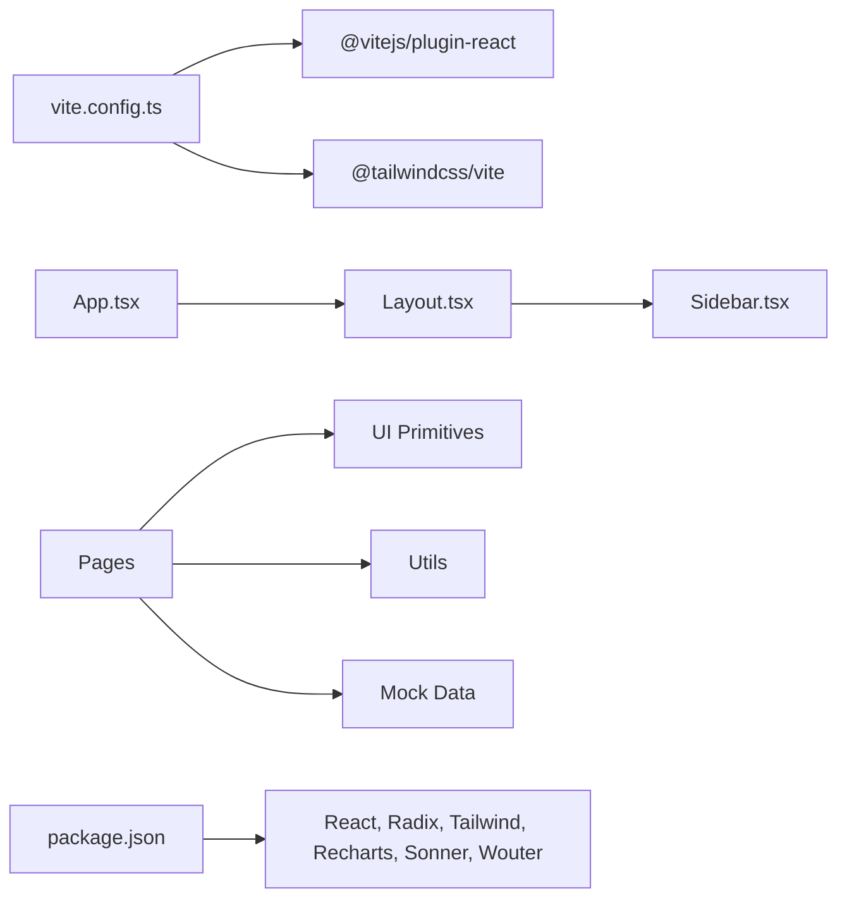

# Architecture Overview

<cite>
**Referenced Files in This Document**
- [main.tsx](file://app/src/main.tsx)
- [App.tsx](file://app/src/App.tsx)
- [Layout.tsx](file://app/src/components/layout/Layout.tsx)
- [Sidebar.tsx](file://app/src/components/layout/Sidebar.tsx)
- [Dashboard.tsx](file://app/src/pages/Dashboard.tsx)
- [Jobs.tsx](file://app/src/pages/Jobs.tsx)
- [card.tsx](file://app/src/components/ui/card.tsx)
- [button.tsx](file://app/src/components/ui/button.tsx)
- [mock.ts](file://app/src/data/mock.ts)
- [index.ts](file://app/src/types/index.ts)
- [utils.ts](file://app/src/lib/utils.ts)
- [vite.config.ts](file://app/vite.config.ts)
- [package.json](file://app/package.json)
- [index.html](file://app/index.html)
</cite>

## Table of Contents
1. Introduction
2. Project Structure
3. Core Components
4. Architecture Overview
5. Detailed Component Analysis
6. Dependency Analysis
7. Performance Considerations
8. Troubleshooting Guide
9. Conclusion

## Introduction
This document describes the architecture of the AWS MakerBay Construction Subcontractor App, a React 19 + TypeScript application that provides construction accounting features for subcontractors. The app uses a component-based architecture with clear separation between pages, layout components, reusable UI primitives, types, and utilities. It demonstrates data flow from mock data through strongly-typed interfaces to UI components, and outlines the build pipeline powered by Vite.

## Project Structure
The project is organized into logical layers:
- Entry points: HTML shell and React bootstrap
- Application root: routing state and page orchestration
- Layout system: responsive sidebar and top bar
- Pages: feature screens (Dashboard, Jobs, etc.)
- UI primitives: accessible, themeable components built on Radix UI and styled with Tailwind CSS
- Data layer: mock datasets typed via TypeScript interfaces
- Utilities: formatting helpers and class merging
- Build configuration: Vite with React and Tailwind plugins

**Diagram sources**
- [index.html:1-17](file://app/index.html#L1-L17)
- [main.tsx:1-11](file://app/src/main.tsx#L1-L11)
- [App.tsx:1-78](file://app/src/App.tsx#L1-L78)
- [Layout.tsx:1-77](file://app/src/components/layout/Layout.tsx#L1-L77)
- [Sidebar.tsx:1-97](file://app/src/components/layout/Sidebar.tsx#L1-L97)
- [Dashboard.tsx:1-259](file://app/src/pages/Dashboard.tsx#L1-L259)
- [Jobs.tsx:1-200](file://app/src/pages/Jobs.tsx#L1-L200)
- [card.tsx:1-47](file://app/src/components/ui/card.tsx#L1-L47)
- [button.tsx:1-45](file://app/src/components/ui/button.tsx#L1-L45)
- [utils.ts:1-45](file://app/src/lib/utils.ts#L1-L45)
- [mock.ts:1-246](file://app/src/data/mock.ts#L1-L246)
- [index.ts:1-255](file://app/src/types/index.ts#L1-L255)

**Section sources**
- [index.html:1-17](file://app/index.html#L1-L17)
- [main.tsx:1-11](file://app/src/main.tsx#L1-L11)
- [App.tsx:1-78](file://app/src/App.tsx#L1-L78)

## Core Components
- Application root (App): Holds global navigation state and renders the Layout with the active page. Uses local state to track current page and selected project context.
- Layout: Provides a responsive layout with a collapsible sidebar, sticky header with search/notifications/user avatar, and a main content area.
- Sidebar: Defines navigation items, highlights the active route, supports collapsed mode, and triggers navigation callbacks.
- UI Primitives: Theme-consistent components (Card, Button) using Radix UI primitives and Tailwind CSS with utility composition via a shared cn helper.
- Pages: Feature screens such as Dashboard and Jobs that consume mock data and compose UI primitives to present information and actions.
- Types: Strongly-typed domain models (Project, TimeEntry, PayApplication, WIPEntity, etc.) and route type union used across the app.
- Utilities: Formatting functions (currency, percent, date, number) and class name merging utility.
- Mock Data: Realistic datasets aligned with the types, consumed by pages to render charts, lists, and summaries.

**Section sources**
- [App.tsx:15-78](file://app/src/App.tsx#L15-L78)
- [Layout.tsx:1-77](file://app/src/components/layout/Layout.tsx#L1-L77)
- [Sidebar.tsx:1-97](file://app/src/components/layout/Sidebar.tsx#L1-L97)
- [card.tsx:1-47](file://app/src/components/ui/card.tsx#L1-L47)
- [button.tsx:1-45](file://app/src/components/ui/button.tsx#L1-L45)
- [index.ts:1-255](file://app/src/types/index.ts#L1-L255)
- [utils.ts:1-45](file://app/src/lib/utils.ts#L1-L45)
- [mock.ts:1-246](file://app/src/data/mock.ts#L1-L246)

## Architecture Overview
The app follows a unidirectional data flow:
- App orchestrates page rendering based on local state.
- Layout wraps each page with consistent chrome (sidebar/header).
- Pages read from mock data, compute derived values, and render UI primitives.
- Navigation is handled via callbacks passed down from App to pages and layout.

**Diagram sources**
- [App.tsx:27-78](file://app/src/App.tsx#L27-L78)
- [Layout.tsx:15-77](file://app/src/components/layout/Layout.tsx#L15-L77)
- [Sidebar.tsx:26-97](file://app/src/components/layout/Sidebar.tsx#L26-L97)
- [Dashboard.tsx:19-259](file://app/src/pages/Dashboard.tsx#L19-L259)
- [mock.ts:1-246](file://app/src/data/mock.ts#L1-L246)

## Detailed Component Analysis

### App Orchestrator
- Maintains currentPage and selectedProjectId via useState.
- Centralizes page metadata (title/subtitle) mapping to routes.
- Renders Layout with dynamic title/subtitle and mounts toast container.
- Delegates page rendering via a switch over PageRoute.

**Diagram sources**
- [App.tsx:15-78](file://app/src/App.tsx#L15-L78)

**Section sources**
- [App.tsx:15-78](file://app/src/App.tsx#L15-L78)

### Layout System
- Responsive layout with fixed sidebar and scrollable main area.
- Collapsible sidebar toggles width and content visibility; main content margin adjusts accordingly.
- Sticky header includes search input, notification bell with indicator, and user avatar.
- Passes currentPage and onNavigate to Sidebar for active highlighting and navigation.

**Diagram sources**
- [Layout.tsx:7-77](file://app/src/components/layout/Layout.tsx#L7-L77)
- [Sidebar.tsx:8-97](file://app/src/components/layout/Sidebar.tsx#L8-L97)

**Section sources**
- [Layout.tsx:1-77](file://app/src/components/layout/Layout.tsx#L1-L77)
- [Sidebar.tsx:1-97](file://app/src/components/layout/Sidebar.tsx#L1-L97)

### Pages: Dashboard and Jobs
- Dashboard computes KPIs from mock data, renders charts (bar/pie), and shows alerts for pending approvals, overdue invoices, and under-billing conditions.
- Jobs implements filtering (search, status), view toggle (cards/table), and navigates to job detail with project context.

**Diagram sources**
- [Dashboard.tsx:19-259](file://app/src/pages/Dashboard.tsx#L19-L259)
- [mock.ts:1-246](file://app/src/data/mock.ts#L1-L246)
- [card.tsx:1-47](file://app/src/components/ui/card.tsx#L1-L47)

**Section sources**
- [Dashboard.tsx:1-259](file://app/src/pages/Dashboard.tsx#L1-L259)
- [Jobs.tsx:1-200](file://app/src/pages/Jobs.tsx#L1-L200)

### UI Primitives and Design System
- Card components provide semantic structure (header, title, description, content, footer) with consistent styling.
- Button uses Radix Slot for flexible composition and class-variance-authority for variant/size control.
- Styling leverages Tailwind CSS with custom tokens and a cn utility for conditional classes.

**Diagram sources**
- [card.tsx:1-47](file://app/src/components/ui/card.tsx#L1-L47)
- [button.tsx:1-45](file://app/src/components/ui/button.tsx#L1-L45)

**Section sources**
- [card.tsx:1-47](file://app/src/components/ui/card.tsx#L1-L47)
- [button.tsx:1-45](file://app/src/components/ui/button.tsx#L1-L45)

### Data Flow Pattern
- Types define domain contracts (Project, TimeEntry, PayApplication, WIPEntity, GLAccount, Invoice, Bill, Vendor).
- Mock data adheres to these types and is consumed by pages to derive metrics and render views.
- Utilities format numbers, currency, percentages, and dates consistently across the UI.

**Diagram sources**
- [index.ts:1-255](file://app/src/types/index.ts#L1-L255)
- [mock.ts:1-246](file://app/src/data/mock.ts#L1-L246)
- [utils.ts:1-45](file://app/src/lib/utils.ts#L1-L45)

**Section sources**
- [index.ts:1-255](file://app/src/types/index.ts#L1-L255)
- [mock.ts:1-246](file://app/src/data/mock.ts#L1-L246)
- [utils.ts:1-45](file://app/src/lib/utils.ts#L1-L45)

## Dependency Analysis
- External libraries include React 19, Radix UI primitives, Tailwind CSS, Recharts for visualizations, Sonner for toasts, and Wouter for client-side routing (declared but not actively used in the current codebase).
- Vite config sets up React plugin, Tailwind plugin, and path aliasing for cleaner imports.
- Package scripts support development, TypeScript compilation, and production builds.

**Diagram sources**
- [vite.config.ts:1-17](file://app/vite.config.ts#L1-L17)
- [package.json:1-44](file://app/package.json#L1-L44)
- [App.tsx:1-78](file://app/src/App.tsx#L1-L78)
- [Layout.tsx:1-77](file://app/src/components/layout/Layout.tsx#L1-L77)
- [Sidebar.tsx:1-97](file://app/src/components/layout/Sidebar.tsx#L1-L97)

**Section sources**
- [vite.config.ts:1-17](file://app/vite.config.ts#L1-L17)
- [package.json:1-44](file://app/package.json#L1-L44)

## Performance Considerations
- Use memoization (e.g., useMemo/useCallback) for expensive computations in pages like Dashboard when datasets grow.
- Virtualize large lists in Jobs if the table/cards list becomes large.
- Keep mock data modular and lazy-load where appropriate to reduce initial bundle size.
- Leverage Vite’s fast HMR and optimized builds; ensure tree-shaking by avoiding unused imports.

[No sources needed since this section provides general guidance]

## Troubleshooting Guide
- Navigation issues: Ensure onNavigate is correctly passed from App to Layout and Sidebar, and that pages receive it to trigger route changes.
- Type mismatches: Verify that mock data conforms to the TypeScript interfaces; any schema drift will surface as compile-time errors.
- Styling conflicts: Use the cn utility to merge Tailwind classes safely; avoid hard-coded conflicting classes.
- Chart rendering: Confirm data keys and series match Recharts expectations; validate numeric formats via utils.

**Section sources**
- [App.tsx:27-78](file://app/src/App.tsx#L27-L78)
- [Layout.tsx:15-77](file://app/src/components/layout/Layout.tsx#L15-L77)
- [Sidebar.tsx:26-97](file://app/src/components/layout/Sidebar.tsx#L26-L97)
- [utils.ts:1-45](file://app/src/lib/utils.ts#L1-L45)

## Conclusion
The app employs a clean, component-based architecture with strong typing and a clear separation of concerns. Layout and pages are composable, data flows from typed mock sources through utilities to UI primitives, and the build pipeline is optimized for developer experience and production performance. While Wouter is included for routing, the current implementation manages navigation via local state and callbacks, providing a straightforward foundation that can be extended to full client-side routing as needed.