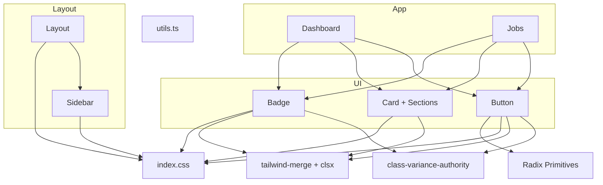
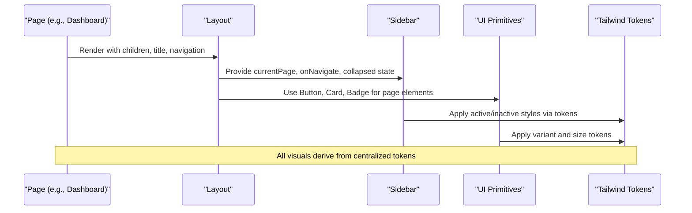
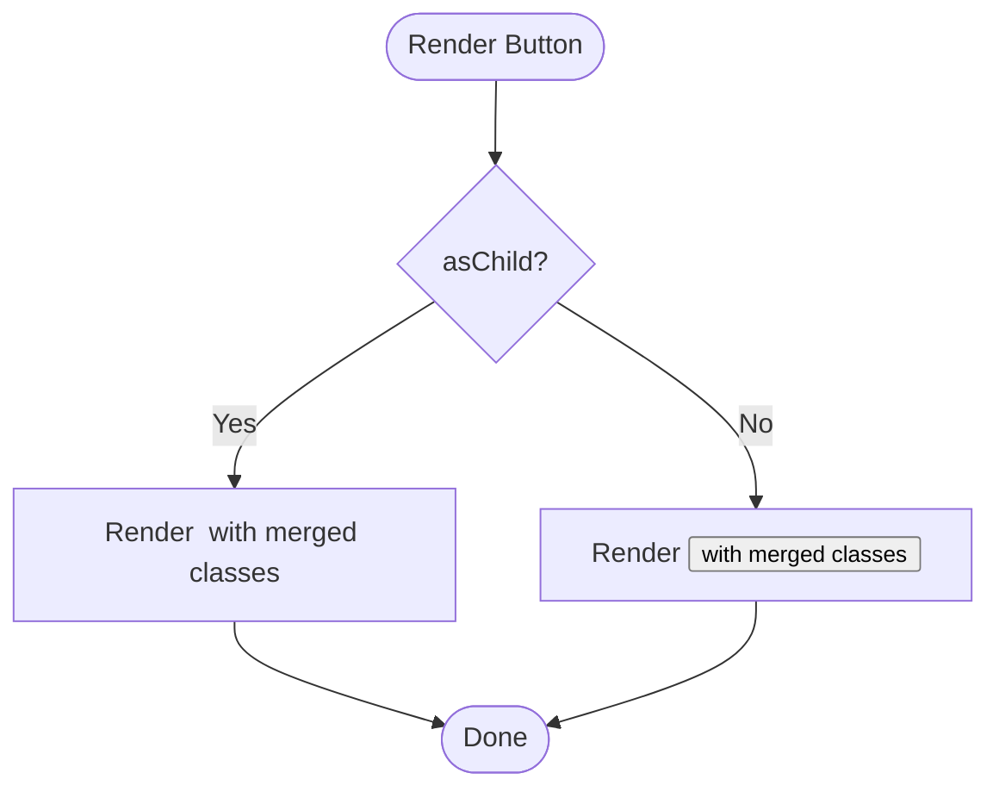
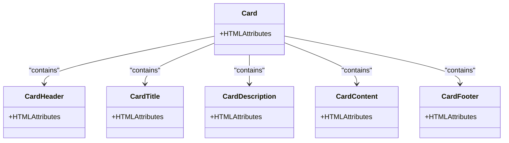
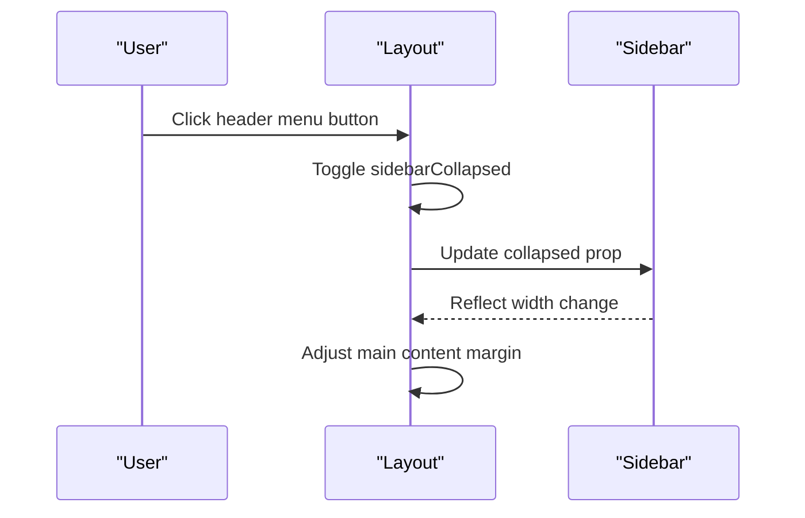
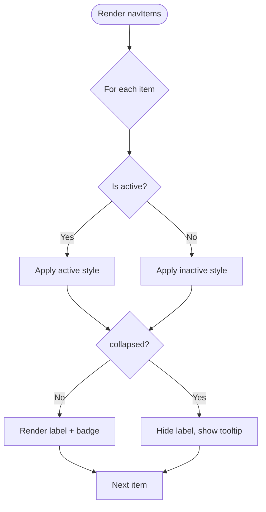
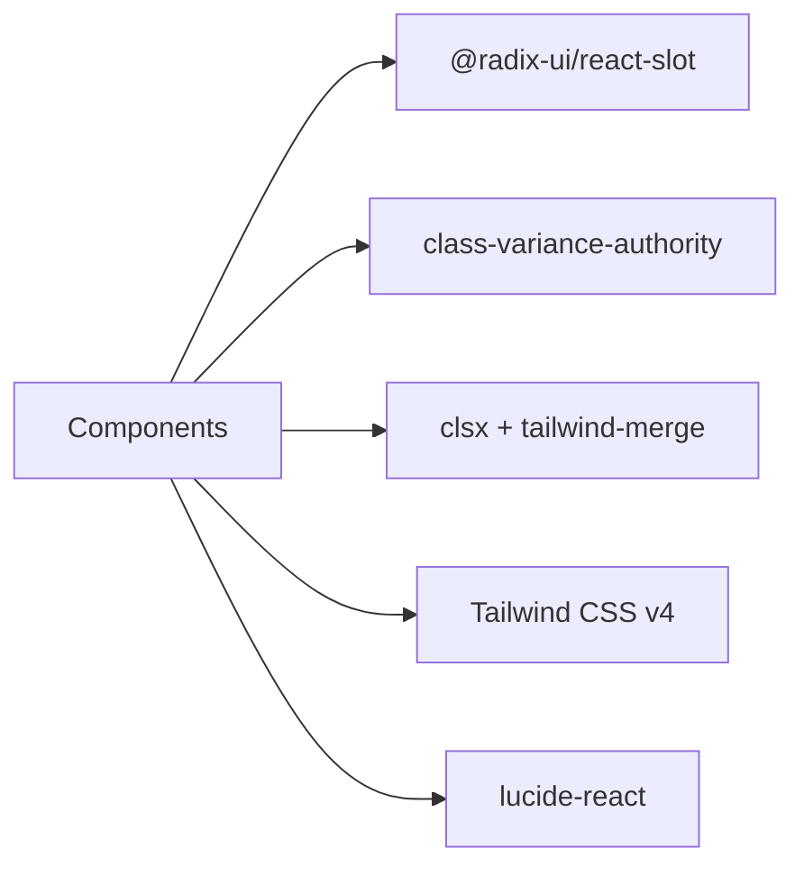

# Component Library

<cite>
**Referenced Files in This Document**
- [button.tsx](file://app/src/components/ui/button.tsx)
- [card.tsx](file://app/src/components/ui/card.tsx)
- [badge.tsx](file://app/src/components/ui/badge.tsx)
- [Layout.tsx](file://app/src/components/layout/Layout.tsx)
- [Sidebar.tsx](file://app/src/components/layout/Sidebar.tsx)
- [utils.ts](file://app/src/lib/utils.ts)
- [index.css](file://app/src/index.css)
- [index.ts](file://app/src/types/index.ts)
- [Dashboard.tsx](file://app/src/pages/Dashboard.tsx)
- [Jobs.tsx](file://app/src/pages/Jobs.tsx)
- [package.json](file://app/package.json)
</cite>

## Table of Contents
1. Introduction
2. Project Structure
3. Core Components
4. Architecture Overview
5. Detailed Component Analysis
6. Dependency Analysis
7. Performance Considerations
8. Troubleshooting Guide
9. Conclusion
10. Appendices

## Introduction
This document describes a reusable component library built with React, Radix UI primitives, Tailwind CSS, and utility libraries for class merging and variant management. It covers UI components (Button, Card, Badge), layout components (Layout, Sidebar), styling guidelines using Tailwind design tokens, accessibility features via Radix, composition patterns, responsive behavior, and extension strategies. Usage examples reference concrete pages where components are composed to build real screens.

## Project Structure
The library is organized by feature:
- UI primitives under src/components/ui
- Layout shell under src/components/layout
- Shared utilities under src/lib
- Global theme and animations under src/index.css
- Types under src/types
- Pages demonstrating composition under src/pages

**Diagram sources**
- [button.tsx:1-45](file://app/src/components/ui/button.tsx#L1-L45)
- [card.tsx:1-47](file://app/src/components/ui/card.tsx#L1-L47)
- [badge.tsx:1-33](file://app/src/components/ui/badge.tsx#L1-L33)
- [Layout.tsx:1-77](file://app/src/components/layout/Layout.tsx#L1-L77)
- [Sidebar.tsx:1-97](file://app/src/components/layout/Sidebar.tsx#L1-L97)
- [Dashboard.tsx:1-259](file://app/src/pages/Dashboard.tsx#L1-L259)
- [Jobs.tsx:1-200](file://app/src/pages/Jobs.tsx#L1-L200)
- [utils.ts:1-45](file://app/src/lib/utils.ts#L1-L45)
- [index.css:1-87](file://app/src/index.css#L1-L87)

**Section sources**
- [Layout.tsx:1-77](file://app/src/components/layout/Layout.tsx#L1-L77)
- [Sidebar.tsx:1-97](file://app/src/components/layout/Sidebar.tsx#L1-L97)
- [button.tsx:1-45](file://app/src/components/ui/button.tsx#L1-L45)
- [card.tsx:1-47](file://app/src/components/ui/card.tsx#L1-L47)
- [badge.tsx:1-33](file://app/src/components/ui/badge.tsx#L1-L33)
- [index.css:1-87](file://app/src/index.css#L1-L87)

## Core Components
This section documents the core UI building blocks, their props, variants, and customization options.

- Button
  - Purpose: Primary interactive element with multiple visual styles and sizes.
  - Props: Standard HTML button attributes plus variant, size, asChild, className, ref.
  - Variants: default, signal, outline, ghost, link, destructive.
  - Sizes: default, sm, lg, icon.
  - Composition: Supports rendering as another element via Slot when asChild is true.
  - Styling: Uses class-variance-authority for variants and tailwind-merge/clsx for safe class composition.
  - Accessibility: Inherits native button semantics; focus-visible ring and disabled states are styled.

- Card and sections
  - Purpose: Content container with semantic sections for headers, titles, descriptions, content, and footers.
  - Exports: Card, CardHeader, CardTitle, CardDescription, CardContent, CardFooter.
  - Styling: Consistent spacing, borders, background, and typography tokens from the theme.
  - Composition: Compose sections to structure complex cards.

- Badge
  - Purpose: Small status or categorical label.
  - Props: Standard HTML div attributes plus variant, className.
  - Variants: default, signal, success, warning, danger, violet, blue, teal, outline.
  - Styling: Rounded pill shape with soft backgrounds and strong text colors based on tokens.

- Utilities
  - cn helper: Safely merges classes with tailwind-merge and clsx.
  - Formatting helpers: Currency, percent, date, number formatting used across pages.

**Section sources**
- [button.tsx:6-44](file://app/src/components/ui/button.tsx#L6-L44)
- [card.tsx:4-46](file://app/src/components/ui/card.tsx#L4-L46)
- [badge.tsx:4-32](file://app/src/components/ui/badge.tsx#L4-L32)
- [utils.ts:1-45](file://app/src/lib/utils.ts#L1-L45)

## Architecture Overview
The application uses a consistent layout shell that composes a Sidebar and a top header with main content area. Pages compose UI primitives to present data and actions. The design system is driven by Tailwind theme tokens defined globally.

**Diagram sources**
- [Layout.tsx:15-76](file://app/src/components/layout/Layout.tsx#L15-L76)
- [Sidebar.tsx:26-96](file://app/src/components/layout/Sidebar.tsx#L26-L96)
- [Dashboard.tsx:55-259](file://app/src/pages/Dashboard.tsx#L55-L259)
- [index.css:3-28](file://app/src/index.css#L3-L28)

## Detailed Component Analysis

### Button
- Implementation highlights:
  - Variants and sizes managed via class-variance-authority.
  - Class composition via cn for predictable overrides.
  - Optional asChild to render as any element while preserving props and refs.
- Customization:
  - Override default classes via className prop.
  - Extend variants by adding new entries to the variant map.
- Accessibility:
  - Native button semantics when not using asChild.
  - Focus-visible ring and disabled state styling.

**Diagram sources**
- [button.tsx:32-44](file://app/src/components/ui/button.tsx#L32-L44)

**Section sources**
- [button.tsx:6-44](file://app/src/components/ui/button.tsx#L6-L44)

### Card and Sections
- Implementation highlights:
  - Forwarded refs and consistent spacing/tokens.
  - Semantic sections for structured content.
- Customization:
  - Pass className to any section for overrides.
  - Combine sections to create rich layouts.

**Diagram sources**
- [card.tsx:4-46](file://app/src/components/ui/card.tsx#L4-L46)

**Section sources**
- [card.tsx:4-46](file://app/src/components/ui/card.tsx#L4-L46)

### Badge
- Implementation highlights:
  - Variant-driven color schemes mapped to theme tokens.
  - Compact, accessible inline element.
- Customization:
  - Add new variants aligned to token palette.
  - Override with className when needed.

**Section sources**
- [badge.tsx:4-32](file://app/src/components/ui/badge.tsx#L4-L32)

### Layout
- Responsibilities:
  - Provides app chrome: sidebar toggle, sticky header with search and notifications, and main content area.
  - Manages collapsed state for sidebar and adjusts main content margin accordingly.
  - Responsive header controls: mobile menu button visible on small screens; search input hidden until medium screens.
- Props:
  - children, currentPage, onNavigate, title, subtitle.
- Responsive behavior:
  - Sidebar width transitions between collapsed and expanded.
  - Header adapts to screen size with conditional visibility.

**Diagram sources**
- [Layout.tsx:15-76](file://app/src/components/layout/Layout.tsx#L15-L76)
- [Sidebar.tsx:26-96](file://app/src/components/layout/Sidebar.tsx#L26-L96)

**Section sources**
- [Layout.tsx:15-76](file://app/src/components/layout/Layout.tsx#L15-L76)

### Sidebar
- Responsibilities:
  - Renders navigation items with icons, labels, optional badges, and active state.
  - Supports collapse mode showing only icons with tooltips via title attribute.
  - Displays company info at bottom when expanded.
- Props:
  - currentPage, onNavigate, collapsed, onToggle.
- Navigation pattern:
  - Active item highlighted using current route matching.
  - Special case for nested job-detail route highlighting jobs.

**Diagram sources**
- [Sidebar.tsx:15-96](file://app/src/components/layout/Sidebar.tsx#L15-L96)

**Section sources**
- [Sidebar.tsx:15-96](file://app/src/components/layout/Sidebar.tsx#L15-L96)

### Usage Examples
- Dashboard page demonstrates composing Card sections, Badge for tags, and layout-aware content grids.
- Jobs page shows Button usage for actions, Card for list items, and Badge for statuses.

References:
- [Dashboard.tsx:55-259](file://app/src/pages/Dashboard.tsx#L55-L259)
- [Jobs.tsx:36-199](file://app/src/pages/Jobs.tsx#L36-L199)

**Section sources**
- [Dashboard.tsx:55-259](file://app/src/pages/Dashboard.tsx#L55-L259)
- [Jobs.tsx:36-199](file://app/src/pages/Jobs.tsx#L36-L199)

## Dependency Analysis
- External dependencies relevant to the component library:
  - Radix UI primitives for robust, accessible primitives (e.g., Slot).
  - class-variance-authority for variant management.
  - clsx and tailwind-merge for safe class composition.
  - Tailwind CSS v4 with custom theme tokens.
  - Lucide icons for consistent iconography.

**Diagram sources**
- [package.json:18-42](file://app/package.json#L18-L42)
- [button.tsx:1-4](file://app/src/components/ui/button.tsx#L1-L4)
- [badge.tsx:1-2](file://app/src/components/ui/badge.tsx#L1-L2)
- [card.tsx:1-2](file://app/src/components/ui/card.tsx#L1-L2)

**Section sources**
- [package.json:18-42](file://app/package.json#L18-L42)

## Performance Considerations
- Prefer memoization for expensive lists if datasets grow large.
- Avoid excessive re-renders by keeping state minimal and colocated.
- Use responsive utilities to reduce layout shifts on resize.
- Keep animation durations short and respect reduced motion preferences already configured.

[No sources needed since this section provides general guidance]

## Troubleshooting Guide
- Classes not applying as expected:
  - Ensure you use the cn helper to merge classes and avoid conflicts.
- Variants not overriding:
  - Verify variant names match those defined in cva maps.
- Accessibility issues:
  - When using asChild, ensure the target element supports required attributes and keyboard interactions.
- Sidebar not collapsing on mobile:
  - Confirm the header menu button toggles the collapsed state and that the main content margin updates.

**Section sources**
- [utils.ts:1-6](file://app/src/lib/utils.ts#L1-L6)
- [button.tsx:32-44](file://app/src/components/ui/button.tsx#L32-L44)
- [Layout.tsx:15-76](file://app/src/components/layout/Layout.tsx#L15-L76)

## Conclusion
This component library provides a cohesive set of UI primitives and layout shells built on a strong foundation of Radix UI, Tailwind CSS, and utility libraries. The design system relies on centralized tokens for consistency, while composition patterns enable flexible and maintainable screens. Accessibility is addressed through Radix primitives and thoughtful defaults. The library scales well for larger applications by encouraging reuse and clear separation of concerns.

[No sources needed since this section summarizes without analyzing specific files]

## Appendices

### Design System Principles
- Token-first styling: All colors, fonts, and surfaces are defined in the global theme.
- Consistent spacing and typography: Reuse tokens and standard spacing utilities.
- Accessible by default: Leverage Radix primitives and semantic HTML.
- Mobile-first responsiveness: Build with progressive enhancement and responsive utilities.

**Section sources**
- [index.css:3-28](file://app/src/index.css#L3-L28)
- [index.css:30-36](file://app/src/index.css#L30-L36)
- [index.css:65-70](file://app/src/index.css#L65-L70)

### Extending and Customizing Components
- Adding new Button variants:
  - Extend the variant map in the Button’s cva configuration.
- Adding new Badge variants:
  - Add entries to the Badge’s cva variant map aligned with theme tokens.
- Overriding styles:
  - Use className to override base styles; rely on cn for safe merging.
- Creating new layout sections:
  - Follow the Card pattern: forwardRef, consistent spacing, and token-based styling.

**Section sources**
- [button.tsx:6-29](file://app/src/components/ui/button.tsx#L6-L29)
- [badge.tsx:4-23](file://app/src/components/ui/badge.tsx#L4-L23)
- [card.tsx:4-46](file://app/src/components/ui/card.tsx#L4-L46)

### Accessibility Features
- Radix primitives provide robust keyboard navigation, focus management, and ARIA attributes.
- Buttons inherit native semantics; focus-visible rings improve keyboard usability.
- Reduced motion preference respected via global media query.

**Section sources**
- [package.json:18-30](file://app/package.json#L18-L30)
- [button.tsx:6-29](file://app/src/components/ui/button.tsx#L6-L29)
- [index.css:65-70](file://app/src/index.css#L65-L70)

### Responsive Design Patterns
- Sidebar collapses to an icon-only mode and can be toggled via header button on mobile.
- Header search and controls adapt visibility based on breakpoints.
- Grids adjust columns for different screen sizes to optimize readability.

**Section sources**
- [Layout.tsx:15-76](file://app/src/components/layout/Layout.tsx#L15-L76)
- [Sidebar.tsx:26-96](file://app/src/components/layout/Sidebar.tsx#L26-L96)
- [Dashboard.tsx:55-82](file://app/src/pages/Dashboard.tsx#L55-L82)
- [Jobs.tsx:75-147](file://app/src/pages/Jobs.tsx#L75-L147)