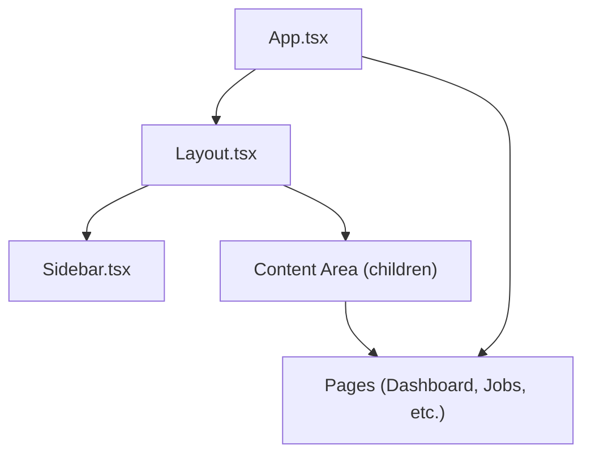
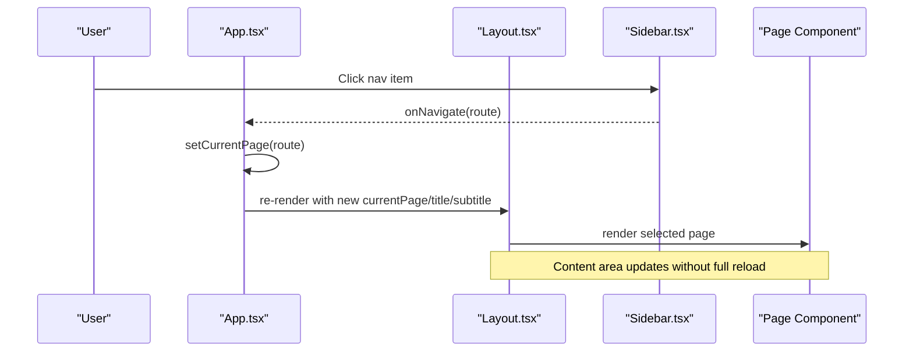
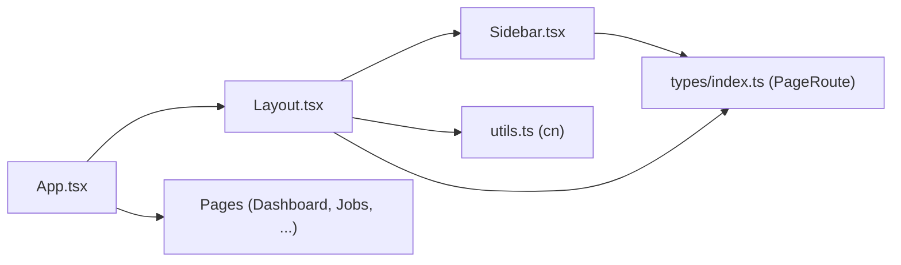
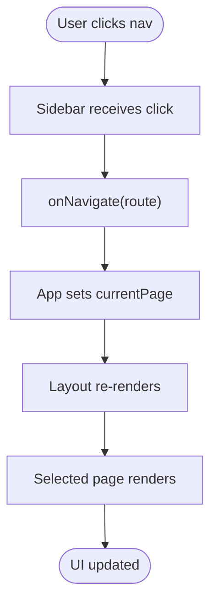

# Layout Components

<cite>
**Referenced Files in This Document**
- [Layout.tsx](file://app/src/components/layout/Layout.tsx)
- [Sidebar.tsx](file://app/src/components/layout/Sidebar.tsx)
- [App.tsx](file://app/src/App.tsx)
- [index.css](file://app/src/index.css)
- [utils.ts](file://app/src/lib/utils.ts)
- [types/index.ts](file://app/src/types/index.ts)
- [Dashboard.tsx](file://app/src/pages/Dashboard.tsx)
- [Jobs.tsx](file://app/src/pages/Jobs.tsx)
</cite>

## Table of Contents
1. [Introduction](#introduction)
2. [Project Structure](#project-structure)
3. [Core Components](#core-components)
4. [Architecture Overview](#architecture-overview)
5. [Detailed Component Analysis](#detailed-component-analysis)
6. [Dependency Analysis](#dependency-analysis)
7. [Performance Considerations](#performance-considerations)
8. [Troubleshooting Guide](#troubleshooting-guide)
9. [Conclusion](#conclusion)
10. [Appendices](#appendices)

## Introduction
This document explains the layout system that forms the structural foundation of the application shell. It focuses on two core components:
- Layout: Provides the top bar, content area management, and responsive behavior around a collapsible sidebar.
- Sidebar: Renders navigation items with active state, collapsible behavior, and mobile-friendly interactions.

It also covers how these components integrate with routing via props, how pages are rendered inside the shell, and how responsive design is achieved using utility classes and CSS variables.

## Project Structure
The layout system lives under the components/layout directory and is consumed by the root App component to wrap all pages. Pages are conditionally rendered based on the current route managed in App.

**Diagram sources**
- [App.tsx:27-77](file://app/src/App.tsx#L27-L77)
- [Layout.tsx:15-76](file://app/src/components/layout/Layout.tsx#L15-L76)
- [Sidebar.tsx:26-96](file://app/src/components/layout/Sidebar.tsx#L26-L96)

**Section sources**
- [App.tsx:27-77](file://app/src/App.tsx#L27-L77)
- [Layout.tsx:15-76](file://app/src/components/layout/Layout.tsx#L15-L76)
- [Sidebar.tsx:26-96](file://app/src/components/layout/Sidebar.tsx#L26-L96)

## Core Components
- Layout
  - Manages collapsed state for the sidebar and applies dynamic margins to the main content area.
  - Renders a sticky header with title/subtitle, search, notifications, and user avatar.
  - Wraps page content in a main element with padding.
  - Uses a utility function to merge class names for conditional styling.
- Sidebar
  - Defines navigation items with icons, labels, optional badges, and active detection.
  - Supports collapsed mode where only icons are visible; text and badges hide.
  - Provides a toggle button at the bottom to collapse/expand.
  - Highlights the active item based on the current route.

Key behaviors:
- Responsive margin transitions when collapsing/expanding the sidebar.
- Mobile-only menu toggle in the header to open/close the sidebar.
- Active state highlighting for the current page.

**Section sources**
- [Layout.tsx:15-76](file://app/src/components/layout/Layout.tsx#L15-L76)
- [Sidebar.tsx:26-96](file://app/src/components/layout/Sidebar.tsx#L26-L96)
- [utils.ts:4-6](file://app/src/lib/utils.ts#L4-L6)

## Architecture Overview
The application shell is composed as follows:
- App holds the current route and renders the Layout with page-specific title/subtitle.
- Layout composes Sidebar and a content area.
- Sidebar emits navigation events back to App via callbacks.
- Pages receive navigation callbacks to switch routes.

**Diagram sources**
- [App.tsx:27-77](file://app/src/App.tsx#L27-L77)
- [Layout.tsx:15-76](file://app/src/components/layout/Layout.tsx#L15-L76)
- [Sidebar.tsx:26-96](file://app/src/components/layout/Sidebar.tsx#L26-L96)

## Detailed Component Analysis

### Layout Component
Responsibilities:
- Holds collapsed state for the sidebar and toggles it.
- Applies responsive left margin to the content wrapper based on collapsed state.
- Renders a sticky header with:
  - Mobile menu toggle button.
  - Title and optional subtitle.
  - Search input (visible on small screens and up).
  - Notification bell with indicator dot.
  - User avatar placeholder.
- Renders children (page content) in a padded main area.

Responsive behavior:
- On large screens, the sidebar is visible and content shifts right with a fixed margin.
- On small screens, the header shows a menu button to toggle the sidebar overlay behavior through margin changes.

Accessibility considerations:
- Buttons have clear roles and are keyboard-focusable by default.
- The header uses semantic elements (header, h2, main) for structure.
- Consider adding aria-labels to icon-only buttons (e.g., search, bell, menu) for screen readers.

Customization options:
- Title and subtitle are passed as props.
- Collapsed state can be controlled externally if needed by lifting state from App.

Usage pattern:
- Wrap each page with Layout and pass currentPage, onNavigate, title, and optional subtitle.

**Section sources**
- [Layout.tsx:15-76](file://app/src/components/layout/Layout.tsx#L15-L76)
- [index.css:3-28](file://app/src/index.css#L3-L28)

### Sidebar Component
Responsibilities:
- Displays a list of navigation items with icons, labels, and optional badges.
- Highlights the active item based on the current route.
- Supports collapsed mode to show only icons and reduce width.
- Provides a toggle button to collapse/expand.

Navigation integration:
- Emits onNavigate(route) when a nav item is clicked.
- Special handling marks jobs as active when viewing job-detail.

Mobile responsiveness:
- Fixed position sidebar with transitioned width.
- In collapsed mode, tooltips or titles can help identify items.

Accessibility considerations:
- Navigation items are buttons with appropriate focus styles.
- When collapsed, consider providing accessible tooltips or aria-labels for icon-only items.

Customization options:
- Add or reorder navItems to change navigation structure.
- Use badge property to annotate items (e.g., payroll badge).

Usage pattern:
- Provide currentPage, onNavigate, collapsed, and onToggle props.

**Section sources**
- [Sidebar.tsx:26-96](file://app/src/components/layout/Sidebar.tsx#L26-L96)
- [types/index.ts:245-255](file://app/src/types/index.ts#L245-L255)

### Routing Integration and Page Composition
- App manages currentPage state and passes it down to Layout and individual pages.
- Layout forwards onNavigate to Sidebar; clicking a nav item updates App’s currentPage.
- App renders the corresponding page component based on currentPage.
- Some pages (e.g., Dashboard, Jobs) accept onNavigate to trigger route changes.

Example flows:
- From Dashboard: Clicking an action triggers onNavigate('jobs'), updating the shell and rendering Jobs.
- From Jobs: Clicking a job card triggers onNavigate('job-detail', projectId), updating the shell and rendering JobDetail.

**Section sources**
- [App.tsx:27-77](file://app/src/App.tsx#L27-L77)
- [Dashboard.tsx:15-17](file://app/src/pages/Dashboard.tsx#L15-L17)
- [Jobs.tsx:13-15](file://app/src/pages/Jobs.tsx#L13-L15)

### Responsive Breakpoints and Behavior
Breakpoints used in the layout and pages:
- Small screens: Header menu toggle visible; search hidden until sm breakpoint.
- Medium and above: Search input appears; grid layouts adjust columns.
- Large screens: Sidebar remains expanded; content margin adjusts accordingly.

Implementation notes:
- Tailwind utility classes control visibility and layout shifts.
- Transitions animate margin changes for smooth sidebar collapse/expand.

**Section sources**
- [Layout.tsx:27-32](file://app/src/components/layout/Layout.tsx#L27-L32)
- [Layout.tsx:48-56](file://app/src/components/layout/Layout.tsx#L48-L56)
- [Dashboard.tsx:58-85](file://app/src/pages/Dashboard.tsx#L58-L85)
- [Jobs.tsx:75-78](file://app/src/pages/Jobs.tsx#L75-L78)

### Accessibility and Keyboard Navigation
- Semantic HTML: header, h2, main provide document structure.
- Focus management: All interactive elements are native buttons/inputs with default focus behavior.
- Screen reader support:
  - Add aria-labels to icon-only buttons (menu, search, bell).
  - Ensure active navigation items convey state via aria-current or similar attributes if extended.
- Reduced motion: Global media query disables animations for users who prefer reduced motion.

**Section sources**
- [index.css:65-70](file://app/src/index.css#L65-L70)
- [Layout.tsx:34-67](file://app/src/components/layout/Layout.tsx#L34-L67)
- [Sidebar.tsx:47-77](file://app/src/components/layout/Sidebar.tsx#L47-L77)

## Dependency Analysis
High-level dependencies:
- Layout depends on:
  - Sidebar for navigation.
  - Utility function cn for class merging.
  - Types for PageRoute.
- Sidebar depends on:
  - Types for PageRoute.
  - Icons from lucide-react.
- App depends on:
  - Layout and all page components.
  - Types for PageRoute.

**Diagram sources**
- [App.tsx:27-77](file://app/src/App.tsx#L27-L77)
- [Layout.tsx:1-13](file://app/src/components/layout/Layout.tsx#L1-L13)
- [Sidebar.tsx:1-13](file://app/src/components/layout/Sidebar.tsx#L1-L13)
- [utils.ts:4-6](file://app/src/lib/utils.ts#L4-L6)
- [types/index.ts:245-255](file://app/src/types/index.ts#L245-L255)

**Section sources**
- [App.tsx:27-77](file://app/src/App.tsx#L27-L77)
- [Layout.tsx:1-13](file://app/src/components/layout/Layout.tsx#L1-L13)
- [Sidebar.tsx:1-13](file://app/src/components/layout/Sidebar.tsx#L1-L13)
- [utils.ts:4-6](file://app/src/lib/utils.ts#L4-L6)
- [types/index.ts:245-255](file://app/src/types/index.ts#L245-L255)

## Performance Considerations
- State location: Current route and sidebar collapsed state are kept in App and Layout respectively. For larger apps, consider lifting collapsed state to App to persist across navigations.
- Re-renders: Passing onNavigate and currentPage ensures minimal re-renders; avoid unnecessary prop changes.
- Animations: Smooth transitions are applied to margin and width changes; ensure they remain lightweight.
- List rendering: Sidebar maps a static array of nav items; performance is negligible but keep the list concise.

[No sources needed since this section provides general guidance]

## Troubleshooting Guide
Common issues and resolutions:
- Sidebar not collapsing/expanding:
  - Verify collapsed state is toggled and passed correctly to Sidebar and Layout.
  - Check that onToggle is wired to setSidebarCollapsed in Layout.
- Active item not highlighted:
  - Ensure currentPage matches the route keys defined in types.
  - Confirm special case for job-detail mapping to jobs in Sidebar.
- Mobile menu not working:
  - Confirm the header menu button toggles collapsed state.
  - Ensure the content wrapper margin updates for small screens.
- Search input not visible:
  - Check responsive classes controlling visibility on different breakpoints.

**Section sources**
- [Layout.tsx:15-32](file://app/src/components/layout/Layout.tsx#L15-L32)
- [Sidebar.tsx:47-77](file://app/src/components/layout/Sidebar.tsx#L47-L77)
- [Layout.tsx:48-56](file://app/src/components/layout/Layout.tsx#L48-L56)

## Conclusion
The layout system provides a robust, responsive application shell built from two primary components:
- Layout manages the overall structure, header, and content area while coordinating sidebar state.
- Sidebar offers navigation with active states, collapsible behavior, and mobile-friendly interactions.

Together, they create a consistent experience across devices and integrate seamlessly with routing via props. By following the usage patterns and accessibility guidelines outlined here, developers can extend and customize the layout effectively.

[No sources needed since this section summarizes without analyzing specific files]

## Appendices

### Usage Patterns and Examples
- Basic usage:
  - Wrap page content with Layout and pass currentPage, onNavigate, title, and optional subtitle.
  - Implement onNavigate in App to update currentPage and scroll to top.
- Adding a new page:
  - Create a new page component and add a route entry in App’s switch logic.
  - Optionally add a nav item in Sidebar’s navItems array with matching route key.
- Customizing the header:
  - Extend Layout’s header to include additional controls or branding.

**Section sources**
- [App.tsx:27-77](file://app/src/App.tsx#L27-L77)
- [Sidebar.tsx:15-24](file://app/src/components/layout/Sidebar.tsx#L15-L24)
- [Layout.tsx:34-67](file://app/src/components/layout/Layout.tsx#L34-L67)

### Data Flow Diagram

**Diagram sources**
- [Sidebar.tsx:47-77](file://app/src/components/layout/Sidebar.tsx#L47-L77)
- [App.tsx:27-77](file://app/src/App.tsx#L27-L77)
- [Layout.tsx:15-76](file://app/src/components/layout/Layout.tsx#L15-L76)