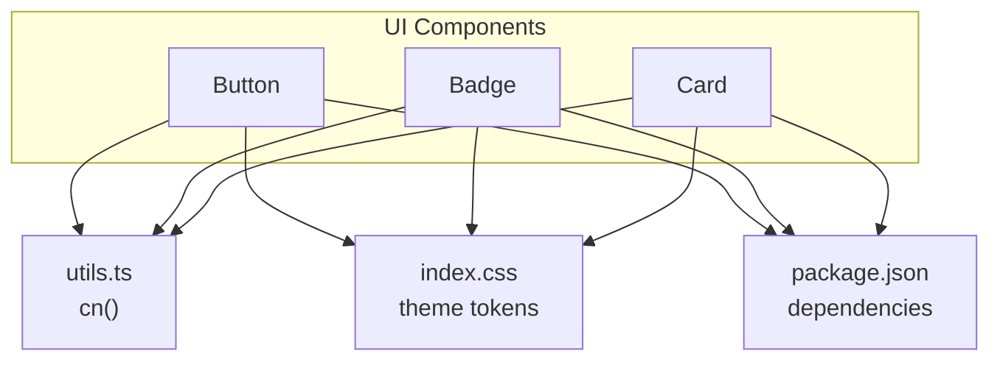
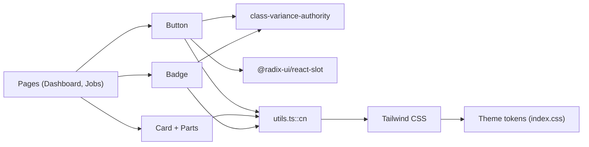
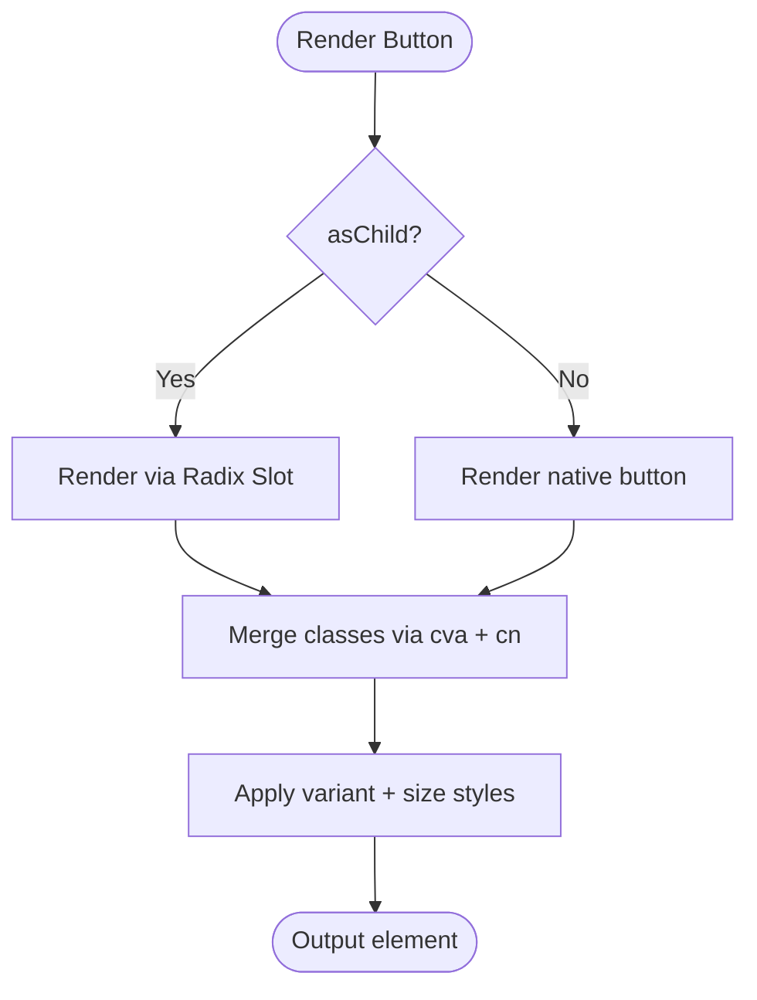
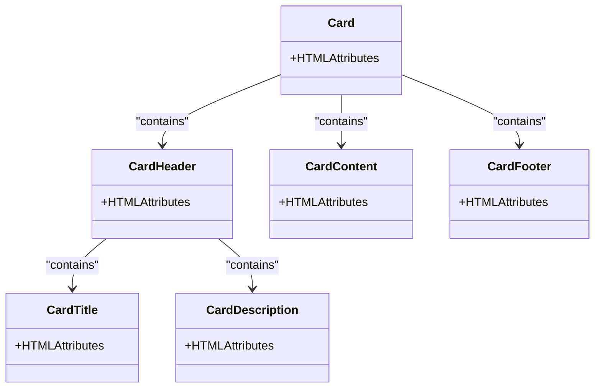
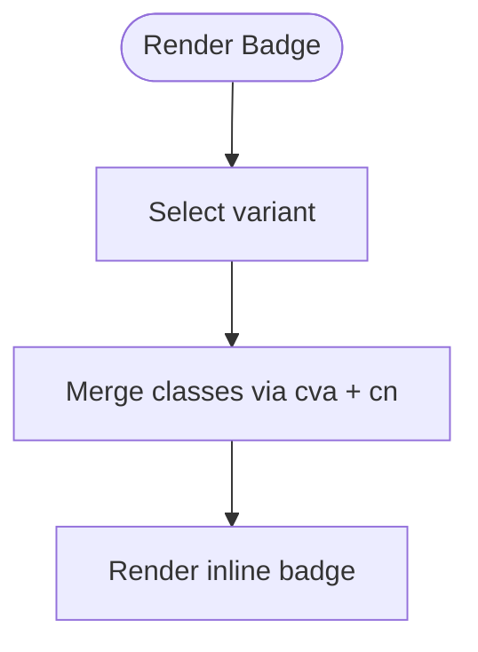
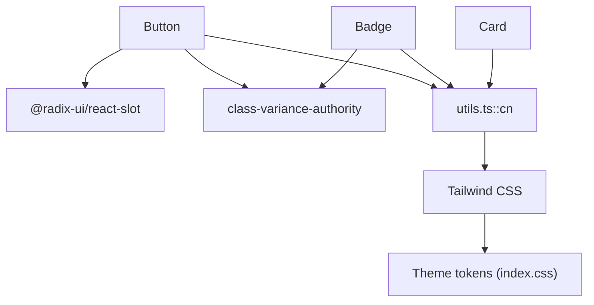

# UI Components

<cite>
**Referenced Files in This Document**
- [button.tsx](file://app/src/components/ui/button.tsx)
- [card.tsx](file://app/src/components/ui/card.tsx)
- [badge.tsx](file://app/src/components/ui/badge.tsx)
- [utils.ts](file://app/src/lib/utils.ts)
- [index.css](file://app/src/index.css)
- [package.json](file://app/package.json)
- [Dashboard.tsx](file://app/src/pages/Dashboard.tsx)
- [Jobs.tsx](file://app/src/pages/Jobs.tsx)
</cite>

## Table of Contents
1. [Introduction](#introduction)
2. [Project Structure](#project-structure)
3. [Core Components](#core-components)
4. [Architecture Overview](#architecture-overview)
5. [Detailed Component Analysis](#detailed-component-analysis)
6. [Dependency Analysis](#dependency-analysis)
7. [Performance Considerations](#performance-considerations)
8. [Troubleshooting Guide](#troubleshooting-guide)
9. [Conclusion](#conclusion)
10. [Appendices](#appendices)

## Introduction
This document describes the base UI components built with Radix UI primitives and Tailwind CSS, focusing on Button, Card, and Badge. It explains variants, sizes, customization patterns using class-variance-authority (cva), accessibility considerations, and guidelines for extending or creating new variants consistently across the design system.

## Project Structure
The UI components live under a dedicated folder and are composed from shared utilities and theme tokens:
- Components: Button, Card, Badge
- Utilities: className merging helper and formatting helpers
- Theme: Tailwind theme variables for colors and typography
- Usage examples: Dashboard and Jobs pages demonstrate practical usage

**Diagram sources**
- [button.tsx:1-45](file://app/src/components/ui/button.tsx#L1-L45)
- [card.tsx:1-47](file://app/src/components/ui/card.tsx#L1-L47)
- [badge.tsx:1-33](file://app/src/components/ui/badge.tsx#L1-L33)
- [utils.ts:1-45](file://app/src/lib/utils.ts#L1-L45)
- [index.css:1-87](file://app/src/index.css#L1-L87)
- [package.json:18-42](file://app/package.json#L18-L42)

**Section sources**
- [button.tsx:1-45](file://app/src/components/ui/button.tsx#L1-L45)
- [card.tsx:1-47](file://app/src/components/ui/card.tsx#L1-L47)
- [badge.tsx:1-33](file://app/src/components/ui/badge.tsx#L1-L33)
- [utils.ts:1-45](file://app/src/lib/utils.ts#L1-L45)
- [index.css:1-87](file://app/src/index.css#L1-L87)
- [package.json:18-42](file://app/package.json#L18-L42)

## Core Components
- Button: A versatile action button with multiple visual variants and sizes, powered by cva and Tailwind classes. Supports rendering as a child component via Radix Slot for seamless integration with routing/linking libraries.
- Card: A composable container with semantic parts (Header, Title, Description, Content, Footer) styled with consistent spacing and borders.
- Badge: A compact status/label indicator with multiple color variants and an outline option.

These components share:
- A consistent styling approach using Tailwind utility classes
- A shared className merger utility to safely merge user-provided classes
- A cohesive design token set defined in the theme CSS

**Section sources**
- [button.tsx:6-44](file://app/src/components/ui/button.tsx#L6-L44)
- [card.tsx:4-46](file://app/src/components/ui/card.tsx#L4-L46)
- [badge.tsx:4-32](file://app/src/components/ui/badge.tsx#L4-L32)
- [utils.ts:4-6](file://app/src/lib/utils.ts#L4-L6)
- [index.css:3-28](file://app/src/index.css#L3-L28)

## Architecture Overview
The components follow a simple, layered architecture:
- Presentation layer: Button, Card, Badge
- Styling layer: Tailwind theme tokens and utility classes
- Utility layer: cn() for safe class merging
- Integration layer: Optional use of Radix primitives (e.g., Slot) for advanced composition

**Diagram sources**
- [button.tsx:1-45](file://app/src/components/ui/button.tsx#L1-L45)
- [card.tsx:1-47](file://app/src/components/ui/card.tsx#L1-L47)
- [badge.tsx:1-33](file://app/src/components/ui/badge.tsx#L1-L33)
- [utils.ts:1-45](file://app/src/lib/utils.ts#L1-L45)
- [index.css:1-87](file://app/src/index.css#L1-L87)
- [package.json:18-42](file://app/package.json#L18-L42)

## Detailed Component Analysis

### Button
- Variants: default, signal, outline, ghost, link, destructive
- Sizes: default, sm, lg, icon
- Props: standard HTML button attributes plus variant, size, and asChild
- Composition: Uses Radix Slot when asChild is true to render as any element (e.g., Link) while preserving button semantics through focus management and keyboard behavior provided by the underlying primitive
- Styling: Built with cva; merges user classes via cn()

Usage highlights:
- Primary actions: default or signal
- Secondary actions: outline or ghost
- Text-like actions: link
- Error actions: destructive
- Compact controls: icon size

Accessibility notes:
- Focus-visible ring ensures keyboard users can see focus state
- Disabled state disables pointer events and reduces opacity
- When used as a child (asChild), it preserves interactive semantics via Radix primitives

**Diagram sources**
- [button.tsx:6-44](file://app/src/components/ui/button.tsx#L6-L44)

**Section sources**
- [button.tsx:6-44](file://app/src/components/ui/button.tsx#L6-L44)
- [package.json:18-42](file://app/package.json#L18-L42)
- [Jobs.tsx:69-71](file://app/src/pages/Jobs.tsx#L69-L71)

### Card
- Structure: Composed of Card, CardHeader, CardTitle, CardDescription, CardContent, CardFooter
- Styling: Consistent border, background, shadow, and spacing; uses theme tokens for line and surface colors
- Semantics: Title renders as h3; description as p; header/content/footer provide logical grouping

Usage highlights:
- Group related content and actions
- Use Header/Title/Description for context
- Place primary actions in Footer

**Diagram sources**
- [card.tsx:4-46](file://app/src/components/ui/card.tsx#L4-L46)

**Section sources**
- [card.tsx:4-46](file://app/src/components/ui/card.tsx#L4-L46)
- [Dashboard.tsx:1-3](file://app/src/pages/Dashboard.tsx#L1-L3)
- [Jobs.tsx:2-4](file://app/src/pages/Jobs.tsx#L2-L4)

### Badge
- Variants: default, signal, success, warning, danger, violet, blue, teal, outline
- Purpose: Status indicators and labels with clear color semantics
- Styling: Small, rounded pill shape with soft backgrounds and contrasting text per variant

Usage highlights:
- Job statuses, tags, and small labels
- Combine multiple badges for multi-state indicators

**Diagram sources**
- [badge.tsx:4-32](file://app/src/components/ui/badge.tsx#L4-L32)

**Section sources**
- [badge.tsx:4-32](file://app/src/components/ui/badge.tsx#L4-L32)
- [Dashboard.tsx:175-176](file://app/src/pages/Dashboard.tsx#L175-L176)
- [Jobs.tsx:95-96](file://app/src/pages/Jobs.tsx#L95-L96)

## Dependency Analysis
- Button depends on:
  - @radix-ui/react-slot for composition
  - class-variance-authority for variant management
  - utils.ts::cn for class merging
- Badge depends on:
  - class-variance-authority
  - utils.ts::cn
- Card depends on:
  - utils.ts::cn
- All components rely on Tailwind theme tokens defined in index.css for consistent colors and typography.

**Diagram sources**
- [button.tsx:1-45](file://app/src/components/ui/button.tsx#L1-L45)
- [badge.tsx:1-33](file://app/src/components/ui/badge.tsx#L1-L33)
- [card.tsx:1-47](file://app/src/components/ui/card.tsx#L1-L47)
- [utils.ts:1-45](file://app/src/lib/utils.ts#L1-L45)
- [index.css:1-87](file://app/src/index.css#L1-L87)
- [package.json:18-42](file://app/package.json#L18-L42)

**Section sources**
- [package.json:18-42](file://app/package.json#L18-L42)
- [utils.ts:1-45](file://app/src/lib/utils.ts#L1-L45)
- [index.css:1-87](file://app/src/index.css#L1-L87)

## Performance Considerations
- Class merging: Using cn() with clsx and tailwind-merge avoids duplicate classes and minimizes CSS bloat.
- Variant computation: cva computes styles at runtime based on props; keep variant sets small and focused to reduce overhead.
- Re-renders: Components are lightweight and memoization is not required unless used in large lists; consider React.memo if needed for performance-critical scenarios.
- Animations: Global animations respect prefers-reduced-motion for accessibility.

[No sources needed since this section provides general guidance]

## Troubleshooting Guide
- Unexpected styles override: Ensure you pass className via the component’s prop and avoid overriding critical cva-generated classes directly.
- Focus issues with links: When using Button as a link, set asChild to preserve focus management and keyboard behavior.
- Inconsistent sizing: Verify size prop values match available options; unsupported sizes will fall back to defaults.
- Badge contrast: Choose appropriate variants for your context to maintain sufficient color contrast.

**Section sources**
- [button.tsx:32-44](file://app/src/components/ui/button.tsx#L32-L44)
- [badge.tsx:4-32](file://app/src/components/ui/badge.tsx#L4-L32)
- [index.css:65-70](file://app/src/index.css#L65-L70)

## Conclusion
The Button, Card, and Badge components form a cohesive, accessible, and extensible UI foundation. They leverage Radix primitives for robust interaction semantics, Tailwind for flexible styling, and class-variance-authority for predictable variant management. Following the established patterns ensures consistency, accessibility, and ease of extension across the application.

[No sources needed since this section summarizes without analyzing specific files]

## Appendices

### Accessibility Features
- Keyboard navigation and focus management: Provided by Radix primitives (e.g., Slot) and focus-visible styles ensure clear focus indication.
- Semantic structure: Card parts use appropriate elements (h3 for title, p for description) to convey meaning to assistive technologies.
- Reduced motion: Global media query respects user preferences for reduced motion.

**Section sources**
- [button.tsx:6-44](file://app/src/components/ui/button.tsx#L6-L44)
- [card.tsx:11-30](file://app/src/components/ui/card.tsx#L11-L30)
- [index.css:65-70](file://app/src/index.css#L65-L70)

### Usage Examples
- Button: See usage in Jobs page where a signal-sized button triggers a primary action.
- Card: Used extensively in Dashboard and Jobs pages to group KPIs, charts, and job listings.
- Badge: Applied to show job status and special tags like prevailing wage.

**Section sources**
- [Jobs.tsx:69-71](file://app/src/pages/Jobs.tsx#L69-L71)
- [Dashboard.tsx:63-79](file://app/src/pages/Dashboard.tsx#L63-L79)
- [Dashboard.tsx:175-176](file://app/src/pages/Dashboard.tsx#L175-L176)
- [Jobs.tsx:95-96](file://app/src/pages/Jobs.tsx#L95-L96)

### Extending Components and Creating New Variants
- Add a new Button variant:
  - Extend the cva variants object with a new key and corresponding Tailwind classes.
  - Update documentation and tests accordingly.
- Add a new Badge variant:
  - Follow the same pattern as existing variants; ensure color contrast meets accessibility standards.
- Create a new composite component:
  - Use Card as a template: define forwardRef components, apply consistent spacing and theme tokens, and export named parts for composability.
- Maintain consistency:
  - Use cn() for all class merging.
  - Stick to theme tokens for colors and typography.
  - Keep variant names descriptive and aligned with product semantics.

**Section sources**
- [button.tsx:6-29](file://app/src/components/ui/button.tsx#L6-L29)
- [badge.tsx:4-23](file://app/src/components/ui/badge.tsx#L4-L23)
- [card.tsx:4-46](file://app/src/components/ui/card.tsx#L4-L46)
- [utils.ts:4-6](file://app/src/lib/utils.ts#L4-L6)
- [index.css:3-28](file://app/src/index.css#L3-L28)