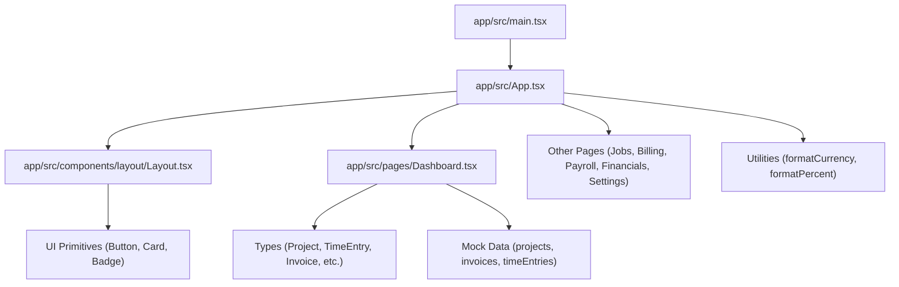
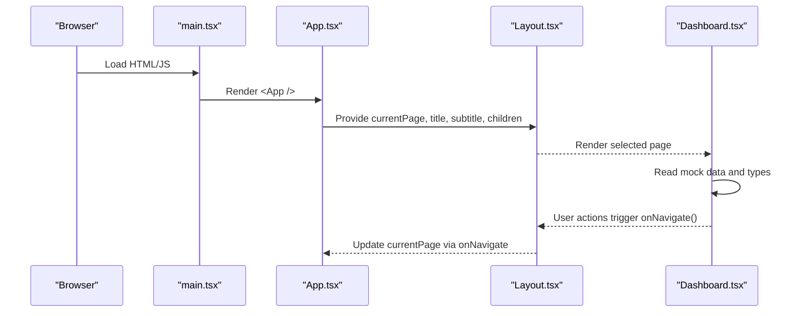
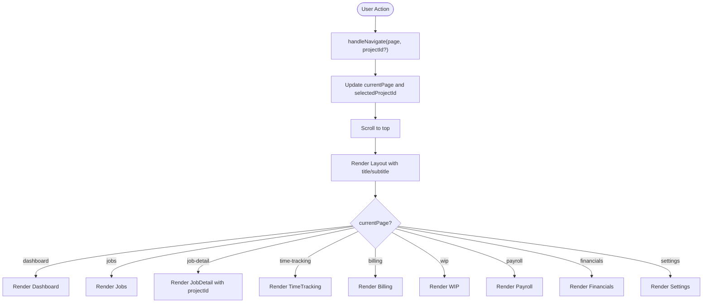
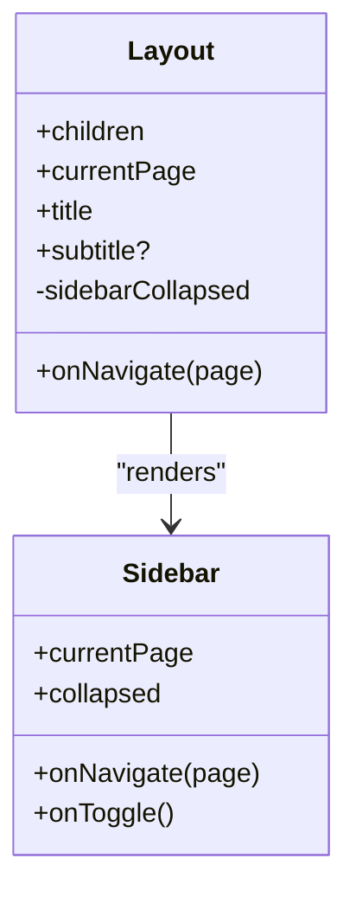
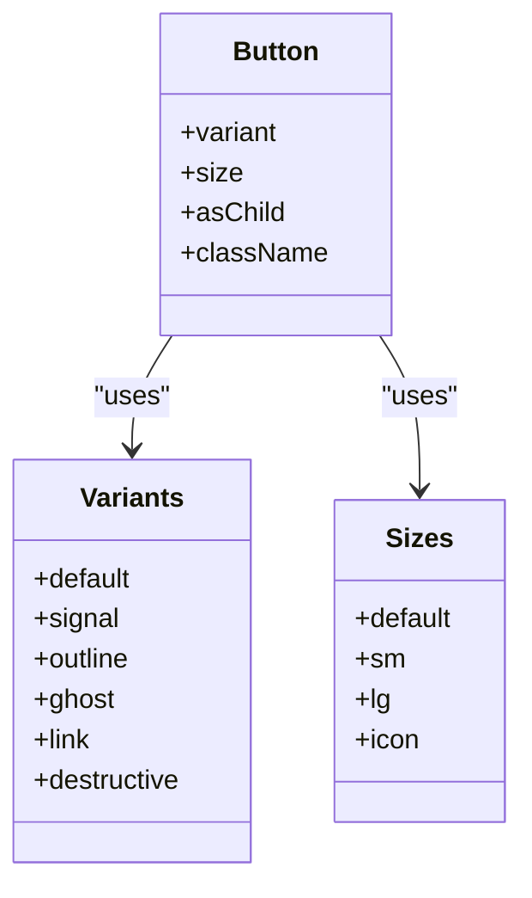
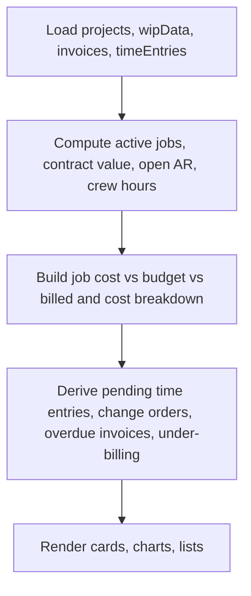
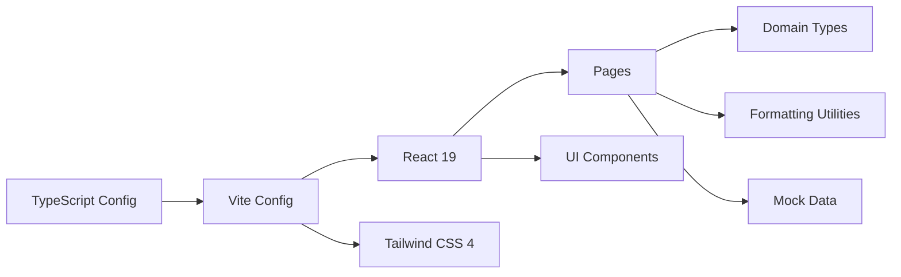

# Contributing Guidelines

<cite>
**Referenced Files in This Document**
- [package.json](file://app/package.json)
- [tsconfig.json](file://app/tsconfig.json)
- [vite.config.ts](file://app/vite.config.ts)
- [App.tsx](file://app/src/App.tsx)
- [main.tsx](file://app/src/main.tsx)
- [Layout.tsx](file://app/src/components/layout/Layout.tsx)
- [Dashboard.tsx](file://app/src/pages/Dashboard.tsx)
- [button.tsx](file://app/src/components/ui/button.tsx)
- [card.tsx](file://app/src/components/ui/card.tsx)
- [utils.ts](file://app/src/lib/utils.ts)
- [index.ts](file://app/src/types/index.ts)
- [mock.ts](file://app/src/data/mock.ts)
- [BuildBooks-Product-Spec-Sheet.md](file://BuildBooks-Product-Spec-Sheet.md)
- [Reusable AI-App Technology and Design Stack Playbook.md](file://Reusable AI-App Technology and Design Stack Playbook.md)
</cite>

## Table of Contents
1. Introduction
2. Project Structure
3. Core Components
4. Architecture Overview
5. Detailed Component Analysis
6. Dependency Analysis
7. Performance Considerations
8. Troubleshooting Guide
9. Conclusion
10. Appendices

## Introduction
This document provides comprehensive contributing guidelines for developers working on the AWS MakerBay Construction Subcontractor App. It covers development workflow, branch management, commit conventions, pull request processes, code style using TypeScript and React best practices, testing requirements, build and deployment steps, feature addition guidelines, code review and approval workflows, project structure conventions, environment setup, issue and feature request templates, release and versioning strategy, and licensing considerations. The guidance is grounded in the current repository configuration and source files.

## Project Structure
The application is a React + TypeScript single-page app built with Vite and styled with Tailwind CSS. Key directories:
- app/src/pages: Feature pages (Dashboard, Jobs, Billing, etc.)
- app/src/components: Shared UI components and layout
- app/src/lib: Utilities (formatting, class merging)
- app/src/types: Domain types used across the app
- app/src/data: Mock data for development and demos
- app: Build and dependency configuration

**Diagram sources**
- [main.tsx:1-11](file://app/src/main.tsx#L1-L11)
- [App.tsx:1-78](file://app/src/App.tsx#L1-L78)
- [Layout.tsx:1-77](file://app/src/components/layout/Layout.tsx#L1-L77)
- [Dashboard.tsx:1-259](file://app/src/pages/Dashboard.tsx#L1-L259)
- [button.tsx:1-45](file://app/src/components/ui/button.tsx#L1-L45)
- [card.tsx:1-47](file://app/src/components/ui/card.tsx#L1-L47)
- [utils.ts:1-45](file://app/src/lib/utils.ts#L1-L45)
- [index.ts:1-255](file://app/src/types/index.ts#L1-L255)
- [mock.ts:1-246](file://app/src/data/mock.ts#L1-L246)

**Section sources**
- [package.json:1-44](file://app/package.json#L1-L44)
- [vite.config.ts:1-17](file://app/vite.config.ts#L1-L17)
- [tsconfig.json:1-24](file://app/tsconfig.json#L1-L24)
- [main.tsx:1-11](file://app/src/main.tsx#L1-L11)
- [App.tsx:1-78](file://app/src/App.tsx#L1-L78)

## Core Components
- Application shell: main.tsx mounts React.StrictMode and renders App.tsx.
- Routing and page orchestration: App.tsx manages current page state and renders Layout with title/subtitle and the selected page component.
- Layout: Layout.tsx provides sidebar, top bar, and content area; it accepts currentPage, onNavigate, title, subtitle, and children.
- UI primitives: button.tsx and card.tsx implement consistent variants and composition patterns using class-variance-authority and clsx/tailwind-merge utilities.
- Utilities: utils.ts centralizes formatting helpers (currency, percent, date, number) and class name merging.
- Types: index.ts defines domain models (Project, CostCode, Phase, TimeEntry, Employee, PayrollRun, PayApplication, ChangeOrder, WIPEntity, GLAccount, Invoice, Bill, Vendor, DashboardKPI, PageRoute).
- Mock data: mock.ts supplies realistic sample datasets for development and demo purposes.

**Section sources**
- [main.tsx:1-11](file://app/src/main.tsx#L1-L11)
- [App.tsx:1-78](file://app/src/App.tsx#L1-L78)
- [Layout.tsx:1-77](file://app/src/components/layout/Layout.tsx#L1-L77)
- [button.tsx:1-45](file://app/src/components/ui/button.tsx#L1-L45)
- [card.tsx:1-47](file://app/src/components/ui/card.tsx#L1-L47)
- [utils.ts:1-45](file://app/src/lib/utils.ts#L1-L45)
- [index.ts:1-255](file://app/src/types/index.ts#L1-L255)
- [mock.ts:1-246](file://app/src/data/mock.ts#L1-L246)

## Architecture Overview
The app follows a simple client-side architecture:
- Entry point mounts the root component.
- App orchestrates navigation and renders the Layout shell with the active page.
- Pages consume domain types and mock data to render dashboards and feature views.
- UI primitives provide reusable building blocks for consistent interactions.

**Diagram sources**
- [main.tsx:1-11](file://app/src/main.tsx#L1-L11)
- [App.tsx:1-78](file://app/src/App.tsx#L1-L78)
- [Layout.tsx:1-77](file://app/src/components/layout/Layout.tsx#L1-L77)
- [Dashboard.tsx:1-259](file://app/src/pages/Dashboard.tsx#L1-L259)

## Detailed Component Analysis

### App Navigation Flow
App.tsx maintains currentPage and selectedProjectId, updates them via handleNavigate, and renders the corresponding page inside Layout. This pattern centralizes navigation state and ensures consistent header metadata per page.

**Diagram sources**
- [App.tsx:15-78](file://app/src/App.tsx#L15-L78)

**Section sources**
- [App.tsx:15-78](file://app/src/App.tsx#L15-L78)

### Layout Shell and Sidebar Interaction
Layout.tsx composes Sidebar and content area, supports collapsible sidebar, and exposes search and notification placeholders. It uses utility cn for conditional classes and integrates icons from Lucide.

**Diagram sources**
- [Layout.tsx:1-77](file://app/src/components/layout/Layout.tsx#L1-L77)

**Section sources**
- [Layout.tsx:1-77](file://app/src/components/layout/Layout.tsx#L1-L77)

### Button Component Variants
button.tsx implements variant and size control via class-variance-authority, enabling consistent styling across the app. It supports asChild composition for flexible usage.

**Diagram sources**
- [button.tsx:1-45](file://app/src/components/ui/button.tsx#L1-L45)

**Section sources**
- [button.tsx:1-45](file://app/src/components/ui/button.tsx#L1-L45)

### Dashboard Data Rendering
Dashboard.tsx consumes mock data and types to compute KPIs, charts, and alerts. It demonstrates how domain models are used to drive UI logic and visualization.

**Diagram sources**
- [Dashboard.tsx:1-259](file://app/src/pages/Dashboard.tsx#L1-L259)
- [mock.ts:1-246](file://app/src/data/mock.ts#L1-L246)
- [index.ts:1-255](file://app/src/types/index.ts#L1-L255)

**Section sources**
- [Dashboard.tsx:1-259](file://app/src/pages/Dashboard.tsx#L1-L259)
- [mock.ts:1-246](file://app/src/data/mock.ts#L1-L246)
- [index.ts:1-255](file://app/src/types/index.ts#L1-L255)

## Dependency Analysis
- Build tooling: Vite config sets up React and Tailwind plugins and an alias for @ pointing to src.
- TypeScript: Strict mode enabled, JSX set to react-jsx, module resolution configured for bundler.
- Dependencies: React 19, Radix UI primitives, Tailwind CSS 4, Recharts for charts, Sonner for notifications, Wouter for routing, Lucide icons, and utility libraries for class merging and variants.

**Diagram sources**
- [tsconfig.json:1-24](file://app/tsconfig.json#L1-L24)
- [vite.config.ts:1-17](file://app/vite.config.ts#L1-L17)
- [package.json:1-44](file://app/package.json#L1-L44)

**Section sources**
- [tsconfig.json:1-24](file://app/tsconfig.json#L1-L24)
- [vite.config.ts:1-17](file://app/vite.config.ts#L1-L17)
- [package.json:1-44](file://app/package.json#L1-L44)

## Performance Considerations
- Keep static domain data separate from view state; use local state for UI-only toggles and filters.
- Prefer memoization for derived computations when filtering or aggregating large datasets.
- Use lightweight chart configurations and avoid unnecessary re-renders by stabilizing props.
- Leverage Tailwind utility classes for efficient styling without heavy custom CSS.
- Avoid animating layout properties; prefer opacity and transform transitions.

[No sources needed since this section provides general guidance]

## Troubleshooting Guide
Common issues and resolutions:
- Build fails due to TypeScript strictness: Review type definitions and ensure all props match expected interfaces.
- Module resolution errors: Verify path aliases (@/*) and ensure imports resolve correctly.
- Runtime warnings in React StrictMode: Ensure side effects are properly handled and no unexpected re-renders occur.
- Styling conflicts: Use the provided cn utility to merge classes deterministically.

**Section sources**
- [tsconfig.json:1-24](file://app/tsconfig.json#L1-L24)
- [vite.config.ts:1-17](file://app/vite.config.ts#L1-L17)
- [utils.ts:1-45](file://app/src/lib/utils.ts#L1-L45)

## Conclusion
Contributors should follow the established TypeScript and React patterns, use the shared UI primitives and utilities, and adhere to the defined domain types. Maintain clear separation between static data and UI state, keep components focused and reusable, and validate changes through builds and browser QA. Align new features with the product vision outlined in the spec documents and maintain consistency in naming and structure.

[No sources needed since this section summarizes without analyzing specific files]

## Appendices

### Development Environment Setup
- Install dependencies and run dev server:
  - npm install
  - npm run dev
- Preview production build:
  - npm run build
  - npm run preview

**Section sources**
- [package.json:6-10](file://app/package.json#L6-L10)

### Branch Management
- Use feature branches named after the work item (e.g., feature/job-costing-v2).
- Keep branches small and focused; create separate branches for unrelated changes.
- Base branches:
  - main: stable releases
  - develop: integration branch for upcoming features

[No sources needed since this section provides general guidance]

### Commit Conventions
- Use conventional commits:
  - feat: add new functionality
  - fix: bug fixes
  - refactor: code restructuring without behavior change
  - docs: documentation updates
  - test: tests additions or updates
  - chore: maintenance tasks
- Keep commits atomic and descriptive; reference related issues where applicable.

[No sources needed since this section provides general guidance]

### Pull Request Process
- Create a PR against the target branch (develop or main).
- Include a clear description of changes, rationale, and any breaking changes.
- Attach screenshots or recordings for UI changes.
- Ensure all checks pass (build, lint if configured, type checks).
- Request reviews from relevant maintainers.

[No sources needed since this section provides general guidance]

### Code Style Guidelines
- TypeScript:
  - Enable strict mode and define explicit types for props and data shapes.
  - Use enums or union types for constrained values (see domain types).
- React:
  - Functional components with hooks; keep components small and focused.
  - Use context or prop drilling appropriately; avoid excessive global state.
- Styling:
  - Use Tailwind utility classes and the cn helper for class merging.
  - Follow design tokens and spacing scales documented in the playbook.
- Components:
  - Prefer shadcn/ui-like primitives with variants and sizes.
  - Compose components using Slot or wrapper patterns when necessary.

**Section sources**
- [tsconfig.json:1-24](file://app/tsconfig.json#L1-L24)
- [button.tsx:1-45](file://app/src/components/ui/button.tsx#L1-L45)
- [card.tsx:1-47](file://app/src/components/ui/card.tsx#L1-L47)
- [utils.ts:1-45](file://app/src/lib/utils.ts#L1-L45)
- [Reusable AI-App Technology and Design Stack Playbook.md:14-31](file://Reusable AI-App Technology and Design Stack Playbook.md#L14-L31)

### Testing Requirements and Quality Gates
- Static correctness:
  - Run TypeScript compiler checks before delivery.
- Production build:
  - Validate bundle creation and absence of runtime errors.
- Browser QA:
  - Test key interactions (navigation, forms, charts, modals) on desktop and mobile.
- Optional unit/integration tests:
  - Add tests for critical business logic and utilities when complexity increases.

**Section sources**
- [Reusable AI-App Technology and Design Stack Playbook.md:284-322](file://Reusable AI-App Technology and Design Stack Playbook.md#L284-L322)

### Build and Deployment Processes
- Local development:
  - npm run dev starts the Vite dev server with hot reloading.
- Build:
  - npm run build compiles TypeScript and produces optimized assets.
- Preview:
  - npm run preview serves the built output locally for verification.
- Deployment:
  - Deploy the dist folder to your hosting provider or static site service.

**Section sources**
- [package.json:6-10](file://app/package.json#L6-L10)

### Adding New Features
- Define or extend domain types in types/index.ts.
- Create or update pages under src/pages with clear responsibilities.
- Implement reusable UI components under src/components/ui when patterns emerge.
- Use mock data in src/data for initial development; plan migration to real data later.
- Wire navigation in App.tsx and ensure Layout receives correct metadata.

**Section sources**
- [index.ts:1-255](file://app/src/types/index.ts#L1-L255)
- [App.tsx:15-78](file://app/src/App.tsx#L15-L78)
- [mock.ts:1-246](file://app/src/data/mock.ts#L1-L246)

### Modifying Existing Components
- Keep changes minimal and focused; avoid mixing unrelated updates.
- Preserve existing props and behaviors unless intentionally deprecating.
- Update variants and styles consistently using class-variance-authority and Tailwind.
- Validate changes with builds and browser QA.

**Section sources**
- [button.tsx:1-45](file://app/src/components/ui/button.tsx#L1-L45)
- [card.tsx:1-47](file://app/src/components/ui/card.tsx#L1-L47)

### Updating Documentation
- Keep README and spec documents aligned with implementation.
- Reflect changes in product specs and playbooks when features evolve.
- Include examples and usage notes for new components or APIs.

**Section sources**
- [BuildBooks-Product-Spec-Sheet.md:286-353](file://BuildBooks-Product-Spec-Sheet.md#L286-L353)
- [Reusable AI-App Technology and Design Stack Playbook.md:32-67](file://Reusable AI-App Technology and Design Stack Playbook.md#L32-L67)

### Code Review and Approval Workflows
- Self-review checklist:
  - Types are explicit and complete.
  - No unused imports or dead code.
  - UI states include loading, empty, error, disabled.
  - Accessibility basics: semantic headings, focus states, labels.
- Reviewer checklist:
  - Correctness and alignment with product goals.
  - Performance implications and potential regressions.
  - Consistency with design system and naming conventions.
- Approvals:
  - Require at least one maintainer approval before merging.
  - Address all feedback before final approval.

[No sources needed since this section provides general guidance]

### Project Structure Conventions and Naming Standards
- Directory organization:
  - pages: feature-specific screens
  - components/ui: shared UI primitives
  - components/layout: application shell components
  - lib: utilities and helpers
  - types: domain models and shared types
  - data: mock datasets for development
- Naming:
  - PascalCase for components and types.
  - kebab-case for file names where appropriate.
  - Clear, descriptive names reflecting purpose.

**Section sources**
- [Reusable AI-App Technology and Design Stack Playbook.md:32-67](file://Reusable AI-App Technology and Design Stack Playbook.md#L32-L67)

### Issue Reports and Feature Requests Templates
- Issue report template:
  - Title: Brief summary
  - Description: What happened and expected behavior
  - Steps to reproduce: Numbered list
  - Screenshots/GIFs: If applicable
  - Environment: OS, browser, Node/npm versions
  - Additional context: Logs, error messages
- Feature request template:
  - Title: Proposed feature
  - Problem statement: Why this is needed
  - Proposed solution: How it should work
  - Acceptance criteria: Conditions for completion
  - Impact: Users affected and benefits

[No sources needed since this section provides general guidance]

### Release Process and Version Management Strategy
- Versioning:
  - Semantic versioning (major.minor.patch) based on changes.
  - Update version in package.json for each release.
- Release steps:
  - Merge approved PRs into the target branch.
  - Tag the release commit.
  - Build and publish artifacts.
  - Announce changes in release notes.

**Section sources**
- [package.json:1-10](file://app/package.json#L1-L10)

### Licensing and Intellectual Property Considerations
- Contributions must respect third-party licenses for dependencies.
- Ensure that added code does not introduce incompatible licenses.
- Document any new external libraries and their license terms.
- Confirm that contributions comply with organizational IP policies.

[No sources needed since this section provides general guidance]