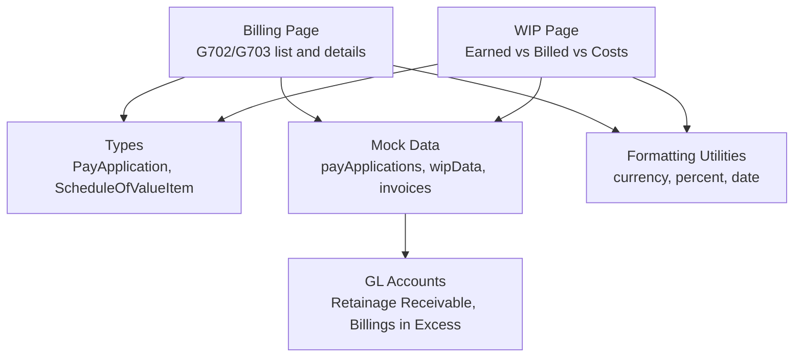
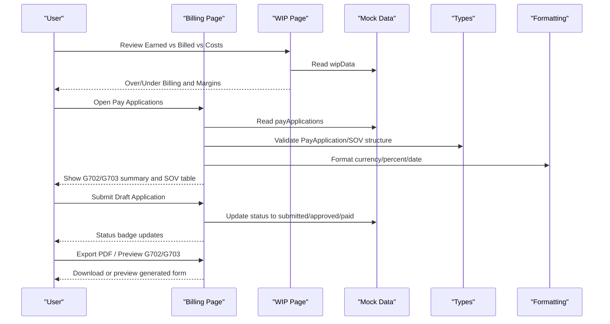
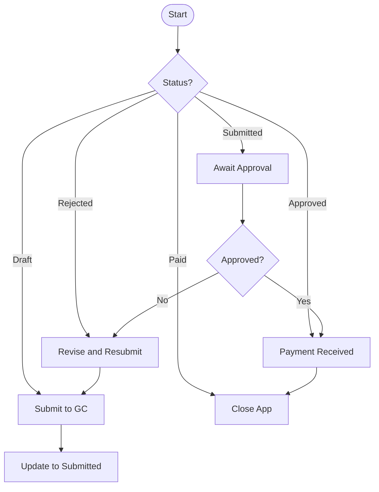
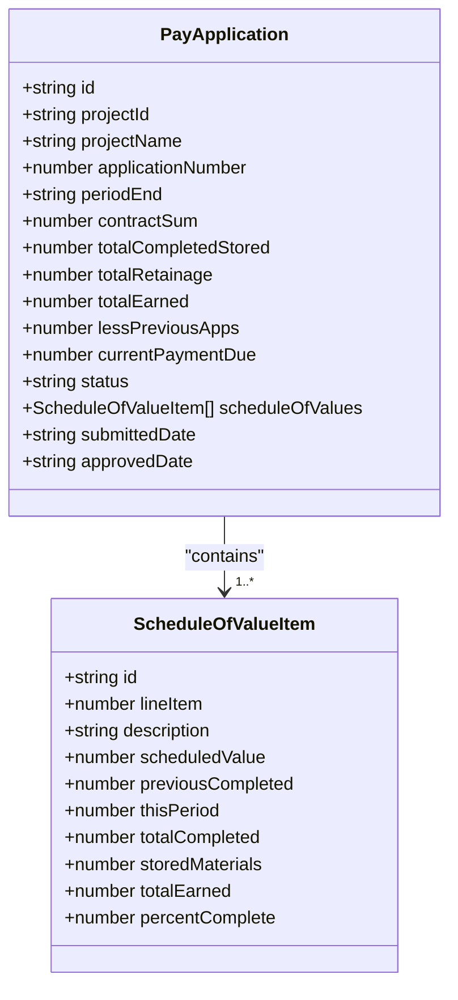
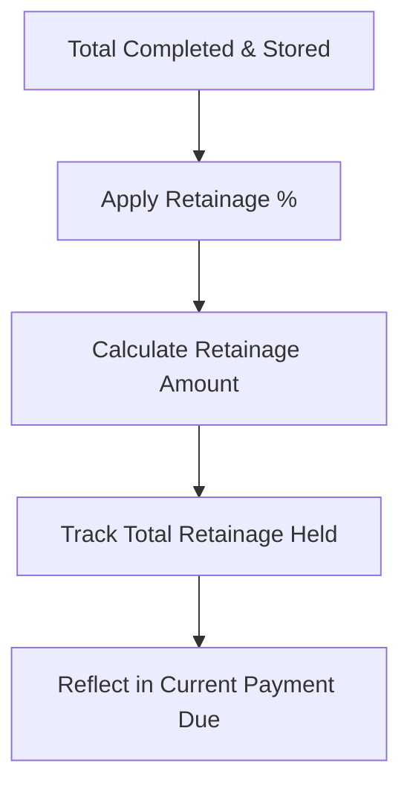
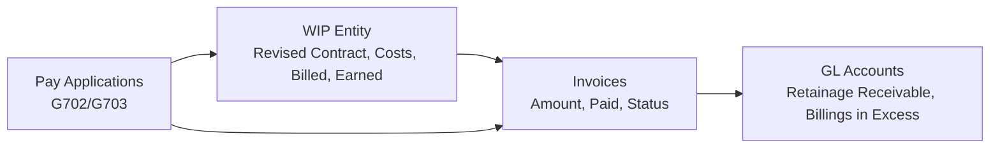
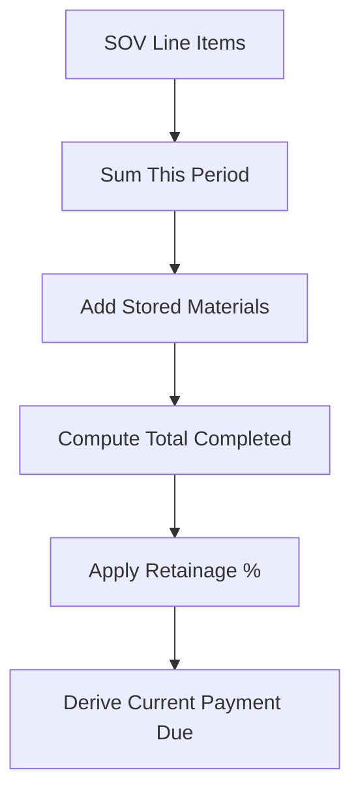
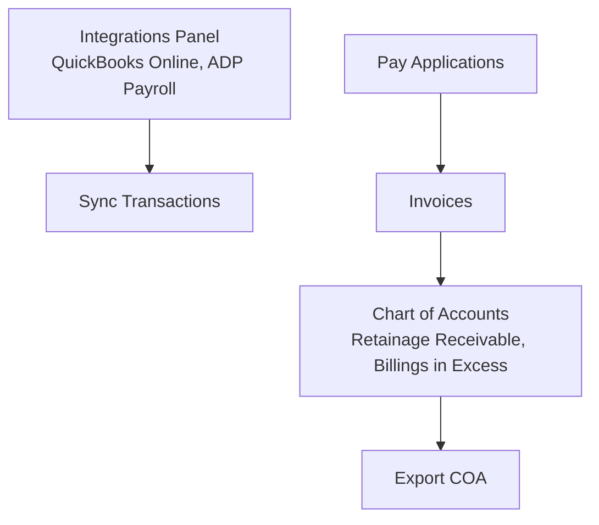
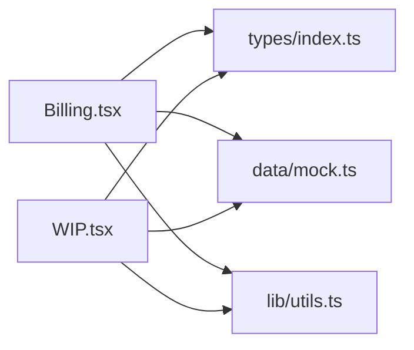

# AIA Billing

<cite>
**Referenced Files in This Document**
- [Billing.tsx](file://app/src/pages/Billing.tsx)
- [WIP.tsx](file://app/src/pages/WIP.tsx)
- [index.ts](file://app/src/types/index.ts)
- [mock.ts](file://app/src/data/mock.ts)
- [utils.ts](file://app/src/lib/utils.ts)
- [BuildBooks-Product-Spec-Sheet.md](file://BuildBooks-Product-Spec-Sheet.md)
</cite>

## Table of Contents
1. [Introduction](#introduction)
2. [Project Structure](#project-structure)
3. [Core Components](#core-components)
4. [Architecture Overview](#architecture-overview)
5. [Detailed Component Analysis](#detailed-component-analysis)
6. [Dependency Analysis](#dependency-analysis)
7. [Performance Considerations](#performance-considerations)
8. [Troubleshooting Guide](#troubleshooting-guide)
9. [Conclusion](#conclusion)
10. [Appendices](#appendices)

## Introduction
This document explains the AIA Billing feature for construction subcontractors, focusing on G702/G703 pay application generation, schedule of values (SOV) management, retainage calculations, and the end-to-end workflow from progress review to payment application submission. It also clarifies how Work-in-Progress (WIP) data relates to invoices and AIA forms, how payment status is tracked, and how documents can be exported. The content aligns with construction billing standards and compliance requirements referenced in the product specification.

## Project Structure
The AIA Billing capability is implemented as a React-based frontend module that:
- Displays pay applications and their SOVs
- Tracks statuses such as draft, submitted, approved, paid, and rejected
- Provides actions to submit, preview, and export PDFs
- Integrates with WIP reporting for over/under billing visibility
- Uses shared types and mock data to represent projects, pay applications, invoices, and GL accounts

**Diagram sources**
- [Billing.tsx:1-163](file://app/src/pages/Billing.tsx#L1-L163)
- [WIP.tsx:1-188](file://app/src/pages/WIP.tsx#L1-L188)
- [index.ts:129-158](file://app/src/types/index.ts#L129-L158)
- [mock.ts:147-182](file://app/src/data/mock.ts#L147-L182)
- [mock.ts:193-199](file://app/src/data/mock.ts#L193-L199)
- [mock.ts:201-220](file://app/src/data/mock.ts#L201-L220)
- [utils.ts:8-44](file://app/src/lib/utils.ts#L8-L44)

**Section sources**
- [Billing.tsx:1-163](file://app/src/pages/Billing.tsx#L1-L163)
- [WIP.tsx:1-188](file://app/src/pages/WIP.tsx#L1-L188)
- [index.ts:129-158](file://app/src/types/index.ts#L129-L158)
- [mock.ts:147-182](file://app/src/data/mock.ts#L147-L182)
- [mock.ts:193-199](file://app/src/data/mock.ts#L193-L199)
- [mock.ts:201-220](file://app/src/data/mock.ts#L201-L220)
- [utils.ts:8-44](file://app/src/lib/utils.ts#L8-L44)

## Core Components
- Pay Application model: Represents an AIA G702/G703 application with contract sum, completed and stored amounts, retainage, earned totals, previous applications, current payment due, status, and an embedded schedule of values.
- Schedule of Values item: Line items with scheduled value, prior completion, current period completion, total completion, stored materials, earned amount, and percent complete.
- WIP entity: Per-job metrics including revised contract, costs to date, billed to date, earned revenue, percent complete, over/under billing, profit fade, and gross margin.
- Invoice: Links pay applications to receivables with issue/due dates and payment tracking.
- GL accounts: Construction-specific accounts such as Retainage Receivable and Billings in Excess of Costs.

These components are defined in the type system and populated by mock data to demonstrate workflows and calculations.

**Section sources**
- [index.ts:129-158](file://app/src/types/index.ts#L129-L158)
- [index.ts:173-189](file://app/src/types/index.ts#L173-L189)
- [index.ts:199-225](file://app/src/types/index.ts#L199-L225)
- [mock.ts:147-182](file://app/src/data/mock.ts#L147-L182)
- [mock.ts:193-199](file://app/src/data/mock.ts#L193-L199)
- [mock.ts:201-220](file://app/src/data/mock.ts#L201-L220)

## Architecture Overview
The AIA Billing flow connects WIP insights to pay applications and invoices, enabling standardized G702/G703 submissions and retainage tracking.

**Diagram sources**
- [Billing.tsx:17-163](file://app/src/pages/Billing.tsx#L17-L163)
- [WIP.tsx:12-188](file://app/src/pages/WIP.tsx#L12-L188)
- [index.ts:129-158](file://app/src/types/index.ts#L129-L158)
- [mock.ts:147-182](file://app/src/data/mock.ts#L147-L182)
- [utils.ts:8-44](file://app/src/lib/utils.ts#L8-L44)

## Detailed Component Analysis

### AIA Pay Application Model and Workflow
- Pay applications carry key fields for G702/G703: contract sum, total completed and stored, retainage, earned totals, less previous applications, and current payment due.
- Statuses include draft, submitted, approved, paid, and rejected, enabling lifecycle tracking.
- Actions exposed in the UI:
  - Submit to GC when in draft
  - Export PDF
  - Preview G702/G703

**Diagram sources**
- [Billing.tsx:9-15](file://app/src/pages/Billing.tsx#L9-L15)
- [Billing.tsx:147-152](file://app/src/pages/Billing.tsx#L147-L152)
- [index.ts:4](file://app/src/types/index.ts#L4)

**Section sources**
- [Billing.tsx:17-163](file://app/src/pages/Billing.tsx#L17-L163)
- [index.ts:4](file://app/src/types/index.ts#L4)

### Schedule of Values (G703) Management
- Each pay application includes a schedule of values table with columns for line number, description, scheduled value, previous completed, this period, total completed, stored materials, and percent complete.
- The UI renders these rows and formats monetary and percentage values consistently.

**Diagram sources**
- [index.ts:129-158](file://app/src/types/index.ts#L129-L158)
- [Billing.tsx:112-143](file://app/src/pages/Billing.tsx#L112-L143)

**Section sources**
- [Billing.tsx:112-143](file://app/src/pages/Billing.tsx#L112-L143)
- [index.ts:129-158](file://app/src/types/index.ts#L129-L158)

### Retainage Calculations and Tracking
- Retainage is tracked per pay application and aggregated across applications to show total retainage held.
- The UI displays retainage alongside other key figures such as contract sum, completed and stored amounts, and previous applications.

**Diagram sources**
- [Billing.tsx:36-39](file://app/src/pages/Billing.tsx#L36-L39)
- [Billing.tsx:92-109](file://app/src/pages/Billing.tsx#L92-L109)
- [mock.ts:147-182](file://app/src/data/mock.ts#L147-L182)

**Section sources**
- [Billing.tsx:36-39](file://app/src/pages/Billing.tsx#L36-L39)
- [Billing.tsx:92-109](file://app/src/pages/Billing.tsx#L92-L109)
- [mock.ts:147-182](file://app/src/data/mock.ts#L147-L182)

### WIP, Invoices, and AIA Forms Relationship
- WIP provides per-job metrics: revised contract, costs to date, billed to date, earned revenue, percent complete, over/under billing, profit fade, and gross margin.
- Invoices link pay applications to receivables with issue/due dates and payment status.
- GL accounts include construction-specific accounts like Retainage Receivable and Billings in Excess of Costs, supporting accounting integration.

**Diagram sources**
- [index.ts:173-189](file://app/src/types/index.ts#L173-L189)
- [index.ts:199-225](file://app/src/types/index.ts#L199-L225)
- [mock.ts:193-199](file://app/src/data/mock.ts#L193-L199)
- [mock.ts:222-228](file://app/src/data/mock.ts#L222-L228)
- [mock.ts:201-220](file://app/src/data/mock.ts#L201-L220)

**Section sources**
- [WIP.tsx:12-188](file://app/src/pages/WIP.tsx#L12-L188)
- [index.ts:173-189](file://app/src/types/index.ts#L173-L189)
- [index.ts:199-225](file://app/src/types/index.ts#L199-L225)
- [mock.ts:193-199](file://app/src/data/mock.ts#L193-L199)
- [mock.ts:222-228](file://app/src/data/mock.ts#L222-L228)
- [mock.ts:201-220](file://app/src/data/mock.ts#L201-L220)

### AIA Form Calculations and Examples
- The pay application model includes fields that support standard AIA calculations:
  - Contract Sum
  - Total Completed and Stored
  - Retainage
  - Less Previous Applications
  - Current Payment Due
- The schedule of values supports line-item breakdowns with scheduled values, prior completions, current period work, stored materials, and percent complete.

**Diagram sources**
- [index.ts:129-158](file://app/src/types/index.ts#L129-L158)
- [mock.ts:147-182](file://app/src/data/mock.ts#L147-L182)

**Section sources**
- [Billing.tsx:92-109](file://app/src/pages/Billing.tsx#L92-L109)
- [Billing.tsx:112-143](file://app/src/pages/Billing.tsx#L112-L143)
- [index.ts:129-158](file://app/src/types/index.ts#L129-L158)
- [mock.ts:147-182](file://app/src/data/mock.ts#L147-L182)

### Integration with Accounting Systems
- The system includes a construction-specific chart of accounts with accounts such as Retainage Receivable and Billings in Excess of Costs.
- UI indicates integrations with QuickBooks Online and payroll systems, suggesting pathways for exporting data and syncing transactions.

**Diagram sources**
- [mock.ts:201-220](file://app/src/data/mock.ts#L201-L220)
- [Settings.tsx:60-89](file://app/src/pages/Settings.tsx#L60-L89)

**Section sources**
- [mock.ts:201-220](file://app/src/data/mock.ts#L201-L220)
- [Settings.tsx:60-89](file://app/src/pages/Settings.tsx#L60-L89)

## Dependency Analysis
- Billing page depends on:
  - Types for PayApplication and ScheduleOfValueItem
  - Mock data for payApplications
  - Formatting utilities for currency, percent, and date
- WIP page depends on:
  - Types for WIPEntity
  - Mock data for wipData
  - Formatting utilities
- Mock data ties together projects, pay applications, invoices, and GL accounts, providing a cohesive dataset for demonstration and testing.

**Diagram sources**
- [Billing.tsx:1-163](file://app/src/pages/Billing.tsx#L1-L163)
- [WIP.tsx:1-188](file://app/src/pages/WIP.tsx#L1-L188)
- [index.ts:129-158](file://app/src/types/index.ts#L129-L158)
- [mock.ts:147-182](file://app/src/data/mock.ts#L147-L182)
- [utils.ts:8-44](file://app/src/lib/utils.ts#L8-L44)

**Section sources**
- [Billing.tsx:1-163](file://app/src/pages/Billing.tsx#L1-L163)
- [WIP.tsx:1-188](file://app/src/pages/WIP.tsx#L1-L188)
- [index.ts:129-158](file://app/src/types/index.ts#L129-L158)
- [mock.ts:147-182](file://app/src/data/mock.ts#L147-L182)
- [utils.ts:8-44](file://app/src/lib/utils.ts#L8-L44)

## Performance Considerations
- Rendering large schedules of values: Use virtualization or pagination if SOV lists grow significantly to maintain UI responsiveness.
- Aggregations: Compute totals (e.g., total retainage, total billed) efficiently using memoized reducers or precomputed aggregates in state.
- Chart rendering: Limit data points or use sampling for large WIP datasets to avoid heavy re-renders.

[No sources needed since this section provides general guidance]

## Troubleshooting Guide
- Missing or incorrect SOV line items: Ensure each pay application has valid ScheduleOfValueItem entries with consistent totals and percentages.
- Retainage discrepancies: Verify retainage percentage and totals against contract terms; check that retained amounts are reflected in both pay applications and GL accounts.
- Status transitions: Confirm that draft applications can be submitted and that subsequent statuses reflect approval and payment events.
- Export issues: Validate that PDF export and preview functions are wired to generate correct G702/G703 outputs based on current pay application data.

**Section sources**
- [Billing.tsx:9-15](file://app/src/pages/Billing.tsx#L9-L15)
- [Billing.tsx:147-152](file://app/src/pages/Billing.tsx#L147-L152)
- [index.ts:129-158](file://app/src/types/index.ts#L129-L158)

## Conclusion
The AIA Billing feature provides a structured approach to generating G702/G703 pay applications, managing schedules of values, and tracking retainage throughout the project lifecycle. WIP reporting offers visibility into earned versus billed amounts and profitability trends, while invoices and GL accounts support accounting integration. The UI exposes clear actions for submitting applications, previewing forms, and exporting documents, aligning with construction billing standards and compliance needs outlined in the product specification.

[No sources needed since this section summarizes without analyzing specific files]

## Appendices

### AIA Billing Standards and Compliance
- AIA G702/G703: Standardized pay application and continuation sheet formats used by general contractors and owners.
- Retainage: Typically 5–10% withheld until completion; tracked per application and aggregated across jobs.
- Percentage-of-completion billing: Driven by cost-to-cost or manual percent complete, reflected in SOV line items.
- Certified payroll and prevailing wage: Required on public works; supported via payroll features and reporting.

**Section sources**
- [BuildBooks-Product-Spec-Sheet.md:162-174](file://BuildBooks-Product-Spec-Sheet.md#L162-L174)
- [BuildBooks-Product-Spec-Sheet.md:186-195](file://BuildBooks-Product-Spec-Sheet.md#L186-L195)
- [BuildBooks-Product-Spec-Sheet.md:571-600](file://BuildBooks-Product-Spec-Sheet.md#L571-L600)