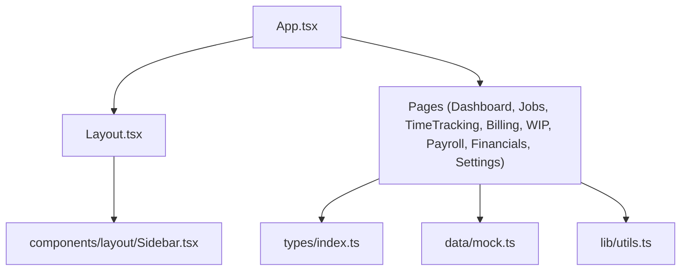
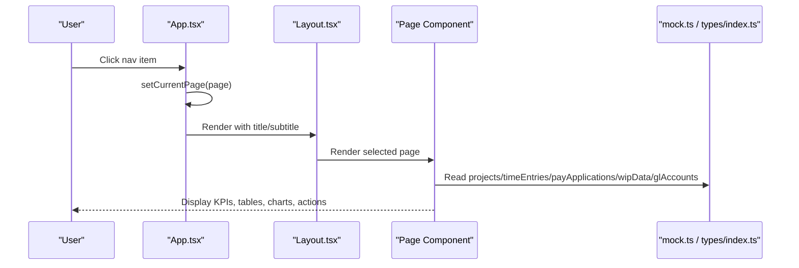
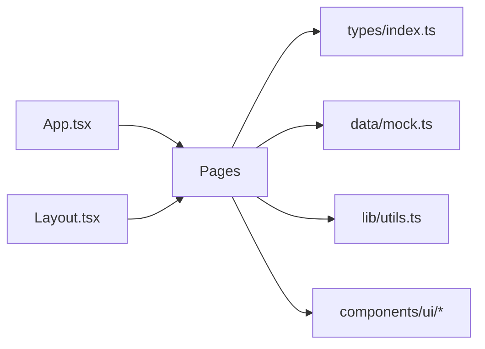

# Core Features

<cite>
**Referenced Files in This Document**
- [App.tsx](file://app/src/App.tsx)
- [Layout.tsx](file://app/src/components/layout/Layout.tsx)
- [Dashboard.tsx](file://app/src/pages/Dashboard.tsx)
- [Jobs.tsx](file://app/src/pages/Jobs.tsx)
- [JobDetail.tsx](file://app/src/pages/JobDetail.tsx)
- [TimeTracking.tsx](file://app/src/pages/TimeTracking.tsx)
- [Billing.tsx](file://app/src/pages/Billing.tsx)
- [WIP.tsx](file://app/src/pages/WIP.tsx)
- [Payroll.tsx](file://app/src/pages/Payroll.tsx)
- [Financials.tsx](file://app/src/pages/Financials.tsx)
- [Settings.tsx](file://app/src/pages/Settings.tsx)
- [types/index.ts](file://app/src/types/index.ts)
- [data/mock.ts](file://app/src/data/mock.ts)
- [utils.ts](file://app/src/lib/utils.ts)
- [package.json](file://app/package.json)
</cite>

## Table of Contents
1. Introduction
2. Project Structure
3. Core Components
4. Architecture Overview
5. Detailed Component Analysis
6. Dependency Analysis
7. Performance Considerations
8. Troubleshooting Guide
9. Conclusion

## Introduction
This document provides comprehensive documentation for the core features of the AWS MakerBay Construction Subcontractor App. It covers Dashboard & Analytics, Project Management with job costing and budget tracking, Time Tracking with crew hours logging and GPS support, Payroll Processing with certified payroll and prevailing wage compliance, AIA Billing (G702/G703), WIP Reporting with over/under billing analysis, Financial Management (AR/AP/GL), and Settings & Configuration. For each feature, we describe user workflows, key functionality, data models, integration points, and construction-specific business logic such as retainage calculations, cost codes, phase planning, and bonding requirements. Practical examples reference actual code paths to show how features interact.

## Project Structure
The application is a React + TypeScript frontend built with Vite. The root component orchestrates routing between pages via state-driven navigation. Each page encapsulates a specific domain area (e.g., Billing, WIP, Payroll). Shared UI components are under components/ui and layout. Data types are centralized in types/index.ts, and mock datasets simulate backend entities in data/mock.ts. Utilities handle formatting and class merging.

**Diagram sources**
- [App.tsx:1-78](file://app/src/App.tsx#L1-L78)
- [Layout.tsx:1-77](file://app/src/components/layout/Layout.tsx#L1-L77)

**Section sources**
- [App.tsx:1-78](file://app/src/App.tsx#L1-L78)
- [package.json:1-44](file://app/package.json#L1-L44)

## Core Components
- Application Shell: Centralized navigation and header/sidebar layout.
- Page Modules: Feature-specific screens with KPIs, tables, charts, and actions.
- Data Layer: Strongly-typed models and mock datasets representing projects, time entries, pay applications, WIP, GL accounts, invoices, bills, vendors, employees, and payroll runs.
- Utilities: Formatting helpers for currency, percentages, dates, and class name merging.

Key responsibilities:
- App.tsx: Manages current page and project context; renders Layout and page content.
- Layout.tsx: Provides consistent chrome (header, sidebar, main content area).
- Types: Define all domain models used across pages.
- Mock: Provide realistic sample data for development and demonstration.
- Utils: Standardize number/date formatting and styling utilities.

**Section sources**
- [App.tsx:15-78](file://app/src/App.tsx#L15-L78)
- [Layout.tsx:15-77](file://app/src/components/layout/Layout.tsx#L15-L77)
- [types/index.ts:1-255](file://app/src/types/index.ts#L1-L255)
- [data/mock.ts:1-246](file://app/src/data/mock.ts#L1-L246)
- [utils.ts:1-45](file://app/src/lib/utils.ts#L1-L45)

## Architecture Overview
The app follows a single-page application architecture with state-based routing. Each page consumes typed data from mock and renders domain-specific views. Charts and tables visualize financial and operational metrics. Navigation flows connect related features (e.g., Dashboard alerts link to Jobs or Billing).

**Diagram sources**
- [App.tsx:27-78](file://app/src/App.tsx#L27-L78)
- [Layout.tsx:15-77](file://app/src/components/layout/Layout.tsx#L15-L77)
- [Dashboard.tsx:19-55](file://app/src/pages/Dashboard.tsx#L19-L55)
- [Billing.tsx:17-45](file://app/src/pages/Billing.tsx#L17-L45)
- [WIP.tsx:12-33](file://app/src/pages/WIP.tsx#L12-L33)
- [Payroll.tsx:9-36](file://app/src/pages/Payroll.tsx#L9-L36)
- [Financials.tsx:12-67](file://app/src/pages/Financials.tsx#L12-L67)

## Detailed Component Analysis

### Dashboard & Analytics
Purpose: Provide a real-time overview of active jobs, contract values, open AR, crew hours, and actionable alerts.

User workflow:
- View KPI cards for Active Jobs, Total Contract Value, Open AR, Crew Hours.
- Inspect bar chart comparing Budget vs Actual vs Billed per job.
- Review cost breakdown pie chart by category.
- Click into Active Jobs list to navigate to Jobs page.
- Address Alerts & Actions (pending time entries, change orders, overdue invoices, under-billing).

Key functionality:
- Aggregates active projects, WIP data, invoices, time entries, and change orders to compute KPIs.
- Renders interactive charts using Recharts.
- Highlights PW projects with badges.

Data models:
- Projects, WIP, Invoices, TimeEntry, ChangeOrder.

Integration points:
- Links to Jobs and Job Detail pages via onNavigate.
- Uses utils for currency and percent formatting.

Construction-specific logic:
- Retainage awareness through WIP and Pay Applications.
- Prevailing wage indicators on active jobs.

Practical example references:
- KPI computation and alert generation: [Dashboard.tsx:19-55](file://app/src/pages/Dashboard.tsx#L19-L55), [Dashboard.tsx:205-251](file://app/src/pages/Dashboard.tsx#L205-L251)
- Chart rendering: [Dashboard.tsx:84-149](file://app/src/pages/Dashboard.tsx#L84-L149)

**Section sources**
- [Dashboard.tsx:19-259](file://app/src/pages/Dashboard.tsx#L19-L259)
- [data/mock.ts:6-90](file://app/src/data/mock.ts#L6-L90)
- [data/mock.ts:193-199](file://app/src/data/mock.ts#L193-L199)
- [data/mock.ts:222-228](file://app/src/data/mock.ts#L222-L228)
- [data/mock.ts:184-191](file://app/src/data/mock.ts#L184-L191)
- [utils.ts:8-40](file://app/src/lib/utils.ts#L8-L40)

### Project Management (Jobs & Costing)
Purpose: Manage jobs, track budgets, costs, profitability, and view detailed cost code and phase breakdowns.

User workflow:
- Filter/search jobs by name, job number, customer, and status.
- Toggle between Cards and Table views.
- Click a job card to drill into Job Detail for cost codes and phases.
- Observe progress bars, margin indicators, and change order counts.

Key functionality:
- Filtering and search.
- Summary metrics per job (contract, cost to date, billed, margin).
- Status badges and PW indicators.

Data models:
- Project, CostCode, Phase, WIPEntity, ChangeOrder.

Integration points:
- Navigates to JobDetail with projectId context.
- Reads WIP and change orders for summaries.

Construction-specific logic:
- Cost codes aligned to CSI divisions (e.g., “26 05 19”).
- Phases within cost codes (Rough-In, Trim, Finish).
- Retainage reflected in WIP and Pay Applications.

Practical example references:
- Filtering and view toggle: [Jobs.tsx:24-73](file://app/src/pages/Jobs.tsx#L24-L73)
- Card/table rendering and metrics: [Jobs.tsx:75-196](file://app/src/pages/Jobs.tsx#L75-L196)

**Section sources**
- [Jobs.tsx:24-196](file://app/src/pages/Jobs.tsx#L24-L196)
- [types/index.ts:24-63](file://app/src/types/index.ts#L24-L63)
- [data/mock.ts:6-90](file://app/src/data/mock.ts#L6-L90)
- [data/mock.ts:193-199](file://app/src/data/mock.ts#L193-L199)
- [data/mock.ts:184-191](file://app/src/data/mock.ts#L184-L191)

### Time Tracking
Purpose: Log crew hours, classify labor, approve/reject entries, and prepare for payroll runs.

User workflow:
- Filter entries by status (all/pending/approved/rejected).
- Approve or reject individual entries or bulk approve pending.
- View grouped daily summaries with hours and labor cost.

Key functionality:
- Grouping by date.
- Calculating total hours and labor cost including burden.
- Status transitions with visual feedback.

Data models:
- TimeEntry, Employee.

Integration points:
- Feeds into Payroll processing via approved entries.
- Supports GPS fields for location capture (model-level).

Construction-specific logic:
- Labor burden rates per employee.
- Classifications align with prevailing wage categories.

Practical example references:
- State management and approvals: [TimeTracking.tsx:9-27](file://app/src/pages/TimeTracking.tsx#L9-L27)
- Daily grouping and display: [TimeTracking.tsx:29-34](file://app/src/pages/TimeTracking.tsx#L29-L34), [TimeTracking.tsx:87-163](file://app/src/pages/TimeTracking.tsx#L87-L163)

**Section sources**
- [TimeTracking.tsx:9-167](file://app/src/pages/TimeTracking.tsx#L9-L167)
- [types/index.ts:65-98](file://app/src/types/index.ts#L65-L98)
- [data/mock.ts:92-116](file://app/src/data/mock.ts#L92-L116)

### Payroll Processing
Purpose: Run payroll periods, calculate gross/net, taxes, fringes, and generate certified reports for prevailing wage projects.

User workflow:
- Review summary KPIs (total gross, net, certified runs, active employees).
- Expand payroll runs to inspect employee entries.
- Export payroll or WH-347 report when certified.

Key functionality:
- Summaries across completed runs.
- Expanded detail table per run with classification and totals.
- Certification badge and export actions.

Data models:
- PayrollRun, PayrollEntry, Employee.

Integration points:
- Consumes approved time entries implicitly via mock data.
- Integrates with external payroll systems via Settings integrations.

Construction-specific logic:
- Prevailing wage classifications tracked per employee.
- Certified payroll runs marked for compliance.

Practical example references:
- Summary and CTA: [Payroll.tsx:9-54](file://app/src/pages/Payroll.tsx#L9-L54)
- Run expansion and employee table: [Payroll.tsx:56-153](file://app/src/pages/Payroll.tsx#L56-L153)
- Employee list and classifications: [Payroll.tsx:159-206](file://app/src/pages/Payroll.tsx#L159-L206)

**Section sources**
- [Payroll.tsx:9-210](file://app/src/pages/Payroll.tsx#L9-L210)
- [types/index.ts:100-127](file://app/src/types/index.ts#L100-L127)
- [data/mock.ts:118-145](file://app/src/data/mock.ts#L118-L145)
- [data/mock.ts:92-101](file://app/src/data/mock.ts#L92-L101)

### AIA Billing (G702/G703)
Purpose: Create and manage pay applications with schedule of values, retainage, earned revenue, and submission workflows.

User workflow:
- View summary KPIs (applications count, total billed, awaiting approval, retainage held).
- Expand an application to review contract sum, completed/stored, retainage, previous apps, and current payment due.
- Preview/export G702/G703 forms and submit to GC when draft.

Key functionality:
- Collapsible application cards with detailed SOV tables.
- Status progression (draft → submitted → approved → paid).
- Retainage calculation visibility.

Data models:
- PayApplication, ScheduleOfValueItem.

Integration points:
- Drives AR invoices and WIP earned revenue updates.
- Connects to project cost codes and phases via SOV descriptions.

Construction-specific logic:
- Retainage percentage applied per project.
- SOV lines map to CSI cost codes and phases.

Practical example references:
- Summary and actions: [Billing.tsx:17-45](file://app/src/pages/Billing.tsx#L17-L45)
- Expanded details and SOV table: [Billing.tsx:47-155](file://app/src/pages/Billing.tsx#L47-L155)

**Section sources**
- [Billing.tsx:17-163](file://app/src/pages/Billing.tsx#L17-L163)
- [types/index.ts:129-158](file://app/src/types/index.ts#L129-L158)
- [data/mock.ts:147-182](file://app/src/data/mock.ts#L147-L182)

### WIP Reporting
Purpose: Produce work-in-progress schedules for bonding and banking, analyzing earned vs billed vs costs and profit fade.

User workflow:
- Review KPIs (total contract, costs, billed, over/under billing, gross profit).
- Analyze charts for earned/billed/costs and margins by job.
- Export bonding-ready WIP schedule.

Key functionality:
- Aggregated totals and per-job metrics.
- Visualizations for performance and profitability.
- Bonding-ready table format.

Data models:
- WIPEntity.

Integration points:
- Pulls from projects and WIP mock data.
- Reflects outcomes of Billing and Time Tracking.

Construction-specific logic:
- Over/under billing detection.
- Profit fade tracking for risk monitoring.

Practical example references:
- KPIs and charts: [WIP.tsx:12-107](file://app/src/pages/WIP.tsx#L12-L107)
- Bonding-ready table: [WIP.tsx:109-183](file://app/src/pages/WIP.tsx#L109-L183)

**Section sources**
- [WIP.tsx:12-188](file://app/src/pages/WIP.tsx#L12-L188)
- [types/index.ts:173-189](file://app/src/types/index.ts#L173-L189)
- [data/mock.ts:193-199](file://app/src/data/mock.ts#L193-L199)

### Financial Management (GL, AR, AP)
Purpose: Track general ledger accounts, accounts receivable, and accounts payable with status indicators and summaries.

User workflow:
- Switch tabs between GL, AR, and AP.
- Review account balances grouped by type.
- Monitor overdue invoices and open bills.

Key functionality:
- Tabbed interface for GL/AR/AP.
- Status icons and badges for invoice/bill states.
- Totals for assets, liabilities, revenue, expenses, and net income.

Data models:
- GLAccount, Invoice, Bill.

Integration points:
- AR linked to Billing pay applications and invoices.
- AP linked to vendor bills and project commitments.

Construction-specific logic:
- Accounts include retainage receivable and billings in excess of costs.
- Categories align with construction COA standards.

Practical example references:
- Tab switching and summaries: [Financials.tsx:12-86](file://app/src/pages/Financials.tsx#L12-L86)
- GL view: [Financials.tsx:88-139](file://app/src/pages/Financials.tsx#L88-L139)
- AR view: [Financials.tsx:142-199](file://app/src/pages/Financials.tsx#L142-L199)
- AP view: [Financials.tsx:202-241](file://app/src/pages/Financials.tsx#L202-L241)

**Section sources**
- [Financials.tsx:12-246](file://app/src/pages/Financials.tsx#L12-L246)
- [types/index.ts:191-236](file://app/src/types/index.ts#L191-L236)
- [data/mock.ts:201-245](file://app/src/data/mock.ts#L201-L245)

### Settings & Configuration
Purpose: Configure company info, chart of accounts, integrations, notifications, subscription, and security settings.

User workflow:
- Edit company details and fiscal year end.
- Customize chart of accounts and export/import data.
- Connect third-party integrations (QuickBooks, ADP, Procore, Raken, BusyBusy, Sage Estimating).
- Toggle notification preferences.
- Manage subscription and security options (2FA, role-based access, audit trail, encryption).

Key functionality:
- Form inputs and toggles for configuration.
- Integration status indicators and connect actions.
- Subscription and security panels.

Construction-specific logic:
- Pre-configured industry-standard COA with retainage and contract accounts.
- Role-based access tailored to construction roles (Owner, Controller, PM, Foreman, Field Worker).

Practical example references:
- Company info and COA: [Settings.tsx:12-75](file://app/src/pages/Settings.tsx#L12-L75)
- Integrations: [Settings.tsx:77-111](file://app/src/pages/Settings.tsx#L77-L111)
- Notifications and subscription: [Settings.tsx:132-193](file://app/src/pages/Settings.tsx#L132-L193)
- Security: [Settings.tsx:195-234](file://app/src/pages/Settings.tsx#L195-L234)

**Section sources**
- [Settings.tsx:12-244](file://app/src/pages/Settings.tsx#L12-L244)

## Dependency Analysis
The application’s dependency graph centers on App.tsx orchestrating page rendering, while pages depend on shared types and mock data. Utilities provide cross-cutting formatting. UI primitives are reused across pages.

**Diagram sources**
- [App.tsx:1-78](file://app/src/App.tsx#L1-L78)
- [Layout.tsx:1-77](file://app/src/components/layout/Layout.tsx#L1-L77)
- [types/index.ts:1-255](file://app/src/types/index.ts#L1-L255)
- [data/mock.ts:1-246](file://app/src/data/mock.ts#L1-L246)
- [utils.ts:1-45](file://app/src/lib/utils.ts#L1-L45)

**Section sources**
- [App.tsx:1-78](file://app/src/App.tsx#L1-L78)
- [types/index.ts:1-255](file://app/src/types/index.ts#L1-L255)
- [data/mock.ts:1-246](file://app/src/data/mock.ts#L1-L246)

## Performance Considerations
- Rendering efficiency: Pages use local state for filters and expansions to minimize re-renders.
- Chart libraries: Recharts components are responsive but should be scoped to visible areas to reduce overhead.
- Data size: Mock datasets are small; in production, paginate large tables and lazy-load charts.
- Formatting: Centralized utils avoid repeated Intl calls; consider memoization if heavy computations arise.

[No sources needed since this section provides general guidance]

## Troubleshooting Guide
Common issues and resolutions:
- Pending time entries block payroll: Use TimeTracking to approve all pending entries before running payroll. See approval handlers and bulk approve action.
- Overdue invoices impact cash flow: Check Financials AR tab for overdue status and follow up with customers.
- Under-billing detected: Dashboard alerts indicate under-billing; create or update Pay Applications to reflect earned revenue.
- Missing change orders affect WIP: Ensure change orders are approved to adjust contract sums and WIP metrics.

Operational references:
- Time entry approvals: [TimeTracking.tsx:19-27](file://app/src/pages/TimeTracking.tsx#L19-L27)
- AR overdue alerts: [Financials.tsx:142-157](file://app/src/pages/Financials.tsx#L142-L157)
- Dashboard under-billing alert: [Dashboard.tsx:236-244](file://app/src/pages/Dashboard.tsx#L236-L244)

**Section sources**
- [TimeTracking.tsx:19-27](file://app/src/pages/TimeTracking.tsx#L19-L27)
- [Financials.tsx:142-157](file://app/src/pages/Financials.tsx#L142-L157)
- [Dashboard.tsx:236-244](file://app/src/pages/Dashboard.tsx#L236-L244)

## Conclusion
The AWS MakerBay Construction Subcontractor App delivers a cohesive suite of construction accounting features: real-time dashboards, robust project costing, time tracking with payroll readiness, AIA billing with retainage handling, WIP reporting for bonding, and full financial management. The modular page structure, strong typing, and reusable utilities enable maintainable development and clear user workflows. Construction-specific logic—cost codes, phases, retainage, prevailing wage, and bonding formats—is embedded throughout the data models and UI interactions.

[No sources needed since this section summarizes without analyzing specific files]