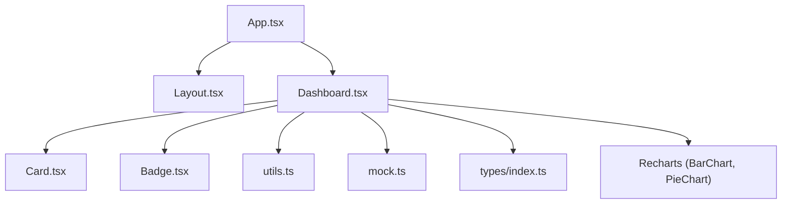
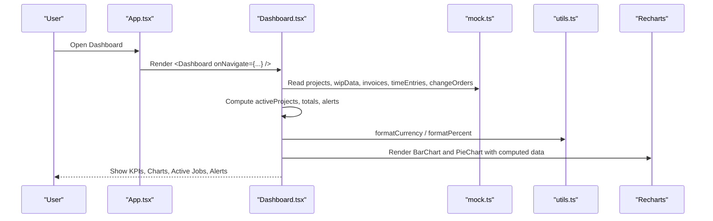
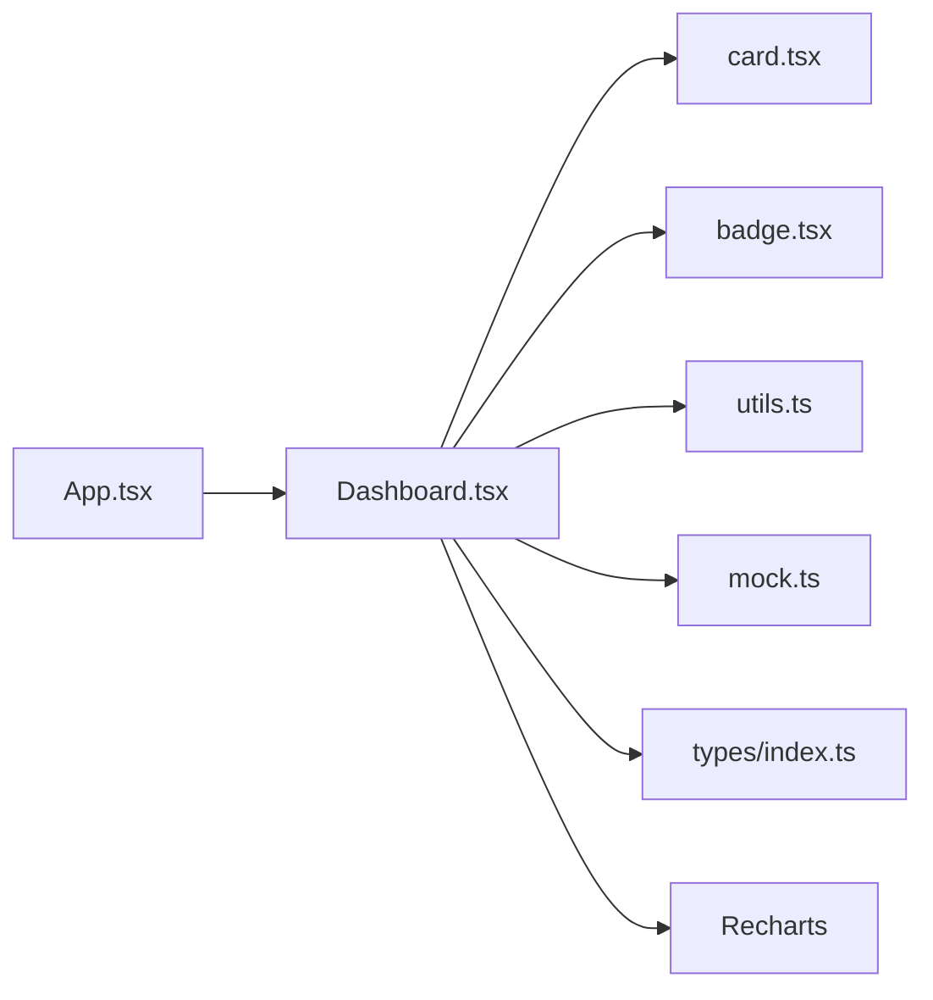

# Dashboard & Analytics

<cite>
**Referenced Files in This Document**
- [Dashboard.tsx](file://app/src/pages/Dashboard.tsx)
- [mock.ts](file://app/src/data/mock.ts)
- [index.ts](file://app/src/types/index.ts)
- [utils.ts](file://app/src/lib/utils.ts)
- [card.tsx](file://app/src/components/ui/card.tsx)
- [badge.tsx](file://app/src/components/ui/badge.tsx)
- [App.tsx](file://app/src/App.tsx)
</cite>

## Table of Contents
1. [Introduction](#introduction)
2. [Project Structure](#project-structure)
3. [Core Components](#core-components)
4. [Architecture Overview](#architecture-overview)
5. [Detailed Component Analysis](#detailed-component-analysis)
6. [Dependency Analysis](#dependency-analysis)
7. [Performance Considerations](#performance-considerations)
8. [Troubleshooting Guide](#troubleshooting-guide)
9. [Conclusion](#conclusion)
10. [Appendices](#appendices)

## Introduction
This document explains the Dashboard & Analytics feature that provides a real-time overview of construction accounting metrics. It covers:
- KPI cards for active jobs, total contract value, open accounts receivable (AR), and crew hours with trend indicators
- A job cost vs budget vs billed bar chart and a cost breakdown pie chart
- Active jobs summary with progress tracking and prevailing wage project indicators
- Alerts & Actions system for pending time entries, change orders, overdue invoices, and under-billing situations
- Implementation details for data aggregation from mock sources, metric calculations, and responsive chart rendering using Recharts
- Guidance to customize KPIs, add new metrics, and integrate with backend APIs

## Project Structure
The dashboard is implemented as a single-page component that composes UI primitives and charts. Data is sourced from a centralized mock dataset and typed via shared type definitions. Formatting utilities ensure consistent currency and percentage displays.

**Diagram sources**
- [App.tsx:27-78](file://app/src/App.tsx#L27-L78)
- [Dashboard.tsx:1-259](file://app/src/pages/Dashboard.tsx#L1-L259)
- [card.tsx:1-47](file://app/src/components/ui/card.tsx#L1-L47)
- [badge.tsx:1-33](file://app/src/components/ui/badge.tsx#L1-L33)
- [utils.ts:1-45](file://app/src/lib/utils.ts#L1-L45)
- [mock.ts:1-246](file://app/src/data/mock.ts#L1-L246)
- [index.ts:1-255](file://app/src/types/index.ts#L1-L255)

**Section sources**
- [App.tsx:27-78](file://app/src/App.tsx#L27-L78)
- [Dashboard.tsx:1-259](file://app/src/pages/Dashboard.tsx#L1-L259)

## Core Components
- KPI Cards: Display active jobs count, total contract value, open AR, and crew hours this week. Each card shows an icon, value, label, and a trend indicator with percentage change.
- Charts:
  - Bar Chart: Job Cost vs Budget vs Billed per active job
  - Pie Chart: YTD cost breakdown by category (labor, materials, equipment, subcontracts)
- Active Jobs Summary: Lists active projects with name, customer, job number, contract value, progress bar, and prevailing wage badge when applicable.
- Alerts & Actions: Highlights pending time entries, pending/draft change orders, overdue invoices, and under-billing conditions.

Key implementation highlights:
- Aggregation uses filter/reduce over mock datasets to compute totals
- Trend indicators are derived from static values in the KPI array
- Charts use Recharts ResponsiveContainer for responsive sizing
- Formatting uses Intl-based currency and percent helpers

**Section sources**
- [Dashboard.tsx:31-82](file://app/src/pages/Dashboard.tsx#L31-L82)
- [Dashboard.tsx:84-150](file://app/src/pages/Dashboard.tsx#L84-L150)
- [Dashboard.tsx:152-255](file://app/src/pages/Dashboard.tsx#L152-L255)
- [utils.ts:8-32](file://app/src/lib/utils.ts#L8-L32)
- [mock.ts:6-90](file://app/src/data/mock.ts#L6-L90)
- [mock.ts:193-199](file://app/src/data/mock.ts#L193-L199)
- [mock.ts:222-228](file://app/src/data/mock.ts#L222-L228)
- [index.ts:24-43](file://app/src/types/index.ts#L24-L43)
- [index.ts:160-171](file://app/src/types/index.ts#L160-L171)
- [index.ts:199-211](file://app/src/types/index.ts#L199-L211)

## Architecture Overview
The dashboard orchestrates data flows from mock sources into computed metrics and renders them through reusable UI components and charts. Navigation hooks allow moving to detailed pages.

**Diagram sources**
- [App.tsx:27-78](file://app/src/App.tsx#L27-L78)
- [Dashboard.tsx:19-30](file://app/src/pages/Dashboard.tsx#L19-L30)
- [Dashboard.tsx:38-53](file://app/src/pages/Dashboard.tsx#L38-L53)
- [Dashboard.tsx:84-150](file://app/src/pages/Dashboard.tsx#L84-L150)
- [utils.ts:8-32](file://app/src/lib/utils.ts#L8-L32)
- [mock.ts:6-90](file://app/src/data/mock.ts#L6-L90)
- [mock.ts:193-199](file://app/src/data/mock.ts#L193-L199)
- [mock.ts:222-228](file://app/src/data/mock.ts#L222-L228)

## Detailed Component Analysis

### KPI Cards
- Active Jobs: Count of projects with status active
- Total Contract Value: Sum of revisedContract for active projects
- Open AR: Sum of unpaid amounts for invoices with status sent or overdue
- Crew Hours This Week: Static weekly hours display
- Trend Indicators: Percentage changes shown with up/down icons; positive/negative styling applied

Implementation notes:
- Derived from filtering projects and aggregating WIP/invoice data
- Uses formatting utility for currency display
- Icons and colors are mapped per KPI

**Section sources**
- [Dashboard.tsx:19-36](file://app/src/pages/Dashboard.tsx#L19-L36)
- [Dashboard.tsx:57-82](file://app/src/pages/Dashboard.tsx#L57-L82)
- [utils.ts:8-15](file://app/src/lib/utils.ts#L8-L15)
- [mock.ts:6-90](file://app/src/data/mock.ts#L6-L90)
- [mock.ts:222-228](file://app/src/data/mock.ts#L222-L228)

### Job Cost vs Budget vs Billed Bar Chart
- Data source: For each active project, map to { name, budget, actual, billed }
- Budget: revisedContract from project
- Actual: costsToDate from WIP
- Billed: billedToDate from WIP
- Rendering: Recharts BarChart with CartesianGrid, X/Y axes, tooltips, and color-coded bars

Responsiveness:
- Wrapped in ResponsiveContainer to adapt to container size

**Section sources**
- [Dashboard.tsx:38-46](file://app/src/pages/Dashboard.tsx#L38-L46)
- [Dashboard.tsx:84-109](file://app/src/pages/Dashboard.tsx#L84-L109)
- [mock.ts:6-90](file://app/src/data/mock.ts#L6-L90)
- [mock.ts:193-199](file://app/src/data/mock.ts#L193-L199)

### Cost Breakdown Pie Chart (YTD)
- Categories: Labor, Materials, Equipment, Subcontracts
- Values: Hardcoded YTD totals
- Rendering: Recharts PieChart with inner/outer radius, padding angle, and legend below

Customization:
- Colors assigned per category
- Tooltip formats values as currency

**Section sources**
- [Dashboard.tsx:48-53](file://app/src/pages/Dashboard.tsx#L48-L53)
- [Dashboard.tsx:111-149](file://app/src/pages/Dashboard.tsx#L111-L149)

### Active Jobs Summary
- Displays active projects with:
  - Name, customer, job number
  - Contract value
  - Progress bar reflecting percentComplete
  - Prevailing wage badge when isPrevailingWage is true
- Clicking a row navigates to the jobs page

**Section sources**
- [Dashboard.tsx:152-196](file://app/src/pages/Dashboard.tsx#L152-L196)
- [mock.ts:6-90](file://app/src/data/mock.ts#L6-L90)
- [index.ts:24-43](file://app/src/types/index.ts#L24-L43)

### Alerts & Actions System
Monitors and surfaces actionable items:
- Pending time entries: Count of entries with status pending
- Change orders needing attention: Count of change orders with status pending or draft
- Overdue invoices: Count and total past due amount for invoices with status overdue
- Under-billing detection: Flag if any active job has overUnderBilling less than a threshold
- Payroll reminder: Static alert about payroll period closing

Rendering:
- Conditional blocks show relevant alerts based on computed counts and thresholds
- Visual cues include icons and colored borders/backgrounds

**Section sources**
- [Dashboard.tsx:20-30](file://app/src/pages/Dashboard.tsx#L20-L30)
- [Dashboard.tsx:198-255](file://app/src/pages/Dashboard.tsx#L198-L255)
- [mock.ts:103-116](file://app/src/data/mock.ts#L103-L116)
- [mock.ts:184-191](file://app/src/data/mock.ts#L184-L191)
- [mock.ts:222-228](file://app/src/data/mock.ts#L222-L228)
- [mock.ts:193-199](file://app/src/data/mock.ts#L193-L199)

### Data Aggregation and Real-Time Metric Calculations
- Active projects filtered by status
- Totals computed via reduce across arrays
- WIP linked to projects by projectId
- Invoices aggregated by status and payment state
- Time entries and change orders counted by status

Complexity:
- Filtering and mapping operations run on small mock datasets; performance is negligible
- For large datasets, consider memoization or server-side aggregation

**Section sources**
- [Dashboard.tsx:19-30](file://app/src/pages/Dashboard.tsx#L19-L30)
- [Dashboard.tsx:38-46](file://app/src/pages/Dashboard.tsx#L38-L46)
- [mock.ts:6-90](file://app/src/data/mock.ts#L6-L90)
- [mock.ts:193-199](file://app/src/data/mock.ts#L193-L199)
- [mock.ts:222-228](file://app/src/data/mock.ts#L222-L228)

### Responsive Chart Rendering with Recharts
- BarChart and PieChart wrapped in ResponsiveContainer
- Axes and tooltips configured for readability
- Currency formatting applied in tooltips

**Section sources**
- [Dashboard.tsx:84-150](file://app/src/pages/Dashboard.tsx#L84-L150)
- [utils.ts:8-15](file://app/src/lib/utils.ts#L8-L15)

## Dependency Analysis
The dashboard depends on:
- UI primitives for layout and badges
- Utilities for formatting
- Mock data for all metrics
- Type definitions for contracts and entities
- Recharts for visualization

**Diagram sources**
- [Dashboard.tsx:1-14](file://app/src/pages/Dashboard.tsx#L1-L14)
- [card.tsx:1-47](file://app/src/components/ui/card.tsx#L1-L47)
- [badge.tsx:1-33](file://app/src/components/ui/badge.tsx#L1-L33)
- [utils.ts:1-45](file://app/src/lib/utils.ts#L1-L45)
- [mock.ts:1-246](file://app/src/data/mock.ts#L1-L246)
- [index.ts:1-255](file://app/src/types/index.ts#L1-L255)
- [App.tsx:27-78](file://app/src/App.tsx#L27-L78)

**Section sources**
- [Dashboard.tsx:1-14](file://app/src/pages/Dashboard.tsx#L1-L14)
- [App.tsx:27-78](file://app/src/App.tsx#L27-L78)

## Performance Considerations
- Current dataset sizes are small; computations are O(n) per render and acceptable
- For scaling:
  - Memoize derived data with React.memo or useMemo
  - Precompute aggregates in a service layer or cache
  - Paginate or virtualize lists if active jobs grow large
  - Use server-side aggregation for charts and KPIs to minimize client load

[No sources needed since this section provides general guidance]

## Troubleshooting Guide
Common issues and resolutions:
- Missing or incorrect data keys in charts: Ensure data arrays match chart dataKey fields (e.g., name, budget, actual, billed)
- Incorrect currency formatting: Verify usage of formatCurrency helper and correct numeric inputs
- Alerts not showing: Confirm statuses in mock data align with conditional checks (pending, draft, overdue)
- Prevailing wage badge not appearing: Check isPrevailingWage flag on projects
- Navigation not working: Ensure onNavigate prop is passed and routes are handled in App

**Section sources**
- [Dashboard.tsx:38-46](file://app/src/pages/Dashboard.tsx#L38-L46)
- [Dashboard.tsx:152-196](file://app/src/pages/Dashboard.tsx#L152-L196)
- [Dashboard.tsx:198-255](file://app/src/pages/Dashboard.tsx#L198-L255)
- [utils.ts:8-15](file://app/src/lib/utils.ts#L8-L15)
- [mock.ts:6-90](file://app/src/data/mock.ts#L6-L90)
- [mock.ts:103-116](file://app/src/data/mock.ts#L103-L116)
- [mock.ts:184-191](file://app/src/data/mock.ts#L184-L191)
- [mock.ts:222-228](file://app/src/data/mock.ts#L222-L228)

## Conclusion
The Dashboard & Analytics feature provides a comprehensive, responsive view of key construction accounting metrics. It leverages mock data for rapid development and clear separation of concerns between data, types, formatting, and presentation. The design supports easy customization of KPIs, addition of new metrics, and integration with backend APIs for production use.

[No sources needed since this section summarizes without analyzing specific files]

## Appendices

### Customizing KPIs
- Add a new KPI:
  - Extend the KPI array with label, value, change, icon, and color
  - Compute value from mock data or API response
  - Optionally add a trend calculation based on historical data
- Modify existing KPIs:
  - Update aggregation logic to reflect new business rules
  - Adjust formatting and thresholds as needed

**Section sources**
- [Dashboard.tsx:31-36](file://app/src/pages/Dashboard.tsx#L31-L36)
- [Dashboard.tsx:19-30](file://app/src/pages/Dashboard.tsx#L19-L30)

### Adding New Metrics
- Identify data source (projects, WIP, invoices, time entries, change orders)
- Compute metric using filter/reduce or map transformations
- Integrate into KPI grid or dedicated section
- Add appropriate chart or list item if necessary

**Section sources**
- [Dashboard.tsx:19-30](file://app/src/pages/Dashboard.tsx#L19-L30)
- [Dashboard.tsx:38-46](file://app/src/pages/Dashboard.tsx#L38-L46)
- [mock.ts:6-90](file://app/src/data/mock.ts#L6-L90)
- [mock.ts:193-199](file://app/src/data/mock.ts#L193-L199)
- [mock.ts:222-228](file://app/src/data/mock.ts#L222-L228)

### Integrating with Backend APIs
- Replace mock imports with API calls (fetch/axios)
- Cache responses to avoid redundant requests
- Map API payloads to existing types (Project, WIPEntity, Invoice, etc.)
- Handle loading states and errors gracefully
- Maintain backward compatibility during migration

**Section sources**
- [index.ts:24-43](file://app/src/types/index.ts#L24-L43)
- [index.ts:160-171](file://app/src/types/index.ts#L160-L171)
- [index.ts:199-211](file://app/src/types/index.ts#L199-L211)
- [Dashboard.tsx:1-14](file://app/src/pages/Dashboard.tsx#L1-L14)