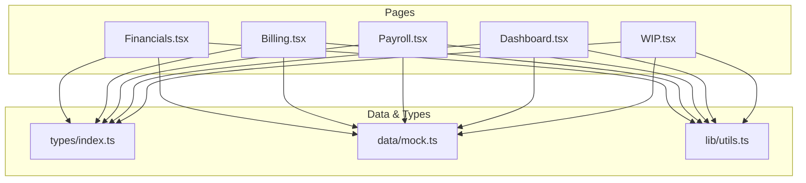
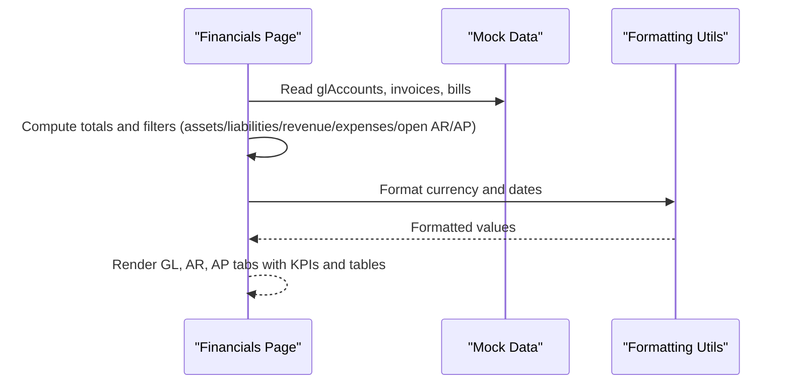
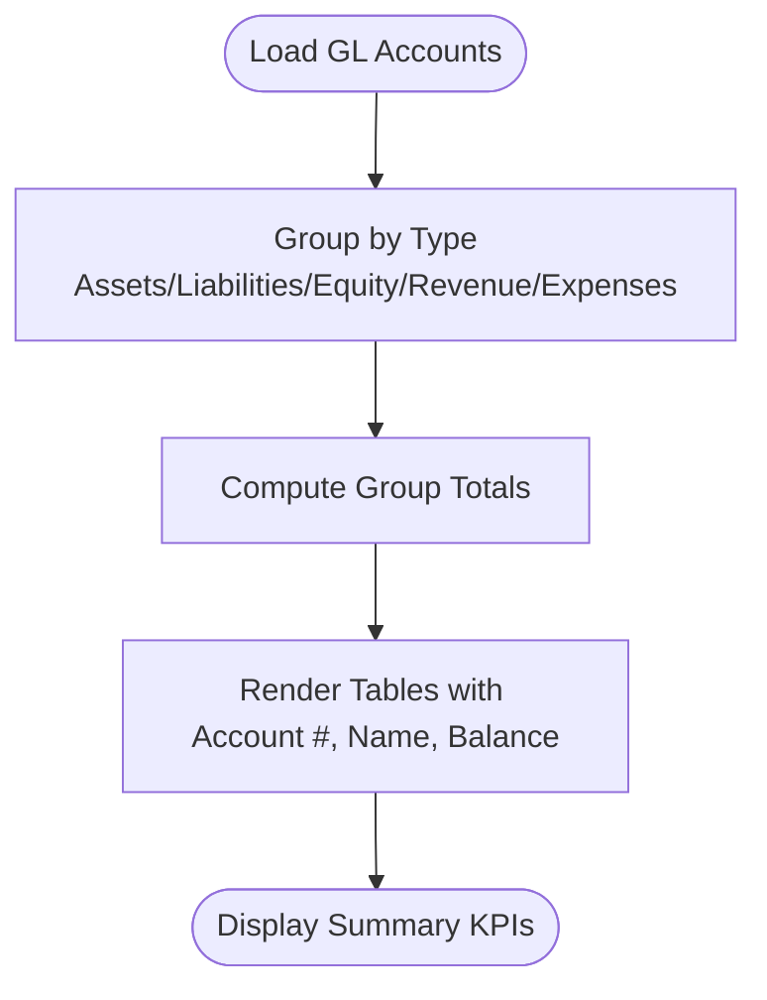
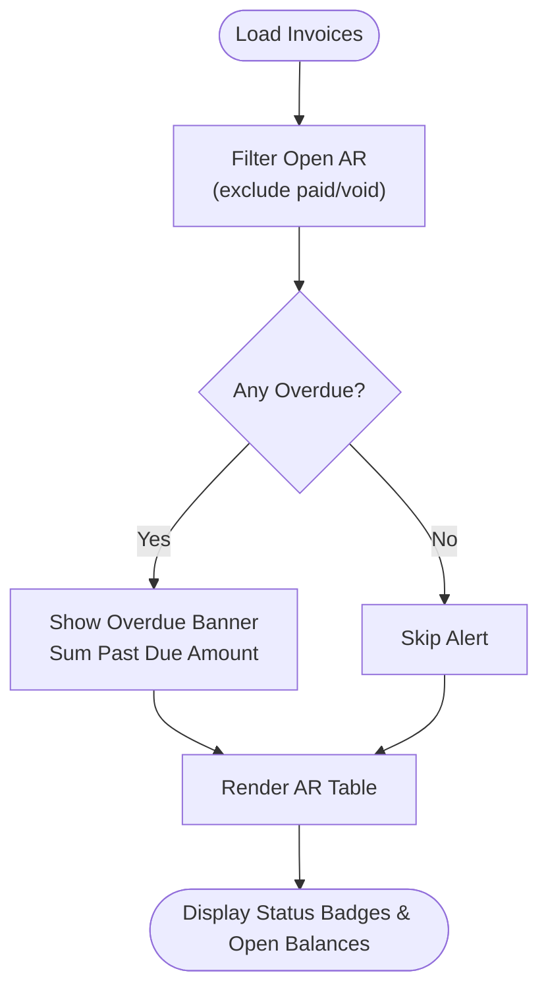
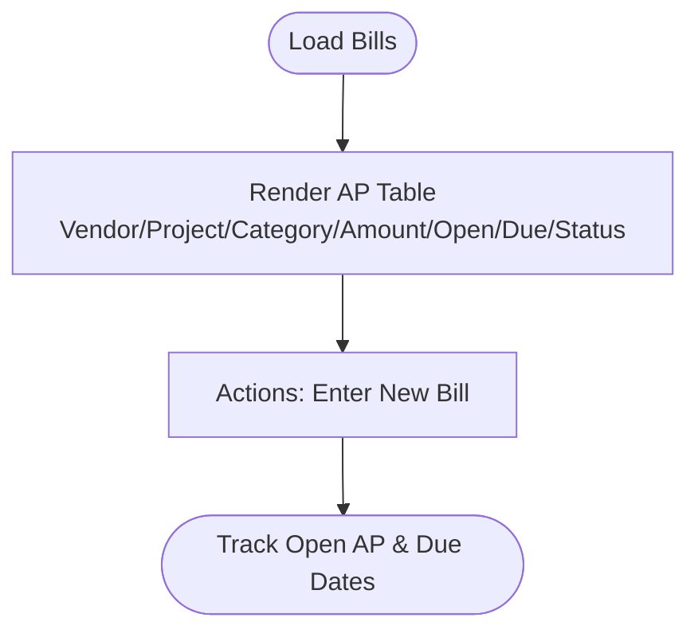
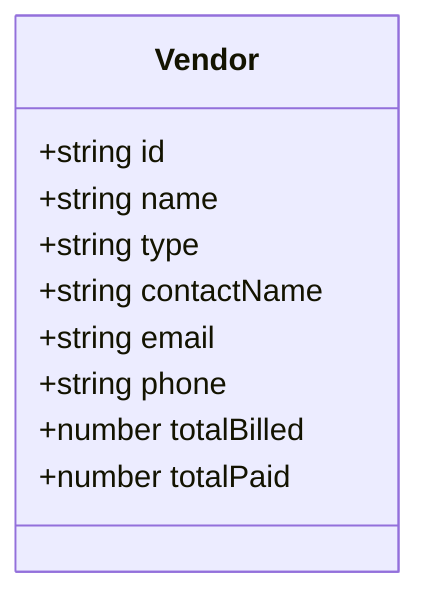
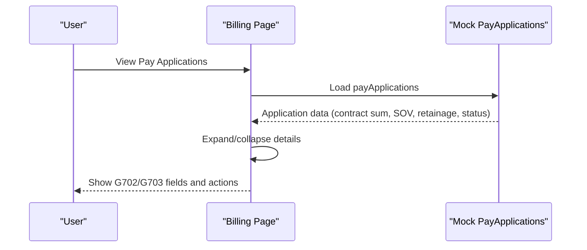
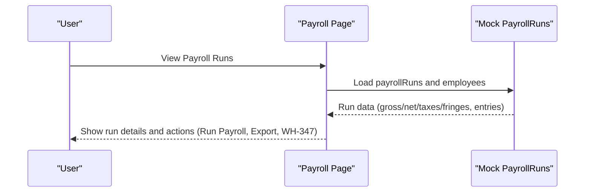
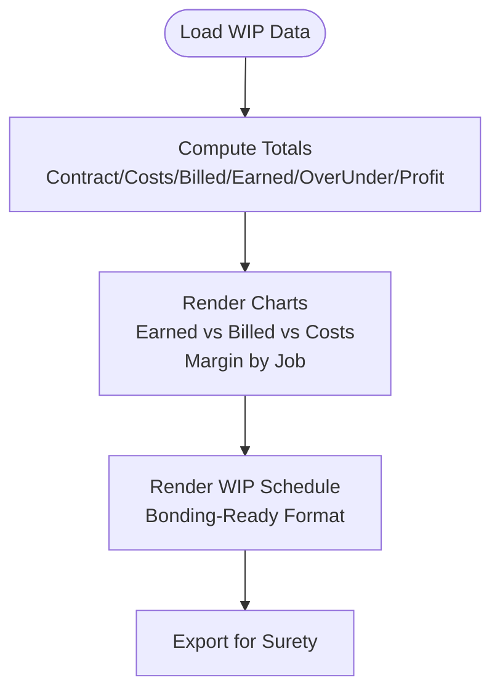
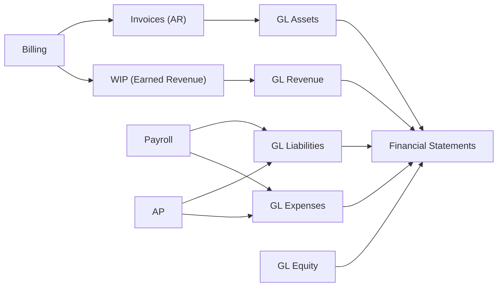

# Financial Management

<cite>
**Referenced Files in This Document**
- [Financials.tsx](file://app/src/pages/Financials.tsx)
- [Billing.tsx](file://app/src/pages/Billing.tsx)
- [Payroll.tsx](file://app/src/pages/Payroll.tsx)
- [Dashboard.tsx](file://app/src/pages/Dashboard.tsx)
- [WIP.tsx](file://app/src/pages/WIP.tsx)
- [types/index.ts](file://app/src/types/index.ts)
- [data/mock.ts](file://app/src/data/mock.ts)
- [utils.ts](file://app/src/lib/utils.ts)
</cite>

## Table of Contents
1. Introduction
2. Project Structure
3. Core Components
4. Architecture Overview
5. Detailed Component Analysis
6. Dependency Analysis
7. Performance Considerations
8. Troubleshooting Guide
9. Conclusion
10. Appendices

## Introduction
This document explains the Financial Management feature for a construction subcontractor application. It covers accounts receivable (AR), accounts payable (AP), general ledger (GL) accounts, vendor management, invoice and bill processing, and their relationships to billing and payroll. It also outlines aging reports, cash flow analysis, financial statement generation, GL account structures, transaction posting logic, and integration considerations with accounting systems. Construction-specific requirements such as AIA pay applications, retainage, WIP schedules, and prevailing wage reporting are addressed.

## Project Structure
The Financial Management feature is implemented across several React pages that consume shared types and mock data:
- Financials page: Central hub for GL, AR, and AP views with summary KPIs and tabs.
- Billing page: Pay applications (AIA G702/G703), schedule of values, status tracking, and export options.
- Payroll page: Payroll runs, employee details, certified payroll indicators, and WH-347 report access.
- Dashboard page: High-level KPIs including open AR, alerts, and cost breakdowns.
- WIP page: Work-in-progress schedule, earned vs billed vs costs, gross margin by job, and surety-ready export.
- Types and mock data: Strongly typed models for projects, invoices, bills, vendors, GL accounts, pay applications, payroll runs, and WIP entities.
- Utilities: Currency, percentage, date formatting helpers used across pages.

**Diagram sources**
- [Financials.tsx:1-246](file://app/src/pages/Financials.tsx#L1-L246)
- [Billing.tsx:1-163](file://app/src/pages/Billing.tsx#L1-L163)
- [Payroll.tsx:1-210](file://app/src/pages/Payroll.tsx#L1-L210)
- [Dashboard.tsx:1-259](file://app/src/pages/Dashboard.tsx#L1-L259)
- [WIP.tsx:1-188](file://app/src/pages/WIP.tsx#L1-L188)
- [types/index.ts:1-255](file://app/src/types/index.ts#L1-L255)
- [data/mock.ts:1-246](file://app/src/data/mock.ts#L1-L246)
- [utils.ts:1-45](file://app/src/lib/utils.ts#L1-L45)

**Section sources**
- [Financials.tsx:1-246](file://app/src/pages/Financials.tsx#L1-L246)
- [Billing.tsx:1-163](file://app/src/pages/Billing.tsx#L1-L163)
- [Payroll.tsx:1-210](file://app/src/pages/Payroll.tsx#L1-L210)
- [Dashboard.tsx:1-259](file://app/src/pages/Dashboard.tsx#L1-L259)
- [WIP.tsx:1-188](file://app/src/pages/WIP.tsx#L1-L188)
- [types/index.ts:1-255](file://app/src/types/index.ts#L1-L255)
- [data/mock.ts:1-246](file://app/src/data/mock.ts#L1-L246)
- [utils.ts:1-45](file://app/src/lib/utils.ts#L1-L45)

## Core Components
- General Ledger (GL): Chart of Accounts grouped by type (assets, liabilities, equity, revenue, expenses) with balances and totals.
- Accounts Receivable (AR): Invoices linked to projects and customers; overdue detection; open amounts; status badges.
- Accounts Payable (AP): Bills linked to vendors and projects; categories; open amounts; due dates; statuses.
- Vendor Management: Vendor records with contact info, type, and cumulative billed/paid totals.
- Billing: Pay applications with AIA G702/G703 fields, schedule of values, retainage, current payment due, and submission/approval workflow.
- Payroll: Payroll runs with gross/net totals, taxes, fringes, certifications, and WH-347 report access.
- WIP: Earned vs billed vs costs per project, over/under billing, profit fade, gross margin, and surety-ready export.

Key data models include GLAccount, Invoice, Bill, Vendor, PayApplication, PayrollRun, Employee, TimeEntry, WIPEntity, and related enums.

**Section sources**
- [types/index.ts:191-236](file://app/src/types/index.ts#L191-L236)
- [data/mock.ts:201-245](file://app/src/data/mock.ts#L201-L245)
- [Financials.tsx:12-246](file://app/src/pages/Financials.tsx#L12-L246)
- [Billing.tsx:17-163](file://app/src/pages/Billing.tsx#L17-L163)
- [Payroll.tsx:9-210](file://app/src/pages/Payroll.tsx#L9-L210)
- [WIP.tsx:12-188](file://app/src/pages/WIP.tsx#L12-L188)

## Architecture Overview
The Financial Management feature follows a page-based architecture where each page consumes shared types and mock data to render financial dashboards and operational workflows. Data flows from mock datasets into typed components, which compute summaries and present actionable insights.

**Diagram sources**
- [Financials.tsx:12-246](file://app/src/pages/Financials.tsx#L12-L246)
- [data/mock.ts:201-245](file://app/src/data/mock.ts#L201-L245)
- [utils.ts:8-44](file://app/src/lib/utils.ts#L8-L44)

## Detailed Component Analysis

### General Ledger (GL)
- Purpose: Provide a chart of accounts grouped by type with balances and totals for assets, liabilities, equity, revenue, and expenses.
- Implementation highlights:
  - Filters accounts by type and computes group totals.
  - Displays account number, name, and balance in a table with totals per group.
  - Supports adding new accounts via UI affordance.
- Construction relevance:
  - Includes typical construction GL accounts such as Retainage Receivable, Billings in Excess of Costs, and COGS categories aligned with labor, materials, equipment, and subcontracts.

**Diagram sources**
- [Financials.tsx:15-139](file://app/src/pages/Financials.tsx#L15-L139)
- [data/mock.ts:201-220](file://app/src/data/mock.ts#L201-L220)

**Section sources**
- [Financials.tsx:15-139](file://app/src/pages/Financials.tsx#L15-L139)
- [data/mock.ts:201-220](file://app/src/data/mock.ts#L201-L220)
- [types/index.ts:191-197](file://app/src/types/index.ts#L191-L197)

### Accounts Receivable (AR)
- Purpose: Track invoices, open amounts, due dates, and overdue status; highlight overdue items for follow-up.
- Implementation highlights:
  - Computes open AR by excluding paid/void invoices.
  - Highlights overdue invoices with alert banner and total past due amount.
  - Displays invoice details including project, customer, amount, open balance, due date, and status badge.
- Construction relevance:
  - Invoices often correspond to pay applications; AR aging can be derived from due dates and status.

**Diagram sources**
- [Financials.tsx:25-199](file://app/src/pages/Financials.tsx#L25-L199)
- [data/mock.ts:222-228](file://app/src/data/mock.ts#L222-L228)

**Section sources**
- [Financials.tsx:25-199](file://app/src/pages/Financials.tsx#L25-L199)
- [data/mock.ts:222-228](file://app/src/data/mock.ts#L222-L228)
- [types/index.ts:199-211](file://app/src/types/index.ts#L199-L211)

### Accounts Payable (AP)
- Purpose: Manage bills, track open amounts, due dates, categories, and vendor relationships.
- Implementation highlights:
  - Renders bill list with vendor, project, category, amount, open balance, due date, and status.
  - Supports entering new bills via UI affordance.
- Construction relevance:
  - Categories align with materials, equipment, and other costs; bills link to projects for cost tracking.

**Diagram sources**
- [Financials.tsx:202-242](file://app/src/pages/Financials.tsx#L202-L242)
- [data/mock.ts:230-236](file://app/src/data/mock.ts#L230-L236)

**Section sources**
- [Financials.tsx:202-242](file://app/src/pages/Financials.tsx#L202-L242)
- [data/mock.ts:230-236](file://app/src/data/mock.ts#L230-L236)
- [types/index.ts:213-225](file://app/src/types/index.ts#L213-L225)

### Vendor Management
- Purpose: Maintain vendor profiles, categorization, and cumulative billing/payment metrics.
- Implementation highlights:
  - Vendor model includes type (subcontractor, material-supplier, equipment-rental, other), contact info, and totals.
  - Used in AP view to display vendor names and categories.
- Construction relevance:
  - Subcontractors and suppliers are central to project costs and AP workflows.

**Diagram sources**
- [types/index.ts:227-236](file://app/src/types/index.ts#L227-L236)
- [data/mock.ts:238-245](file://app/src/data/mock.ts#L238-L245)

**Section sources**
- [types/index.ts:227-236](file://app/src/types/index.ts#L227-L236)
- [data/mock.ts:238-245](file://app/src/data/mock.ts#L238-L245)

### Billing (Pay Applications)
- Purpose: Create and manage AIA G702/G703 pay applications, schedule of values, retainage, and payment due calculations.
- Implementation highlights:
  - Summarizes total applications, total billed, awaiting approval counts, and total retainage held.
  - Expands each application to show contract sum, completed/stored amounts, retainage, previous apps, and current payment due.
  - Schedule of Values table shows line items, scheduled value, previous completed, this period, total completed, stored materials, and percent complete.
  - Actions include submit to GC, export PDF, and preview G702/G703.
- Construction relevance:
  - Aligns with standard industry forms and processes; supports retainage handling and progress billing.

**Diagram sources**
- [Billing.tsx:17-163](file://app/src/pages/Billing.tsx#L17-L163)
- [data/mock.ts:147-182](file://app/src/data/mock.ts#L147-L182)

**Section sources**
- [Billing.tsx:17-163](file://app/src/pages/Billing.tsx#L17-L163)
- [data/mock.ts:147-182](file://app/src/data/mock.ts#L147-L182)
- [types/index.ts:129-158](file://app/src/types/index.ts#L129-L158)

### Payroll
- Purpose: Run payroll periods, track gross/net, taxes, fringes, certifications, and generate WH-347 reports for prevailing wage projects.
- Implementation highlights:
  - Summarizes total gross/net for completed runs and counts certified runs and active employees.
  - Displays draft/current period prompts to run payroll when ready.
  - Expanded payroll run shows per-employee entries with classification, hours, gross, taxes, fringes, net, and project linkage.
  - Certified runs expose WH-347 report export.
- Construction relevance:
  - Prevailing wage compliance and certified payroll reporting are supported via certification flags and WH-347 access.

**Diagram sources**
- [Payroll.tsx:9-210](file://app/src/pages/Payroll.tsx#L9-L210)
- [data/mock.ts:118-145](file://app/src/data/mock.ts#L118-L145)

**Section sources**
- [Payroll.tsx:9-210](file://app/src/pages/Payroll.tsx#L9-L210)
- [data/mock.ts:118-145](file://app/src/data/mock.ts#L118-L145)
- [types/index.ts:100-127](file://app/src/types/index.ts#L100-L127)

### Work-in-Progress (WIP)
- Purpose: Present earned vs billed vs costs, over/under billing, profit fade, and gross margin by job; support surety-ready export.
- Implementation highlights:
  - Summarizes total contract value, costs, billed, over/under billing, and gross profit.
  - Charts visualize earned/billed/costs and gross margin by job.
  - Table provides bonding-ready format with key columns and totals.
- Construction relevance:
  - Essential for performance measurement, bonding requirements, and financial health monitoring.

**Diagram sources**
- [WIP.tsx:12-188](file://app/src/pages/WIP.tsx#L12-L188)
- [data/mock.ts:193-199](file://app/src/data/mock.ts#L193-L199)

**Section sources**
- [WIP.tsx:12-188](file://app/src/pages/WIP.tsx#L12-L188)
- [data/mock.ts:193-199](file://app/src/data/mock.ts#L193-L199)
- [types/index.ts:173-189](file://app/src/types/index.ts#L173-L189)

### Dashboard Integration
- Purpose: Provide high-level financial KPIs and alerts, including open AR and cost breakdowns.
- Implementation highlights:
  - Calculates open AR from invoices and displays alerts for overdue invoices and under-billing conditions.
  - Shows cost breakdown by type (labor, materials, equipment, subcontracts).
- Construction relevance:
  - Early visibility into cash flow risks and project performance.

**Section sources**
- [Dashboard.tsx:19-259](file://app/src/pages/Dashboard.tsx#L19-L259)
- [data/mock.ts:222-228](file://app/src/data/mock.ts#L222-L228)

## Dependency Analysis
- Pages depend on shared types for consistent data contracts and on mock data for demonstration content.
- Formatting utilities ensure consistent currency, percentage, and date presentation across all financial views.
- Relationships between modules:
  - Billing generates invoices that feed AR; pay applications drive earned revenue and affect WIP.
  - Payroll impacts liabilities (accrued payroll, payroll taxes payable) and expenses (COGS-labor, fringes).
  - AP bills increase liabilities (accounts payable) and expenses (COGS-materials/equipment/subcontracts).
  - GL consolidates balances from these activities to produce financial statements.

**Diagram sources**
- [types/index.ts:191-236](file://app/src/types/index.ts#L191-L236)
- [data/mock.ts:201-245](file://app/src/data/mock.ts#L201-L245)

**Section sources**
- [types/index.ts:191-236](file://app/src/types/index.ts#L191-L236)
- [data/mock.ts:201-245](file://app/src/data/mock.ts#L201-L245)

## Performance Considerations
- Client-side filtering and aggregation: Current implementation uses in-memory arrays for summaries; for large datasets, consider pagination or server-side aggregation.
- Rendering efficiency: Tables and charts should virtualize long lists if dataset size grows significantly.
- Formatting overhead: Reuse formatted values where possible to avoid repeated Intl computations.
- State management: For complex interactions (e.g., multi-tab financials), consider centralized state to reduce re-renders.

[No sources needed since this section provides general guidance]

## Troubleshooting Guide
- Overdue invoices: The dashboard and AR tab highlight overdue invoices; verify due dates and statuses to ensure accurate aging.
- Under-billing alerts: Dashboard warns about under-billing; review pay applications and schedule of values to align billed amounts with earned revenue.
- Payroll certification: Ensure payroll runs marked as certified have required classifications and hours for WH-347 reporting.
- Retainage discrepancies: Confirm retainage percentages and calculations in pay applications match contract terms.

**Section sources**
- [Dashboard.tsx:223-244](file://app/src/pages/Dashboard.tsx#L223-L244)
- [Billing.tsx:147-152](file://app/src/pages/Billing.tsx#L147-L152)
- [Payroll.tsx:145-150](file://app/src/pages/Payroll.tsx#L145-L150)

## Conclusion
The Financial Management feature provides a comprehensive view of construction financial operations, integrating GL, AR, AP, billing, payroll, and WIP into cohesive dashboards and workflows. It supports industry-standard practices like AIA pay applications, retainage, and certified payroll reporting. With clear data models and consistent formatting, it enables robust financial tracking, reporting, and decision-making tailored to construction subcontractors.

[No sources needed since this section summarizes without analyzing specific files]

## Appendices

### GL Account Structures
- Typical construction GL structure includes:
  - Assets: Cash, Accounts Receivable, Retainage Receivable, Inventory, Equipment.
  - Liabilities: Accounts Payable, Accrued Payroll, Payroll Taxes Payable, Billings in Excess of Costs.
  - Equity: Retained Earnings.
  - Revenue: Contract Revenue.
  - Expenses: COGS (Labor, Materials, Equipment, Subcontracts), G&A, Insurance, Depreciation.
- These accounts appear in the mock dataset and are grouped and summarized in the GL view.

**Section sources**
- [data/mock.ts:201-220](file://app/src/data/mock.ts#L201-L220)
- [Financials.tsx:15-139](file://app/src/pages/Financials.tsx#L15-L139)

### Transaction Posting Logic (Conceptual)
- Billing to AR:
  - When a pay application is approved and invoiced, increase AR and recognize earned revenue; adjust WIP earned revenue accordingly.
- Payment Receipt:
  - Reduce AR and increase cash; update invoice status to paid.
- AP to Expenses:
  - When a bill is posted, increase AP and corresponding COGS expense; upon payment, reduce AP and cash.
- Payroll Posting:
  - Post gross wages to COGS-labor; post taxes and fringes to liabilities and expenses; upon payment, reduce liabilities and cash.
- WIP Adjustments:
  - Earned revenue updates reflect progress billing; over/under billing impacts retained earnings and liability accounts.

[No sources needed since this section provides conceptual guidance]

### Aging Reports and Cash Flow Analysis
- Aging by due date: Use invoice due dates and status to bucket AR into aging categories (current, 1–30, 31–60, 61–90, 90+ days).
- Cash flow: Combine AR collections, AP payments, payroll disbursements, and retained earnings changes to forecast cash positions.
- Dashboard alerts: Leverage existing overdue and under-billing alerts to proactively manage cash flow.

**Section sources**
- [Dashboard.tsx:223-244](file://app/src/pages/Dashboard.tsx#L223-L244)
- [Financials.tsx:25-199](file://app/src/pages/Financials.tsx#L25-L199)

### Integration with Accounting Systems
- Mapping:
  - Map GL accounts to external accounting software chart of accounts.
  - Sync invoices, bills, payroll entries, and WIP adjustments via APIs or exports.
- Validation:
  - Ensure double-entry integrity: debits equal credits for each transaction batch.
- Reconciliation:
  - Periodically reconcile internal GL balances with external system outputs.

[No sources needed since this section provides general guidance]

### Construction-Specific Requirements and Reporting Standards
- AIA G702/G703: Supported via pay applications and schedule of values with retainage and percent complete tracking.
- Prevailing Wage: Certified payroll runs and WH-347 report access for compliance.
- Bonding-Ready WIP: Exportable WIP schedule with contract, costs, billed, earned, over/under, profit fade, and margins.

**Section sources**
- [Billing.tsx:42-152](file://app/src/pages/Billing.tsx#L42-L152)
- [Payroll.tsx:145-150](file://app/src/pages/Payroll.tsx#L145-L150)
- [WIP.tsx:111-183](file://app/src/pages/WIP.tsx#L111-L183)