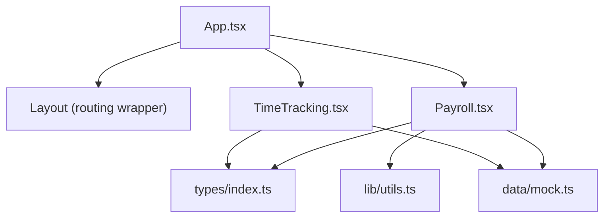
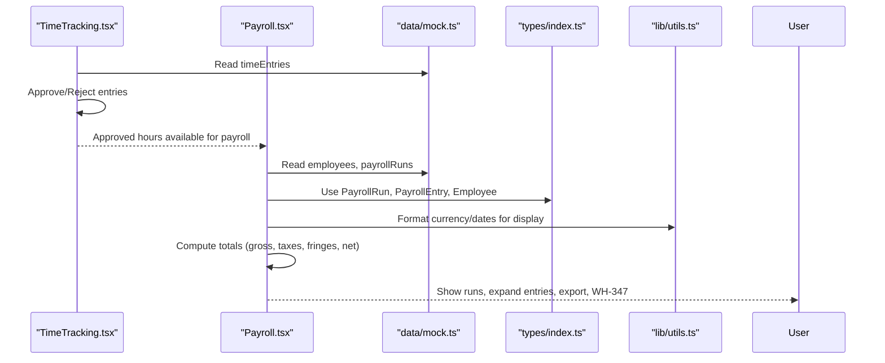
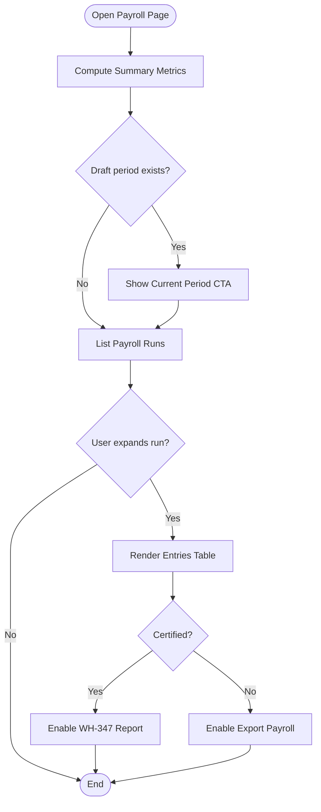
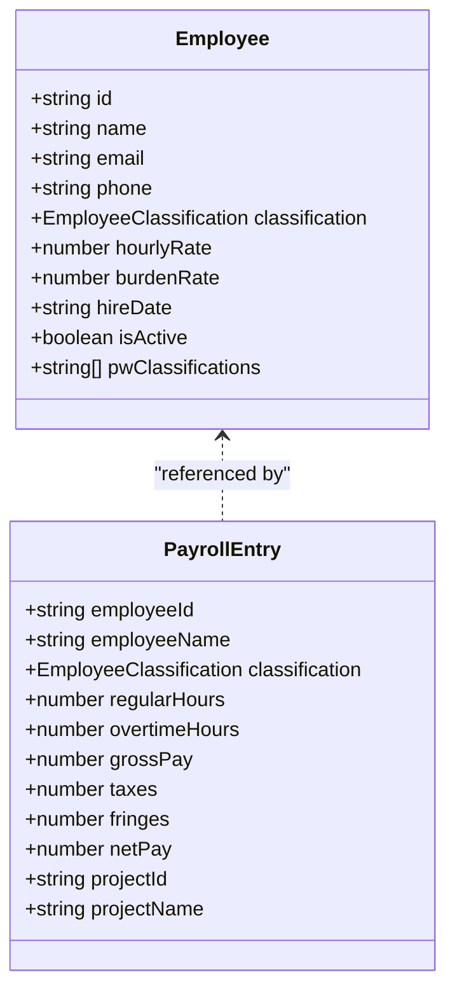
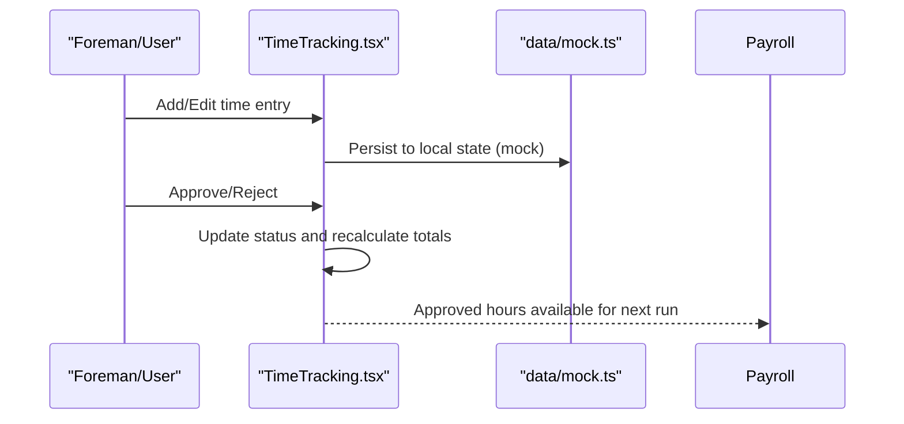
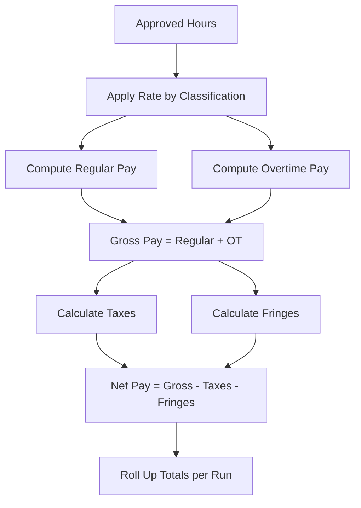
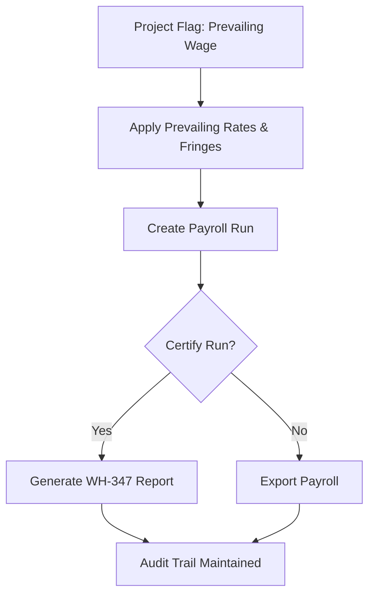
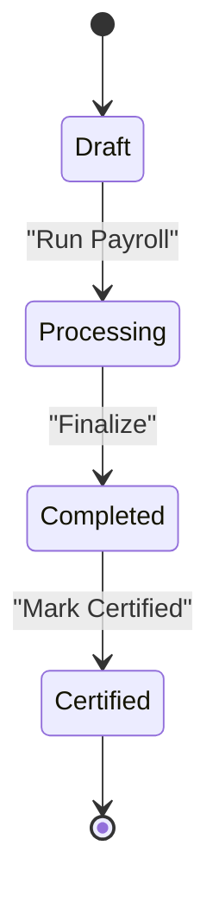
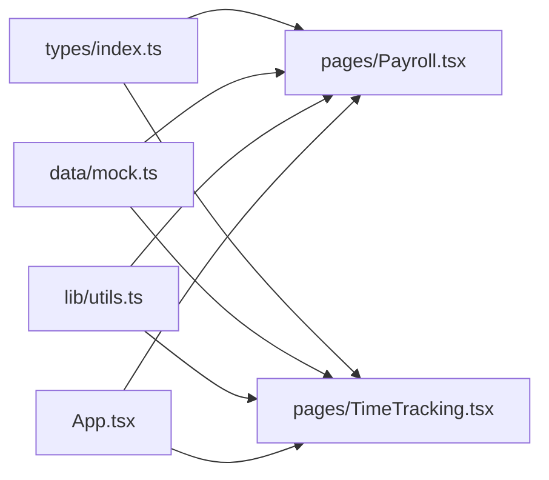

# Payroll Processing

<cite>
**Referenced Files in This Document**
- [Payroll.tsx](file://app/src/pages/Payroll.tsx)
- [TimeTracking.tsx](file://app/src/pages/TimeTracking.tsx)
- [App.tsx](file://app/src/App.tsx)
- [index.ts](file://app/src/types/index.ts)
- [mock.ts](file://app/src/data/mock.ts)
- [utils.ts](file://app/src/lib/utils.ts)
- [BuildBooks-Product-Spec-Sheet.md](file://BuildBooks-Product-Spec-Sheet.md)
</cite>

## Table of Contents
1. Introduction
2. Project Structure
3. Core Components
4. Architecture Overview
5. Detailed Component Analysis
6. Dependency Analysis
7. Performance Considerations
8. Troubleshooting Guide
9. Conclusion
10. Appendices

## Introduction
This document explains the Payroll Processing feature for a construction subcontractor application. It covers payroll run creation, employee classification management, certified payroll reporting, tax and fringe calculations, prevailing wage compliance, payroll period management, integration with time tracking and employee records, certification workflows, report generation, and compliance documentation. Examples include calculation formulas and regulatory reporting requirements aligned with construction industry standards.

## Project Structure
The payroll feature is implemented as a React page integrated into the application shell. Data models are defined centrally and used across pages. Mock data provides sample employees, time entries, and payroll runs to demonstrate functionality.

**Diagram sources**
- [App.tsx:27-62](file://app/src/App.tsx#L27-L62)
- [Payroll.tsx:1-10](file://app/src/pages/Payroll.tsx#L1-L10)
- [TimeTracking.tsx:1-10](file://app/src/pages/TimeTracking.tsx#L1-L10)

**Section sources**
- [App.tsx:27-62](file://app/src/App.tsx#L27-L62)
- [Payroll.tsx:1-10](file://app/src/pages/Payroll.tsx#L1-L10)
- [TimeTracking.tsx:1-10](file://app/src/pages/TimeTracking.tsx#L1-L10)

## Core Components
- Payroll page: Displays summary metrics, current pay period, payroll runs with expandable details, and an employee/classification table. Supports exporting payroll and generating WH-347 reports for certified runs.
- Time Tracking page: Manages time entries with approval workflow; aggregates hours and labor cost by date; feeds approved hours into payroll runs.
- Data types: Define Employee, TimeEntry, PayrollRun, PayrollEntry, and related structures that drive payroll logic and UI.
- Mock data: Provides realistic sample projects, employees, time entries, and payroll runs demonstrating multi-classification work, overtime, fringes, taxes, and certification status.
- Utilities: Formatting helpers for currency, dates, and numbers used consistently across payroll displays.

Key responsibilities:
- Payroll run lifecycle: draft → processing → completed; supports certification flag for public works.
- Employee classification: maps internal classifications to prevailing wage classifications per project.
- Calculations: regular and overtime hours, gross pay, taxes, fringes, net pay; totals roll up to run-level.
- Reporting: export payroll and generate WH-347 when certified.

**Section sources**
- [Payroll.tsx:16-158](file://app/src/pages/Payroll.tsx#L16-L158)
- [TimeTracking.tsx:9-167](file://app/src/pages/TimeTracking.tsx#L9-L167)
- [index.ts:65-127](file://app/src/types/index.ts#L65-L127)
- [mock.ts:92-145](file://app/src/data/mock.ts#L92-L145)
- [utils.ts:8-44](file://app/src/lib/utils.ts#L8-L44)

## Architecture Overview
The payroll system integrates time tracking and employee records to produce weekly or periodic payroll runs. Approved time entries feed into payroll calculations, which compute gross pay, taxes, fringes, and net pay per employee and per project. Certified runs enable generation of WH-347 reports for compliance.

**Diagram sources**
- [TimeTracking.tsx:9-167](file://app/src/pages/TimeTracking.tsx#L9-L167)
- [Payroll.tsx:16-158](file://app/src/pages/Payroll.tsx#L16-L158)
- [mock.ts:92-145](file://app/src/data/mock.ts#L92-L145)
- [index.ts:65-127](file://app/src/types/index.ts#L65-L127)
- [utils.ts:8-44](file://app/src/lib/utils.ts#L8-L44)

## Detailed Component Analysis

### Payroll Run Creation and Management
- Summary KPIs: total gross for completed runs, total net pay, count of certified runs, active employees.
- Current pay period banner: highlights draft periods and exposes a “Run Payroll” action.
- Payroll runs list: each run shows period dates, status badge, certification badge, pay date, and totals when completed.
- Expanded run view: table of employee entries including classification, regular/overtime hours, gross, taxes, fringes, and net.
- Actions: Export payroll and WH-347 Report for certified runs.

**Diagram sources**
- [Payroll.tsx:16-158](file://app/src/pages/Payroll.tsx#L16-L158)

**Section sources**
- [Payroll.tsx:16-158](file://app/src/pages/Payroll.tsx#L16-L158)

### Employee Classification Management
- Employee table shows name, email, classification badge, hourly rate, burden rate, and prevailing wage classifications.
- Classifications align with construction trades and supervisory roles; multiple PW classifications support multi-rate environments.
- Projects may be marked as prevailing wage, influencing how rates and fringes apply during payroll runs.

**Diagram sources**
- [index.ts:87-98](file://app/src/types/index.ts#L87-L98)
- [index.ts:115-127](file://app/src/types/index.ts#L115-L127)

**Section sources**
- [Payroll.tsx:159-206](file://app/src/pages/Payroll.tsx#L159-L206)
- [index.ts:87-98](file://app/src/types/index.ts#L87-L98)
- [mock.ts:92-101](file://app/src/data/mock.ts#L92-L101)

### Time Tracking Integration
- Time entries capture employee, project, phase, regular/overtime hours, classification, rate, labor burden, and status.
- Approval workflow: pending entries can be approved or rejected; bulk approve supported.
- Aggregations: total hours and labor cost computed from filtered entries; grouped by date for review.
- Integration point: approved time entries provide the basis for payroll run calculations.

**Diagram sources**
- [TimeTracking.tsx:9-167](file://app/src/pages/TimeTracking.tsx#L9-L167)
- [mock.ts:103-116](file://app/src/data/mock.ts#L103-L116)

**Section sources**
- [TimeTracking.tsx:9-167](file://app/src/pages/TimeTracking.tsx#L9-L167)
- [mock.ts:103-116](file://app/src/data/mock.ts#L103-L116)

### Tax and Fringe Calculations
- Gross pay: derived from regular and overtime hours multiplied by applicable rates.
- Taxes: calculated per employee based on classification and project context; aggregated at run level.
- Fringes: prevailing wage fringe benefits applied per hour or as credited amounts; tracked per entry and summed at run level.
- Net pay: gross minus taxes minus fringes; displayed per employee and summarized per run.

**Diagram sources**
- [Payroll.tsx:111-143](file://app/src/pages/Payroll.tsx#L111-L143)
- [mock.ts:118-145](file://app/src/data/mock.ts#L118-L145)
- [index.ts:115-127](file://app/src/types/index.ts#L115-L127)

**Section sources**
- [Payroll.tsx:111-143](file://app/src/pages/Payroll.tsx#L111-L143)
- [mock.ts:118-145](file://app/src/data/mock.ts#L118-L145)

### Prevailing Wage Compliance and Certification
- Projects flagged as prevailing wage influence rate application and fringe accounting.
- Certified payroll runs enable WH-347 report generation for compliance submission.
- Audit trail: per-run totals and per-entry breakdowns support verification of rates, hours, and fringes.

**Diagram sources**
- [Payroll.tsx:145-150](file://app/src/pages/Payroll.tsx#L145-L150)
- [mock.ts:118-145](file://app/src/data/mock.ts#L118-L145)
- [BuildBooks-Product-Spec-Sheet.md:150-160](file://BuildBooks-Product-Spec-Sheet.md#L150-L160)

**Section sources**
- [Payroll.tsx:145-150](file://app/src/pages/Payroll.tsx#L145-L150)
- [BuildBooks-Product-Spec-Sheet.md:150-160](file://BuildBooks-Product-Spec-Sheet.md#L150-L160)

### Payroll Period Management
- Draft periods appear as actionable banners indicating readiness to run payroll.
- Completed periods show totals and allow detailed inspection of entries.
- Status transitions: draft → processing → completed; certification toggled post-processing.

**Diagram sources**
- [Payroll.tsx:38-54](file://app/src/pages/Payroll.tsx#L38-L54)
- [Payroll.tsx:56-105](file://app/src/pages/Payroll.tsx#L56-L105)

**Section sources**
- [Payroll.tsx:38-105](file://app/src/pages/Payroll.tsx#L38-L105)

### Report Generation and Compliance Documentation
- Export Payroll: downloadable summary of payroll run data for accounting and auditing.
- WH-347 Report: enabled for certified runs; aligns with Davis-Bacon and state certified payroll requirements.
- Supporting documents: payroll runs maintain totals and per-entry details to substantiate submissions.

**Section sources**
- [Payroll.tsx:145-150](file://app/src/pages/Payroll.tsx#L145-L150)
- [BuildBooks-Product-Spec-Sheet.md:150-160](file://BuildBooks-Product-Spec-Sheet.md#L150-L160)

## Dependency Analysis
- Pages depend on shared types for consistent data contracts.
- Mock data supplies realistic scenarios for employees, time entries, and payroll runs.
- Utilities standardize formatting across payroll displays.
- Routing wires Payroll and TimeTracking into the app shell.

**Diagram sources**
- [index.ts:65-127](file://app/src/types/index.ts#L65-L127)
- [mock.ts:92-145](file://app/src/data/mock.ts#L92-L145)
- [utils.ts:8-44](file://app/src/lib/utils.ts#L8-L44)
- [App.tsx:27-62](file://app/src/App.tsx#L27-L62)

**Section sources**
- [index.ts:65-127](file://app/src/types/index.ts#L65-L127)
- [mock.ts:92-145](file://app/src/data/mock.ts#L92-L145)
- [utils.ts:8-44](file://app/src/lib/utils.ts#L8-L44)
- [App.tsx:27-62](file://app/src/App.tsx#L27-L62)

## Performance Considerations
- Keep payroll run expansions lightweight; render only necessary columns and avoid excessive re-renders.
- Aggregate totals efficiently using reduce operations over small arrays typical for weekly runs.
- Defer heavy computations until user actions (e.g., expanding a run or running payroll).
- Use memoization where appropriate to prevent unnecessary recalculations on filter changes in time tracking.

[No sources needed since this section provides general guidance]

## Troubleshooting Guide
- Missing approved time entries: ensure time entries are approved before running payroll; check pending counts in Time Tracking.
- Incorrect totals: verify employee rates, classifications, and project prevailing wage flags; confirm overtime rules applied correctly.
- Certification issues: only completed runs can be certified; ensure run status is completed before enabling WH-347 generation.
- Export failures: validate that selected run has entries; confirm formatting utilities are functioning.

**Section sources**
- [TimeTracking.tsx:19-27](file://app/src/pages/TimeTracking.tsx#L19-L27)
- [Payroll.tsx:38-54](file://app/src/pages/Payroll.tsx#L38-L54)
- [Payroll.tsx:145-150](file://app/src/pages/Payroll.tsx#L145-L150)

## Conclusion
The Payroll Processing feature integrates time tracking and employee records to compute wages, taxes, and fringes per pay period. It supports prevailing wage compliance through classification mapping and certified payroll reporting via WH-347 generation. The modular structure, clear data types, and mock data enable robust demonstration and future backend integration.

[No sources needed since this section summarizes without analyzing specific files]

## Appendices

### Calculation Formulas and Logic
- Gross Pay: sum of regular hours times base rate plus overtime hours times overtime multiplier.
- Taxes: computed per employee based on classification and project context; aggregated to run totals.
- Fringes: prevailing wage fringe benefits applied per hour or credited; tracked per entry and rolled up.
- Net Pay: gross minus taxes minus fringes.

**Section sources**
- [Payroll.tsx:111-143](file://app/src/pages/Payroll.tsx#L111-L143)
- [mock.ts:118-145](file://app/src/data/mock.ts#L118-L145)

### Regulatory Reporting Requirements
- Davis-Bacon Act compliance for federally funded projects.
- State prevailing wage rate tables and auto-updates.
- Certified payroll reports (WH-347) and state equivalents.
- Multi-rate payroll and audit trails for rates, hours, and fringes.

**Section sources**
- [BuildBooks-Product-Spec-Sheet.md:150-160](file://BuildBooks-Product-Spec-Sheet.md#L150-L160)