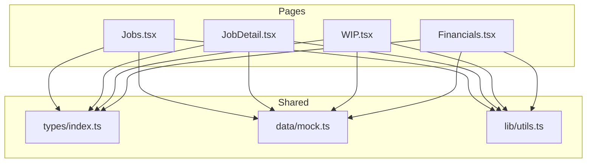
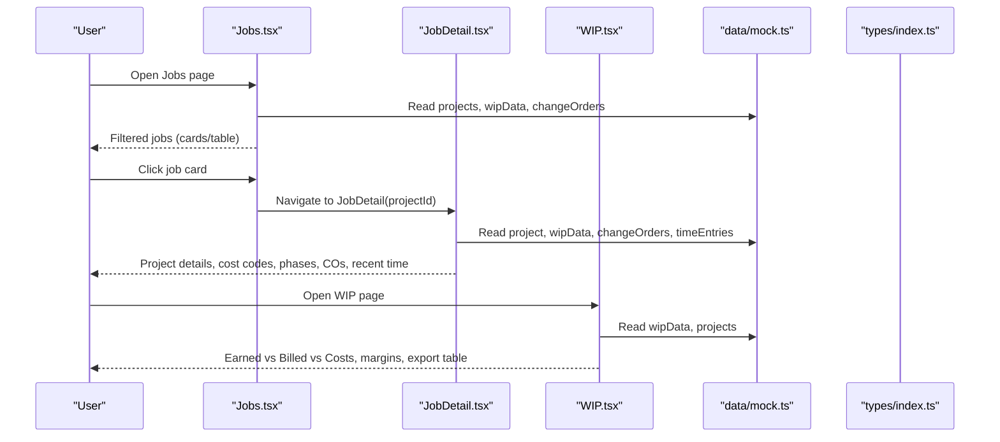
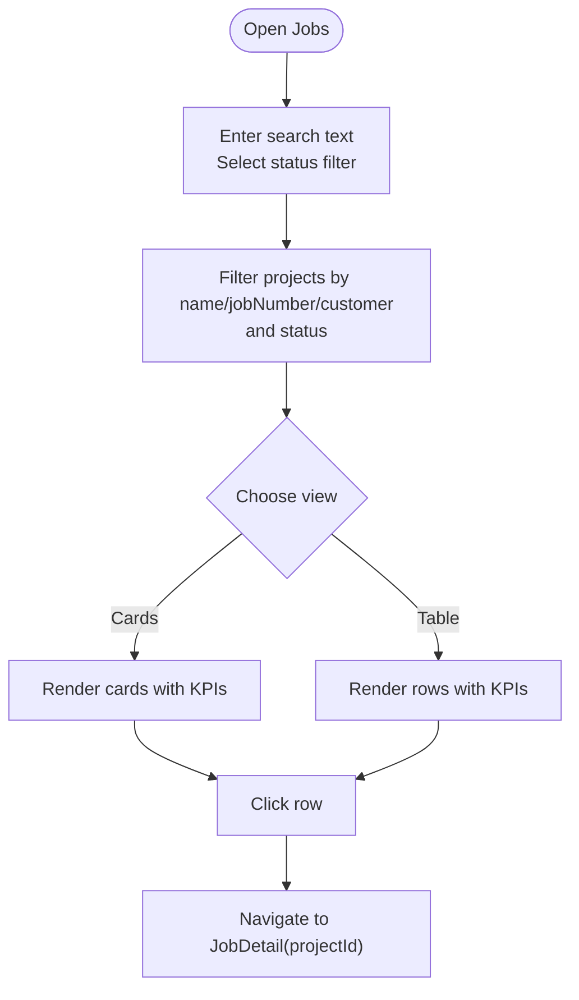
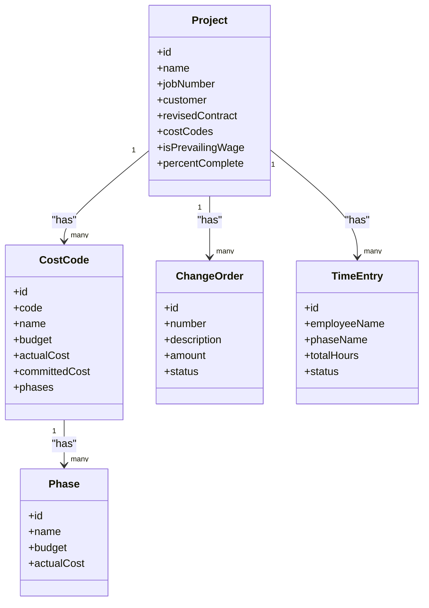
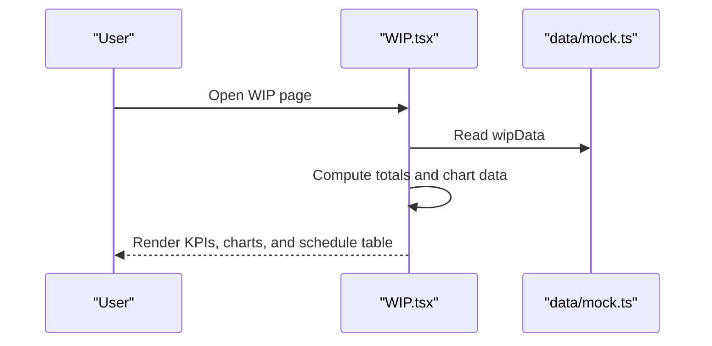
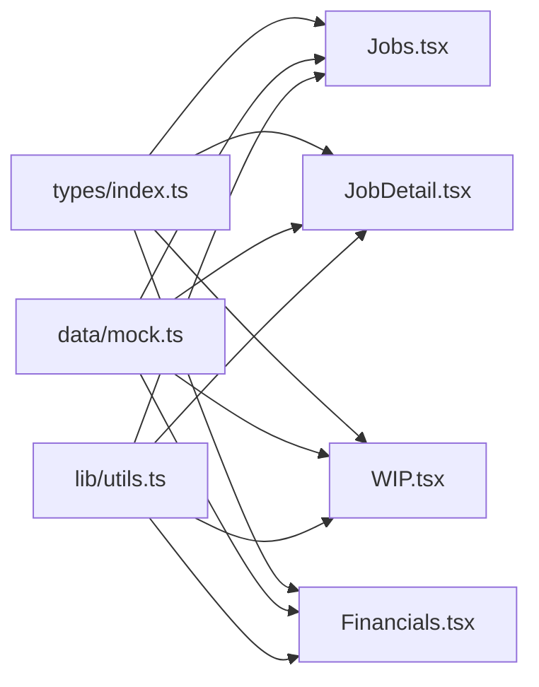
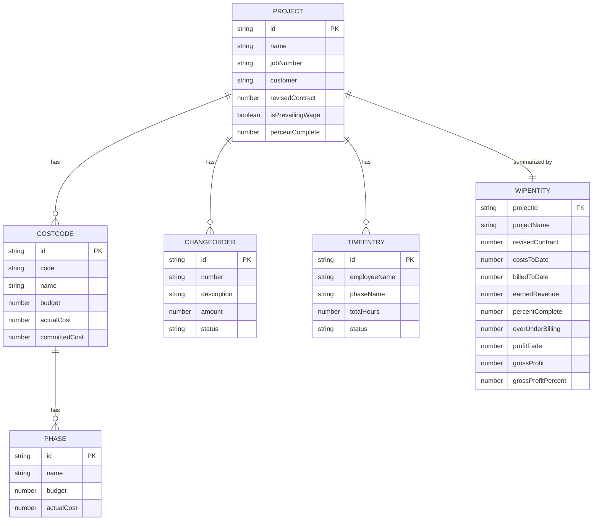

# Project Management

<cite>
**Referenced Files in This Document**
- [Jobs.tsx](file://app/src/pages/Jobs.tsx)
- [JobDetail.tsx](file://app/src/pages/JobDetail.tsx)
- [WIP.tsx](file://app/src/pages/WIP.tsx)
- [Financials.tsx](file://app/src/pages/Financials.tsx)
- [types/index.ts](file://app/src/types/index.ts)
- [data/mock.ts](file://app/src/data/mock.ts)
- [utils.ts](file://app/src/lib/utils.ts)
</cite>

## Table of Contents
1. Introduction
2. Project Structure
3. Core Components
4. Architecture Overview
5. Detailed Component Analysis
6. Dependency Analysis
7. Performance Considerations
8. Troubleshooting Guide
9. Conclusion

## Introduction
This document explains the Project Management feature for construction subcontractors, focusing on job listing and filtering, detailed job views, cost code management, budget tracking across phases, change order processing, WIP reporting integration, and construction-specific features such as prevailing wage support and multi-phase project management. It also covers job status management, progress tracking, and provides examples of job costing calculations, budget variance analysis, and phase-level financial tracking.

## Project Structure
The Project Management feature is implemented as a set of React pages that consume shared types and mock data:
- Jobs listing and filtering: app/src/pages/Jobs.tsx
- Job detail view with cost codes, phases, change orders, and recent time entries: app/src/pages/JobDetail.tsx
- Work-in-Progress (WIP) reporting: app/src/pages/WIP.tsx
- Financials overview (GL, AR, AP): app/src/pages/Financials.tsx
- Shared domain types: app/src/types/index.ts
- Mock data for projects, cost codes, phases, time entries, change orders, WIP, invoices, bills, vendors: app/src/data/mock.ts
- Formatting utilities: app/src/lib/utils.ts

**Diagram sources**
- [Jobs.tsx:1-200](file://app/src/pages/Jobs.tsx#L1-L200)
- [JobDetail.tsx:1-221](file://app/src/pages/JobDetail.tsx#L1-L221)
- [WIP.tsx:1-188](file://app/src/pages/WIP.tsx#L1-L188)
- [Financials.tsx:1-246](file://app/src/pages/Financials.tsx#L1-L246)
- [types/index.ts:1-255](file://app/src/types/index.ts#L1-L255)
- [data/mock.ts:1-246](file://app/src/data/mock.ts#L1-L246)
- [utils.ts:1-45](file://app/src/lib/utils.ts#L1-L45)

**Section sources**
- [Jobs.tsx:1-200](file://app/src/pages/Jobs.tsx#L1-L200)
- [JobDetail.tsx:1-221](file://app/src/pages/JobDetail.tsx#L1-L221)
- [WIP.tsx:1-188](file://app/src/pages/WIP.tsx#L1-L188)
- [Financials.tsx:1-246](file://app/src/pages/Financials.tsx#L1-L246)
- [types/index.ts:1-255](file://app/src/types/index.ts#L1-L255)
- [data/mock.ts:1-246](file://app/src/data/mock.ts#L1-L246)
- [utils.ts:1-45](file://app/src/lib/utils.ts#L1-L45)

## Core Components
- Job listing and filtering: Search by name/job number/customer; filter by status; toggle between cards and table views; show percent complete and key financials per job.
- Job detail: Displays project header, financial summary KPIs, cost code breakdown (budget vs actual vs committed), phase-level budgets and usage, change orders list, and recent time entries.
- WIP reporting: Aggregates earned revenue, costs to date, billed amounts, over/under billing, profit fade, and gross margin per job; includes charts and export-ready table.
- Financials: General ledger balances, accounts receivable and payable lists, overdue alerts, and totals.

Key data model relationships:
- Project contains multiple CostCode entries.
- Each CostCode has Budget, Actual, Committed, and an array of Phase entries.
- TimeEntry links to Project, CostCode, and Phase for labor cost attribution.
- ChangeOrder belongs to a Project and can affect revised contract and margins.
- WIPEntity summarizes per-project financials used in WIP reporting.

**Section sources**
- [types/index.ts:24-63](file://app/src/types/index.ts#L24-L63)
- [data/mock.ts:6-90](file://app/src/data/mock.ts#L6-L90)
- [data/mock.ts:103-116](file://app/src/data/mock.ts#L103-L116)
- [data/mock.ts:184-199](file://app/src/data/mock.ts#L184-L199)

## Architecture Overview
The UI is page-driven with components consuming typed models and mock datasets. Data flows from mock data into pages, which compute derived metrics (totals, variances, percentages) and render charts or tables.

**Diagram sources**
- [Jobs.tsx:24-200](file://app/src/pages/Jobs.tsx#L24-L200)
- [JobDetail.tsx:20-221](file://app/src/pages/JobDetail.tsx#L20-L221)
- [WIP.tsx:12-188](file://app/src/pages/WIP.tsx#L12-L188)
- [data/mock.ts:6-90](file://app/src/data/mock.ts#L6-L90)
- [data/mock.ts:184-199](file://app/src/data/mock.ts#L184-L199)
- [types/index.ts:24-63](file://app/src/types/index.ts#L24-L63)

## Detailed Component Analysis

### Job Listing and Filtering (Jobs.tsx)
- Search and filters:
  - Text search matches project name, job number, and customer.
  - Status filter supports all, active, completed, on-hold.
- Views:
  - Cards view shows quick stats: contract value, cost to date, billed to date, margin, percent complete, location, dates, and prevailing wage badge.
  - Table view lists key columns and progress bars.
- Navigation:
  - Clicking a job navigates to the job detail view with the selected projectId.

**Diagram sources**
- [Jobs.tsx:24-200](file://app/src/pages/Jobs.tsx#L24-L200)

**Section sources**
- [Jobs.tsx:24-200](file://app/src/pages/Jobs.tsx#L24-L200)

### Job Detail View (JobDetail.tsx)
- Header:
  - Project name, status badge, prevailing wage indicator, customer, location, dates, description.
- Financial KPIs:
  - Revised contract, cost to date, billed to date, gross margin, open commitments.
- Cost Code Breakdown:
  - Bar chart comparing budget, actual, and committed per cost code.
- Phases:
  - Lists each phase under each cost code with budget vs actual and percentage usage.
- Change Orders:
  - Lists change orders for the project with status and amount.
- Recent Time Entries:
  - Shows recent time entries linked to the project, including employee, phase, hours, and status.

**Diagram sources**
- [types/index.ts:24-63](file://app/src/types/index.ts#L24-L63)
- [types/index.ts:160-171](file://app/src/types/index.ts#L160-L171)
- [types/index.ts:65-85](file://app/src/types/index.ts#L65-L85)

**Section sources**
- [JobDetail.tsx:20-221](file://app/src/pages/JobDetail.tsx#L20-L221)
- [data/mock.ts:6-90](file://app/src/data/mock.ts#L6-L90)
- [data/mock.ts:184-191](file://app/src/data/mock.ts#L184-L191)
- [data/mock.ts:103-116](file://app/src/data/mock.ts#L103-L116)

### WIP Reporting Integration (WIP.tsx)
- KPIs:
  - Total contract value, total costs, total billed, over/under billing, total gross profit.
- Charts:
  - Earned vs Billed vs Costs by job.
  - Gross Margin by job with color-coded thresholds.
- WIP Schedule Table:
  - Bonding-ready format with job number, contract, costs to date, billed to date, earned revenue, percent complete, over/under billing, profit fade, and gross margin.

**Diagram sources**
- [WIP.tsx:12-188](file://app/src/pages/WIP.tsx#L12-L188)
- [data/mock.ts:193-199](file://app/src/data/mock.ts#L193-L199)

**Section sources**
- [WIP.tsx:12-188](file://app/src/pages/WIP.tsx#L12-L188)
- [data/mock.ts:193-199](file://app/src/data/mock.ts#L193-L199)

### Financials Overview (Financials.tsx)
- Tabs:
  - General Ledger: grouped accounts by type with totals.
  - Accounts Receivable: invoice list with overdue alerts and open amounts.
  - Accounts Payable: bill list with vendor, project, category, and open amounts.
- KPIs:
  - Assets, liabilities, revenue YTD, expenses YTD, net income.

**Section sources**
- [Financials.tsx:12-246](file://app/src/pages/Financials.tsx#L12-L246)
- [data/mock.ts:201-245](file://app/src/data/mock.ts#L201-L245)

## Dependency Analysis
- Pages depend on shared types for consistent modeling and on mock data for content.
- Formatting utilities are reused across pages for currency, percent, and date formatting.
- Relationships:
  - Project -> CostCode -> Phase
  - Project -> ChangeOrder
  - Project -> TimeEntry
  - WIP aggregates per-project metrics for reporting.

**Diagram sources**
- [types/index.ts:1-255](file://app/src/types/index.ts#L1-L255)
- [data/mock.ts:1-246](file://app/src/data/mock.ts#L1-L246)
- [utils.ts:1-45](file://app/src/lib/utils.ts#L1-L45)
- [Jobs.tsx:1-200](file://app/src/pages/Jobs.tsx#L1-L200)
- [JobDetail.tsx:1-221](file://app/src/pages/JobDetail.tsx#L1-L221)
- [WIP.tsx:1-188](file://app/src/pages/WIP.tsx#L1-L188)
- [Financials.tsx:1-246](file://app/src/pages/Financials.tsx#L1-L246)

**Section sources**
- [types/index.ts:1-255](file://app/src/types/index.ts#L1-L255)
- [data/mock.ts:1-246](file://app/src/data/mock.ts#L1-L246)
- [utils.ts:1-45](file://app/src/lib/utils.ts#L1-L45)

## Performance Considerations
- Client-side filtering and aggregation are efficient for the current dataset size. For larger datasets, consider:
  - Debouncing search input.
  - Paginating results in table view.
  - Memoizing computed totals and chart data using memoization hooks.
- Chart rendering uses responsive containers; ensure minimal re-renders by stabilizing data references.

[No sources needed since this section provides general guidance]

## Troubleshooting Guide
- Missing or incorrect project IDs:
  - Ensure navigation passes the correct projectId when moving from Jobs to JobDetail.
- Empty or mismatched WIP data:
  - Verify that wipData contains an entry for each project to display accurate margins and over/under billing.
- Change orders not appearing:
  - Confirm change orders have matching projectId values to the selected project.
- Time entries not showing:
  - Check that time entries include the correct projectId and phaseId to link properly.

**Section sources**
- [Jobs.tsx:24-200](file://app/src/pages/Jobs.tsx#L24-L200)
- [JobDetail.tsx:20-221](file://app/src/pages/JobDetail.tsx#L20-L221)
- [WIP.tsx:12-188](file://app/src/pages/WIP.tsx#L12-L188)
- [data/mock.ts:6-90](file://app/src/data/mock.ts#L6-L90)
- [data/mock.ts:184-199](file://app/src/data/mock.ts#L184-L199)
- [data/mock.ts:103-116](file://app/src/data/mock.ts#L103-L116)

## Conclusion
The Project Management feature provides a comprehensive view of jobs, cost codes, phases, change orders, and WIP reporting tailored for construction subcontractors. It supports job listing and filtering, detailed job views with budget vs actual comparisons, phase-level tracking, and prevailing wage project indicators. The WIP module consolidates earned revenue, costs, and billing to deliver bonding-ready reports and margin insights. Financials integrate GL, AR, and AP to give a full picture of project and company finances.

[No sources needed since this section summarizes without analyzing specific files]

## Appendices

### Data Model Relationships

**Diagram sources**
- [types/index.ts:24-63](file://app/src/types/index.ts#L24-L63)
- [types/index.ts:160-171](file://app/src/types/index.ts#L160-L171)
- [types/index.ts:65-85](file://app/src/types/index.ts#L65-L85)
- [types/index.ts:173-189](file://app/src/types/index.ts#L173-L189)

### Examples of Calculations and Tracking

- Job costing calculation:
  - Sum actualCost across all cost codes for a project to get total cost to date.
  - Reference: [Jobs.tsx:78-82](file://app/src/pages/Jobs.tsx#L78-L82), [JobDetail.tsx:26-28](file://app/src/pages/JobDetail.tsx#L26-L28)

- Budget variance analysis:
  - Compare budget vs actual per cost code and per phase to identify overruns.
  - Reference: [JobDetail.tsx:90-149](file://app/src/pages/JobDetail.tsx#L90-L149)

- Phase-level financial tracking:
  - Track phase budget vs actual and percentage usage to monitor completion and spend.
  - Reference: [JobDetail.tsx:112-149](file://app/src/pages/JobDetail.tsx#L112-L149)

- Change order processing:
  - List change orders per project with status and amount; approved COs may influence revised contract and margins.
  - Reference: [JobDetail.tsx:151-183](file://app/src/pages/JobDetail.tsx#L151-L183), [data/mock.ts:184-191](file://app/src/data/mock.ts#L184-L191)

- WIP integration:
  - Use WIP data to compute earned revenue, costs to date, billed amounts, over/under billing, profit fade, and gross margin.
  - Reference: [WIP.tsx:12-188](file://app/src/pages/WIP.tsx#L12-L188), [data/mock.ts:193-199](file://app/src/data/mock.ts#L193-L199)

- Prevailing wage support:
  - Projects flagged as prevailing wage display a badge and can be filtered or highlighted for compliance tracking.
  - Reference: [Jobs.tsx:96-97](file://app/src/pages/Jobs.tsx#L96-L97), [JobDetail.tsx:52-53](file://app/src/pages/JobDetail.tsx#L52-L53), [data/mock.ts:33-49](file://app/src/data/mock.ts#L33-L49)

- Multi-phase project management:
  - Each cost code can contain multiple phases to track work stages (e.g., Rough-In, Trim, Finish).
  - Reference: [data/mock.ts:14-31](file://app/src/data/mock.ts#L14-L31), [types/index.ts:45-63](file://app/src/types/index.ts#L45-L63)

**Section sources**
- [Jobs.tsx:78-82](file://app/src/pages/Jobs.tsx#L78-L82)
- [JobDetail.tsx:26-28](file://app/src/pages/JobDetail.tsx#L26-L28)
- [JobDetail.tsx:90-149](file://app/src/pages/JobDetail.tsx#L90-L149)
- [JobDetail.tsx:151-183](file://app/src/pages/JobDetail.tsx#L151-L183)
- [WIP.tsx:12-188](file://app/src/pages/WIP.tsx#L12-L188)
- [data/mock.ts:14-31](file://app/src/data/mock.ts#L14-L31)
- [data/mock.ts:33-49](file://app/src/data/mock.ts#L33-L49)
- [data/mock.ts:184-199](file://app/src/data/mock.ts#L184-L199)
- [types/index.ts:45-63](file://app/src/types/index.ts#L45-L63)