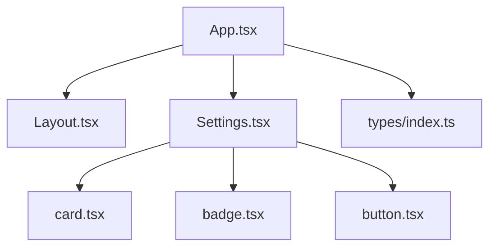
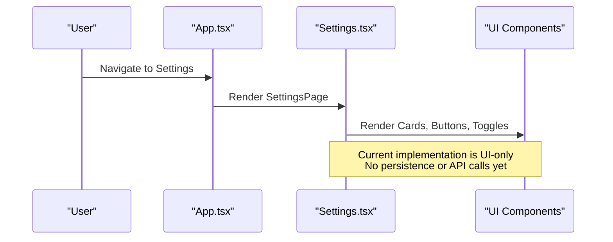
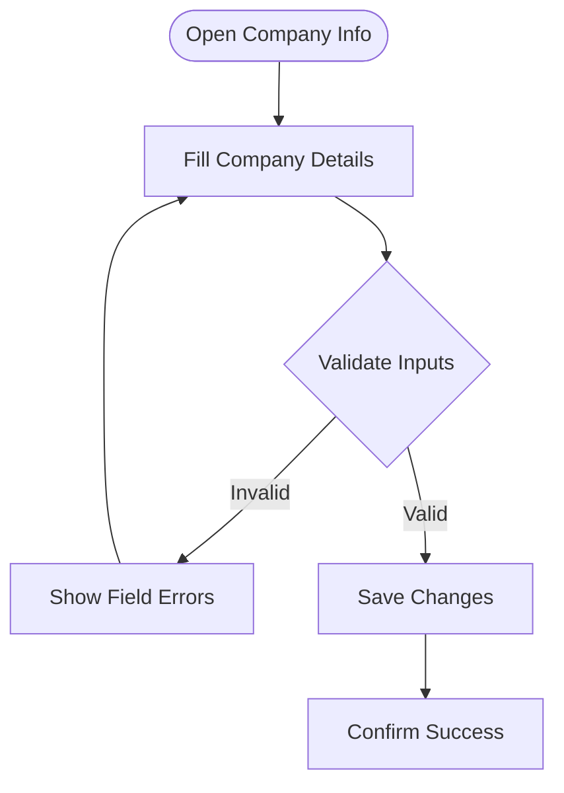
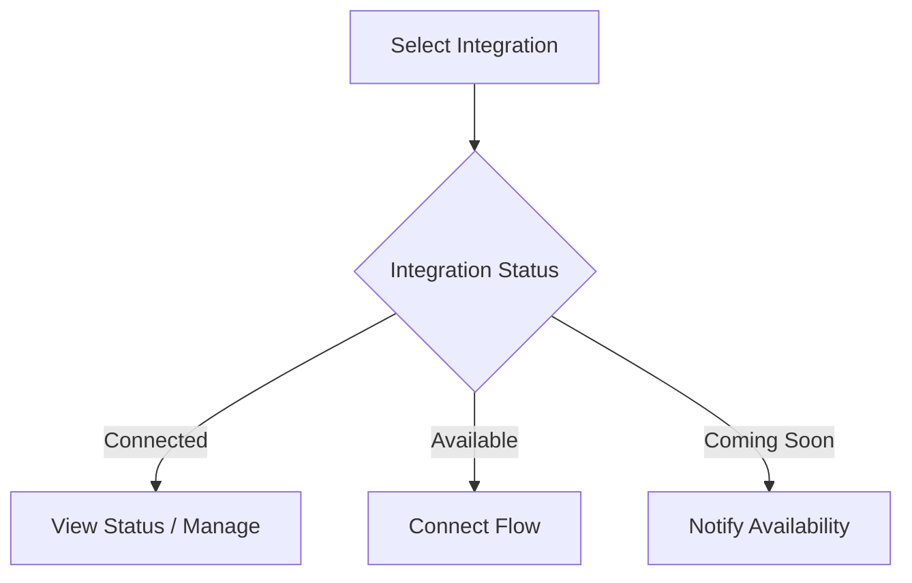
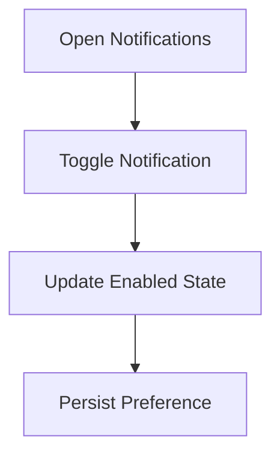
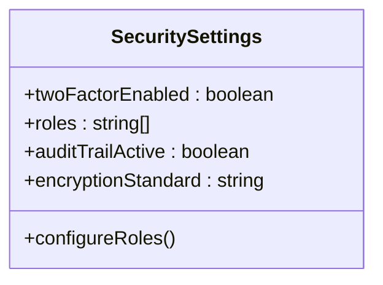
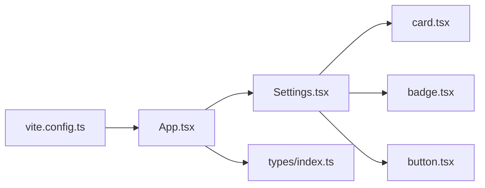
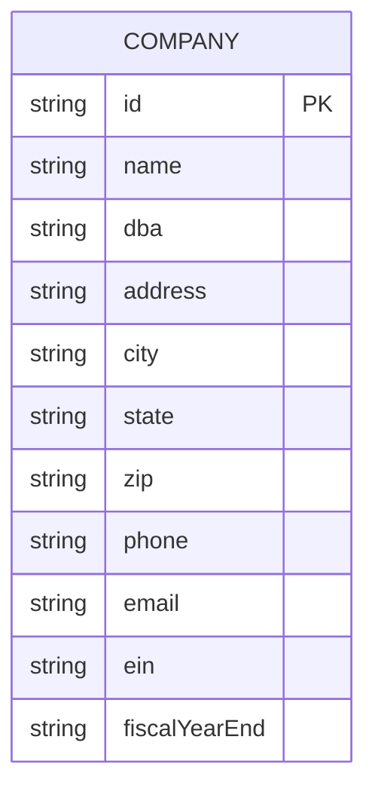

# Settings & Configuration

<cite>
**Referenced Files in This Document**
- [Settings.tsx](file://app/src/pages/Settings.tsx)
- [index.ts](file://app/src/types/index.ts)
- [mock.ts](file://app/src/data/mock.ts)
- [App.tsx](file://app/src/App.tsx)
- [card.tsx](file://app/src/components/ui/card.tsx)
- [badge.tsx](file://app/src/components/ui/badge.tsx)
- [button.tsx](file://app/src/components/ui/button.tsx)
- [vite.config.ts](file://app/vite.config.ts)
</cite>

## Table of Contents
1. [Introduction](#introduction)
2. [Project Structure](#project-structure)
3. [Core Components](#core-components)
4. [Architecture Overview](#architecture-overview)
5. [Detailed Component Analysis](#detailed-component-analysis)
6. [Dependency Analysis](#dependency-analysis)
7. [Performance Considerations](#performance-considerations)
8. [Troubleshooting Guide](#troubleshooting-guide)
9. [Conclusion](#conclusion)
10. [Appendices](#appendices)

## Introduction
This document explains the Settings & Configuration feature for the application, focusing on company information management, user preferences, system configuration, integration settings, user role management, and customization options. It also describes the configuration data model and persistence mechanisms as implemented in the current codebase, and outlines where to extend the system for multi-entity support and enterprise-level requirements.

## Project Structure
The Settings page is a single-page UI that groups configuration areas into cards: Company Information, Chart of Accounts, Integrations, Data Migration, Notifications, Subscription, and Security & Access. The app routes to this page via a central router-like component. Types define the core data model (including Company), while mock data provides sample datasets for other features. UI primitives are reusable components used by the Settings page.

**Diagram sources**
- [App.tsx:27-78](file://app/src/App.tsx#L27-L78)
- [Settings.tsx:9-244](file://app/src/pages/Settings.tsx#L9-L244)
- [card.tsx:4-47](file://app/src/components/ui/card.tsx#L4-L47)
- [badge.tsx:1-33](file://app/src/components/ui/badge.tsx#L1-L33)
- [button.tsx:1-45](file://app/src/components/ui/button.tsx#L1-L45)

**Section sources**
- [App.tsx:15-25](file://app/src/App.tsx#L15-L25)
- [App.tsx:27-78](file://app/src/App.tsx#L27-L78)
- [Settings.tsx:9-244](file://app/src/pages/Settings.tsx#L9-L244)

## Core Components
- Settings Page: Renders grouped configuration sections with inputs, toggles, and action buttons.
- Types: Define the Company entity and related domain types.
- UI Primitives: Card, Badge, Button provide consistent styling and behavior.
- App Router: Routes to the Settings page and sets page metadata.

Key responsibilities:
- Present configuration fields for company profile and system preferences.
- Provide entry points to integrations, notifications, subscription, and security controls.
- Expose actions like Import from QuickBooks, Export COA, and Configure roles.

**Section sources**
- [Settings.tsx:13-234](file://app/src/pages/Settings.tsx#L13-L234)
- [index.ts:10-22](file://app/src/types/index.ts#L10-L22)
- [card.tsx:4-47](file://app/src/components/ui/card.tsx#L4-L47)
- [badge.tsx:1-33](file://app/src/components/ui/badge.tsx#L1-L33)
- [button.tsx:1-45](file://app/src/components/ui/button.tsx#L1-L45)
- [App.tsx:27-78](file://app/src/App.tsx#L27-L78)

## Architecture Overview
At runtime, the application renders the Settings page through the main App component. The Settings page composes multiple card sections to present configuration areas. Inputs and toggles are currently static; saving changes is not wired to a backend in this snapshot.

**Diagram sources**
- [App.tsx:27-78](file://app/src/App.tsx#L27-L78)
- [Settings.tsx:9-244](file://app/src/pages/Settings.tsx#L9-L244)

## Detailed Component Analysis

### Company Information
- Fields: Company Name, DBA, EIN, Fiscal Year End, Address, Phone, Email.
- Purpose: Capture legal and operational identity for invoices, reports, and compliance.
- Validation considerations: Ensure required fields are present; format phone/email; validate EIN pattern; ensure fiscal year end is a valid month number.
- Persistence: Not implemented in this snapshot; would typically persist to a company profile store or backend.

**Section sources**
- [Settings.tsx:13-55](file://app/src/pages/Settings.tsx#L13-L55)
- [index.ts:10-22](file://app/src/types/index.ts#L10-L22)

### Chart of Accounts
- Pre-configured construction-specific accounts with export capability.
- Actions: Customize Accounts, Export COA.
- Notes: Suggests industry-standard mapping; export supports migration or reporting.

**Section sources**
- [Settings.tsx:57-75](file://app/src/pages/Settings.tsx#L57-L75)

### Integrations
- Supported integrations include QuickBooks Online, ADP Payroll, Procore, Raken, BusyBusy, and Sage Estimating (coming soon).
- States: Connected, Available, Coming Soon.
- Actions: Connect integrations; view last sync status.

**Section sources**
- [Settings.tsx:77-111](file://app/src/pages/Settings.tsx#L77-L111)

### Data Migration
- Import from QuickBooks or CSV.
- Supports chart of accounts, vendor lists, open AR/AP, historical job data.
- Use cases: Onboarding from legacy systems; periodic reconciliation.

**Section sources**
- [Settings.tsx:113-130](file://app/src/pages/Settings.tsx#L113-L130)

### Notifications
- Toggleable alerts for budget thresholds, overdue invoices, payroll reminders, pay app deadlines, weekly summaries.
- Behavior: Each notification has an enabled state toggle.

**Section sources**
- [Settings.tsx:132-168](file://app/src/pages/Settings.tsx#L132-L168)

### Subscription
- Displays plan details, billing date, payment method, and manage plan action.
- Enterprise relevance: Plan limits may govern multi-entity support and advanced features.

**Section sources**
- [Settings.tsx:170-193](file://app/src/pages/Settings.tsx#L170-L193)

### Security & Access
- Features: Two-Factor Authentication, Role-Based Access, Audit Trail, Data Encryption.
- Roles: Owner, Controller, PM, Foreman, Field Worker.
- Actions: Configure role-based access.

**Section sources**
- [Settings.tsx:195-234](file://app/src/pages/Settings.tsx#L195-L234)

### Application Routing
- Centralized routing maps page identifiers to titles/subtitles and renders the corresponding page.
- Settings route title and subtitle are defined for navigation context.

**Section sources**
- [App.tsx:15-25](file://app/src/App.tsx#L15-L25)
- [App.tsx:27-78](file://app/src/App.tsx#L27-L78)

## Dependency Analysis
- Settings.tsx depends on UI primitives (Card, Badge, Button) for rendering.
- App.tsx orchestrates navigation to SettingsPage and sets page metadata.
- Types define the Company model used conceptually by settings; mock data provides sample entities for other pages but not directly consumed by Settings in this snapshot.
- Vite config defines aliases and plugins used across the project.

**Diagram sources**
- [Settings.tsx:1-7](file://app/src/pages/Settings.tsx#L1-L7)
- [card.tsx:4-47](file://app/src/components/ui/card.tsx#L4-L47)
- [badge.tsx:1-33](file://app/src/components/ui/badge.tsx#L1-L33)
- [button.tsx:1-45](file://app/src/components/ui/button.tsx#L1-L45)
- [App.tsx:27-78](file://app/src/App.tsx#L27-L78)
- [vite.config.ts:1-17](file://app/vite.config.ts#L1-L17)

**Section sources**
- [Settings.tsx:1-7](file://app/src/pages/Settings.tsx#L1-L7)
- [App.tsx:27-78](file://app/src/App.tsx#L27-L78)
- [vite.config.ts:1-17](file://app/vite.config.ts#L1-L17)

## Performance Considerations
- The Settings page is lightweight and purely presentational in this snapshot; no heavy computations or network calls are executed.
- For future enhancements, consider lazy-loading large configuration sections and debouncing input updates to reduce unnecessary re-renders.
- When adding integrations or migrations, implement progress indicators and error boundaries to maintain responsiveness.

[No sources needed since this section provides general guidance]

## Troubleshooting Guide
- Inputs do not save: Currently, the Save Changes button does not trigger persistence logic. Implement state management and API calls to persist changes.
- Integration connect buttons: These are placeholders; integrate OAuth flows and credential storage when connecting external services.
- Notification toggles: Enable/disable states are local; persist them to user preferences if needed.
- Role configuration: The Configure button is a placeholder; implement a role management interface backed by authorization checks.

**Section sources**
- [Settings.tsx:236-240](file://app/src/pages/Settings.tsx#L236-L240)
- [Settings.tsx:77-111](file://app/src/pages/Settings.tsx#L77-L111)
- [Settings.tsx:132-168](file://app/src/pages/Settings.tsx#L132-L168)
- [Settings.tsx:195-234](file://app/src/pages/Settings.tsx#L195-L234)

## Conclusion
The Settings & Configuration feature provides a comprehensive UI for managing company information, integrations, notifications, subscription details, and security settings. In the current implementation, it is a presentation layer without backend integration. Extending it involves wiring inputs to state management and APIs, implementing validation, and adding persistence. Multi-entity support and enterprise configurations can be layered on top by introducing organization-scoped settings, tenant isolation, and advanced role-permission models.

[No sources needed since this section summarizes without analyzing specific files]

## Appendices

### Configuration Data Model
- Company: Represents organizational identity and defaults such as fiscal year end.
- Related types: Projects, cost codes, employees, payroll, applications, change orders, GL accounts, invoices, bills, vendors are defined for the broader application context.

**Diagram sources**
- [index.ts:10-22](file://app/src/types/index.ts#L10-L22)

**Section sources**
- [index.ts:10-22](file://app/src/types/index.ts#L10-L22)

### Default Values and System-Wide Preferences
- Defaults are embedded in the UI (e.g., pre-filled company fields, default notification states).
- System-wide preferences include notification toggles and security settings.

**Section sources**
- [Settings.tsx:13-55](file://app/src/pages/Settings.tsx#L13-L55)
- [Settings.tsx:132-168](file://app/src/pages/Settings.tsx#L132-L168)
- [Settings.tsx:195-234](file://app/src/pages/Settings.tsx#L195-L234)

### Integration Settings
- Integrations listed include accounting, payroll, field operations, and estimating tools.
- Statuses indicate connectivity and availability.

**Section sources**
- [Settings.tsx:77-111](file://app/src/pages/Settings.tsx#L77-L111)

### User Role Management
- Roles include Owner, Controller, PM, Foreman, Field Worker.
- Role-based access control is indicated as configurable.

**Section sources**
- [Settings.tsx:195-234](file://app/src/pages/Settings.tsx#L195-L234)

### Application Customization Options
- Chart of Accounts customization and export.
- Notification preferences per category.
- Security toggles for authentication and audit capabilities.

**Section sources**
- [Settings.tsx:57-75](file://app/src/pages/Settings.tsx#L57-L75)
- [Settings.tsx:132-168](file://app/src/pages/Settings.tsx#L132-L168)
- [Settings.tsx:195-234](file://app/src/pages/Settings.tsx#L195-L234)

### Migration Procedures
- Import from QuickBooks or CSV for chart of accounts, vendors, open balances, and historical job data.
- Export COA for backup or external processing.

**Section sources**
- [Settings.tsx:57-75](file://app/src/pages/Settings.tsx#L57-L75)
- [Settings.tsx:113-130](file://app/src/pages/Settings.tsx#L113-L130)

### Multi-Entity Support and Enterprise Requirements
- Current code includes a companyId reference in Project, indicating potential multi-entity design at the data level.
- To fully support multi-entity settings, introduce tenant-scoped configuration stores and enforce isolation in integrations, roles, and preferences.

**Section sources**
- [index.ts:24-43](file://app/src/types/index.ts#L24-L43)