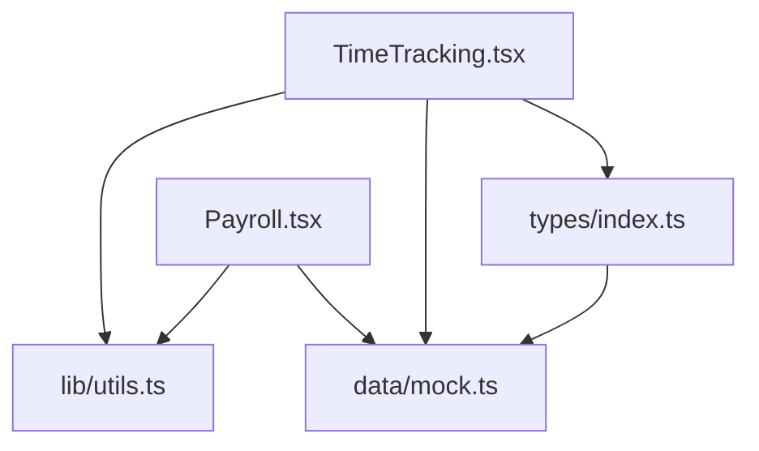
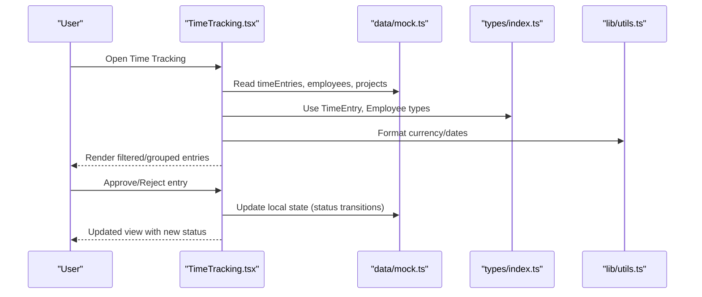
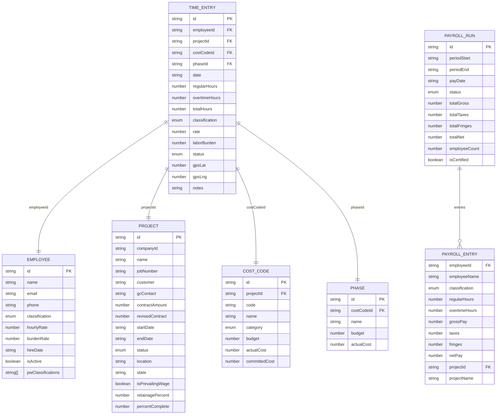
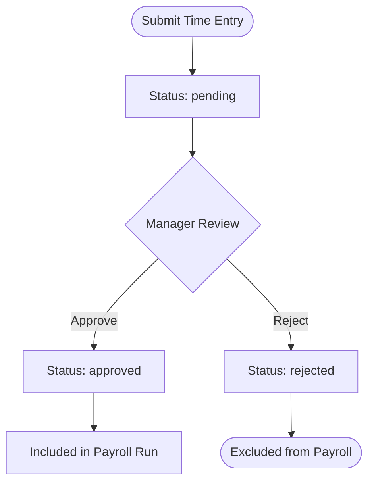
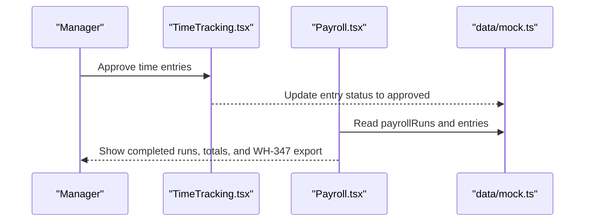
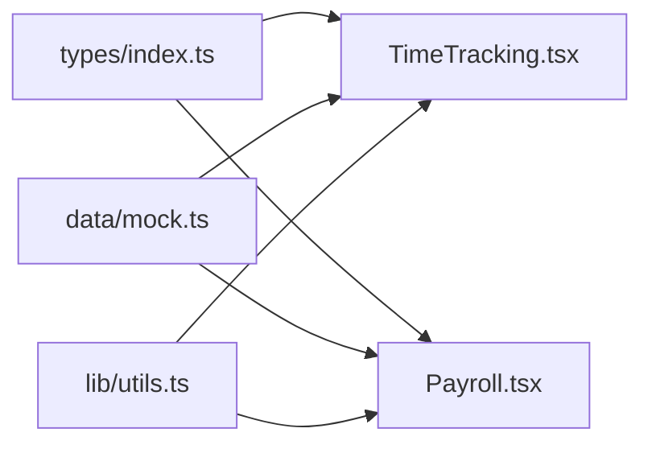

# Time Tracking

<cite>
**Referenced Files in This Document**
- [TimeTracking.tsx](file://app/src/pages/TimeTracking.tsx)
- [Payroll.tsx](file://app/src/pages/Payroll.tsx)
- [index.ts](file://app/src/types/index.ts)
- [mock.ts](file://app/src/data/mock.ts)
- [utils.ts](file://app/src/lib/utils.ts)
- [BuildBooks-Product-Spec-Sheet.md](file://BuildBooks-Product-Spec-Sheet.md)
</cite>

## Table of Contents
1. [Introduction](#introduction)
2. [Project Structure](#project-structure)
3. [Core Components](#core-components)
4. [Architecture Overview](#architecture-overview)
5. [Detailed Component Analysis](#detailed-component-analysis)
6. [Dependency Analysis](#dependency-analysis)
7. [Performance Considerations](#performance-considerations)
8. [Troubleshooting Guide](#troubleshooting-guide)
9. [Conclusion](#conclusion)
10. [Appendices](#appendices)

## Introduction
This document explains the Time Tracking feature as implemented in the application, focusing on crew time entry forms, GPS location tracking fields, approval workflows, validation rules, overtime calculations, labor burden tracking, and integration with payroll processing. It also covers construction-specific requirements such as certified payroll compliance and prevailing wage tracking, including how the data model supports these needs.

## Project Structure
The Time Tracking feature is primarily implemented in a single page component that renders time entries grouped by date, provides filtering and approval actions, and displays summary KPIs. Supporting types define the core data models for time entries, employees, projects, and payroll runs. Mock data provides sample records to demonstrate functionality. Utility functions handle currency and date formatting used across pages.

**Diagram sources**
- [TimeTracking.tsx:1-167](file://app/src/pages/TimeTracking.tsx#L1-L167)
- [Payroll.tsx:1-210](file://app/src/pages/Payroll.tsx#L1-L210)
- [index.ts:1-255](file://app/src/types/index.ts#L1-L255)
- [mock.ts:1-246](file://app/src/data/mock.ts#L1-L246)
- [utils.ts:1-45](file://app/src/lib/utils.ts#L1-L45)

**Section sources**
- [TimeTracking.tsx:1-167](file://app/src/pages/TimeTracking.tsx#L1-L167)
- [Payroll.tsx:1-210](file://app/src/pages/Payroll.tsx#L1-L210)
- [index.ts:1-255](file://app/src/types/index.ts#L1-L255)
- [mock.ts:1-246](file://app/src/data/mock.ts#L1-L246)
- [utils.ts:1-45](file://app/src/lib/utils.ts#L1-L45)

## Core Components
- Time Tracking Page: Displays time entries grouped by date, filters by status (all, pending, approved, rejected), shows total hours and labor cost, and allows approve/reject actions per entry or bulk approve all pending.
- Payroll Page: Shows payroll runs, highlights current draft period, summarizes gross/net totals, lists employee details, and exposes WH-347 report export when runs are certified.
- Data Models: Define TimeEntry, Employee, Project, CostCode, Phase, PayrollRun, PayrollEntry, and related enums/statuses.
- Utilities: Currency and date formatting helpers used consistently across UI.

Key responsibilities:
- TimeTracking.tsx: Rendering, filtering, grouping, approval state updates, and cost aggregation.
- Payroll.tsx: Aggregation of completed payroll runs, display of employee classifications and rates, and certification indicators.
- index.ts: Strongly typed contracts for all domain entities and statuses.
- mock.ts: Representative datasets for projects, employees, time entries, and payroll runs.
- utils.ts: Formatting utilities for currency and dates.

**Section sources**
- [TimeTracking.tsx:9-167](file://app/src/pages/TimeTracking.tsx#L9-L167)
- [Payroll.tsx:9-210](file://app/src/pages/Payroll.tsx#L9-L210)
- [index.ts:1-255](file://app/src/types/index.ts#L1-L255)
- [mock.ts:1-246](file://app/src/data/mock.ts#L1-L246)
- [utils.ts:1-45](file://app/src/lib/utils.ts#L1-L45)

## Architecture Overview
At runtime, the Time Tracking page loads mock time entries and employees, groups them by date, computes totals, and renders interactive controls for approvals. The Payroll page consumes payroll runs and employee data to present summaries and detailed tables. Both pages rely on shared type definitions and utility functions for consistent behavior.

**Diagram sources**
- [TimeTracking.tsx:9-167](file://app/src/pages/TimeTracking.tsx#L9-L167)
- [mock.ts:103-116](file://app/src/data/mock.ts#L103-L116)
- [index.ts:65-85](file://app/src/types/index.ts#L65-L85)
- [utils.ts:8-40](file://app/src/lib/utils.ts#L8-L40)

## Detailed Component Analysis

### Time Entry Data Model and Relationships
The TimeEntry model captures all necessary attributes for construction time tracking, including employee and project associations, classification, hours, rates, burden, optional GPS coordinates, and status. Employees provide hourly rate and burden rate, while projects carry metadata like prevailing wage flags and locations.

**Diagram sources**
- [index.ts:24-127](file://app/src/types/index.ts#L24-L127)

**Section sources**
- [index.ts:65-127](file://app/src/types/index.ts#L65-L127)

### Time Entry Validation Rules
Validation is enforced through TypeScript types and UI constraints:
- Status must be one of pending, approved, or rejected.
- Hours must be numeric; totalHours is derived from regularHours and overtimeHours.
- Classification must match allowed values (e.g., electrician, foreman).
- Optional GPS coordinates can be captured for site verification.
- Notes field allows additional context.

These constraints ensure data integrity at the type level and guide user input in forms.

**Section sources**
- [index.ts:1-8](file://app/src/types/index.ts#L1-L8)
- [index.ts:65-85](file://app/src/types/index.ts#L65-L85)

### Overtime Calculations and Labor Burden Tracking
- Total hours are computed as the sum of regular and overtime hours.
- Labor cost aggregates both base rate and labor burden per hour multiplied by total hours.
- The UI highlights overtime hours separately and includes burden in cost calculations.

Implementation references:
- Aggregation logic sums total hours and calculates labor cost using rate plus burden times total hours.
- Display logic shows overtime hours alongside regular hours.

**Section sources**
- [TimeTracking.tsx:13-16](file://app/src/pages/TimeTracking.tsx#L13-L16)
- [TimeTracking.tsx:125-132](file://app/src/pages/TimeTracking.tsx#L125-L132)

### Approval Workflow and Status Transitions
- Entries start as pending after submission.
- Managers can approve or reject individual entries or approve all pending entries at once.
- Approved entries are included in payroll runs; rejected entries are excluded.
- Status badges reflect current state visually.

**Diagram sources**
- [TimeTracking.tsx:19-27](file://app/src/pages/TimeTracking.tsx#L19-L27)
- [TimeTracking.tsx:134-154](file://app/src/pages/TimeTracking.tsx#L134-L154)

**Section sources**
- [TimeTracking.tsx:19-27](file://app/src/pages/TimeTracking.tsx#L19-L27)
- [TimeTracking.tsx:134-154](file://app/src/pages/TimeTracking.tsx#L134-L154)

### GPS Location Tracking
- TimeEntry supports optional latitude and longitude fields for capturing crew location at time of entry.
- While not actively populated in mock data, the schema enables geotagging for auditability and site verification.

**Section sources**
- [index.ts:65-85](file://app/src/types/index.ts#L65-L85)

### Integration with Payroll Processing
- Approved time entries feed into payroll runs, which aggregate regular and overtime hours per employee per project.
- Payroll runs track gross, taxes, fringes, and net pay, and can be marked as certified for compliance reporting.
- The Payroll page exposes WH-347 report export for certified runs, aligning with Davis-Bacon and state certified payroll requirements.

**Diagram sources**
- [TimeTracking.tsx:19-27](file://app/src/pages/TimeTracking.tsx#L19-L27)
- [Payroll.tsx:108-150](file://app/src/pages/Payroll.tsx#L108-L150)
- [mock.ts:118-145](file://app/src/data/mock.ts#L118-L145)

**Section sources**
- [Payroll.tsx:10-36](file://app/src/pages/Payroll.tsx#L10-L36)
- [Payroll.tsx:108-150](file://app/src/pages/Payroll.tsx#L108-L150)
- [mock.ts:118-145](file://app/src/data/mock.ts#L118-L145)

### Construction-Specific Requirements: Prevailing Wage and Certified Payroll
- Projects may be flagged as prevailing wage, enabling multi-rate payroll and compliance tracking.
- Employees include prevailing wage classifications to support accurate rate assignment and reporting.
- Payroll runs can be certified, allowing generation of WH-347 reports required for public works compliance.

References:
- Product spec sheet outlines capabilities for Davis-Bacon compliance, state prevailing wage rates, fringe benefit credits, certified payroll reports, multi-rate payroll, and audit trails.
- Mock data demonstrates projects with prevailing wage flags and employees with multiple classifications.

**Section sources**
- [BuildBooks-Product-Spec-Sheet.md:150-160](file://BuildBooks-Product-Spec-Sheet.md#L150-L160)
- [BuildBooks-Product-Spec-Sheet.md:571-599](file://BuildBooks-Product-Spec-Sheet.md#L571-L599)
- [mock.ts:6-89](file://app/src/data/mock.ts#L6-L89)
- [mock.ts:92-101](file://app/src/data/mock.ts#L92-L101)
- [mock.ts:118-145](file://app/src/data/mock.ts#L118-L145)

## Dependency Analysis
- TimeTracking.tsx depends on types for strong typing, mock data for initial state, and utilities for formatting.
- Payroll.tsx depends on mock data for payroll runs and employees, and utilities for formatting.
- Shared types centralize domain contracts, ensuring consistency across components.

**Diagram sources**
- [TimeTracking.tsx:1-7](file://app/src/pages/TimeTracking.tsx#L1-L7)
- [Payroll.tsx:1-7](file://app/src/pages/Payroll.tsx#L1-L7)
- [index.ts:1-255](file://app/src/types/index.ts#L1-L255)
- [mock.ts:1-246](file://app/src/data/mock.ts#L1-L246)
- [utils.ts:1-45](file://app/src/lib/utils.ts#L1-L45)

**Section sources**
- [TimeTracking.tsx:1-7](file://app/src/pages/TimeTracking.tsx#L1-L7)
- [Payroll.tsx:1-7](file://app/src/pages/Payroll.tsx#L1-L7)
- [index.ts:1-255](file://app/src/types/index.ts#L1-L255)
- [mock.ts:1-246](file://app/src/data/mock.ts#L1-L246)
- [utils.ts:1-45](file://app/src/lib/utils.ts#L1-L45)

## Performance Considerations
- Grouping entries by date and computing totals are linear operations over the dataset size; acceptable for typical crew sizes.
- Filtering by status reduces rendering load when viewing subsets.
- Avoid unnecessary re-renders by keeping state minimal and leveraging memoization where appropriate.

[No sources needed since this section provides general guidance]

## Troubleshooting Guide
Common issues and resolutions:
- Entries not appearing: Ensure status filter matches desired state; verify mock data contains entries for the selected date range.
- Incorrect labor cost: Confirm rate and labor burden are set correctly per employee/classification; check aggregation logic uses total hours.
- Missing overtime display: Verify overtimeHours > 0; UI conditionally renders OT indicator.
- Payroll run not updated: Only approved entries should be included; confirm status transitions occurred before running payroll.
- Certified payroll export unavailable: Ensure payroll run is marked as certified; WH-347 export is enabled only for certified runs.

**Section sources**
- [TimeTracking.tsx:13-16](file://app/src/pages/TimeTracking.tsx#L13-L16)
- [TimeTracking.tsx:125-132](file://app/src/pages/TimeTracking.tsx#L125-L132)
- [Payroll.tsx:145-150](file://app/src/pages/Payroll.tsx#L145-L150)
- [mock.ts:118-145](file://app/src/data/mock.ts#L118-L145)

## Conclusion
The Time Tracking feature provides a robust foundation for crew time entry, approval workflows, and payroll integration tailored to construction environments. It supports validated time entries with optional GPS capture, tracks labor burden and overtime, and integrates with certified payroll processes for prevailing wage compliance. The modular design separates concerns between UI, data models, and utilities, enabling scalability and maintainability.

[No sources needed since this section summarizes without analyzing specific files]

## Appendices

### Example Time Entry Data Model Usage
- Fields include employee and project identifiers, classification, hours, rates, burden, status, and optional GPS coordinates.
- Mock data demonstrates realistic scenarios with varying classifications, projects, and statuses.

**Section sources**
- [index.ts:65-85](file://app/src/types/index.ts#L65-L85)
- [mock.ts:103-116](file://app/src/data/mock.ts#L103-L116)

### Validation Rules Summary
- Status constrained to pending/approved/rejected.
- Numeric hours enforce totalHours = regularHours + overtimeHours.
- Classification restricted to predefined roles.
- Optional GPS and notes fields allow enhanced auditability.

**Section sources**
- [index.ts:1-8](file://app/src/types/index.ts#L1-L8)
- [index.ts:65-85](file://app/src/types/index.ts#L65-L85)

### Prevailing Wage and Certified Payroll Capabilities
- Davis-Bacon Act compliance and state prevailing wage rate management.
- Fringe benefit credit calculations and multi-rate payroll.
- Certified payroll reports (WH-347) and audit trails for rates, hours by classification, and fringes applied.

**Section sources**
- [BuildBooks-Product-Spec-Sheet.md:150-160](file://BuildBooks-Product-Spec-Sheet.md#L150-L160)
- [BuildBooks-Product-Spec-Sheet.md:571-599](file://BuildBooks-Product-Spec-Sheet.md#L571-L599)