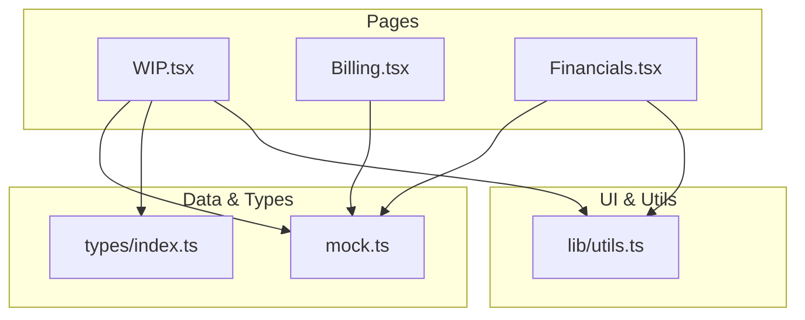
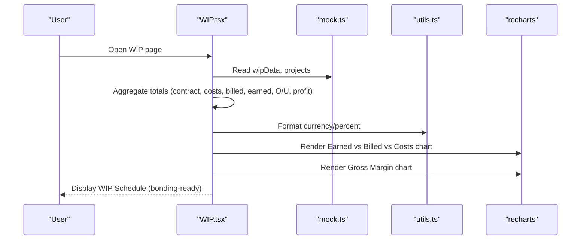
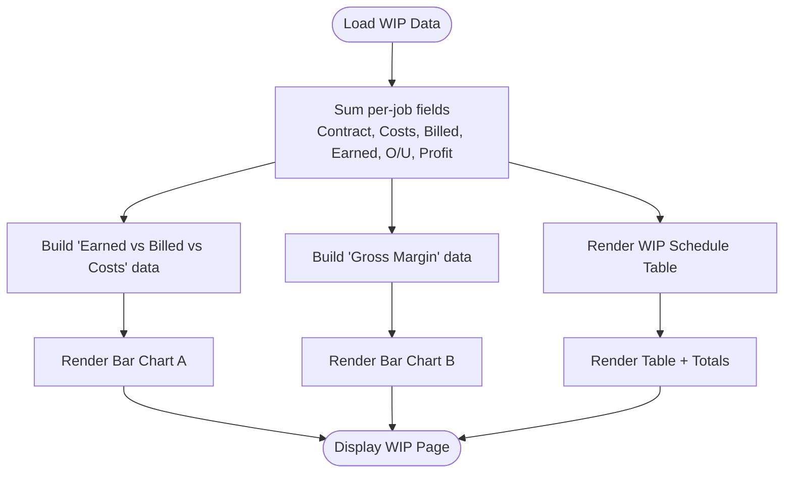
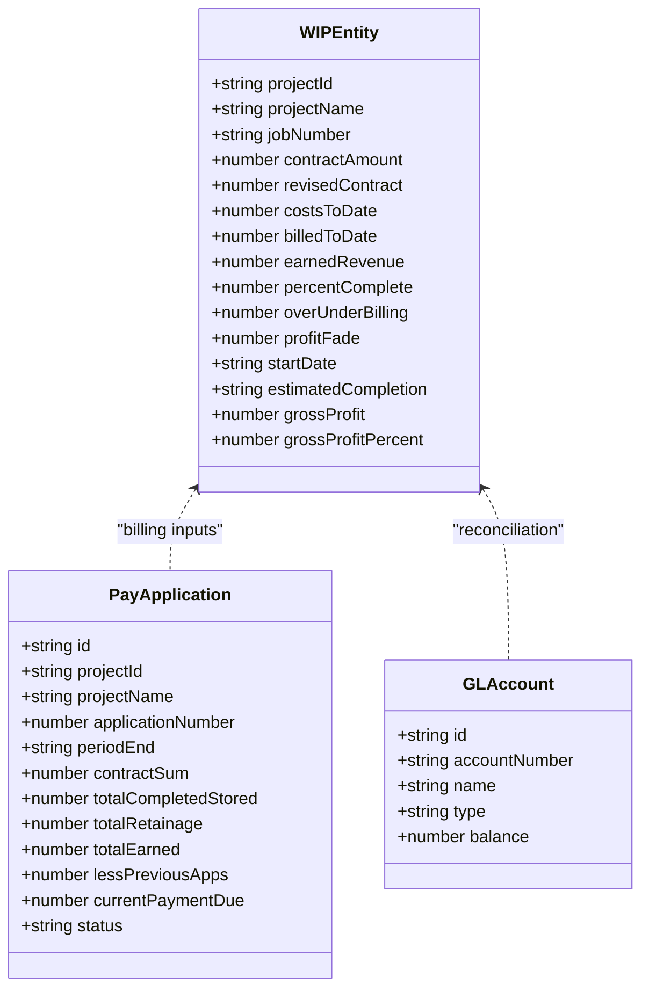
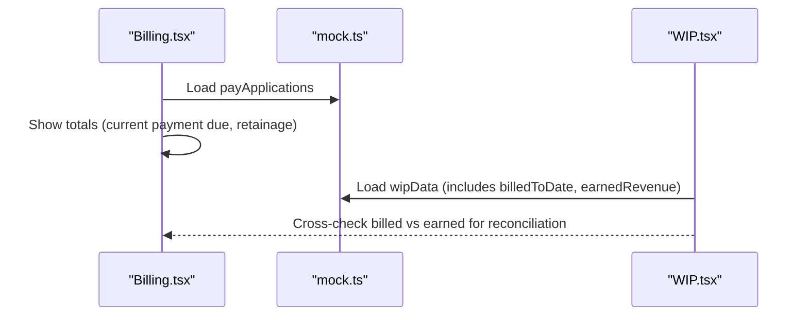
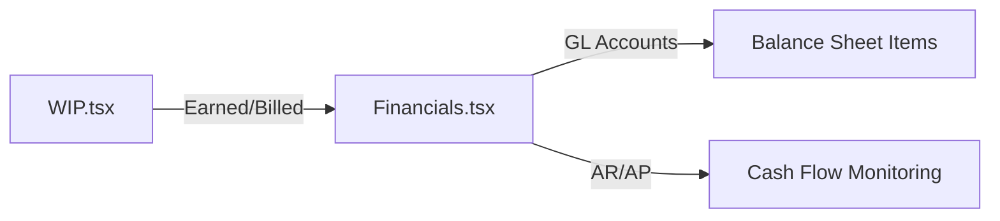
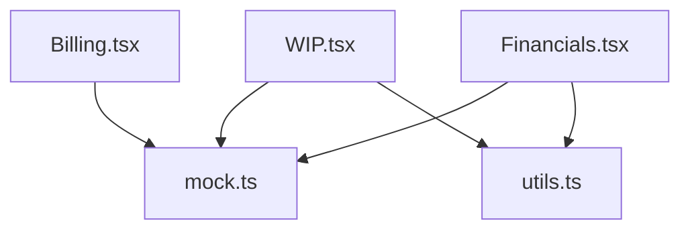

# WIP Reporting

<cite>
**Referenced Files in This Document**
- [WIP.tsx](file://app/src/pages/WIP.tsx)
- [mock.ts](file://app/src/data/mock.ts)
- [index.ts](file://app/src/types/index.ts)
- [utils.ts](file://app/src/lib/utils.ts)
- [Billing.tsx](file://app/src/pages/Billing.tsx)
- [Financials.tsx](file://app/src/pages/Financials.tsx)
</cite>

## Table of Contents
1. [Introduction](#introduction)
2. [Project Structure](#project-structure)
3. [Core Components](#core-components)
4. [Architecture Overview](#architecture-overview)
5. [Detailed Component Analysis](#detailed-component-analysis)
6. [Dependency Analysis](#dependency-analysis)
7. [Performance Considerations](#performance-considerations)
8. [Troubleshooting Guide](#troubleshooting-guide)
9. [Conclusion](#conclusion)
10. [Appendices](#appendices)

## Introduction
This document explains the Work In Progress (WIP) Reporting feature for construction subcontractors. It covers how the application presents work-in-progress schedules, over/under billing analysis, profit fade tracking, and bonding-ready report generation. It also details multi-job consolidation, calculation logic for key WIP metrics (costs to date, billings to date, retained amounts), and how WIP data relates to financial reporting requirements. Examples include schedule formats, bonding calculations, and integration touchpoints with accounting systems.

## Project Structure
The WIP feature is implemented as a React page that consumes typed data models and mock datasets to render KPIs, charts, and a bonding-ready WIP schedule table. Related pages provide context for billing applications and general ledger views used by finance teams.

**Diagram sources**
- [WIP.tsx:1-188](file://app/src/pages/WIP.tsx#L1-L188)
- [Billing.tsx:1-163](file://app/src/pages/Billing.tsx#L1-L163)
- [Financials.tsx:1-246](file://app/src/pages/Financials.tsx#L1-L246)
- [mock.ts:1-246](file://app/src/data/mock.ts#L1-L246)
- [index.ts:1-255](file://app/src/types/index.ts#L1-L255)
- [utils.ts:1-45](file://app/src/lib/utils.ts#L1-L45)

**Section sources**
- [WIP.tsx:1-188](file://app/src/pages/WIP.tsx#L1-L188)
- [mock.ts:1-246](file://app/src/data/mock.ts#L1-L246)
- [index.ts:1-255](file://app/src/types/index.ts#L1-L255)

## Core Components
- WIP Page: Aggregates per-job WIP metrics, renders summary KPIs, bar charts for earned vs billed vs costs, gross margin visualization, and a bonding-ready WIP schedule table with export capability.
- Data Model: Typed entities define projects, pay applications, invoices, bills, GL accounts, and WIP-specific fields such as costs to date, billings to date, earned revenue, percent complete, over/under billing, profit fade, and gross profit metrics.
- Utilities: Currency and percentage formatting functions standardize presentation across reports.
- Billing Page: Displays AIA G702/G703 pay applications, including retainage and schedule of values, which feed into WIP billing and retention calculations.
- Financials Page: Shows chart of accounts, AR/AP status, and totals that reconcile with WIP-derived balances like “Billings in Excess of Costs” and “Retainage Receivable.”

Key responsibilities:
- Compute consolidated totals across jobs for contract value, costs, billings, earned revenue, over/under billing, and gross profit.
- Present visual analytics for performance monitoring.
- Provide a standardized WIP schedule suitable for surety/bonding review.
- Surface related financial statements and receivables/payables for reconciliation.

**Section sources**
- [WIP.tsx:13-181](file://app/src/pages/WIP.tsx#L13-L181)
- [index.ts:173-189](file://app/src/types/index.ts#L173-L189)
- [utils.ts:8-32](file://app/src/lib/utils.ts#L8-L32)
- [Billing.tsx:23-152](file://app/src/pages/Billing.tsx#L23-L152)
- [Financials.tsx:15-27](file://app/src/pages/Financials.tsx#L15-L27)

## Architecture Overview
The WIP feature follows a simple client-side architecture:
- Data layer: Mock dataset provides project, payroll, pay application, invoice, bill, GL account, and WIP entity records.
- Type layer: Strongly-typed interfaces ensure consistent data shapes across components.
- Presentation layer: The WIP page composes UI cards, charts, and tables using reusable UI primitives and utility formatters.

**Diagram sources**
- [WIP.tsx:13-181](file://app/src/pages/WIP.tsx#L13-L181)
- [mock.ts:193-199](file://app/src/data/mock.ts#L193-L199)
- [utils.ts:8-32](file://app/src/lib/utils.ts#L8-L32)

## Detailed Component Analysis

### WIP Page: Metrics, Charts, and Bonding-Ready Schedule
- Summary KPIs: Total Contract Value, Total Costs, Total Billed, Over/Under Billing, Total Gross Profit are computed by summing per-job fields from the WIP dataset.
- Charts:
  - Earned vs Billed vs Costs by Job: Bar chart comparing earned revenue, billed amounts, and costs per job.
  - Gross Margin by Job: Bar chart showing gross profit percent and dollar amount per job, color-coded by thresholds.
- WIP Schedule Table:
  - Columns include Job, Contract, Costs to Date, Billed to Date, Earned Revenue, % Complete, Over/Under, Profit Fade, Gross Margin.
  - Totals row aggregates all jobs for meaningful consolidation.
  - Export button indicates readiness for surety/bonding submission.

Bonding-ready characteristics:
- Standard columns align with typical surety requests: revised contract, cumulative costs, cumulative billings, earned revenue, percent complete, over/under billing, and profitability indicators.
- Consolidated totals support multi-job bonding packages.

**Diagram sources**
- [WIP.tsx:13-181](file://app/src/pages/WIP.tsx#L13-L181)

**Section sources**
- [WIP.tsx:13-181](file://app/src/pages/WIP.tsx#L13-L181)
- [mock.ts:193-199](file://app/src/data/mock.ts#L193-L199)

### Data Models: WIP Entity and Supporting Types
- WIPEntity defines core WIP fields:
  - projectId, projectName, jobNumber
  - contractAmount, revisedContract
  - costsToDate, billedToDate, earnedRevenue
  - percentComplete
  - overUnderBilling, profitFade
  - startDate, estimatedCompletion
  - grossProfit, grossProfitPercent
- PayApplication includes retainage and earned values used to derive billing-related WIP metrics.
- GLAccount includes “Billings in Excess of Costs” and “Retainage Receivable,” linking WIP to balance sheet accounts.

**Diagram sources**
- [index.ts:129-189](file://app/src/types/index.ts#L129-L189)
- [index.ts:191-197](file://app/src/types/index.ts#L191-L197)

**Section sources**
- [index.ts:129-189](file://app/src/types/index.ts#L129-L189)
- [index.ts:191-197](file://app/src/types/index.ts#L191-L197)

### Billing Integration: Retainage and Pay Applications
- Pay Applications display contract sums, completed and stored amounts, retainage held, previous applications, and current payment due.
- Schedule of Values (G703) shows line-item progress and earned amounts, enabling accurate WIP earned revenue and billing alignment.
- Retainage totals contribute to “Retainage Receivable” on the balance sheet and influence cash flow forecasting.

**Diagram sources**
- [Billing.tsx:23-152](file://app/src/pages/Billing.tsx#L23-L152)
- [mock.ts:147-182](file://app/src/data/mock.ts#L147-L182)
- [mock.ts:193-199](file://app/src/data/mock.ts#L193-L199)

**Section sources**
- [Billing.tsx:23-152](file://app/src/pages/Billing.tsx#L23-L152)
- [mock.ts:147-182](file://app/src/data/mock.ts#L147-L182)

### Financials Integration: Reconciling WIP to Balance Sheet
- General Ledger view groups accounts by type and shows balances, including “Billings in Excess of Costs” and “Retainage Receivable.”
- Accounts Receivable and Accounts Payable views help reconcile open invoices and bills against WIP-driven expectations.

**Diagram sources**
- [Financials.tsx:15-27](file://app/src/pages/Financials.tsx#L15-L27)
- [mock.ts:201-220](file://app/src/data/mock.ts#L201-L220)

**Section sources**
- [Financials.tsx:15-27](file://app/src/pages/Financials.tsx#L15-L27)
- [mock.ts:201-220](file://app/src/data/mock.ts#L201-L220)

## Dependency Analysis
- WIP.tsx depends on:
  - mock.ts for wipData and projects
  - utils.ts for formatting
  - UI components for layout and interaction
- Billing.tsx depends on:
  - mock.ts for payApplications
  - utils.ts for formatting
- Financials.tsx depends on:
  - mock.ts for glAccounts, invoices, bills
  - utils.ts for formatting

**Diagram sources**
- [WIP.tsx:1-188](file://app/src/pages/WIP.tsx#L1-L188)
- [Billing.tsx:1-163](file://app/src/pages/Billing.tsx#L1-L163)
- [Financials.tsx:1-246](file://app/src/pages/Financials.tsx#L1-L246)
- [mock.ts:1-246](file://app/src/data/mock.ts#L1-L246)
- [utils.ts:1-45](file://app/src/lib/utils.ts#L1-L45)

**Section sources**
- [WIP.tsx:1-188](file://app/src/pages/WIP.tsx#L1-L188)
- [Billing.tsx:1-163](file://app/src/pages/Billing.tsx#L1-L163)
- [Financials.tsx:1-246](file://app/src/pages/Financials.tsx#L1-L246)
- [mock.ts:1-246](file://app/src/data/mock.ts#L1-L246)
- [utils.ts:1-45](file://app/src/lib/utils.ts#L1-L45)

## Performance Considerations
- Aggregation: Totals are computed via linear reductions over small arrays; complexity is O(n) per run and negligible for typical job counts.
- Rendering: Charts use responsive containers; consider memoization if datasets grow significantly.
- Formatting: Intl-based formatters are efficient; reuse where possible to avoid repeated allocations.

[No sources needed since this section provides general guidance]

## Troubleshooting Guide
- Discrepancies between WIP and Billing:
  - Verify that billedToDate aligns with cumulative pay applications and invoices.
  - Check retainage percentages and whether they match contract terms.
- Unexpected Over/Under Billing:
  - Confirm percentComplete and earnedRevenue inputs.
  - Ensure cost codes and phases reflect actual progress accurately.
- Profit Fade Alerts:
  - Investigate rising costs or scope changes not yet reflected in revised contracts.
  - Review change orders and their approval status.
- Reconciliation Issues:
  - Compare “Billings in Excess of Costs” and “Retainage Receivable” GL balances with WIP outputs.
  - Validate AR/AP aging against invoices and bills.

**Section sources**
- [WIP.tsx:13-181](file://app/src/pages/WIP.tsx#L13-L181)
- [Billing.tsx:23-152](file://app/src/pages/Billing.tsx#L23-L152)
- [Financials.tsx:15-27](file://app/src/pages/Financials.tsx#L15-L27)
- [mock.ts:193-199](file://app/src/data/mock.ts#L193-L199)
- [mock.ts:201-220](file://app/src/data/mock.ts#L201-L220)

## Conclusion
The WIP Reporting feature delivers a comprehensive, bonding-ready view of work-in-progress across multiple jobs. It consolidates key metrics, visualizes performance, and integrates with billing and financial modules to support accurate accounting and surety reporting. By aligning WIP data with GL accounts and pay applications, the system enables robust financial control and informed decision-making for construction subcontractors.

[No sources needed since this section summarizes without analyzing specific files]

## Appendices

### WIP Calculation Reference
- Costs to Date: Cumulative actual costs incurred on the job through the reporting period.
- Billings to Date: Cumulative amounts billed to the owner/client through the reporting period.
- Earned Revenue: Revenue recognized based on progress (often tied to percent complete or cost-to-cost).
- Percent Complete: Ratio of progress achieved relative to total scope.
- Over/Under Billing: Difference between billings to date and earned revenue (positive indicates over-billing; negative indicates under-billing).
- Retained Amounts: Portion of billings withheld per contract retainage terms; tracked in GL as “Retainage Receivable.”
- Profit Fade: Change in expected profitability compared to baseline, often due to cost increases or scope changes.

[No sources needed since this section provides conceptual definitions]

### Example WIP Schedule Format (Bonding-Ready)
Typical columns for surety submissions:
- Job Number / Project Name
- Revised Contract Amount
- Costs to Date
- Billings to Date
- Earned Revenue
- Percent Complete
- Over/Under Billing
- Profit Fade (%)
- Gross Margin (%)

The WIP page’s table mirrors these fields and provides consolidated totals for multi-job packages.

**Section sources**
- [WIP.tsx:117-181](file://app/src/pages/WIP.tsx#L117-L181)

### Bonding Calculations and Multi-Job Consolidation
- Consolidation: Sum per-job contract, costs, billings, earned revenue, and over/under billing to produce portfolio-level figures for bonding applications.
- Retention Impact: Include total retainage held across jobs to demonstrate cash flow implications and risk exposure.
- Surety Requirements: Provide clear visibility into earned vs billed, cost trends, and profitability to satisfy bonding company scrutiny.

**Section sources**
- [WIP.tsx:13-181](file://app/src/pages/WIP.tsx#L13-L181)
- [Billing.tsx:23-152](file://app/src/pages/Billing.tsx#L23-L152)
- [Financials.tsx:15-27](file://app/src/pages/Financials.tsx#L15-L27)

### Integration with Accounting Software
- GL Mapping:
  - “Billings in Excess of Costs” reflects over-billing positions.
  - “Retainage Receivable” captures retained amounts owed by clients.
- AR/AP Alignment:
  - Invoices and bills should reconcile with WIP-derived earned and billed amounts.
- Export Capability:
  - Use the “Export for Surety” action to generate standardized WIP schedules for external accounting or surety systems.

**Section sources**
- [Financials.tsx:15-27](file://app/src/pages/Financials.tsx#L15-L27)
- [WIP.tsx:111-114](file://app/src/pages/WIP.tsx#L111-L114)
- [mock.ts:201-220](file://app/src/data/mock.ts#L201-L220)