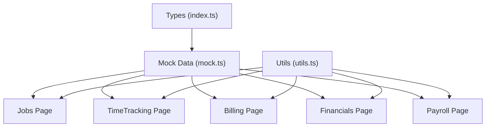
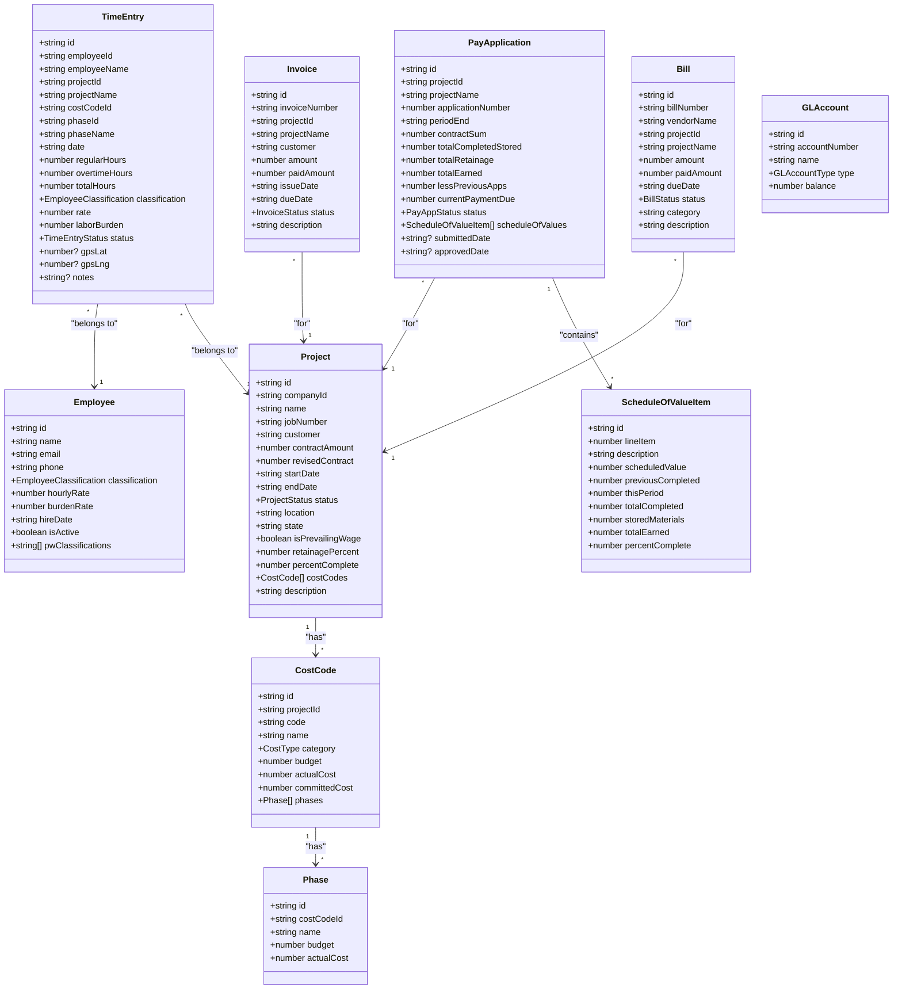
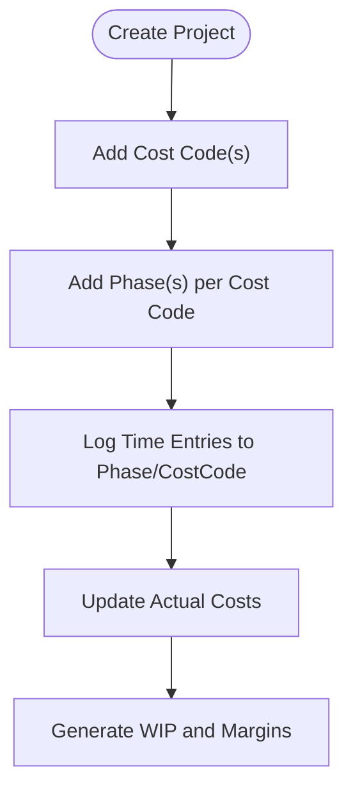
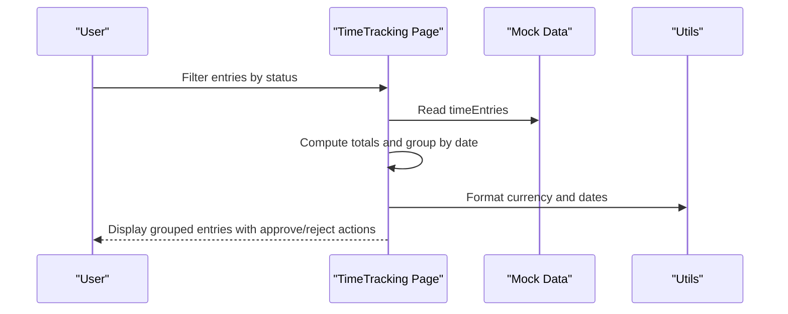
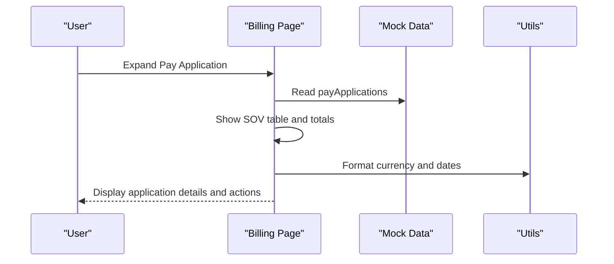
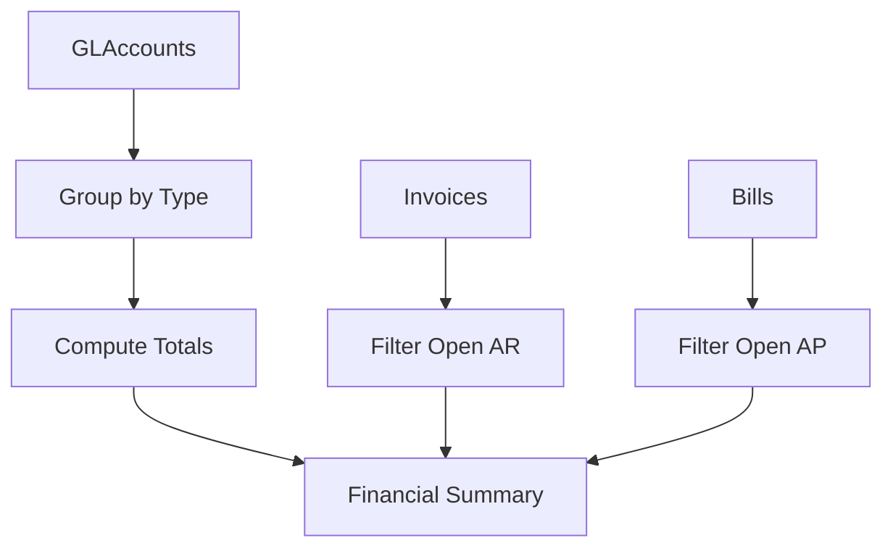
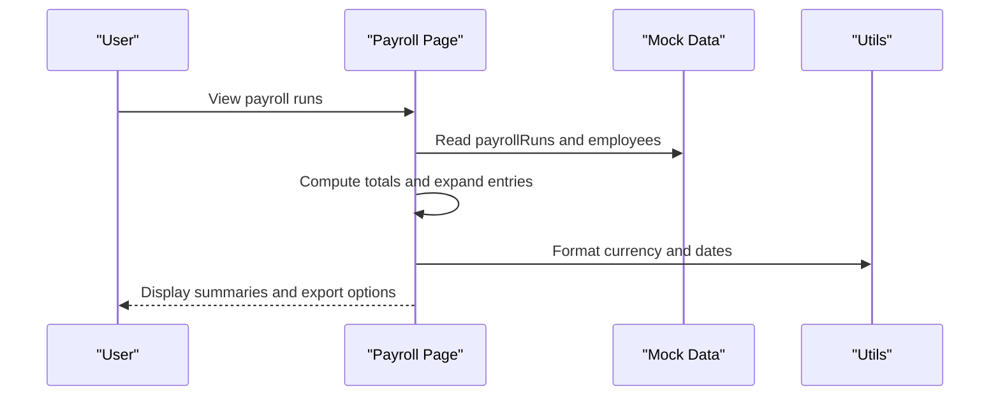
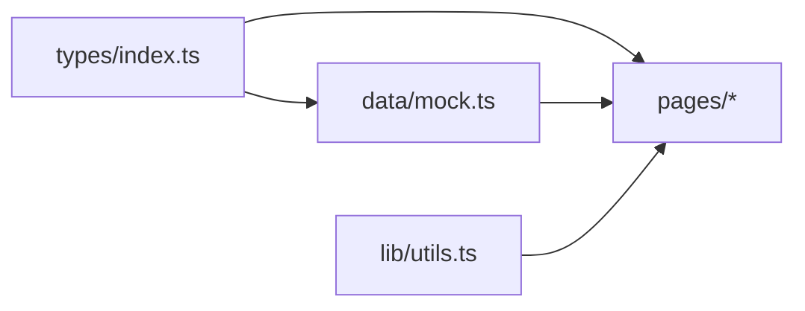
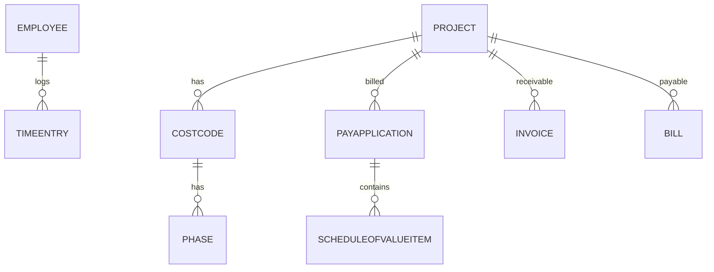

# Data Models & Types

<cite>
**Referenced Files in This Document**
- [types/index.ts](file://app/src/types/index.ts)
- [mock.ts](file://app/src/data/mock.ts)
- [Jobs.tsx](file://app/src/pages/Jobs.tsx)
- [TimeTracking.tsx](file://app/src/pages/TimeTracking.tsx)
- [Billing.tsx](file://app/src/pages/Billing.tsx)
- [Financials.tsx](file://app/src/pages/Financials.tsx)
- [Payroll.tsx](file://app/src/pages/Payroll.tsx)
- [utils.ts](file://app/src/lib/utils.ts)
</cite>

## Table of Contents
1. Introduction
2. Project Structure
3. Core Components
4. Architecture Overview
5. Detailed Component Analysis
6. Dependency Analysis
7. Performance Considerations
8. Troubleshooting Guide
9. Conclusion
10. Appendices

## Introduction
This document provides comprehensive data model documentation for the AWS MakerBay Construction Subcontractor App. It focuses on the TypeScript interfaces and types that define the application’s domain entities, their relationships, validation rules, and usage patterns across pages. The goal is to help both technical and non-technical readers understand how data flows through the system, how type safety prevents runtime errors, and how realistic construction accounting scenarios are represented with mock data.

## Project Structure
The data models live in a centralized types module and are consumed by UI pages and utilities:
- Types and enums: app/src/types/index.ts
- Mock datasets: app/src/data/mock.ts
- Pages consuming models: Jobs, TimeTracking, Billing, Financials, Payroll
- Utilities for formatting: utils.ts

**Diagram sources**
- [types/index.ts:1-255](file://app/src/types/index.ts#L1-L255)
- [mock.ts:1-246](file://app/src/data/mock.ts#L1-L246)
- [Jobs.tsx:1-200](file://app/src/pages/Jobs.tsx#L1-L200)
- [TimeTracking.tsx:1-167](file://app/src/pages/TimeTracking.tsx#L1-L167)
- [Billing.tsx:1-163](file://app/src/pages/Billing.tsx#L1-L163)
- [Financials.tsx:1-246](file://app/src/pages/Financials.tsx#L1-L246)
- [Payroll.tsx:1-210](file://app/src/pages/Payroll.tsx#L1-L210)
- [utils.ts:1-45](file://app/src/lib/utils.ts#L1-L45)

**Section sources**
- [types/index.ts:1-255](file://app/src/types/index.ts#L1-L255)
- [mock.ts:1-246](file://app/src/data/mock.ts#L1-L246)

## Core Components
This section documents each core entity defined in the types module, including fields, data types, constraints, and business meaning.

- Company
  - Purpose: Represents the contracting company profile.
  - Key fields: id, name, dba (optional), address, city, state, zip, phone, email, ein, fiscalYearEnd.
  - Constraints: All required except dba; identifiers are strings; dates formatted as ISO strings.

- Project
  - Purpose: Represents a construction job or contract.
  - Key fields: id, companyId, name, jobNumber, customer, gcContact, contractAmount, revisedContract, startDate, endDate, status, location, state, isPrevailingWage, retainagePercent, percentComplete, costCodes[], description.
  - Relationships: One-to-many with CostCode via costCodes[].
  - Constraints: status must be one of active, completed, on-hold, pending; numeric fields represent monetary values or percentages; dates are ISO strings.

- CostCode
  - Purpose: Breakdown of work categories under a project (e.g., labor, material).
  - Key fields: id, projectId, code, name, category, budget, actualCost, committedCost, phases[].
  - Relationships: Belongs to a Project; contains many Phase entries.
  - Constraints: category must be labor, material, equipment, subcontract, other; budget/actualCost/committedCost are numeric.

- Phase
  - Purpose: Subdivision within a CostCode representing stages of work.
  - Key fields: id, costCodeId, name, budget, actualCost.
  - Relationships: Belongs to a CostCode.
  - Constraints: Numeric budget and actualCost; phase names reflect typical construction phases.

- Employee
  - Purpose: Worker record with classification and pay details.
  - Key fields: id, name, email, phone, classification, hourlyRate, burdenRate, hireDate, isActive, pwClassifications[].
  - Constraints: classification from a fixed set; rates are numeric; pwClassifications is an array of strings.

- TimeEntry
  - Purpose: Daily time logged by employees against projects/cost codes/phases.
  - Key fields: id, employeeId, employeeName, projectId, projectName, costCodeId, phaseId, phaseName, date, regularHours, overtimeHours, totalHours, classification, rate, laborBurden, status, gpsLat (optional), gpsLng (optional), notes (optional).
  - Relationships: Links to Employee, Project, CostCode, Phase via IDs; also stores denormalized names for display.
  - Constraints: status must be pending, approved, rejected; hours are numeric; optional GPS coordinates for geotagging.

- PayrollRun and PayrollEntry
  - Purpose: Aggregated payroll period and per-employee summary.
  - Key fields (run): id, periodStart, periodEnd, payDate, status, totalGross, totalTaxes, totalFringes, totalNet, employeeCount, isCertified, entries[].
  - Key fields (entry): employeeId, employeeName, classification, regularHours, overtimeHours, grossPay, taxes, fringes, netPay, projectId, projectName.
  - Constraints: run.status is draft, processing, completed; entry fields are numeric where applicable.

- PayApplication and ScheduleOfValueItem
  - Purpose: Monthly billing submissions to general contractors (AIA G702/G703 style).
  - Key fields (application): id, projectId, projectName, applicationNumber, periodEnd, contractSum, totalCompletedStored, totalRetainage, totalEarned, lessPreviousApps, currentPaymentDue, status, scheduleOfValues[], submittedDate (optional), approvedDate (optional).
  - Key fields (sov item): id, lineItem, description, scheduledValue, previousCompleted, thisPeriod, totalCompleted, storedMaterials, totalEarned, percentComplete.
  - Constraints: status must be draft, submitted, approved, paid, rejected; numeric fields represent monetary values and percentages.

- ChangeOrder
  - Purpose: Contract change requests with amounts and approvals.
  - Key fields: id, projectId, projectName, number, description, amount, status, requestDate, approvalDate (optional), approvedBy (optional).
  - Constraints: status must be draft, pending, approved, rejected.

- WIPEntity
  - Purpose: Work-in-Progress snapshot per project for financial reporting.
  - Key fields: projectId, projectName, jobNumber, contractAmount, revisedContract, costsToDate, billedToDate, earnedRevenue, percentComplete, overUnderBilling, profitFade, startDate, estimatedCompletion, grossProfit, grossProfitPercent.
  - Constraints: Percentages and monetary values are numeric; fields support WIP calculations.

- GLAccount
  - Purpose: Chart of accounts for general ledger.
  - Key fields: id, accountNumber, name, type, balance.
  - Constraints: type must be asset, liability, equity, revenue, expense; balance is numeric.

- Invoice and Bill
  - Purpose: Accounts receivable and payable records.
  - Invoice key fields: id, invoiceNumber, projectId, projectName, customer, amount, paidAmount, issueDate, dueDate, status, description.
  - Bill key fields: id, billNumber, vendorName, projectId, projectName, amount, paidAmount, dueDate, status, category, description.
  - Constraints: Invoice status must be draft, sent, paid, overdue, void; Bill status must be unpaid, partial, paid, void.

- Vendor
  - Purpose: External suppliers and subcontractors.
  - Key fields: id, name, type, contactName, email, phone, totalBilled, totalPaid.
  - Constraints: type must be subcontractor, material-supplier, equipment-rental, other.

- DashboardKPI and PageRoute
  - Purpose: UI-level types for dashboard metrics and routing.
  - KPI fields: label, value, change, changeLabel.
  - Route union: dashboard, jobs, job-detail, time-tracking, billing, wip, payroll, financials, settings.

**Section sources**
- [types/index.ts:1-255](file://app/src/types/index.ts#L1-L255)

## Architecture Overview
The data architecture centers around a strong type system that ensures consistency across the application. Mock data serves as a realistic dataset for development and demonstration. Pages consume these types directly, enabling compile-time checks and safer refactoring.

**Diagram sources**
- [types/index.ts:24-225](file://app/src/types/index.ts#L24-L225)

## Detailed Component Analysis

### Project-CostCode-Phase Hierarchy
- Relationship: A Project contains multiple CostCodes; each CostCode contains multiple Phases.
- Business meaning: Projects represent contracts; CostCodes categorize costs; Phases break down work into manageable segments.
- Validation: Status enums constrain lifecycle states; numeric fields ensure consistent accounting units.

**Diagram sources**
- [types/index.ts:24-63](file://app/src/types/index.ts#L24-L63)
- [mock.ts:6-90](file://app/src/data/mock.ts#L6-L90)

**Section sources**
- [types/index.ts:24-63](file://app/src/types/index.ts#L24-L63)
- [mock.ts:6-90](file://app/src/data/mock.ts#L6-L90)

### Employee-TimeEntry Associations
- Relationship: TimeEntry references Employee by ID and includes denormalized name and classification for UI convenience.
- Business meaning: Captures daily labor allocation to projects and phases; supports approval workflows and payroll aggregation.
- Validation: Status transitions enforce review cycles; optional GPS fields enable site verification.

**Diagram sources**
- [TimeTracking.tsx:1-167](file://app/src/pages/TimeTracking.tsx#L1-L167)
- [mock.ts:103-116](file://app/src/data/mock.ts#L103-L116)
- [utils.ts:8-40](file://app/src/lib/utils.ts#L8-L40)

**Section sources**
- [TimeTracking.tsx:1-167](file://app/src/pages/TimeTracking.tsx#L1-L167)
- [mock.ts:103-116](file://app/src/data/mock.ts#L103-L116)
- [utils.ts:8-40](file://app/src/lib/utils.ts#L8-L40)

### PayApplication and Schedule of Values
- Relationship: PayApplication aggregates progress billing with detailed line items (ScheduleOfValueItem).
- Business meaning: Tracks earned revenue, retainage, and payment due per period; aligns with industry forms (G702/G703).
- Validation: Status flow enforces submission/approval/payment lifecycle; numeric fields maintain accounting integrity.

**Diagram sources**
- [Billing.tsx:1-163](file://app/src/pages/Billing.tsx#L1-L163)
- [mock.ts:147-182](file://app/src/data/mock.ts#L147-L182)
- [utils.ts:8-40](file://app/src/lib/utils.ts#L8-L40)

**Section sources**
- [Billing.tsx:1-163](file://app/src/pages/Billing.tsx#L1-L163)
- [mock.ts:147-182](file://app/src/data/mock.ts#L147-L182)
- [utils.ts:8-40](file://app/src/lib/utils.ts#L8-L40)

### Financials: GL, AR, AP
- General Ledger: GLAccount defines chart of accounts with balances; Financials page groups by type and computes totals.
- Accounts Receivable: Invoice tracks customer billing and payment status; open AR excludes paid/void.
- Accounts Payable: Bill tracks vendor obligations and payment status; open AP excludes paid/void.

**Diagram sources**
- [Financials.tsx:1-246](file://app/src/pages/Financials.tsx#L1-L246)
- [mock.ts:201-236](file://app/src/data/mock.ts#L201-L236)
- [types/index.ts:191-225](file://app/src/types/index.ts#L191-L225)

**Section sources**
- [Financials.tsx:1-246](file://app/src/pages/Financials.tsx#L1-L246)
- [mock.ts:201-236](file://app/src/data/mock.ts#L201-L236)
- [types/index.ts:191-225](file://app/src/types/index.ts#L191-L225)

### Payroll Runs and Employees
- Relationship: PayrollRun aggregates PayrollEntry records per period; Employee provides classification and rates.
- Business meaning: Summarizes gross/net pay, taxes, fringes; supports certified payroll for prevailing wage projects.
- Validation: Run statuses control workflow; entries include project context for cost allocation.

**Diagram sources**
- [Payroll.tsx:1-210](file://app/src/pages/Payroll.tsx#L1-L210)
- [mock.ts:118-145](file://app/src/data/mock.ts#L118-L145)
- [utils.ts:8-40](file://app/src/lib/utils.ts#L8-L40)

**Section sources**
- [Payroll.tsx:1-210](file://app/src/pages/Payroll.tsx#L1-L210)
- [mock.ts:118-145](file://app/src/data/mock.ts#L118-L145)
- [utils.ts:8-40](file://app/src/lib/utils.ts#L8-L40)

## Dependency Analysis
- Centralized types ensure consistent shapes across modules.
- Mock data depends on types to provide realistic datasets.
- Pages depend on both types and mock data; they use utils for formatting.
- No circular dependencies observed between modules; types act as a stable contract.

**Diagram sources**
- [types/index.ts:1-255](file://app/src/types/index.ts#L1-L255)
- [mock.ts:1-246](file://app/src/data/mock.ts#L1-L246)
- [Jobs.tsx:1-200](file://app/src/pages/Jobs.tsx#L1-L200)
- [TimeTracking.tsx:1-167](file://app/src/pages/TimeTracking.tsx#L1-L167)
- [Billing.tsx:1-163](file://app/src/pages/Billing.tsx#L1-L163)
- [Financials.tsx:1-246](file://app/src/pages/Financials.tsx#L1-L246)
- [Payroll.tsx:1-210](file://app/src/pages/Payroll.tsx#L1-L210)
- [utils.ts:1-45](file://app/src/lib/utils.ts#L1-L45)

**Section sources**
- [types/index.ts:1-255](file://app/src/types/index.ts#L1-L255)
- [mock.ts:1-246](file://app/src/data/mock.ts#L1-L246)

## Performance Considerations
- Filtering and grouping: Pages perform client-side filtering and grouping on arrays; consider memoization for large datasets.
- Formatting: Reuse Intl formatters via utils to avoid repeated allocations.
- Rendering: Use list keys and minimal re-renders; avoid unnecessary recalculations inside loops.
- Memory: Denormalized fields (e.g., employeeName in TimeEntry) reduce joins but increase payload size; balance accuracy vs performance.

[No sources needed since this section provides general guidance]

## Troubleshooting Guide
- Type mismatches: Ensure all numeric fields are numbers and enums match allowed values; TypeScript will catch mismatches at compile time.
- Missing relationships: When linking TimeEntry to Project/CostCode/Phase, verify IDs exist in mock data to prevent undefined references.
- Status transitions: Validate UI actions only allow permitted transitions (e.g., TimeEntry from pending to approved/rejected).
- Formatting errors: Confirm dates are valid ISO strings before formatting; handle invalid inputs gracefully.

**Section sources**
- [TimeTracking.tsx:19-27](file://app/src/pages/TimeTracking.tsx#L19-L27)
- [Billing.tsx:9-15](file://app/src/pages/Billing.tsx#L9-L15)
- [Financials.tsx:25-41](file://app/src/pages/Financials.tsx#L25-L41)
- [utils.ts:8-40](file://app/src/lib/utils.ts#L8-L40)

## Conclusion
The application’s type system establishes a robust foundation for construction accounting workflows. By centralizing definitions and using strict enums, the codebase minimizes runtime errors and improves developer productivity. Mock data demonstrates realistic scenarios, while pages consume types directly to ensure consistency. The diagrams and analyses above illustrate entity relationships, data flows, and best practices for maintaining type safety and performance.

[No sources needed since this section summarizes without analyzing specific files]

## Appendices

### Entity Relationships Diagram

**Diagram sources**
- [types/index.ts:24-225](file://app/src/types/index.ts#L24-L225)

### Data Access Patterns
- Jobs Page: Filters projects by search and status; computes totals from costCodes; integrates WIP and change orders.
- TimeTracking Page: Groups time entries by date; calculates totals and allows approve/reject actions.
- Billing Page: Displays pay applications with expanded schedule of values; formats currency and dates.
- Financials Page: Groups GL accounts by type; filters open AR/AP; highlights overdue invoices.
- Payroll Page: Aggregates payroll runs; displays employee entries; supports export and certification indicators.

**Section sources**
- [Jobs.tsx:29-83](file://app/src/pages/Jobs.tsx#L29-L83)
- [TimeTracking.tsx:13-34](file://app/src/pages/TimeTracking.tsx#L13-L34)
- [Billing.tsx:49-155](file://app/src/pages/Billing.tsx#L49-L155)
- [Financials.tsx:15-41](file://app/src/pages/Financials.tsx#L15-L41)
- [Payroll.tsx:12-15](file://app/src/pages/Payroll.tsx#L12-L15)

### Type Safety Practices
- Enumerated types for statuses and classifications prevent invalid states.
- Optional fields marked with ? to indicate non-mandatory data.
- Denormalized fields (e.g., employeeName, projectName) simplify UI rendering while preserving referential integrity via IDs.
- Consistent formatting utilities ensure uniform presentation across pages.

**Section sources**
- [types/index.ts:1-255](file://app/src/types/index.ts#L1-L255)
- [utils.ts:8-40](file://app/src/lib/utils.ts#L8-L40)