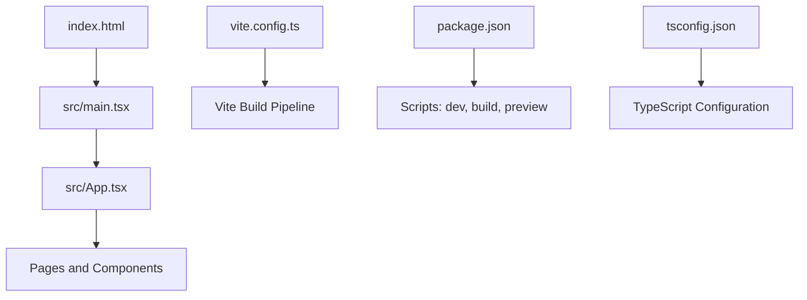
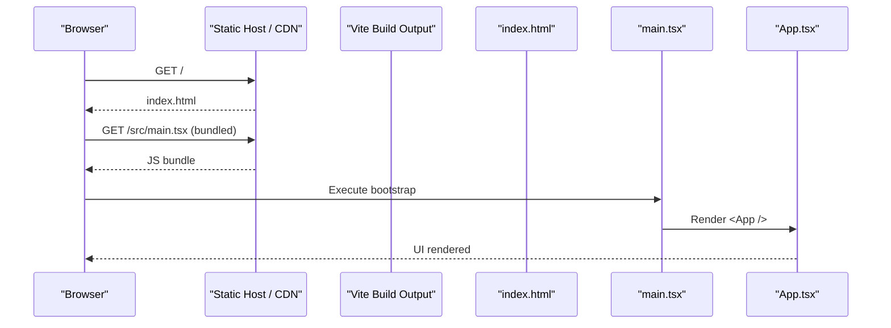
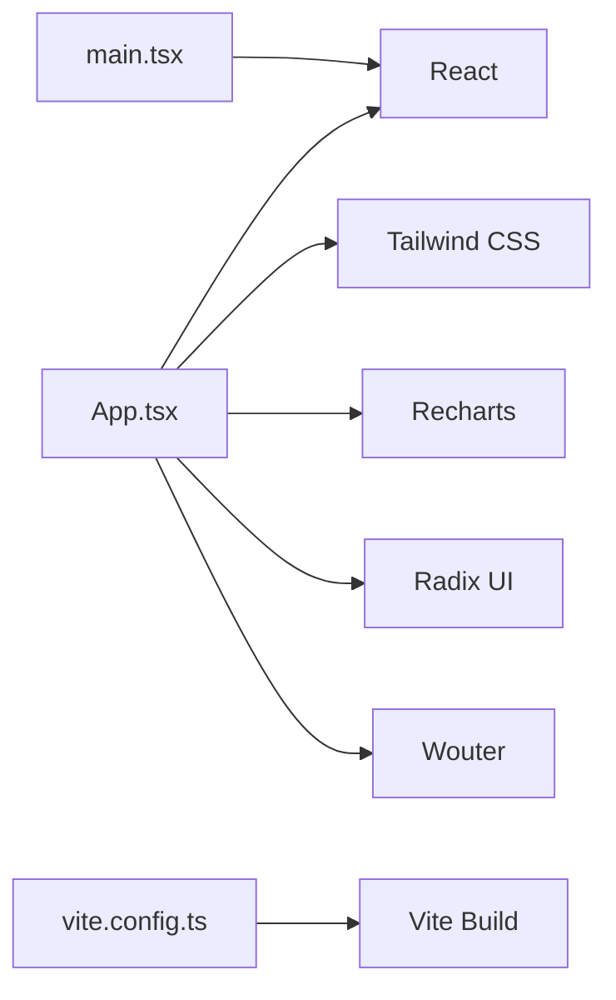
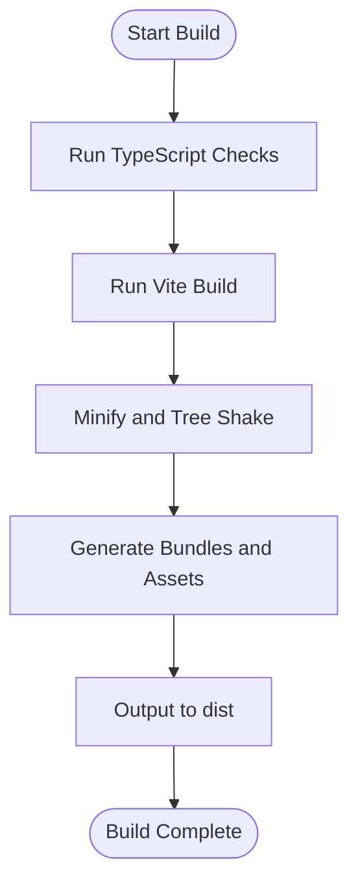

# Deployment & Production

<cite>
**Referenced Files in This Document**
- [vite.config.ts](file://app/vite.config.ts)
- [package.json](file://app/package.json)
- [index.html](file://app/index.html)
- [tsconfig.json](file://app/tsconfig.json)
- [main.tsx](file://app/src/main.tsx)
- [App.tsx](file://app/src/App.tsx)
</cite>

## Table of Contents
1. Introduction
2. Project Structure
3. Core Components
4. Architecture Overview
5. Detailed Component Analysis
6. Dependency Analysis
7. Performance Considerations
8. Troubleshooting Guide
9. Conclusion
10. Appendices

## Introduction
This document provides comprehensive deployment and production guidance for the AWS MakerBay Construction Subcontractor App. It covers the Vite-based build process, environment configuration across targets, production build optimizations, deployment strategies (static hosting, cloud platforms, containers), performance techniques (lazy loading, code splitting, caching), security considerations (environment variables, CORS, CSP), monitoring and logging setup, preview/testing workflows, and troubleshooting common issues.

## Project Structure
The application is a React + TypeScript project built with Vite. The root HTML entry loads the React app, which renders into a root DOM node. Build scripts are defined in package.json to support development, type checking, production builds, and local preview.

**Diagram sources**
- [index.html:1-17](file://app/index.html#L1-L17)
- [main.tsx:1-11](file://app/src/main.tsx#L1-L11)
- [App.tsx:1-78](file://app/src/App.tsx#L1-L78)
- [vite.config.ts:1-17](file://app/vite.config.ts#L1-L17)
- [package.json:1-44](file://app/package.json#L1-L44)
- [tsconfig.json:1-24](file://app/tsconfig.json#L1-L24)

**Section sources**
- [index.html:1-17](file://app/index.html#L1-L17)
- [main.tsx:1-11](file://app/src/main.tsx#L1-L11)
- [App.tsx:1-78](file://app/src/App.tsx#L1-L78)
- [vite.config.ts:1-17](file://app/vite.config.ts#L1-L17)
- [package.json:1-44](file://app/package.json#L1-L44)
- [tsconfig.json:1-24](file://app/tsconfig.json#L1-L24)

## Core Components
- Build tooling: Vite with React and Tailwind CSS plugins configured in vite.config.ts.
- Entry point: index.html defines the HTML shell; main.tsx mounts the React app into the root element.
- Application root: App.tsx orchestrates page rendering and navigation state.
- Type system: tsconfig.json sets strict mode, module resolution, JSX transform, and path aliases.
- Scripts: package.json defines dev, build (type check then Vite build), and preview commands.

Key responsibilities:
- vite.config.ts: Registers plugins, path aliasing for @/src, and serves as the central place for future build customizations.
- package.json: Provides standardized scripts for consistent local and CI builds.
- index.html: Loads the application script and includes preconnect hints for external fonts.
- main.tsx: Bootstraps React StrictMode and renders the App component.
- App.tsx: Central routing/state logic for pages and layout.

**Section sources**
- [vite.config.ts:1-17](file://app/vite.config.ts#L1-L17)
- [package.json:1-44](file://app/package.json#L1-L44)
- [index.html:1-17](file://app/index.html#L1-L17)
- [main.tsx:1-11](file://app/src/main.tsx#L1-L11)
- [App.tsx:1-78](file://app/src/App.tsx#L1-L78)
- [tsconfig.json:1-24](file://app/tsconfig.json#L1-L24)

## Architecture Overview
At runtime, the browser loads index.html, which references the bundled JavaScript produced by Vite. main.tsx initializes React and renders App.tsx, which manages UI state and composes page components. The build pipeline transforms TypeScript and React into optimized static assets suitable for deployment on any static-capable host or CDN.

**Diagram sources**
- [index.html:1-17](file://app/index.html#L1-L17)
- [main.tsx:1-11](file://app/src/main.tsx#L1-L11)
- [App.tsx:1-78](file://app/src/App.tsx#L1-L78)

## Detailed Component Analysis

### Build Process and Optimization Strategy
- Development: Use npm run dev to start the Vite dev server with fast refresh and minimal overhead.
- Production build: npm run build runs TypeScript checks followed by Vite’s production build, which minifies, tree-shakes, and optimizes assets.
- Preview: npm run preview serves the production build locally to validate output before deployment.

Optimization notes based on current configuration:
- Plugins: React and Tailwind CSS are enabled.
- Path aliases: @ maps to src for cleaner imports.
- No explicit optimization flags are set in vite.config.ts; Vite defaults apply (minification, dead code elimination, asset hashing).

Recommended enhancements to vite.config.ts for production:
- Configure base path if deploying under a subpath.
- Enable chunk splitting strategy for large dependencies (e.g., charts libraries).
- Add manifest generation for cache-busting and analytics.
- Integrate compression plugins (gzip/brotli) at build time or via CDN.

**Section sources**
- [package.json:6-10](file://app/package.json#L6-L10)
- [vite.config.ts:1-17](file://app/vite.config.ts#L1-L17)

### Environment Configuration
Current state:
- No environment files (.env.*) are present in the repository.
- No usage of import.meta.env or process.env detected in analyzed files.

Recommended approach:
- Create .env.development, .env.staging, .env.production to store environment-specific variables.
- Reference variables using import.meta.env.VITE_* in source code.
- Ensure only non-sensitive values are committed; use platform secret management for sensitive data.
- For static hosting providers, inject environment variables during build or runtime via provider mechanisms.

Example variable patterns:
- API_BASE_URL: Base URL for backend services.
- APP_ENV: Environment name for feature toggles.
- ANALYTICS_ID: Tracking identifiers.

Security note:
- Never commit secrets to version control.
- Validate and sanitize all injected values at runtime.

**Section sources**
- [index.html:1-17](file://app/index.html#L1-L17)
- [package.json:1-44](file://app/package.json#L1-L44)

### Production Build Configuration in vite.config.ts
Current configuration highlights:
- Uses React plugin and Tailwind CSS plugin.
- Defines path alias @ -> src.
- No explicit optimization settings; relies on Vite defaults.

Production implications:
- Minification: Enabled by default in Vite production builds.
- Tree shaking: Enabled by default; unused code is removed.
- Asset bundling: Assets are hashed and optimized automatically.

Suggested additions for robust production builds:
- Set build.rollupOptions.output.manualChunks to split vendor chunks (e.g., charts, UI libraries).
- Configure build.minify and build.sourcemap according to needs.
- Add build.lib options if publishing reusable modules.
- Integrate compression plugins for gzip/brotli.

**Section sources**
- [vite.config.ts:1-17](file://app/vite.config.ts#L1-L17)

### Deployment Strategies

#### Static Site Hosting
- Suitable platforms: AWS S3 + CloudFront, Netlify, Vercel, GitHub Pages, Firebase Hosting.
- Steps:
  - Run npm run build to generate dist output.
  - Upload the dist folder to the chosen host.
  - Configure redirects for SPA routing if needed.
  - Enable CDN caching and HTTP/2.

Notes:
- If deploying under a subpath, configure base in vite.config.ts accordingly.
- Ensure proper MIME types and caching headers for static assets.

**Section sources**
- [package.json:6-10](file://app/package.json#L6-L10)
- [vite.config.ts:1-17](file://app/vite.config.ts#L1-L17)

#### Cloud Platforms (Serverless/Platform-as-a-Service)
- Options: AWS Amplify, Azure Static Web Apps, Google Cloud Storage + CDN.
- Steps:
  - Connect repository to platform.
  - Configure build command (npm ci && npm run build).
  - Set publish directory to dist.
  - Inject environment variables via platform secret managers.
  - Enable HTTPS and CDN.

**Section sources**
- [package.json:6-10](file://app/package.json#L6-L10)

#### Containerized Deployments
- Use a multi-stage Dockerfile:
  - Stage 1: Install dependencies and run npm run build.
  - Stage 2: Serve static assets with a lightweight server (e.g., nginx, caddy).
- Example workflow:
  - docker build -t makerbay-app .
  - docker run to test locally.
  - Push image to container registry and deploy to Kubernetes/ECS.

Caching and performance:
- Cache node_modules layer in Docker build.
- Compress assets with gzip/brotli in the serving layer.

**Section sources**
- [package.json:6-10](file://app/package.json#L6-L10)

### Performance Optimization Techniques

#### Lazy Loading and Code Splitting
- Current state: All pages are statically imported in App.tsx, meaning they load together by default.
- Recommendation: Convert heavy page imports to dynamic imports to enable route-based code splitting.
  - Benefit: Smaller initial bundle, faster first paint.
  - Implementation: Replace static imports with dynamic import() calls within navigation handlers.

#### Asset Caching Strategies
- Leverage content hashing generated by Vite for long-term caching.
- Configure CDN cache policies:
  - HTML: Short TTL or no-cache.
  - JS/CSS: Long TTL with immutable flag due to hashed filenames.
  - Fonts/Images: Long TTL with versioned URLs.

#### Bundle Size Optimization
- Identify large dependencies (e.g., charts library) and consider lazy-loading them.
- Remove unused UI components or features.
- Prefer icon libraries that allow tree-shaking or inline SVGs where appropriate.

**Section sources**
- [App.tsx:1-78](file://app/src/App.tsx#L1-L78)

### Security Considerations

#### Environment Variables
- Store secrets in platform secret managers (e.g., AWS Secrets Manager, environment variables at deploy time).
- Avoid committing .env files to version control.
- Validate environment variables at runtime to fail fast on misconfiguration.

#### CORS Configuration
- If the frontend calls backend APIs, configure CORS on the server side to restrict origins, methods, and headers.
- Use relative paths or domain-scoped cookies when applicable.

#### Content Security Policy (CSP)
- Implement CSP headers to mitigate XSS and injection attacks.
- Restrict script and style sources to trusted CDNs.
- Use nonce-based or hash-based approaches for inline scripts/styles if necessary.

**Section sources**
- [index.html:1-17](file://app/index.html#L1-L17)

### Monitoring and Logging Setup

#### Frontend Monitoring
- Integrate error tracking (e.g., Sentry) via initialization in main.tsx to capture unhandled exceptions and user interactions.
- Add performance metrics (e.g., web-vitals) to measure Core Web Vitals.

#### Logging Strategy
- Log user actions and errors with contextual metadata (page, device, timestamp).
- Exclude sensitive data from logs.
- Aggregate logs in a centralized system (e.g., CloudWatch, Datadog).

#### Backend Integration
- If calling APIs, log request IDs and correlate frontend and backend logs.
- Implement retry and timeout handling for resilience.

**Section sources**
- [main.tsx:1-11](file://app/src/main.tsx#L1-L11)

### Preview and Testing Before Production

#### Local Preview
- Run npm run preview to serve the production build locally and validate behavior.
- Inspect network requests and bundle sizes using browser developer tools.

#### Automated Checks
- Include linting and type checks in CI pipelines.
- Run unit tests (if added) and snapshot tests for critical components.
- Perform visual regression testing for key pages.

#### Pre-deployment Validation
- Verify environment variables are correctly injected.
- Test critical user flows (navigation, forms, chart rendering).
- Confirm CDN caching and fallback behaviors.

**Section sources**
- [package.json:6-10](file://app/package.json#L6-L10)

## Dependency Analysis
The application depends on React, ReactDOM, Tailwind CSS, Radix UI primitives, Recharts, Wouter (routing), and utility libraries. These dependencies contribute to bundle size and should be considered for lazy loading or chunk splitting.

**Diagram sources**
- [App.tsx:1-78](file://app/src/App.tsx#L1-L78)
- [main.tsx:1-11](file://app/src/main.tsx#L1-L11)
- [vite.config.ts:1-17](file://app/vite.config.ts#L1-L17)

**Section sources**
- [package.json:18-42](file://app/package.json#L18-L42)

## Performance Considerations
- Initial Load: Reduce bundle size by lazy-loading routes and heavy libraries.
- Caching: Use CDN caching with hashed assets; configure appropriate TTLs.
- Rendering: Defer non-critical charts and components until needed.
- Network: Enable HTTP/2, compress responses, and minimize third-party scripts.
- Metrics: Monitor Core Web Vitals and set alerts for regressions.

[No sources needed since this section provides general guidance]

## Troubleshooting Guide

Common Issues and Resolutions:
- Blank screen after deployment:
  - Check base path configuration if deployed under a subpath.
  - Verify that index.html references the correct entry script.
- 404 on route refresh:
  - Configure SPA fallback to index.html on the hosting platform.
- Slow initial load:
  - Implement route-based code splitting and lazy loading.
  - Analyze bundle with Vite’s bundle analyzer to identify large dependencies.
- CORS errors:
  - Ensure backend allows the frontend origin and required headers/methods.
- Environment variables not available:
  - Confirm variables are prefixed correctly and injected at build/deploy time.
- Font loading delays:
  - Keep preconnect hints in index.html and ensure CDN availability.

Diagnostic Steps:
- Use browser DevTools Network tab to inspect resource loading and caching.
- Review console for errors and warnings.
- Validate build output with npm run preview.
- Measure performance with Lighthouse or WebPageTest.

**Section sources**
- [index.html:1-17](file://app/index.html#L1-L17)
- [package.json:6-10](file://app/package.json#L6-L10)

## Conclusion
The AWS MakerBay Construction Subcontractor App uses a modern Vite-based build pipeline with React and TypeScript. By adopting environment-driven configuration, optimizing the build for production, implementing lazy loading and code splitting, securing deployments with proper environment and security practices, and setting up monitoring and logging, the application can be reliably deployed to static hosting, cloud platforms, or containers. Continuous preview and testing ensure quality before production releases.

[No sources needed since this section summarizes without analyzing specific files]

## Appendices

### Build Script Flow

**Diagram sources**
- [package.json:6-10](file://app/package.json#L6-L10)
- [vite.config.ts:1-17](file://app/vite.config.ts#L1-L17)