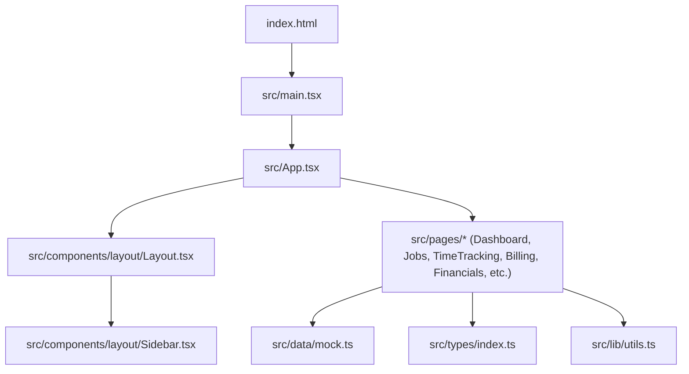
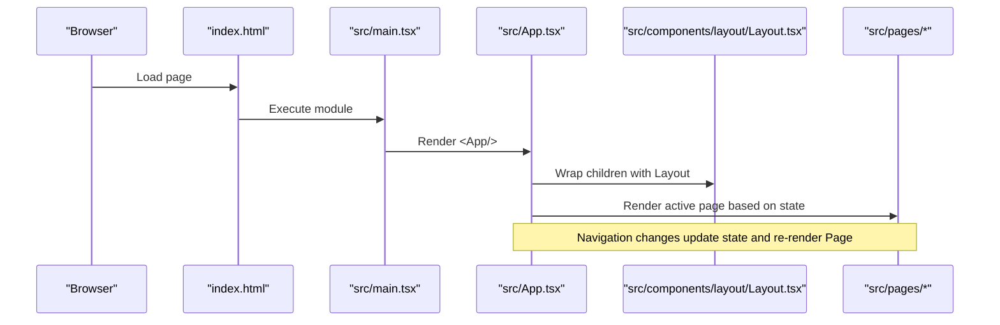
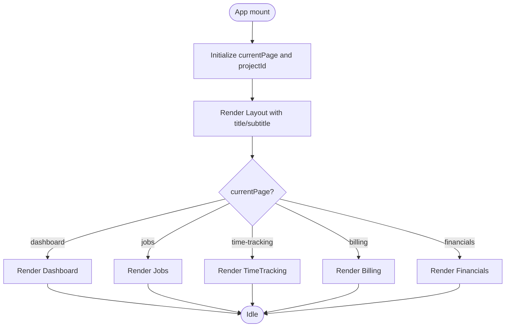
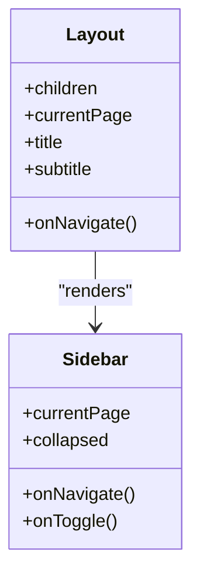
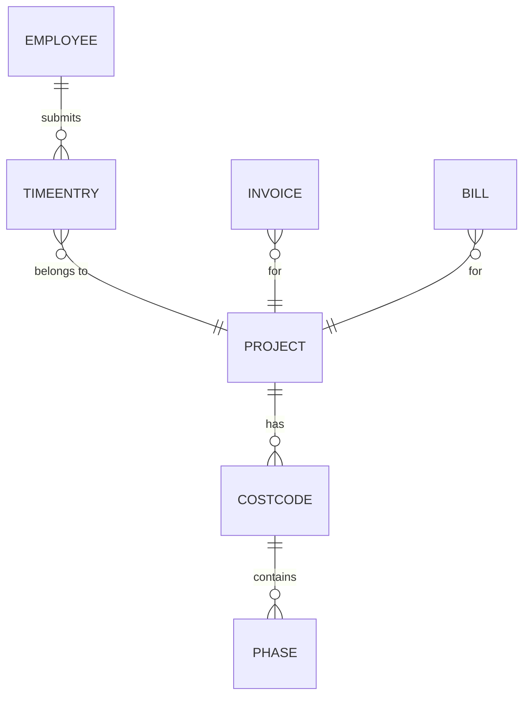
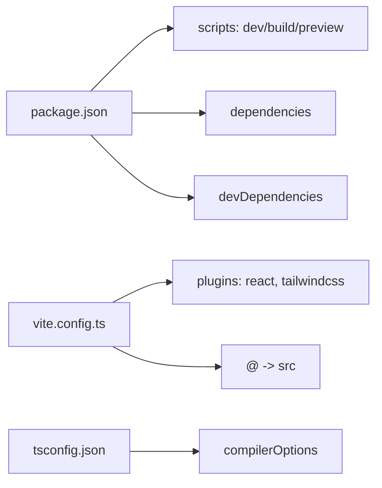

# Getting Started

<cite>
**Referenced Files in This Document**
- [package.json](file://app/package.json)
- [vite.config.ts](file://app/vite.config.ts)
- [tsconfig.json](file://app/tsconfig.json)
- [index.html](file://app/index.html)
- [main.tsx](file://app/src/main.tsx)
- [App.tsx](file://app/src/App.tsx)
- [Layout.tsx](file://app/src/components/layout/Layout.tsx)
- [Sidebar.tsx](file://app/src/components/layout/Sidebar.tsx)
- [Dashboard.tsx](file://app/src/pages/Dashboard.tsx)
- [Jobs.tsx](file://app/src/pages/Jobs.tsx)
- [TimeTracking.tsx](file://app/src/pages/TimeTracking.tsx)
- [Billing.tsx](file://app/src/pages/Billing.tsx)
- [Financials.tsx](file://app/src/pages/Financials.tsx)
- [mock.ts](file://app/src/data/mock.ts)
- [utils.ts](file://app/src/lib/utils.ts)
- [index.ts (types)](file://app/src/types/index.ts)
</cite>

## Table of Contents
1. [Introduction](#introduction)
2. [Project Structure](#project-structure)
3. [Core Components](#core-components)
4. [Architecture Overview](#architecture-overview)
5. [Detailed Component Analysis](#detailed-component-analysis)
6. [Dependency Analysis](#dependency-analysis)
7. [Performance Considerations](#performance-considerations)
8. [Troubleshooting Guide](#troubleshooting-guide)
9. [Conclusion](#conclusion)

## Introduction
This guide helps you set up and run the AWS MakerBay Construction Subcontractor App locally. You will install dependencies, start the development server, navigate key sections (Dashboard, Jobs, Time Tracking, Billing, Financials), build for production, and preview the built output. Configuration files such as Vite, TypeScript, and package scripts are explained to help you understand how the app is built and served.

## Project Structure
The application is a React + TypeScript project built with Vite. The root entry point renders the React app into the DOM, while the src directory organizes pages, components, types, and mock data.

Key directories:
- src/components: Reusable UI and layout components (e.g., Layout, Sidebar, UI primitives like Button, Card, Badge).
- src/pages: Feature screens including Dashboard, Jobs, JobDetail, TimeTracking, Billing, WIP, Payroll, Financials, Settings.
- src/types: Shared TypeScript type definitions used across pages and components.
- src/data: Mock datasets for projects, employees, time entries, invoices, bills, vendors, and financial entities.
- src/lib: Utility functions for formatting and class merging.

**Diagram sources**
- [index.html:1-17](file://app/index.html#L1-L17)
- [main.tsx:1-11](file://app/src/main.tsx#L1-L11)
- [App.tsx:1-78](file://app/src/App.tsx#L1-L78)
- [Layout.tsx:1-77](file://app/src/components/layout/Layout.tsx#L1-L77)
- [Sidebar.tsx:1-97](file://app/src/components/layout/Sidebar.tsx#L1-L97)
- [Dashboard.tsx:1-259](file://app/src/pages/Dashboard.tsx#L1-L259)
- [Jobs.tsx:1-200](file://app/src/pages/Jobs.tsx#L1-L200)
- [mock.ts:1-246](file://app/src/data/mock.ts#L1-L246)
- [index.ts (types):1-255](file://app/src/types/index.ts#L1-L255)
- [utils.ts:1-45](file://app/src/lib/utils.ts#L1-L45)

**Section sources**
- [index.html:1-17](file://app/index.html#L1-L17)
- [main.tsx:1-11](file://app/src/main.tsx#L1-L11)
- [App.tsx:1-78](file://app/src/App.tsx#L1-L78)
- [Layout.tsx:1-77](file://app/src/components/layout/Layout.tsx#L1-L77)
- [Sidebar.tsx:1-97](file://app/src/components/layout/Sidebar.tsx#L1-L97)
- [Dashboard.tsx:1-259](file://app/src/pages/Dashboard.tsx#L1-L259)
- [Jobs.tsx:1-200](file://app/src/pages/Jobs.tsx#L1-L200)
- [mock.ts:1-246](file://app/src/data/mock.ts#L1-L246)
- [index.ts (types):1-255](file://app/src/types/index.ts#L1-L255)
- [utils.ts:1-45](file://app/src/lib/utils.ts#L1-L45)

## Core Components
- App orchestrates page routing via state and renders the Layout wrapper with dynamic titles/subtitles per page. It also mounts a notification toaster.
- Layout provides the top bar, search area, user avatar, and main content area; it manages sidebar collapse state.
- Sidebar defines navigation items and routes for Dashboard, Jobs & Costing, Time Tracking, AIA Billing, WIP Reports, Payroll, Financials, and Settings.
- Pages consume mock data and types to render feature-specific views. For example, Dashboard shows KPIs and charts using mock datasets.

Navigation flow:
- Clicking a sidebar item triggers onNavigate(page), which updates the current page in App and re-renders the corresponding page component.

**Section sources**
- [App.tsx:1-78](file://app/src/App.tsx#L1-L78)
- [Layout.tsx:1-77](file://app/src/components/layout/Layout.tsx#L1-L77)
- [Sidebar.tsx:1-97](file://app/src/components/layout/Sidebar.tsx#L1-L97)
- [Dashboard.tsx:1-259](file://app/src/pages/Dashboard.tsx#L1-L259)
- [Jobs.tsx:1-200](file://app/src/pages/Jobs.tsx#L1-L200)

## Architecture Overview
The app follows a simple client-side architecture:
- Entry point: index.html loads the React app from src/main.tsx.
- Root component: App sets up navigation state and renders Layout plus the active page.
- Layout: Provides consistent chrome (header, sidebar) around page content.
- Pages: Feature modules that read from shared types and mock data.

**Diagram sources**
- [index.html:1-17](file://app/index.html#L1-L17)
- [main.tsx:1-11](file://app/src/main.tsx#L1-L11)
- [App.tsx:1-78](file://app/src/App.tsx#L1-L78)
- [Layout.tsx:1-77](file://app/src/components/layout/Layout.tsx#L1-L77)

## Detailed Component Analysis

### App and Navigation
- Manages currentPage and selectedProjectId state.
- Renders different pages based on currentPage and passes navigation callbacks.
- Uses a configuration map to set page title and subtitle dynamically.

**Diagram sources**
- [App.tsx:1-78](file://app/src/App.tsx#L1-L78)

**Section sources**
- [App.tsx:1-78](file://app/src/App.tsx#L1-L78)

### Layout and Sidebar
- Layout renders a sticky header with search and notifications, and a collapsible sidebar.
- Sidebar defines the primary navigation routes and highlights the active route.

**Diagram sources**
- [Layout.tsx:1-77](file://app/src/components/layout/Layout.tsx#L1-L77)
- [Sidebar.tsx:1-97](file://app/src/components/layout/Sidebar.tsx#L1-L97)

**Section sources**
- [Layout.tsx:1-77](file://app/src/components/layout/Layout.tsx#L1-L77)
- [Sidebar.tsx:1-97](file://app/src/components/layout/Sidebar.tsx#L1-L97)

### Data and Types
- Types define domain models for projects, cost codes, phases, time entries, employees, payroll runs, pay applications, change orders, WIP entities, GL accounts, invoices, bills, and vendors.
- Mock data provides realistic sample datasets consumed by pages and charts.

**Diagram sources**
- [index.ts (types):1-255](file://app/src/types/index.ts#L1-L255)
- [mock.ts:1-246](file://app/src/data/mock.ts#L1-L246)

**Section sources**
- [index.ts (types):1-255](file://app/src/types/index.ts#L1-L255)
- [mock.ts:1-246](file://app/src/data/mock.ts#L1-L246)

## Dependency Analysis
- Build toolchain: Vite with React plugin and Tailwind CSS integration.
- Runtime dependencies: React, ReactDOM, charting library, UI primitives, icons, routing helper, toast notifications, and utility libraries for styling and class merging.
- Development dependencies: TypeScript, Vite, React types, and Tailwind Vite plugin.

Scripts:
- dev: Starts the Vite development server.
- build: Runs TypeScript check then builds with Vite.
- preview: Serves the built output locally.

Configuration:
- vite.config.ts: Enables React and Tailwind plugins, sets path alias @ to src.
- tsconfig.json: Configures modern target, JSX runtime, strict mode, path aliases, and includes only src.

**Diagram sources**
- [package.json:1-44](file://app/package.json#L1-L44)
- [vite.config.ts:1-17](file://app/vite.config.ts#L1-L17)
- [tsconfig.json:1-24](file://app/tsconfig.json#L1-L24)

**Section sources**
- [package.json:1-44](file://app/package.json#L1-L44)
- [vite.config.ts:1-17](file://app/vite.config.ts#L1-L17)
- [tsconfig.json:1-24](file://app/tsconfig.json#L1-L24)

## Performance Considerations
- Use the development server for fast refresh during development.
- Keep mock data minimal when adding new features to avoid unnecessary re-renders.
- Charts rely on a responsive container; ensure data arrays are sized appropriately for performance.
- Avoid heavy computations inside render paths; precompute derived values where possible.

[No sources needed since this section provides general guidance]

## Troubleshooting Guide
Common setup issues and resolutions:
- Node.js version mismatch: Ensure your Node.js version supports the project’s dependencies and TypeScript settings. If you encounter errors related to ES modules or modern syntax, upgrade Node.js to a recent LTS release.
- Missing dependencies: If you see module resolution errors, run the dependency installation command again and ensure the process completes without warnings.
- Port conflicts: If the development server fails to start due to port usage, stop other processes using the same port or configure a different port in your environment.
- Path alias not resolving: Confirm that the path alias @ maps to src in both Vite and TypeScript configurations.
- Build failures: Run the build script to surface TypeScript or bundling errors. Fix reported issues before attempting deployment.

Environment configuration guidance:
- No environment variables are required to run the app out of the box.
- If you later integrate APIs or services, add environment variables through your preferred mechanism and reference them in code.

**Section sources**
- [package.json:1-44](file://app/package.json#L1-L44)
- [vite.config.ts:1-17](file://app/vite.config.ts#L1-L17)
- [tsconfig.json:1-24](file://app/tsconfig.json#L1-L24)

## Conclusion
You now have everything needed to install, run, and explore the AWS MakerBay Construction Subcontractor App. Use the development server for daily work, build for production, and preview the output locally. The modular structure makes it straightforward to extend features, add real data sources, and integrate additional services.