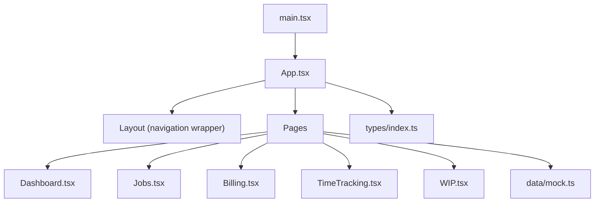
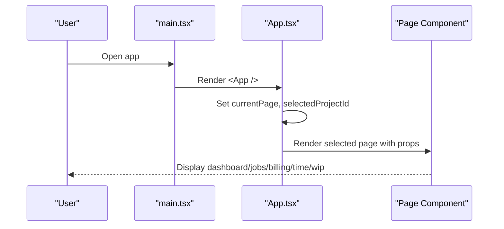
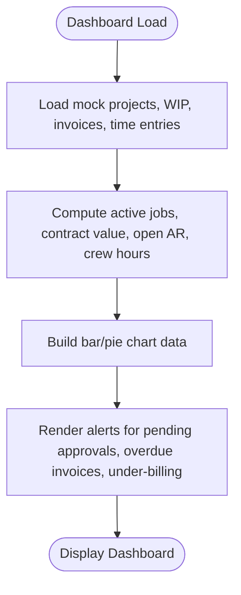
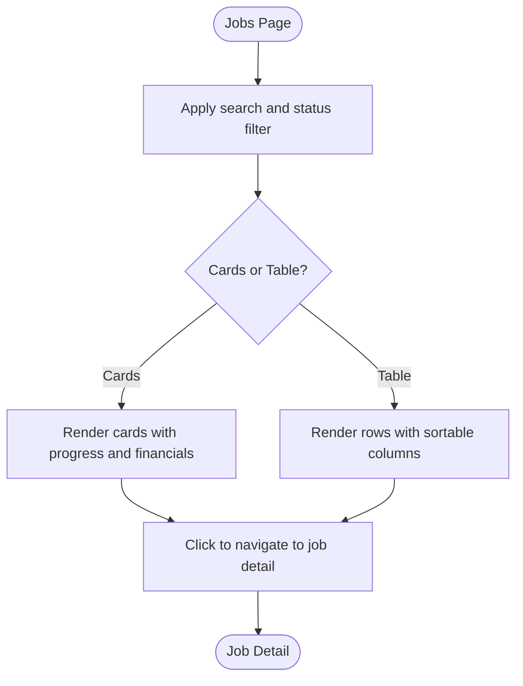
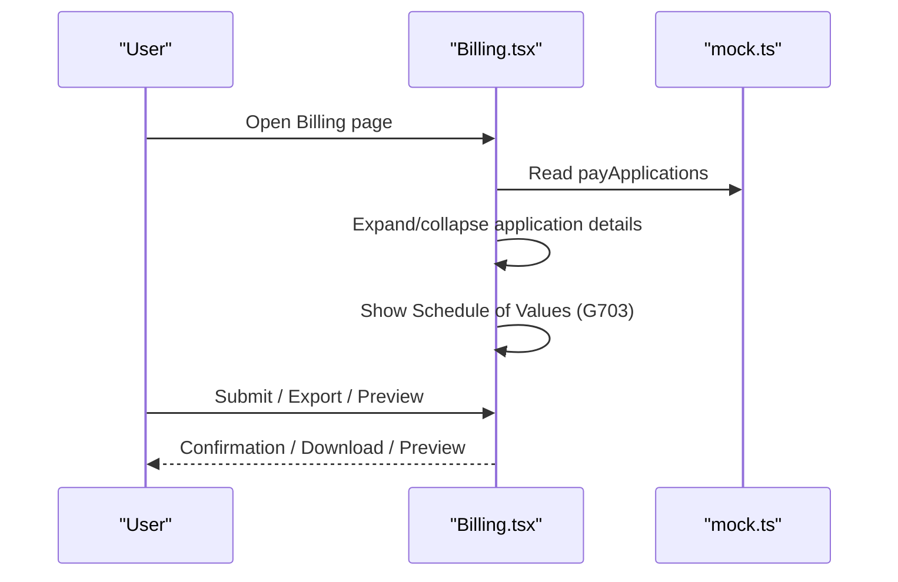
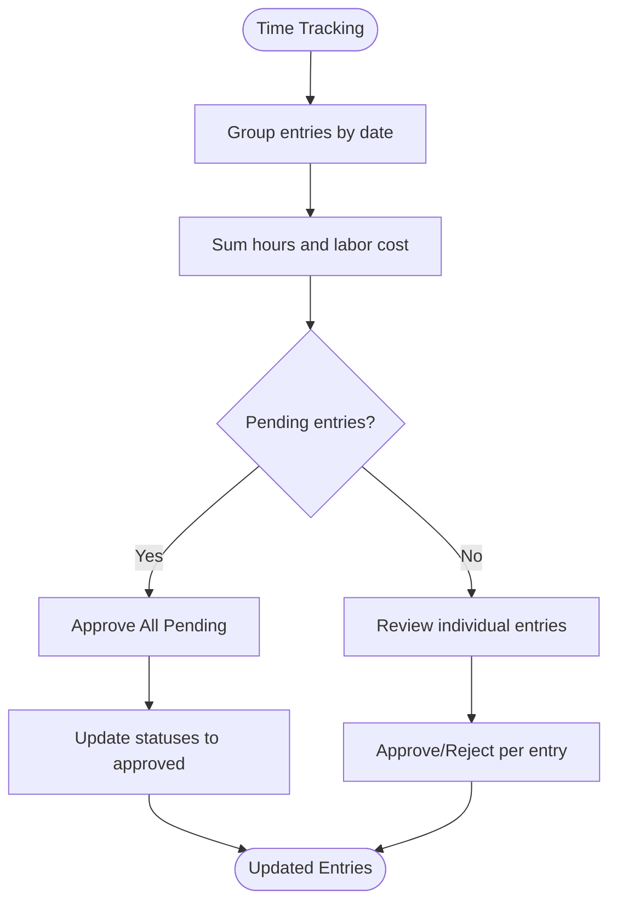
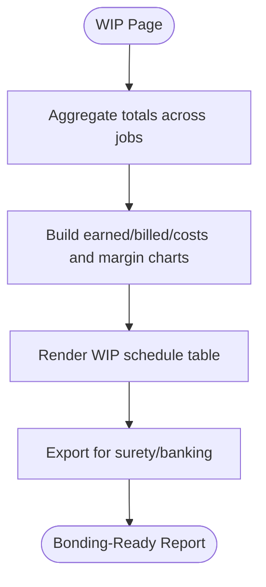
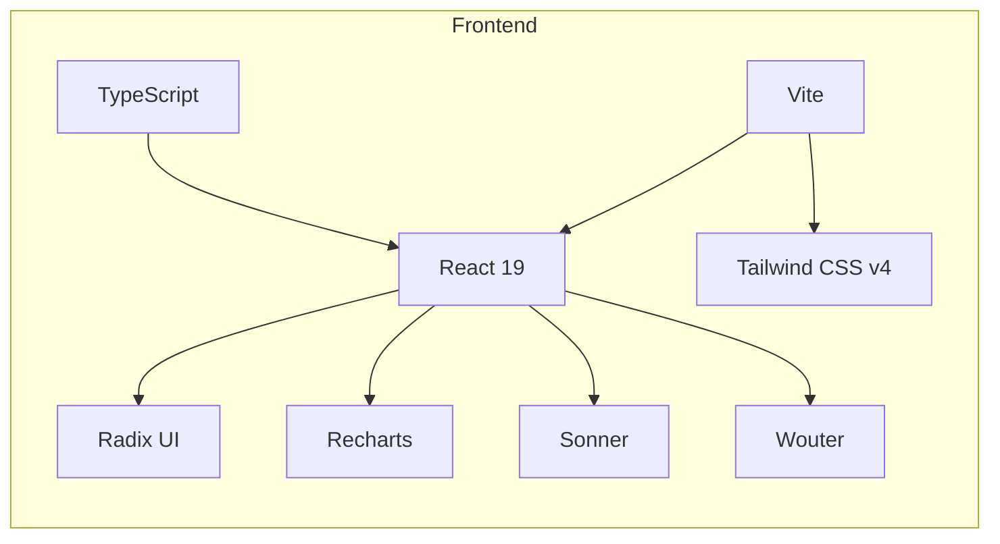

# Project Overview

<cite>
**Referenced Files in This Document**
- [App.tsx](file://app/src/App.tsx)
- [main.tsx](file://app/src/main.tsx)
- [Dashboard.tsx](file://app/src/pages/Dashboard.tsx)
- [Jobs.tsx](file://app/src/pages/Jobs.tsx)
- [Billing.tsx](file://app/src/pages/Billing.tsx)
- [TimeTracking.tsx](file://app/src/pages/TimeTracking.tsx)
- [WIP.tsx](file://app/src/pages/WIP.tsx)
- [index.ts (types)](file://app/src/types/index.ts)
- [mock.ts](file://app/src/data/mock.ts)
- [vite.config.ts](file://app/vite.config.ts)
- [package.json](file://app/package.json)
- [BuildBooks-Product-Spec-Sheet.md](file://BuildBooks-Product-Spec-Sheet.md)
- [Reusable AI-App Technology and Design Stack Playbook.md](file://Reusable AI-App Technology and Design Stack Playbook.md)
</cite>

## Table of Contents
1. Introduction
2. Project Structure
3. Core Components
4. Architecture Overview
5. Detailed Component Analysis
6. Dependency Analysis
7. Performance Considerations
8. Troubleshooting Guide
9. Conclusion

## Introduction
This project is a specialized construction accounting and project management application tailored for electrical subcontractors. It focuses on job costing, time tracking with GPS, certified payroll, AIA billing (G702/G703), work-in-progress (WIP) reporting, and financial management. The product addresses industry-specific needs such as prevailing wage compliance, retainage calculations, bonding-ready WIP reports, and schedule-of-values-driven pay applications.

Target audience:
- Specialty trade subcontractors (electrical, plumbing, HVAC, concrete, framing, roofing, drywall, painting)
- Mid-size firms ($2M–$50M revenue) with 20–100 employees
- Mixed private and public works projects requiring prevailing wage and AIA billing
- Owners/controllers who need real-time job profitability and compliant payroll/billing without enterprise complexity

Core value proposition:
- Real-time job costing by phase and cost code
- Prevailing wage payroll with certified report generation
- Native AIA G702/G703 pay applications from schedule of values
- Bonding-grade WIP schedules with over/under billing and profit fade visibility
- Financials aligned to construction accounting practices

Technology stack overview:
- React 19 with TypeScript
- Tailwind CSS v4 via @tailwindcss/vite
- Radix UI primitives for accessible components
- Vite build system with React plugin and alias support
- Recharts for data visualization
- Sonner for notifications
- Wouter for lightweight client routing

[No sources needed since this section provides general context]

## Project Structure
The application follows a feature-based layout with clear separation between pages, shared UI components, types, and mock data. The entry point renders the root component that manages navigation and page rendering. Pages implement domain features like dashboard analytics, jobs, billing, time tracking, WIP, payroll, and financials.

**Diagram sources**
- [main.tsx:1-11](file://app/src/main.tsx#L1-L11)
- [App.tsx:1-78](file://app/src/App.tsx#L1-L78)
- [Dashboard.tsx:1-259](file://app/src/pages/Dashboard.tsx#L1-L259)
- [Jobs.tsx:1-200](file://app/src/pages/Jobs.tsx#L1-L200)
- [Billing.tsx:1-163](file://app/src/pages/Billing.tsx#L1-L163)
- [TimeTracking.tsx:1-167](file://app/src/pages/TimeTracking.tsx#L1-L167)
- [WIP.tsx:1-188](file://app/src/pages/WIP.tsx#L1-L188)
- [index.ts (types):1-255](file://app/src/types/index.ts#L1-L255)
- [mock.ts:1-246](file://app/src/data/mock.ts#L1-L246)

**Section sources**
- [main.tsx:1-11](file://app/src/main.tsx#L1-L11)
- [App.tsx:1-78](file://app/src/App.tsx#L1-L78)
- [vite.config.ts:1-17](file://app/vite.config.ts#L1-L17)
- [package.json:1-44](file://app/package.json#L1-L44)

## Core Components
- Dashboard: KPIs, charts, active job summaries, alerts for pending approvals, overdue invoices, under-billing, and payroll deadlines.
- Jobs: Searchable/filterable list of projects with status badges, progress bars, contract vs. costs vs. billed metrics, and drill-down to job detail.
- Billing: Pay application management with AIA G702/G703 views, schedule of values tables, retainage tracking, and export/preview actions.
- Time Tracking: Crew hours grouped by date, approval workflow (approve/reject/all), labor burden calculation, and classification tags.
- WIP: Earned vs. billed vs. costs by job, gross margin analysis, and bonding-ready WIP schedule table with totals.

These components share consistent UI primitives (cards, badges, buttons) and rely on typed models and mock datasets for demonstration.

**Section sources**
- [Dashboard.tsx:1-259](file://app/src/pages/Dashboard.tsx#L1-L259)
- [Jobs.tsx:1-200](file://app/src/pages/Jobs.tsx#L1-L200)
- [Billing.tsx:1-163](file://app/src/pages/Billing.tsx#L1-L163)
- [TimeTracking.tsx:1-167](file://app/src/pages/TimeTracking.tsx#L1-L167)
- [WIP.tsx:1-188](file://app/src/pages/WIP.tsx#L1-L188)

## Architecture Overview
The app uses a single-page architecture driven by React state for navigation. The root App component maintains current page and selected project context, rendering the appropriate page within a Layout wrapper. Each page consumes typed models and mock data to render domain-specific views. Charts are rendered using Recharts; notifications use Sonner.

**Diagram sources**
- [main.tsx:1-11](file://app/src/main.tsx#L1-L11)
- [App.tsx:1-78](file://app/src/App.tsx#L1-L78)

## Detailed Component Analysis

### Dashboard Analytics
- Displays KPIs: active jobs, total contract value, open AR, crew hours.
- Visualizes job cost vs budget vs billed and YTD cost breakdown by category.
- Highlights active jobs with progress indicators and flags for pending time entries, change orders, overdue invoices, and under-billing.

**Diagram sources**
- [Dashboard.tsx:1-259](file://app/src/pages/Dashboard.tsx#L1-L259)
- [mock.ts:1-246](file://app/src/data/mock.ts#L1-L246)

**Section sources**
- [Dashboard.tsx:1-259](file://app/src/pages/Dashboard.tsx#L1-L259)
- [mock.ts:1-246](file://app/src/data/mock.ts#L1-L246)

### Job Management
- Provides search and status filters, card/table views.
- Shows per-job financial summary: contract, cost to date, billed, margin.
- Supports navigation to detailed job view.

**Diagram sources**
- [Jobs.tsx:1-200](file://app/src/pages/Jobs.tsx#L1-L200)
- [mock.ts:1-246](file://app/src/data/mock.ts#L1-L246)

**Section sources**
- [Jobs.tsx:1-200](file://app/src/pages/Jobs.tsx#L1-L200)
- [mock.ts:1-246](file://app/src/data/mock.ts#L1-L246)

### AIA Billing (G702/G703)
- Summarizes pay applications: total apps, total billed, awaiting approval, retainage held.
- Expands each application to show schedule of values with line items, previous completed, this period, stored materials, percent complete.
- Actions include submit to GC, export PDF, and preview G702/G703.

**Diagram sources**
- [Billing.tsx:1-163](file://app/src/pages/Billing.tsx#L1-L163)
- [mock.ts:1-246](file://app/src/data/mock.ts#L1-L246)

**Section sources**
- [Billing.tsx:1-163](file://app/src/pages/Billing.tsx#L1-L163)
- [mock.ts:1-246](file://app/src/data/mock.ts#L1-L246)

### Time Tracking with GPS
- Groups entries by date, shows hours, labor burden, and classifications.
- Supports approve/reject workflows and bulk approve.
- Includes GPS fields in model for site verification.

**Diagram sources**
- [TimeTracking.tsx:1-167](file://app/src/pages/TimeTracking.tsx#L1-L167)
- [mock.ts:1-246](file://app/src/data/mock.ts#L1-L246)
- [index.ts (types):65-85](file://app/src/types/index.ts#L65-L85)

**Section sources**
- [TimeTracking.tsx:1-167](file://app/src/pages/TimeTracking.tsx#L1-L167)
- [mock.ts:1-246](file://app/src/data/mock.ts#L1-L246)
- [index.ts (types):65-85](file://app/src/types/index.ts#L65-L85)

### Work in Progress (WIP) Reports
- Aggregates contract value, costs, billings, earned revenue, over/under billing, and gross profit.
- Visualizes earned vs. billed vs. costs and gross margin by job.
- Provides bonding-ready WIP schedule table with totals.

**Diagram sources**
- [WIP.tsx:1-188](file://app/src/pages/WIP.tsx#L1-L188)
- [mock.ts:1-246](file://app/src/data/mock.ts#L1-L246)

**Section sources**
- [WIP.tsx:1-188](file://app/src/pages/WIP.tsx#L1-L188)
- [mock.ts:1-246](file://app/src/data/mock.ts#L1-L246)

### Conceptual Overview
The application aligns with construction accounting best practices:
- Job costing by phase and cost code enables real-time profitability insights.
- Prevailing wage payroll supports Davis-Bacon and state rate compliance with certified payroll outputs.
- AIA billing leverages schedule of values to generate standardized pay applications.
- WIP reporting delivers bonding-ready formats with over/under billing and profit fade visibility.

[No sources needed since this section doesn't analyze specific files]

## Dependency Analysis
The app’s dependencies center around React 19, TypeScript, Vite, Tailwind CSS v4, Radix UI primitives, Recharts, Sonner, and Wouter. The build configuration sets up React and Tailwind plugins and defines an alias for clean imports.

**Diagram sources**
- [package.json:1-44](file://app/package.json#L1-L44)
- [vite.config.ts:1-17](file://app/vite.config.ts#L1-L17)

**Section sources**
- [package.json:1-44](file://app/package.json#L1-L44)
- [vite.config.ts:1-17](file://app/vite.config.ts#L1-L17)

## Performance Considerations
- Use memoization for derived data in dashboards and lists to avoid unnecessary re-renders when filtering or aggregating large datasets.
- Prefer virtualized lists for long job or time-entry tables if data grows significantly.
- Keep chart datasets minimal and compute aggregates efficiently to maintain smooth interactions.
- Leverage Tailwind utility classes for efficient styling without heavy custom CSS.
- Ensure images and assets are optimized; consider lazy-loading heavy components.

[No sources needed since this section provides general guidance]

## Troubleshooting Guide
Common issues and resolutions:
- Navigation not updating: Verify currentPage state and ensure handleNavigate updates both page and scroll position.
- Missing data in charts: Confirm mock datasets contain required fields and that computed arrays map correctly to chart keys.
- Approval workflow not persisting: Ensure local state updates reflect changes and that any future backend integration handles status transitions consistently.
- Build errors: Run type checks and build scripts to catch TypeScript and bundling issues early.

Operational tips:
- Validate form inputs and statuses before submitting pay applications or approving time entries.
- Use alerts and badges to guide users toward completing necessary steps (e.g., approve all pending time entries).
- Test responsive layouts across devices to ensure readability of tables and charts.

**Section sources**
- [App.tsx:15-78](file://app/src/App.tsx#L15-L78)
- [Dashboard.tsx:1-259](file://app/src/pages/Dashboard.tsx#L1-L259)
- [TimeTracking.tsx:1-167](file://app/src/pages/TimeTracking.tsx#L1-L167)
- [Billing.tsx:1-163](file://app/src/pages/Billing.tsx#L1-L163)
- [WIP.tsx:1-188](file://app/src/pages/WIP.tsx#L1-L188)

## Conclusion
This application delivers a focused, construction-specific accounting and project management experience for electrical subcontractors. It combines job costing, time tracking with GPS, certified payroll, AIA billing, WIP reporting, and financials into a cohesive interface built with modern web technologies. By addressing prevailing wage compliance, retainage calculations, and bonding requirements, it helps subcontractors maintain accurate books, improve cash flow, and meet contractual obligations efficiently.

[No sources needed since this section summarizes without analyzing specific files]