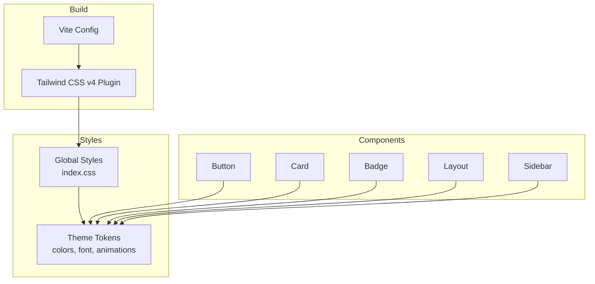
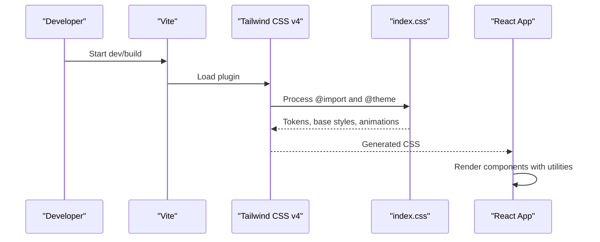
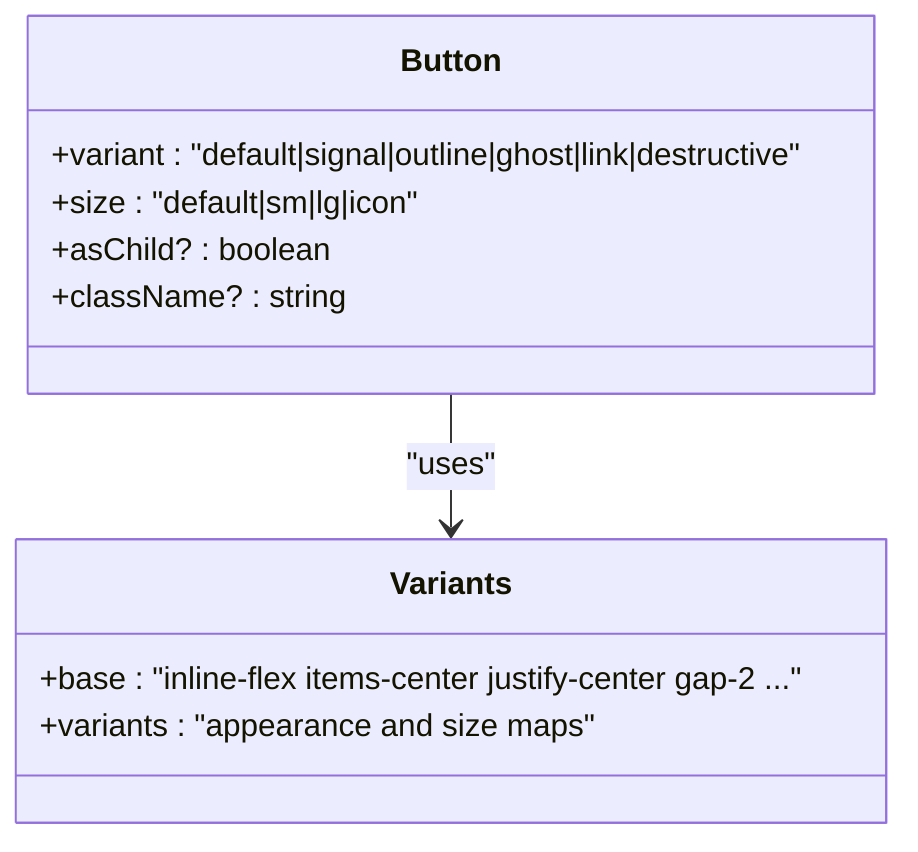
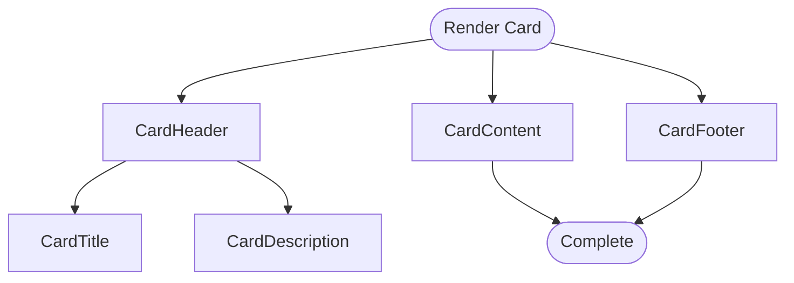
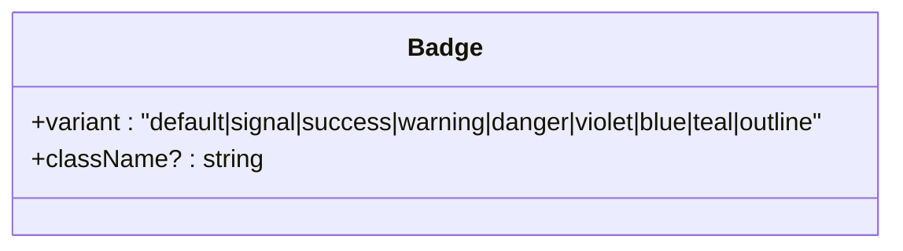
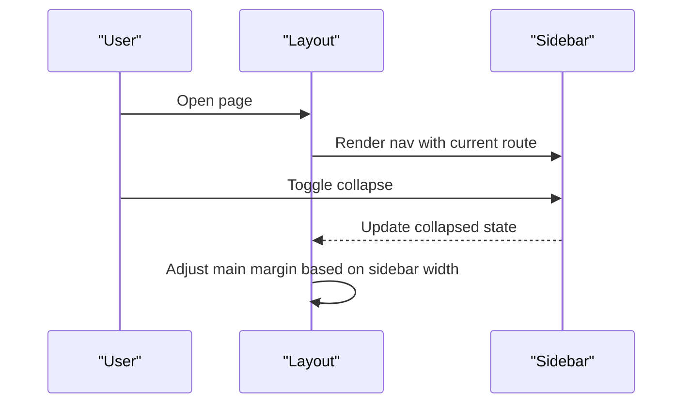
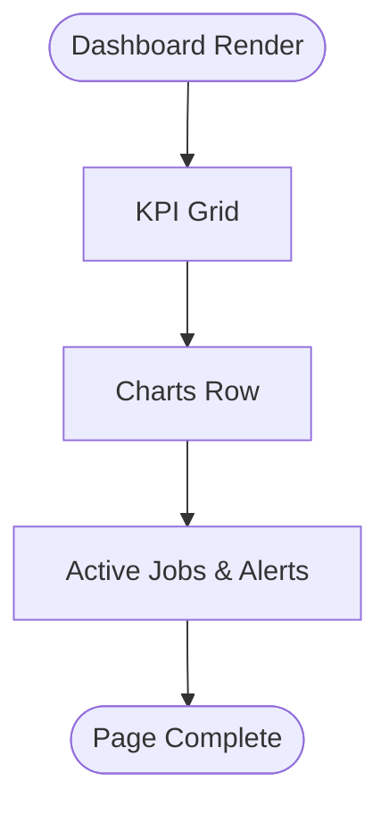
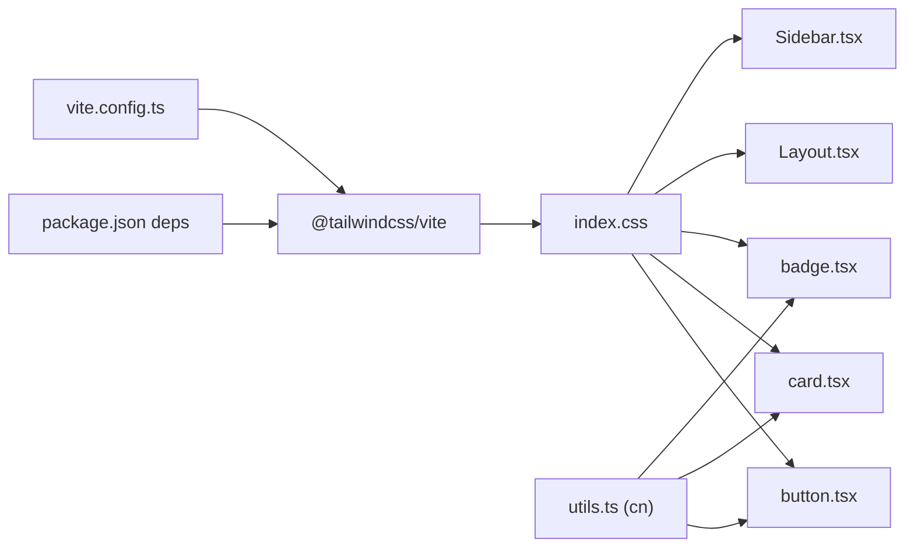

# Styling & Design System

<cite>
**Referenced Files in This Document**
- [vite.config.ts](file://app/vite.config.ts)
- [index.css](file://app/src/index.css)
- [package.json](file://app/package.json)
- [utils.ts](file://app/src/lib/utils.ts)
- [button.tsx](file://app/src/components/ui/button.tsx)
- [card.tsx](file://app/src/components/ui/card.tsx)
- [badge.tsx](file://app/src/components/ui/badge.tsx)
- [Layout.tsx](file://app/src/components/layout/Layout.tsx)
- [Sidebar.tsx](file://app/src/components/layout/Sidebar.tsx)
- [Dashboard.tsx](file://app/src/pages/Dashboard.tsx)
</cite>

## Table of Contents
1. [Introduction](#introduction)
2. [Project Structure](#project-structure)
3. [Core Components](#core-components)
4. [Architecture Overview](#architecture-overview)
5. [Detailed Component Analysis](#detailed-component-analysis)
6. [Dependency Analysis](#dependency-analysis)
7. [Performance Considerations](#performance-considerations)
8. [Troubleshooting Guide](#troubleshooting-guide)
9. [Conclusion](#conclusion)
10. [Appendices](#appendices)

## Introduction
This document explains the styling system and design patterns used across the application. It covers Tailwind CSS v4 configuration, custom design tokens (color palette, typography, spacing), responsive design approach, global styles organization, integration with Radix UI components, accessibility considerations, build-time CSS processing in Vite, and guidelines for consistent visual design.

## Project Structure
The styling system is centered around:
- A single global stylesheet that imports Tailwind and defines theme tokens and base styles.
- Reusable UI components built with Tailwind utility classes and component variants.
- Layout components that compose pages using shared tokens and spacing.
- Vite configuration enabling Tailwind CSS v4 plugin and path aliases.

**Diagram sources**
- [vite.config.ts:1-17](file://app/vite.config.ts#L1-L17)
- [index.css:1-87](file://app/src/index.css#L1-L87)
- [button.tsx:1-45](file://app/src/components/ui/button.tsx#L1-L45)
- [card.tsx:1-47](file://app/src/components/ui/card.tsx#L1-L47)
- [badge.tsx:1-33](file://app/src/components/ui/badge.tsx#L1-L33)
- [Layout.tsx:1-77](file://app/src/components/layout/Layout.tsx#L1-L77)
- [Sidebar.tsx:1-97](file://app/src/components/layout/Sidebar.tsx#L1-L97)

**Section sources**
- [vite.config.ts:1-17](file://app/vite.config.ts#L1-L17)
- [index.css:1-87](file://app/src/index.css#L1-L87)
- [package.json:18-41](file://app/package.json#L18-L41)

## Core Components
The UI layer provides a small set of composable primitives that enforce consistency:
- Button: variant and size system with focus states and disabled handling.
- Card: container with header/title/description/content/footer sections.
- Badge: semantic status indicators with multiple color variants.

These components rely on:
- Shared class merging utility to combine variants and user overrides safely.
- Tailwind utilities for layout, spacing, colors, and transitions.
- Optional Radix Slot for button composition when needed.

Key implementation references:
- Class merging utility: [utils.ts:1-6](file://app/src/lib/utils.ts#L1-L6)
- Button variants and props: [button.tsx:6-44](file://app/src/components/ui/button.tsx#L6-L44)
- Card structure and tokens: [card.tsx:4-46](file://app/src/components/ui/card.tsx#L4-L46)
- Badge variants: [badge.tsx:4-32](file://app/src/components/ui/badge.tsx#L4-L32)

**Section sources**
- [utils.ts:1-6](file://app/src/lib/utils.ts#L1-L6)
- [button.tsx:1-45](file://app/src/components/ui/button.tsx#L1-L45)
- [card.tsx:1-47](file://app/src/components/ui/card.tsx#L1-L47)
- [badge.tsx:1-33](file://app/src/components/ui/badge.tsx#L1-L33)

## Architecture Overview
The styling architecture follows a layered approach:
- Build layer: Vite config enables Tailwind CSS v4 plugin and sets up an alias for src.
- Theme layer: index.css defines design tokens via Tailwind’s @theme block and sets base body styles.
- Component layer: UI components use Tailwind utilities and component variants to compose consistent interfaces.
- Layout layer: Layout and Sidebar orchestle page structure using tokens and responsive utilities.

**Diagram sources**
- [vite.config.ts:1-17](file://app/vite.config.ts#L1-L17)
- [index.css:1-87](file://app/src/index.css#L1-L87)

**Section sources**
- [vite.config.ts:1-17](file://app/vite.config.ts#L1-L17)
- [index.css:1-87](file://app/src/index.css#L1-L87)

## Detailed Component Analysis

### Button Component
- Uses a variant-based system for appearance and sizing.
- Provides accessible focus ring and disabled state.
- Supports composition via Radix Slot when needed.

**Diagram sources**
- [button.tsx:6-44](file://app/src/components/ui/button.tsx#L6-L44)

**Section sources**
- [button.tsx:1-45](file://app/src/components/ui/button.tsx#L1-L45)

### Card Component
- Composed of Card, CardHeader, CardTitle, CardDescription, CardContent, CardFooter.
- Applies consistent border, background, shadow, and spacing tokens.

**Diagram sources**
- [card.tsx:4-46](file://app/src/components/ui/card.tsx#L4-L46)

**Section sources**
- [card.tsx:1-47](file://app/src/components/ui/card.tsx#L1-L47)

### Badge Component
- Semantic status indicator with multiple color variants.
- Consistent rounded shape and compact padding.

**Diagram sources**
- [badge.tsx:4-32](file://app/src/components/ui/badge.tsx#L4-L32)

**Section sources**
- [badge.tsx:1-33](file://app/src/components/ui/badge.tsx#L1-L33)

### Layout and Sidebar
- Layout composes a top bar and main content area, using tokens for backgrounds, borders, and typography.
- Sidebar provides navigation with active states, collapsible behavior, and responsive toggles.

**Diagram sources**
- [Layout.tsx:15-76](file://app/src/components/layout/Layout.tsx#L15-L76)
- [Sidebar.tsx:26-96](file://app/src/components/layout/Sidebar.tsx#L26-L96)

**Section sources**
- [Layout.tsx:1-77](file://app/src/components/layout/Layout.tsx#L1-L77)
- [Sidebar.tsx:1-97](file://app/src/components/layout/Sidebar.tsx#L1-L97)

### Page Example: Dashboard
- Demonstrates responsive grids, token usage, and chart integration.
- Shows how cards, badges, and typography tokens are applied consistently.

**Diagram sources**
- [Dashboard.tsx:19-258](file://app/src/pages/Dashboard.tsx#L19-L258)

**Section sources**
- [Dashboard.tsx:1-259](file://app/src/pages/Dashboard.tsx#L1-L259)

## Dependency Analysis
Styling dependencies flow from build configuration to global tokens to components:

**Diagram sources**
- [package.json:18-41](file://app/package.json#L18-L41)
- [vite.config.ts:1-17](file://app/vite.config.ts#L1-L17)
- [index.css:1-87](file://app/src/index.css#L1-L87)
- [utils.ts:1-6](file://app/src/lib/utils.ts#L1-L6)
- [button.tsx:1-45](file://app/src/components/ui/button.tsx#L1-L45)
- [card.tsx:1-47](file://app/src/components/ui/card.tsx#L1-L47)
- [badge.tsx:1-33](file://app/src/components/ui/badge.tsx#L1-L33)
- [Layout.tsx:1-77](file://app/src/components/layout/Layout.tsx#L1-L77)
- [Sidebar.tsx:1-97](file://app/src/components/layout/Sidebar.tsx#L1-L97)

**Section sources**
- [package.json:18-41](file://app/package.json#L18-L41)
- [vite.config.ts:1-17](file://app/vite.config.ts#L1-L17)
- [index.css:1-87](file://app/src/index.css#L1-L87)
- [utils.ts:1-6](file://app/src/lib/utils.ts#L1-L6)

## Performance Considerations
- Tailwind CSS v4 processes only what is used; keep utility classes concise to minimize generated CSS.
- Use component variants to avoid duplicating styles across components.
- Prefer semantic tokens over ad-hoc values to reduce style sprawl.
- Animations are defined once and reused via utility classes; ensure they respect reduced motion preferences.

[No sources needed since this section provides general guidance]

## Troubleshooting Guide
Common issues and resolutions:
- Token not recognized: Ensure tokens are defined in the @theme block and imported via Tailwind. Verify the import order in the global stylesheet.
- Variant not applying: Check variant names and default variants in component definitions. Confirm class merging utility is used to combine variants with className overrides.
- Focus ring missing: Ensure focus-visible utilities are present and not overridden by global resets or third-party styles.
- Reduced motion not respected: Confirm media query for prefers-reduced-motion is included and not overridden.

Where to look:
- Theme tokens and base styles: [index.css:3-36](file://app/src/index.css#L3-L36)
- Animation and reduced motion: [index.css:38-70](file://app/src/index.css#L38-L70)
- Button focus and disabled states: [button.tsx:6-29](file://app/src/components/ui/button.tsx#L6-L29)
- Class merging utility: [utils.ts:1-6](file://app/src/lib/utils.ts#L1-L6)

**Section sources**
- [index.css:3-70](file://app/src/index.css#L3-L70)
- [button.tsx:6-29](file://app/src/components/ui/button.tsx#L6-L29)
- [utils.ts:1-6](file://app/src/lib/utils.ts#L1-L6)

## Conclusion
The application uses a cohesive, token-driven styling system powered by Tailwind CSS v4. Global tokens define a consistent color palette, typography, and spacing. UI components encapsulate reusable patterns with variants and accessible defaults. The Vite configuration integrates Tailwind seamlessly, while layout components provide a responsive foundation. Following these guidelines ensures visual consistency, maintainability, and accessibility across the app.

[No sources needed since this section summarizes without analyzing specific files]

## Appendices

### Tailwind CSS v4 Configuration and Custom Design Tokens
- Import and theme setup: [index.css:1-28](file://app/src/index.css#L1-L28)
- Base body styles and font smoothing: [index.css:30-36](file://app/src/index.css#L30-L36)
- Animations and reduced motion: [index.css:38-70](file://app/src/index.css#L38-L70)
- Scrollbar styling: [index.css:72-87](file://app/src/index.css#L72-L87)

**Section sources**
- [index.css:1-87](file://app/src/index.css#L1-L87)

### Responsive Design Approach
- Mobile-first grid layouts and breakpoints are used throughout pages and layouts.
- Examples include responsive grids and conditional visibility for search input and menu toggle.

References:
- Dashboard responsive grid: [Dashboard.tsx:56-85](file://app/src/pages/Dashboard.tsx#L56-L85)
- Layout responsive header and mobile menu: [Layout.tsx:33-67](file://app/src/components/layout/Layout.tsx#L33-L67)

**Section sources**
- [Dashboard.tsx:56-85](file://app/src/pages/Dashboard.tsx#L56-L85)
- [Layout.tsx:33-67](file://app/src/components/layout/Layout.tsx#L33-L67)

### Integration with Radix UI
- Button supports composition via Radix Slot for advanced use cases.
- Additional Radix packages are available for dialogs, menus, select, tabs, tooltips, etc., enabling accessible primitives styled with Tailwind.

References:
- Radix Slot usage in Button: [button.tsx:2-3](file://app/src/components/ui/button.tsx#L2-L3)
- Available Radix packages: [package.json:19-30](file://app/package.json#L19-L30)

**Section sources**
- [button.tsx:2-3](file://app/src/components/ui/button.tsx#L2-L3)
- [package.json:19-30](file://app/package.json#L19-L30)

### Accessibility Considerations in Styling
- Focus states: Buttons define visible focus rings using focus-visible utilities.
- Reduced motion: Global media query disables animations for users who prefer reduced motion.
- Contrast: Colors are chosen from a curated palette; verify contrast ratios when introducing new tokens.
- Screen reader support: Use semantic HTML elements and aria attributes where appropriate; styling should not hide meaningful content.

References:
- Focus ring and disabled states: [button.tsx:6-29](file://app/src/components/ui/button.tsx#L6-L29)
- Reduced motion: [index.css:65-70](file://app/src/index.css#L65-L70)

**Section sources**
- [button.tsx:6-29](file://app/src/components/ui/button.tsx#L6-L29)
- [index.css:65-70](file://app/src/index.css#L65-L70)

### Build Configuration for CSS Processing and Optimization
- Vite plugins: React and Tailwind CSS v4 are enabled.
- Path alias: src directory aliased as @ for cleaner imports.

References:
- Vite config: [vite.config.ts:1-17](file://app/vite.config.ts#L1-L17)

**Section sources**
- [vite.config.ts:1-17](file://app/vite.config.ts#L1-L17)

### Guidelines for Consistent Visual Design
- Use tokens from @theme for all colors, fonts, and spacing.
- Prefer component variants over inline styles to maintain consistency.
- Apply responsive utilities for layout and visibility changes.
- Keep animations subtle and respectful of user preferences.
- Maintain accessible focus states and sufficient contrast.

[No sources needed since this section provides general guidance]