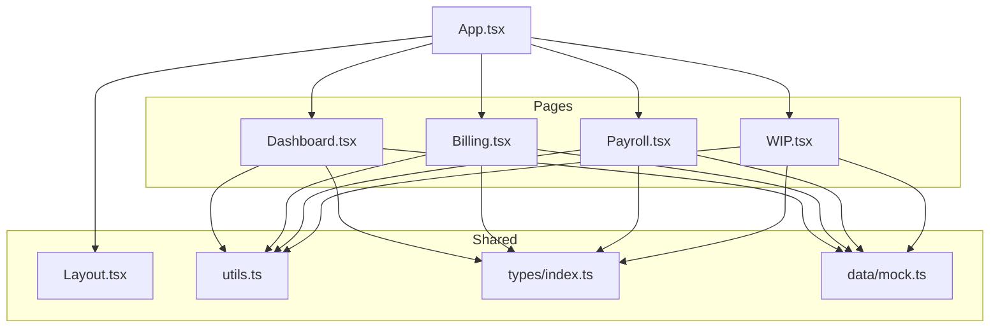
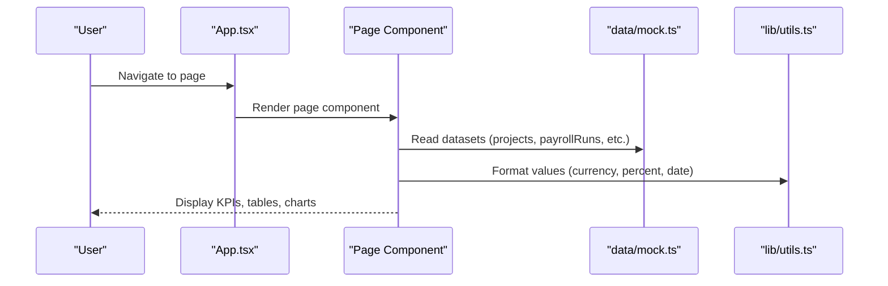
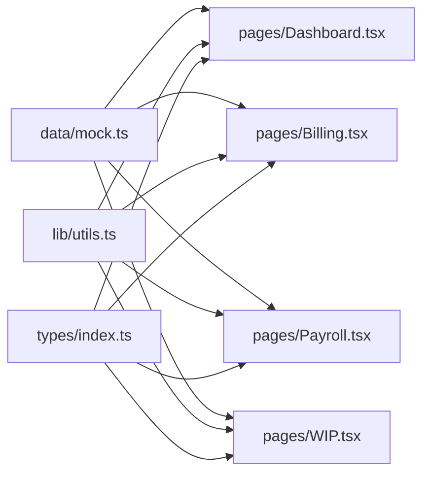

# Testing Strategy

<cite>
**Referenced Files in This Document**
- [mock.ts](file://app/src/data/mock.ts)
- [index.ts](file://app/src/types/index.ts)
- [utils.ts](file://app/src/lib/utils.ts)
- [App.tsx](file://app/src/App.tsx)
- [Layout.tsx](file://app/src/components/layout/Layout.tsx)
- [Dashboard.tsx](file://app/src/pages/Dashboard.tsx)
- [Billing.tsx](file://app/src/pages/Billing.tsx)
- [Payroll.tsx](file://app/src/pages/Payroll.tsx)
- [WIP.tsx](file://app/src/pages/WIP.tsx)
- [package.json](file://app/package.json)
</cite>

## Table of Contents
1. [Introduction](#introduction)
2. [Project Structure](#project-structure)
3. [Core Components](#core-components)
4. [Architecture Overview](#architecture-overview)
5. [Detailed Component Analysis](#detailed-component-analysis)
6. [Dependency Analysis](#dependency-analysis)
7. [Performance Considerations](#performance-considerations)
8. [Troubleshooting Guide](#troubleshooting-guide)
9. [Conclusion](#conclusion)
10. [Appendices](#appendices)

## Introduction
This document defines the testing strategy for the AWS MakerBay Construction Subcontractor App. It covers unit, component, and integration testing approaches; how to use the mock data layer for realistic scenarios; patterns for testing React components with modern libraries; TypeScript type safety checks; business logic tests for payroll calculations, AIA billing formulas, and WIP computations; utilities for test setup; and performance/load testing guidance for large datasets.

## Project Structure
The application is a React + TypeScript app built with Vite. Pages render construction-specific features (Dashboard, Billing, Payroll, WIP) using shared UI components and utility formatters. The mock data layer provides rich, domain-specific datasets that drive both UI and business logic tests.

**Diagram sources**
- [App.tsx:27-62](file://app/src/App.tsx#L27-L62)
- [Dashboard.tsx:1-259](file://app/src/pages/Dashboard.tsx#L1-L259)
- [Billing.tsx:1-163](file://app/src/pages/Billing.tsx#L1-L163)
- [Payroll.tsx:1-210](file://app/src/pages/Payroll.tsx#L1-L210)
- [WIP.tsx:1-188](file://app/src/pages/WIP.tsx#L1-L188)
- [Layout.tsx:1-77](file://app/src/components/layout/Layout.tsx#L1-L77)
- [utils.ts:1-45](file://app/src/lib/utils.ts#L1-L45)
- [index.ts:1-255](file://app/src/types/index.ts#L1-L255)
- [mock.ts:1-246](file://app/src/data/mock.ts#L1-L246)

**Section sources**
- [App.tsx:27-62](file://app/src/App.tsx#L27-L62)
- [package.json:1-44](file://app/package.json#L1-L44)

## Core Components
- Mock Data Layer: Centralized, strongly typed datasets for projects, employees, time entries, payroll runs, pay applications, change orders, WIP entities, GL accounts, invoices, bills, and vendors. These enable deterministic tests across all pages.
- Types: Strict TypeScript interfaces define contracts for all domain entities and enums for statuses, ensuring compile-time safety and consistent test assertions.
- Utilities: Formatting helpers for currency, percentages, dates, and numbers used throughout pages and tests.
- Pages: Feature-rich components that compute KPIs, render charts, and display tables driven by mock data.

Testing implications:
- Use mock data to simulate real-world edge cases (e.g., overtime hours, draft vs completed payroll runs, over/under billing).
- Assert against types to catch regressions early via TypeScript compilation.
- Isolate pure formatting and calculation logic in unit tests; mount components only when necessary.

**Section sources**
- [mock.ts:1-246](file://app/src/data/mock.ts#L1-L246)
- [index.ts:1-255](file://app/src/types/index.ts#L1-L255)
- [utils.ts:1-45](file://app/src/lib/utils.ts#L1-L45)

## Architecture Overview
The app routes to page components through a central App component. Each page consumes mock data and utilities to compute summaries and render visualizations. Tests should validate:
- Unit: Pure functions (formatting, business rules)
- Component: Rendering, user interactions, state changes within pages
- Integration: Cross-page flows and data consistency across mock datasets

**Diagram sources**
- [App.tsx:27-62](file://app/src/App.tsx#L27-L62)
- [Dashboard.tsx:1-259](file://app/src/pages/Dashboard.tsx#L1-L259)
- [Billing.tsx:1-163](file://app/src/pages/Billing.tsx#L1-L163)
- [Payroll.tsx:1-210](file://app/src/pages/Payroll.tsx#L1-L210)
- [WIP.tsx:1-188](file://app/src/pages/WIP.tsx#L1-L188)
- [utils.ts:1-45](file://app/src/lib/utils.ts#L1-L45)
- [mock.ts:1-246](file://app/src/data/mock.ts#L1-L246)

## Detailed Component Analysis

### Dashboard Testing
Focus areas:
- KPI computation from active projects, WIP, invoices, and time entries
- Chart rendering with correct aggregated data
- Alerts based on thresholds (pending approvals, overdue invoices, under-billing)

Test patterns:
- Unit: Verify aggregation logic for totals and counts derived from mock datasets.
- Component: Render and assert KPI cards, chart series, and alert visibility conditions.
- Edge cases: Empty datasets, zero values, negative margins, mixed statuses.

**Section sources**
- [Dashboard.tsx:1-259](file://app/src/pages/Dashboard.tsx#L1-L259)
- [mock.ts:1-246](file://app/src/data/mock.ts#L1-L246)
- [utils.ts:1-45](file://app/src/lib/utils.ts#L1-L45)

### Billing (AIA G702/G703) Testing
Focus areas:
- Summary metrics: total applications, billed amounts, retainage held, awaiting approval
- Schedule of Values table: line items, previous completed, this period, stored materials, percent complete
- Status-driven actions: submit, export, preview

Test patterns:
- Unit: Validate computed totals (currentPaymentDue, totalEarned, totalRetainage) from pay applications.
- Component: Expand/collapse behavior, status badges, table rows, and action buttons.
- Edge cases: Draft vs submitted vs paid statuses; zero or missing fields; large SOV lists.

**Section sources**
- [Billing.tsx:1-163](file://app/src/pages/Billing.tsx#L1-L163)
- [mock.ts:1-246](file://app/src/data/mock.ts#L1-L246)
- [utils.ts:1-45](file://app/src/lib/utils.ts#L1-L45)

### Payroll Testing
Focus areas:
- Summary metrics: total gross/net for completed runs, certified run count, active employees
- Run expansion: employee entries, regular/overtime hours, taxes, fringes, net pay
- Actions: run payroll, export, WH-347 report availability

Test patterns:
- Unit: Aggregate totals and counts from payrollRuns and employees; verify filtering by status and certification flags.
- Component: Expandable rows, badge states, formatted currency and dates.
- Edge cases: Draft periods with no entries; overtime variations; multiple classifications.

**Section sources**
- [Payroll.tsx:1-210](file://app/src/pages/Payroll.tsx#L1-L210)
- [mock.ts:1-246](file://app/src/data/mock.ts#L1-L246)
- [utils.ts:1-45](file://app/src/lib/utils.ts#L1-L45)

### WIP Testing
Focus areas:
- KPIs: total contract value, costs, billed, over/under billing, gross profit
- Charts: earned vs billed vs costs; gross margin by job
- Table: per-job metrics including percent complete, profit fade, gross margin color coding

Test patterns:
- Unit: Compute totals and derived metrics from wipData; ensure correct sign handling for over/under billing.
- Component: Chart rendering, progress bars, conditional colors based on thresholds.
- Edge cases: Negative margins, zero completed, high overbilling, varying percentComplete.

**Section sources**
- [WIP.tsx:1-188](file://app/src/pages/WIP.tsx#L1-L188)
- [mock.ts:1-246](file://app/src/data/mock.ts#L1-L246)
- [utils.ts:1-45](file://app/src/lib/utils.ts#L1-L45)

### Layout and Navigation Testing
Focus areas:
- Sidebar toggle behavior
- Header search input and notification indicator
- Route-based title/subtitle rendering

Test patterns:
- Component: Interactions (toggle sidebar), props propagation (currentPage, title, subtitle), and responsive behaviors.
- Integration: Ensure App routing renders correct page content based on navigation.

**Section sources**
- [Layout.tsx:1-77](file://app/src/components/layout/Layout.tsx#L1-L77)
- [App.tsx:27-62](file://app/src/App.tsx#L27-L62)

## Dependency Analysis
Key dependencies and relationships relevant to testing:
- Pages depend on mock data for deterministic outputs.
- Pages depend on utils for formatting; these are pure functions ideal for unit tests.
- Types enforce structure; any mismatch will be caught at compile time.

**Diagram sources**
- [mock.ts:1-246](file://app/src/data/mock.ts#L1-L246)
- [utils.ts:1-45](file://app/src/lib/utils.ts#L1-L45)
- [index.ts:1-255](file://app/src/types/index.ts#L1-L255)
- [Dashboard.tsx:1-259](file://app/src/pages/Dashboard.tsx#L1-L259)
- [Billing.tsx:1-163](file://app/src/pages/Billing.tsx#L1-L163)
- [Payroll.tsx:1-210](file://app/src/pages/Payroll.tsx#L1-L210)
- [WIP.tsx:1-188](file://app/src/pages/WIP.tsx#L1-L188)

**Section sources**
- [mock.ts:1-246](file://app/src/data/mock.ts#L1-L246)
- [utils.ts:1-45](file://app/src/lib/utils.ts#L1-L45)
- [index.ts:1-255](file://app/src/types/index.ts#L1-L255)

## Performance Considerations
Guidelines for performance and load testing:
- Prefer unit tests for pure functions (formatting, aggregations) to keep suites fast.
- For component tests, minimize re-renders and avoid heavy chart mounts unless necessary; consider snapshot tests sparingly and prefer behavioral assertions.
- When testing large datasets (e.g., many payroll entries or SOV lines), chunk tests and isolate expensive operations.
- Use mocking strategies to limit network calls if APIs are integrated later; currently, mock data is local and fast.
- Measure test execution times and optimize slow tests by reducing DOM interactions or splitting into smaller units.

[No sources needed since this section provides general guidance]

## Troubleshooting Guide
Common issues and resolutions:
- Type mismatches: If tests fail due to type errors, update mocks or assertions to match current interfaces.
- Formatting differences: Ensure locale settings remain consistent; tests rely on Intl formatters for currency and percentages.
- Stateful components: For expand/collapse behaviors, explicitly trigger events and assert state changes rather than relying on snapshots.
- Chart rendering: If charts do not render in tests, ensure required container dimensions and dependencies are available in the test environment.

**Section sources**
- [utils.ts:1-45](file://app/src/lib/utils.ts#L1-L45)
- [Dashboard.tsx:1-259](file://app/src/pages/Dashboard.tsx#L1-L259)
- [Billing.tsx:1-163](file://app/src/pages/Billing.tsx#L1-L163)
- [Payroll.tsx:1-210](file://app/src/pages/Payroll.tsx#L1-L210)
- [WIP.tsx:1-188](file://app/src/pages/WIP.tsx#L1-L188)

## Conclusion
Adopt a layered testing approach:
- Unit tests for pure functions and business rules
- Component tests for user interactions and rendering
- Integration tests for cross-page flows and data consistency
Use the mock data layer extensively to cover realistic scenarios and edge cases. Leverage TypeScript interfaces to maintain type safety and reduce runtime errors. Keep tests fast, focused, and maintainable by isolating logic and minimizing heavy dependencies.

[No sources needed since this section summarizes without analyzing specific files]

## Appendices

### Using the Mock Data Layer for Testing Scenarios
- Projects: Filter by status, calculate totals, simulate different completion levels.
- Employees: Test payroll calculations with varied hourly rates, burden rates, and classifications.
- Time Entries: Simulate pending/approved/rejected states; test overtime impacts.
- Payroll Runs: Validate totals for completed runs; handle draft runs with no entries.
- Pay Applications: Test AIA billing formulas (totalCompletedStored, totalRetainage, totalEarned, lessPreviousApps, currentPaymentDue).
- Change Orders: Test status transitions and amount aggregations.
- WIP Entities: Validate over/under billing, profit fade, gross profit, and margin thresholds.
- GL Accounts, Invoices, Bills, Vendors: Test financial summaries and aging reports.

**Section sources**
- [mock.ts:1-246](file://app/src/data/mock.ts#L1-L246)

### Testing Patterns for React Components
- Setup: Mount components with minimal providers; pass mock data via props or context where applicable.
- Assertions: Check rendered text, presence/absence of elements, and interactive states (expanded/collapsed).
- Events: Simulate clicks and inputs; verify side effects like state updates or navigation callbacks.
- Utilities: Import and test formatting helpers independently; ensure consistent output across locales.

**Section sources**
- [Dashboard.tsx:1-259](file://app/src/pages/Dashboard.tsx#L1-L259)
- [Billing.tsx:1-163](file://app/src/pages/Billing.tsx#L1-L163)
- [Payroll.tsx:1-210](file://app/src/pages/Payroll.tsx#L1-L210)
- [WIP.tsx:1-188](file://app/src/pages/WIP.tsx#L1-L188)
- [utils.ts:1-45](file://app/src/lib/utils.ts#L1-L45)

### Testing TypeScript Interfaces and Type Safety
- Compile-time checks: Ensure all mock data conforms to interfaces; any structural changes will surface as type errors.
- Narrowing: Use discriminated unions and literal types for statuses; write tests that cover each branch.
- Contracts: Treat interfaces as contracts; update tests whenever types evolve to prevent drift.

**Section sources**
- [index.ts:1-255](file://app/src/types/index.ts#L1-L255)

### Business Logic Examples
- Payroll Calculations: Validate gross pay, taxes, fringes, and net pay based on regular and overtime hours; ensure classification impacts rates.
- AIA Billing Formulas: Confirm schedule of values rollups and payment due calculations; test retainage deductions and earned revenue.
- WIP Computations: Verify over/under billing, profit fade, and gross margin; ensure thresholds trigger appropriate UI indicators.

**Section sources**
- [Payroll.tsx:1-210](file://app/src/pages/Payroll.tsx#L1-L210)
- [Billing.tsx:1-163](file://app/src/pages/Billing.tsx#L1-L163)
- [WIP.tsx:1-188](file://app/src/pages/WIP.tsx#L1-L188)
- [mock.ts:1-246](file://app/src/data/mock.ts#L1-L246)

### Test Environment Utilities
- Formatting Helpers: Use formatCurrency, formatPercent, formatDate, formatNumber consistently in tests to match production output.
- Class Name Utilities: Use cn for conditional styling assertions if needed.
- Mock Consistency: Pin mock datasets to known states; avoid randomization to ensure deterministic tests.

**Section sources**
- [utils.ts:1-45](file://app/src/lib/utils.ts#L1-L45)

### Organizing Test Suites
- Group tests by feature (Dashboard, Billing, Payroll, WIP) and by concern (unit, component, integration).
- Co-locate tests near source files or organize in dedicated folders mirroring src structure.
- Maintain clear naming conventions and descriptive test titles to improve readability and maintenance.

[No sources needed since this section provides general guidance]

### Performance and Load Testing Strategies
- Unit-first approach: Keep suites fast by focusing on pure functions and isolated components.
- Large datasets: Chunk tests, avoid mounting heavy charts repeatedly, and measure performance impact.
- Load simulation: If integrating APIs later, add load tests to validate response times and memory usage under stress.

[No sources needed since this section provides general guidance]