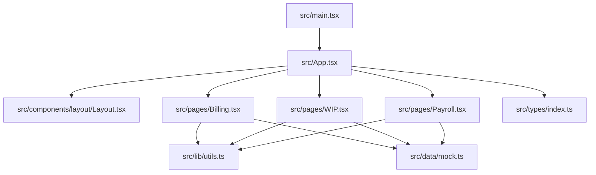
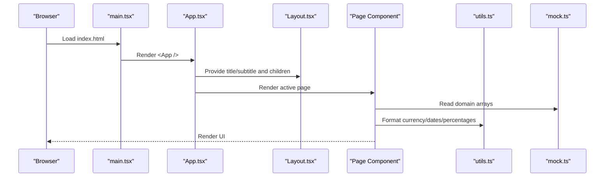
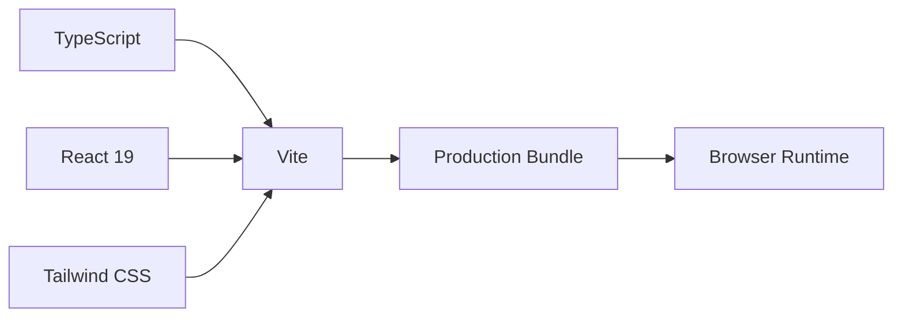

# Troubleshooting & FAQ

<cite>
**Referenced Files in This Document**
- [package.json](file://app/package.json)
- [tsconfig.json](file://app/tsconfig.json)
- [vite.config.ts](file://app/vite.config.ts)
- [main.tsx](file://app/src/main.tsx)
- [App.tsx](file://app/src/App.tsx)
- [Layout.tsx](file://app/src/components/layout/Layout.tsx)
- [Billing.tsx](file://app/src/pages/Billing.tsx)
- [WIP.tsx](file://app/src/pages/WIP.tsx)
- [Payroll.tsx](file://app/src/pages/Payroll.tsx)
- [utils.ts](file://app/src/lib/utils.ts)
- [mock.ts](file://app/src/data/mock.ts)
- [index.ts](file://app/src/types/index.ts)
- [BuildBooks-Product-Spec-Sheet.md](file://BuildBooks-Product-Spec-Sheet.md)
- [Reusable AI-App Technology and Design Stack Playbook.md](file://Reusable AI-App Technology and Design Stack Playbook.md)
</cite>

## Table of Contents
1. Introduction
2. Project Structure
3. Core Components
4. Architecture Overview
5. Detailed Component Analysis
6. Dependency Analysis
7. Performance Considerations
8. Troubleshooting Guide
9. Conclusion
10. Appendices

## Introduction
This document provides comprehensive troubleshooting and FAQs for the AWS MakerBay Construction Subcontractor App. It focuses on common issues during development, deployment, and production usage; debugging techniques for React components and TypeScript; build tooling problems; performance optimization for large datasets and complex calculations; configuration pitfalls; diagnostics; construction-specific FAQs (AIA billing, payroll, WIP); error messages and resolutions; browser compatibility; and performance monitoring.

## Project Structure
The application is a React 19 + TypeScript single-page app built with Vite and styled with Tailwind CSS. The entry point mounts the root component under StrictMode. Routing and navigation are managed locally via state rather than a full router library. Pages implement domain features such as AIA Billing, WIP reporting, and Payroll using shared UI primitives and utility formatters.

**Diagram sources**
- [main.tsx:1-11](file://app/src/main.tsx#L1-L11)
- [App.tsx:1-78](file://app/src/App.tsx#L1-L78)
- [Layout.tsx:1-77](file://app/src/components/layout/Layout.tsx#L1-L77)
- [Billing.tsx:1-163](file://app/src/pages/Billing.tsx#L1-L163)
- [WIP.tsx:1-188](file://app/src/pages/WIP.tsx#L1-L188)
- [Payroll.tsx:1-210](file://app/src/pages/Payroll.tsx#L1-L210)
- [utils.ts:1-45](file://app/src/lib/utils.ts#L1-L45)
- [mock.ts:1-246](file://app/src/data/mock.ts#L1-L246)
- [index.ts:1-255](file://app/src/types/index.ts#L1-L255)

**Section sources**
- [main.tsx:1-11](file://app/src/main.tsx#L1-L11)
- [App.tsx:1-78](file://app/src/App.tsx#L1-L78)
- [package.json:1-44](file://app/package.json#L1-L44)
- [vite.config.ts:1-17](file://app/vite.config.ts#L1-L17)
- [tsconfig.json:1-24](file://app/tsconfig.json#L1-L24)

## Core Components
- Root and routing: The root component renders a Layout wrapper and switches between pages based on local state. Navigation updates scroll position and selected project context.
- Layout: Provides sidebar, header, search bar, notifications, and user avatar area. Sidebar collapse toggles content margin.
- Domain pages:
  - Billing: Displays AIA G702/G703 pay applications, summary metrics, schedule of values table, and actions like submit/export/preview.
  - WIP: Aggregates totals, renders Recharts bar charts, and shows a bonding-ready WIP schedule table with profit fade and gross margin indicators.
  - Payroll: Summarizes payroll runs, expands entries per run, and lists employees with classifications and prevailing wage tags.

Key data and utilities:
- Types define domain models for projects, time entries, employees, payroll runs, pay applications, WIP entities, GL accounts, invoices, bills, vendors, and page routes.
- Utilities provide class name merging and formatting helpers for currency, percentages, dates, and numbers.
- Mock data supplies realistic construction accounting datasets used by pages.

**Section sources**
- [App.tsx:15-78](file://app/src/App.tsx#L15-L78)
- [Layout.tsx:15-77](file://app/src/components/layout/Layout.tsx#L15-L77)
- [Billing.tsx:17-163](file://app/src/pages/Billing.tsx#L17-L163)
- [WIP.tsx:12-188](file://app/src/pages/WIP.tsx#L12-L188)
- [Payroll.tsx:9-210](file://app/src/pages/Payroll.tsx#L9-L210)
- [index.ts:1-255](file://app/src/types/index.ts#L1-L255)
- [utils.ts:4-45](file://app/src/lib/utils.ts#L4-L45)
- [mock.ts:6-246](file://app/src/data/mock.ts#L6-L246)

## Architecture Overview
The app follows a simple client-side architecture:
- Entry point mounts React under StrictMode.
- App manages current page and optional project context.
- Layout composes chrome around page content.
- Pages consume typed models and mock data, render tables/charts, and expose actions.
- Utilities centralize formatting and class merging.

**Diagram sources**
- [main.tsx:1-11](file://app/src/main.tsx#L1-L11)
- [App.tsx:27-78](file://app/src/App.tsx#L27-L78)
- [Layout.tsx:15-77](file://app/src/components/layout/Layout.tsx#L15-L77)
- [Billing.tsx:17-163](file://app/src/pages/Billing.tsx#L17-L163)
- [WIP.tsx:12-188](file://app/src/pages/WIP.tsx#L12-L188)
- [Payroll.tsx:9-210](file://app/src/pages/Payroll.tsx#L9-L210)
- [utils.ts:4-45](file://app/src/lib/utils.ts#L4-L45)
- [mock.ts:6-246](file://app/src/data/mock.ts#L6-L246)

## Detailed Component Analysis

### Billing Page
- Displays summary KPIs derived from pay applications array.
- Renders expandable cards with schedule of values tables.
- Uses status badges and action buttons to simulate workflow states.

Common issues and fixes:
- Incorrect totals or missing values: Ensure mock data includes required fields and that reduce operations handle empty arrays safely.
- Formatting inconsistencies: Use centralized formatting functions for currency and percentages.
- Accessibility: Ensure interactive elements have labels and keyboard support.

Performance tips:
- Memoize expensive computations when dataset grows.
- Virtualize long tables if needed.

**Section sources**
- [Billing.tsx:17-163](file://app/src/pages/Billing.tsx#L17-L163)
- [utils.ts:8-45](file://app/src/lib/utils.ts#L8-L45)
- [mock.ts:147-182](file://app/src/data/mock.ts#L147-L182)

### WIP Page
- Computes totals across jobs and builds chart datasets.
- Shows earned vs billed vs costs and gross margin charts.
- Presents a bonding-ready WIP schedule table with progress bars and color-coded margins.

Common issues and fixes:
- Chart rendering errors: Verify data keys match chart configuration and numeric types.
- Totals mismatch: Confirm aggregation logic matches table footers.
- Large datasets: Consider memoization and virtualized lists.

**Section sources**
- [WIP.tsx:12-188](file://app/src/pages/WIP.tsx#L12-L188)
- [mock.ts:193-199](file://app/src/data/mock.ts#L193-L199)
- [utils.ts:8-45](file://app/src/lib/utils.ts#L8-L45)

### Payroll Page
- Summarizes completed payroll runs and highlights draft periods.
- Expands entries per run and displays employee details with classifications and prevailing wage tags.

Common issues and fixes:
- Missing entries: Validate payroll run structure and ensure entries array exists before rendering.
- Certification flags: Ensure isCertified is set correctly for WH-347 export visibility.
- Date formatting: Use consistent date formatter for period ranges.

**Section sources**
- [Payroll.tsx:9-210](file://app/src/pages/Payroll.tsx#L9-L210)
- [mock.ts:118-145](file://app/src/data/mock.ts#L118-L145)
- [utils.ts:34-45](file://app/src/lib/utils.ts#L34-L45)

### Layout and Navigation
- Manages sidebar collapse and responsive header.
- Provides search input and notification indicator.

Common issues and fixes:
- Sidebar overlap: Ensure margin transitions align with collapsed width.
- Mobile menu: Test hamburger toggle behavior and focus management.

**Section sources**
- [Layout.tsx:15-77](file://app/src/components/layout/Layout.tsx#L15-L77)

## Dependency Analysis
- Build and dev dependencies include React 19, TypeScript, Vite, Tailwind CSS, Radix UI primitives, Recharts, Sonner, and Wouter.
- Path alias "@" maps to src for cleaner imports.
- TypeScript config enforces strict mode, JSX transform, and module resolution suitable for bundler environments.

**Diagram sources**
- [package.json:11-42](file://app/package.json#L11-L42)
- [vite.config.ts:1-17](file://app/vite.config.ts#L1-L17)
- [tsconfig.json:1-24](file://app/tsconfig.json#L1-L24)

**Section sources**
- [package.json:1-44](file://app/package.json#L1-L44)
- [vite.config.ts:1-17](file://app/vite.config.ts#L1-L17)
- [tsconfig.json:1-24](file://app/tsconfig.json#L1-L24)

## Performance Considerations
- Large datasets: For extensive pay applications, WIP schedules, or payroll entries, consider:
  - Memoizing computed totals and chart datasets with useMemo.
  - Virtualizing tables to avoid rendering all rows at once.
  - Debouncing search/filter inputs.
- Charts: Recharts can be heavy with many series; limit visible data points and use efficient tick formatters.
- Formatting: Centralize formatting to avoid repeated Intl calls in tight loops; precompute where possible.
- Rendering: Avoid unnecessary re-renders by keeping state minimal and lifting only what’s necessary.

[No sources needed since this section provides general guidance]

## Troubleshooting Guide

### Development Setup Issues
- Node version mismatch: Ensure Node supports ES modules and modern syntax aligned with package scripts.
- Missing dependencies: Run install to populate node_modules before dev/build.
- Port conflicts: If dev server fails to start, change port or kill conflicting processes.

Resolution steps:
- Verify Node version compatibility with React 19 and Vite.
- Clean install dependencies and rebuild.
- Check terminal output for port binding errors and adjust accordingly.

**Section sources**
- [package.json:6-16](file://app/package.json#L6-L16)

### TypeScript Compilation Errors
- Strict mode enabled: Review type mismatches, unused variables, and unsafe casts.
- Module resolution: Ensure path aliases resolve correctly and imports use correct extensions.
- JSX transform: Confirm React 19 compatibility with configured JSX transform.

Resolution steps:
- Fix type errors reported by the compiler.
- Align import paths with tsconfig paths.
- Update any deprecated APIs or types.

**Section sources**
- [tsconfig.json:1-24](file://app/tsconfig.json#L1-L24)

### Build Tooling Issues (Vite)
- Plugin order: React and Tailwind plugins must be present and compatible.
- Alias configuration: Ensure "@" alias resolves to src directory.
- Build script: TypeScript check runs before Vite build; fix TS errors first.

Resolution steps:
- Validate plugin versions and compatibility.
- Confirm alias mapping in vite config.
- Run type check separately to isolate TS errors prior to bundling.

**Section sources**
- [vite.config.ts:1-17](file://app/vite.config.ts#L1-L17)
- [package.json:6-16](file://app/package.json#L6-L16)

### React Component Debugging
- State not updating: Verify event handlers update state immutably and trigger re-renders.
- Conditional rendering: Guard against undefined data before accessing properties.
- Accessibility: Add aria attributes and keyboard support for custom controls.

Resolution steps:
- Use React DevTools to inspect state and props.
- Add console logs sparingly to trace flows.
- Ensure components handle loading, empty, and error states gracefully.

**Section sources**
- [App.tsx:27-78](file://app/src/App.tsx#L27-L78)
- [Layout.tsx:15-77](file://app/src/components/layout/Layout.tsx#L15-L77)

### AIA Billing Calculations
- Schedule of values totals: Ensure line items sum correctly to total completed and earned amounts.
- Retainage: Apply retainage percentage consistently across applications.
- Previous applications: Subtract previous billed amounts accurately to compute current payment due.

Resolution steps:
- Cross-check SOV line item math with totals.
- Validate retainage calculation against contract terms.
- Audit previous application references for correctness.

**Section sources**
- [Billing.tsx:17-163](file://app/src/pages/Billing.tsx#L17-L163)
- [mock.ts:147-182](file://app/src/data/mock.ts#L147-L182)
- [index.ts:129-158](file://app/src/types/index.ts#L129-L158)

### Payroll Processing
- Hours and rates: Validate regular and overtime hours against time entries and classification rates.
- Taxes and fringes: Ensure tax and fringe calculations align with payroll rules and certifications.
- Certified payroll: Mark runs as certified when applicable and generate required reports.

Resolution steps:
- Reconcile payroll entries with time tracking data.
- Verify tax and fringe computations per jurisdiction and classification.
- Generate WH-347-compatible outputs for certified runs.

**Section sources**
- [Payroll.tsx:9-210](file://app/src/pages/Payroll.tsx#L9-L210)
- [mock.ts:118-145](file://app/src/data/mock.ts#L118-L145)
- [index.ts:100-127](file://app/src/types/index.ts#L100-L127)

### WIP Reporting
- Over/under billing: Compute difference between billed and earned revenue accurately.
- Profit fade: Track margin changes over time and highlight trends.
- Bonding-ready format: Ensure table columns match standard WIP expectations.

Resolution steps:
- Validate earned vs billed calculations per job.
- Monitor profit fade indicators and investigate anomalies.
- Export formats should align with surety requirements.

**Section sources**
- [WIP.tsx:12-188](file://app/src/pages/WIP.tsx#L12-L188)
- [mock.ts:193-199](file://app/src/data/mock.ts#L193-L199)
- [index.ts:173-189](file://app/src/types/index.ts#L173-L189)

### Configuration Problems
- Environment setup: Ensure environment variables (if any) are loaded and accessible.
- Dependency conflicts: Align React, TypeScript, and Vite versions to avoid runtime issues.
- Build tool issues: Confirm plugins and aliases are correctly configured.

Resolution steps:
- Review package versions and lockfiles for consistency.
- Validate environment variable presence and naming.
- Rebuild after dependency updates and clear caches.

**Section sources**
- [package.json:11-42](file://app/package.json#L11-L42)
- [vite.config.ts:1-17](file://app/vite.config.ts#L1-L17)
- [tsconfig.json:1-24](file://app/tsconfig.json#L1-L24)

### Error Messages and Resolutions
- TypeScript errors: Fix type mismatches, missing properties, and unsafe casts.
- Vite build errors: Resolve plugin incompatibilities and path resolution issues.
- Runtime errors: Guard against undefined data and add error boundaries where appropriate.

Resolution steps:
- Address compiler warnings and errors first.
- Use browser developer tools to locate stack traces.
- Implement graceful fallbacks for missing data.

**Section sources**
- [tsconfig.json:1-24](file://app/tsconfig.json#L1-L24)
- [vite.config.ts:1-17](file://app/vite.config.ts#L1-L17)

### Browser Compatibility and Cross-Platform
- Modern browsers: Target ES2023 features; ensure polyfills if supporting older environments.
- Responsive design: Test layouts on mobile, tablet, and desktop breakpoints.
- Reduced motion: Respect prefers-reduced-motion for animations.

Resolution steps:
- Validate CSS and JS compatibility with target browsers.
- Test responsive behavior across devices.
- Disable animations for users preferring reduced motion.

**Section sources**
- [tsconfig.json:1-24](file://app/tsconfig.json#L1-L24)
- [Reusable AI-App Technology and Design Stack Playbook.md:278-283](file://Reusable AI-App Technology and Design Stack Playbook.md#L278-L283)

### Performance Monitoring and Profiling
- React Profiler: Identify slow components and excessive re-renders.
- Network tab: Inspect asset sizes and load times.
- Memory profiling: Detect leaks and high memory usage in long sessions.

Resolution steps:
- Use React DevTools Profiler to capture render timelines.
- Optimize heavy computations and defer non-critical work.
- Lazy-load charts and large tables when possible.

[No sources needed since this section provides general guidance]

### FAQs: Construction-Specific Features
- AIA billing: How are G702/G703 generated? From schedule of values with retained amounts and previous applications subtracted.
- Payroll: How are prevailing wages handled? By classification and certification flags for compliant reporting.
- WIP: What does profit fade indicate? Declining margins over time requiring investigation and corrective action.

**Section sources**
- [BuildBooks-Product-Spec-Sheet.md:162-194](file://BuildBooks-Product-Spec-Sheet.md#L162-L194)
- [BuildBooks-Product-Spec-Sheet.md:571-599](file://BuildBooks-Product-Spec-Sheet.md#L571-L599)

### Community Resources and Support
- Industry associations: NECA, ASA, MCAA, ABC for networking and education.
- CPA referrals: Partner with construction-focused CPAs for adoption and support.
- Surety agents: Engage bonding companies to promote better financial reporting tools.

**Section sources**
- [BuildBooks-Product-Spec-Sheet.md:400-424](file://BuildBooks-Product-Spec-Sheet.md#L400-L424)

## Conclusion
This troubleshooting guide addresses common development, build, and runtime issues while providing targeted solutions for construction-specific features like AIA billing, payroll processing, and WIP reporting. By following the diagnostic steps, optimizing performance, and leveraging community resources, teams can maintain a reliable and scalable application tailored to subcontractors’ needs.

[No sources needed since this section summarizes without analyzing specific files]

## Appendices

### Appendix A: Quick Reference Commands
- Start development server
- Type check and build
- Preview production build

**Section sources**
- [package.json:6-16](file://app/package.json#L6-L16)

### Appendix B: Key Data Models
- Projects, cost codes, phases, time entries, employees, payroll runs, pay applications, WIP entities, GL accounts, invoices, bills, vendors.

**Section sources**
- [index.ts:1-255](file://app/src/types/index.ts#L1-L255)