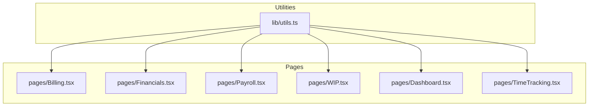
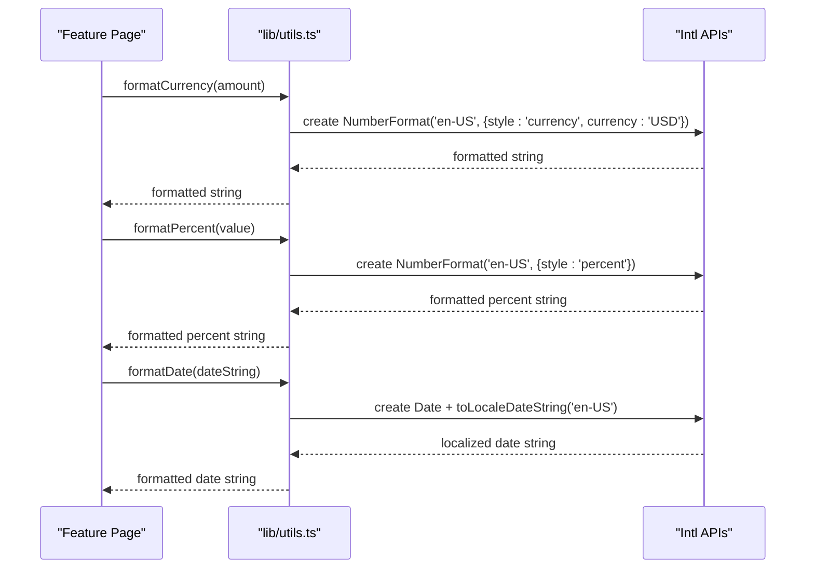

# Utilities & Helpers

<cite>
**Referenced Files in This Document**
- [utils.ts](file://app/src/lib/utils.ts)
- [index.ts](file://app/src/types/index.ts)
- [Billing.tsx](file://app/src/pages/Billing.tsx)
- [Financials.tsx](file://app/src/pages/Financials.tsx)
- [Payroll.tsx](file://app/src/pages/Payroll.tsx)
- [WIP.tsx](file://app/src/pages/WIP.tsx)
- [Dashboard.tsx](file://app/src/pages/Dashboard.tsx)
- [TimeTracking.tsx](file://app/src/pages/TimeTracking.tsx)
</cite>

## Table of Contents
1. Introduction
2. Project Structure
3. Core Components
4. Architecture Overview
5. Detailed Component Analysis
6. Dependency Analysis
7. Performance Considerations
8. Troubleshooting Guide
9. Conclusion
10. Appendices

## Introduction
This document explains the utility functions and helper methods used across the application, focusing on formatting helpers for currency, dates, percentages, and numbers; class name utilities; and how these utilities are consumed by feature pages to maintain consistent presentation and behavior. It also outlines design principles, performance considerations, and best practices for extending the library with construction-specific calculations such as labor burden computations, overtime calculations, and cost allocation methods.

## Project Structure
The utility layer is centralized in a single module that provides:
- Class name merging utility for UI components
- Currency formatting (integer and decimal variants)
- Percentage formatting
- Date formatting
- Number formatting

These utilities are imported by multiple feature pages to ensure consistent display of financial figures, project timelines, and progress metrics.

**Diagram sources**
- [utils.ts:1-45](file://app/src/lib/utils.ts#L1-L45)
- [Billing.tsx:1-163](file://app/src/pages/Billing.tsx#L1-L163)
- [Financials.tsx:1-200](file://app/src/pages/Financials.tsx#L1-L200)
- [Payroll.tsx:1-200](file://app/src/pages/Payroll.tsx#L1-L200)
- [WIP.tsx:1-188](file://app/src/pages/WIP.tsx#L1-L188)
- [Dashboard.tsx:1-200](file://app/src/pages/Dashboard.tsx#L1-L200)
- [TimeTracking.tsx:1-167](file://app/src/pages/TimeTracking.tsx#L1-L167)

**Section sources**
- [utils.ts:1-45](file://app/src/lib/utils.ts#L1-L45)

## Core Components
The utility module exposes the following functions:
- cn(...inputs): Merges CSS classes safely using clsx and tailwind-merge for predictable styling in UI components.
- formatCurrency(amount): Formats USD amounts without cents for concise displays.
- formatCurrencyDetailed(amount): Formats USD amounts with two decimal places for precise financial reporting.
- formatPercent(value): Formats a percentage value with one decimal place.
- formatDate(date): Formats ISO-like date strings into a localized short-month day-year format.
- formatNumber(value): Formats plain numbers with locale-aware grouping.

Design principles:
- Single source of truth for formatting rules ensures consistency across all screens.
- Use of Intl APIs guarantees correct localization and number/currency conventions.
- Small, focused functions improve readability and testability.

Usage examples across the app:
- Billing page uses formatCurrency for totals and retainage, formatDate for period endings, and formatPercent for schedule-of-values completion.
- Financials page uses formatCurrency for GL balances and invoice amounts, and formatDate for due dates.
- Payroll page uses formatCurrency for gross/net pay and formatDate for period ranges and pay dates.
- WIP page uses formatCurrency for contract values, costs, billed amounts, and earned revenue; formatPercent for gross margin.
- Dashboard page uses formatCurrency for KPIs and chart tooltips.
- TimeTracking page uses formatCurrencyDetailed for labor cost summaries and formatDate for entry dates.

**Section sources**
- [utils.ts:4-44](file://app/src/lib/utils.ts#L4-L44)
- [Billing.tsx:1-163](file://app/src/pages/Billing.tsx#L1-L163)
- [Financials.tsx:1-200](file://app/src/pages/Financials.tsx#L1-L200)
- [Payroll.tsx:1-200](file://app/src/pages/Payroll.tsx#L1-L200)
- [WIP.tsx:1-188](file://app/src/pages/WIP.tsx#L1-L188)
- [Dashboard.tsx:1-200](file://app/src/pages/Dashboard.tsx#L1-L200)
- [TimeTracking.tsx:1-167](file://app/src/pages/TimeTracking.tsx#L1-L167)

## Architecture Overview
The utilities form a thin, stateless layer consumed by feature pages. Pages import only what they need, keeping coupling minimal and enabling independent evolution of formatting logic.

**Diagram sources**
- [utils.ts:8-44](file://app/src/lib/utils.ts#L8-L44)

## Detailed Component Analysis

### Formatting Utilities
- Currency formatting
  - Integer variant for summary cards and compact displays.
  - Decimal variant for detailed financial views requiring precision.
- Percentage formatting
  - Normalizes input as a whole number (e.g., 12.5) and formats as a percentage string with one decimal place.
- Date formatting
  - Converts ISO-like date strings to a user-friendly short month/day/year format suitable for project timelines and payroll periods.
- Number formatting
  - Provides locale-aware thousands separators for counts and quantities.

Consumption patterns:
- Summaries and KPIs use integer currency formatting for clarity.
- Tables and reports use decimal currency formatting for accuracy.
- Percentages are used for job completion, margins, and progress indicators.
- Dates are used for billing periods, payroll runs, and invoice due dates.

**Section sources**
- [utils.ts:8-44](file://app/src/lib/utils.ts#L8-L44)
- [Billing.tsx:1-163](file://app/src/pages/Billing.tsx#L1-L163)
- [Financials.tsx:1-200](file://app/src/pages/Financials.tsx#L1-L200)
- [Payroll.tsx:1-200](file://app/src/pages/Payroll.tsx#L1-L200)
- [WIP.tsx:1-188](file://app/src/pages/WIP.tsx#L1-L188)
- [Dashboard.tsx:1-200](file://app/src/pages/Dashboard.tsx#L1-L200)
- [TimeTracking.tsx:1-167](file://app/src/pages/TimeTracking.tsx#L1-L167)

### Class Name Utility
- cn(...inputs) merges conditional classes deterministically, preventing style conflicts and simplifying component styling logic.

Usage:
- Employed by UI components to compose dynamic class lists based on props or state.

**Section sources**
- [utils.ts:1-6](file://app/src/lib/utils.ts#L1-L6)

### Construction-Specific Calculations and Data Models
While business calculations are implemented at the page level, the types define the domain model that informs those calculations:
- Projects include fields like contractAmount, revisedContract, retainagePercent, percentComplete, and cost codes/phases.
- Time entries capture regularHours, overtimeHours, totalHours, rate, and laborBurden, enabling labor cost aggregation.
- Payroll entries summarize grossPay, taxes, fringes, and netPay per employee per run.
- WIP entities track earnedRevenue, costsToDate, billedToDate, overUnderBilling, profitFade, grossProfit, and grossProfitPercent.

These models guide how utilities are applied to present accurate financial and timeline data.

**Section sources**
- [index.ts:24-43](file://app/src/types/index.ts#L24-L43)
- [index.ts:65-85](file://app/src/types/index.ts#L65-L85)
- [index.ts:100-127](file://app/src/types/index.ts#L100-L127)
- [index.ts:129-158](file://app/src/types/index.ts#L129-L158)
- [index.ts:173-189](file://app/src/types/index.ts#L173-L189)

### Usage Examples Across Features

#### Billing
- Displays totals, retainage, and schedule-of-values line items using currency formatting.
- Shows period end dates and percent complete using date and percentage formatting.

**Section sources**
- [Billing.tsx:1-163](file://app/src/pages/Billing.tsx#L1-L163)

#### Financials
- Aggregates GL account balances and displays them with currency formatting.
- Lists invoices and bills with due dates formatted for readability.

**Section sources**
- [Financials.tsx:1-200](file://app/src/pages/Financials.tsx#L1-L200)

#### Payroll
- Shows payroll run periods and pay dates using date formatting.
- Presents gross and net pay totals with currency formatting.

**Section sources**
- [Payroll.tsx:1-200](file://app/src/pages/Payroll.tsx#L1-L200)

#### WIP
- Summarizes contract values, costs, billed amounts, and earned revenue with currency formatting.
- Displays gross margin percentages using percentage formatting.

**Section sources**
- [WIP.tsx:1-188](file://app/src/pages/WIP.tsx#L1-L188)

#### Dashboard
- Renders KPIs and chart tooltips with currency formatting.

**Section sources**
- [Dashboard.tsx:1-200](file://app/src/pages/Dashboard.tsx#L1-L200)

#### TimeTracking
- Computes labor cost using hourly rate plus labor burden, then formats with detailed currency formatting.
- Groups entries by date and displays formatted dates.

**Section sources**
- [TimeTracking.tsx:1-167](file://app/src/pages/TimeTracking.tsx#L1-L167)

## Dependency Analysis
- The utility module has no internal dependencies beyond clsx and tailwind-merge for class merging.
- Feature pages depend on the utility module for consistent formatting.
- Types module defines shared interfaces consumed by pages; utilities remain decoupled from domain logic.

**Diagram sources**
- [index.ts:1-255](file://app/src/types/index.ts#L1-L255)
- [utils.ts:1-45](file://app/src/lib/utils.ts#L1-L45)
- [Billing.tsx:1-163](file://app/src/pages/Billing.tsx#L1-L163)
- [Financials.tsx:1-200](file://app/src/pages/Financials.tsx#L1-L200)
- [Payroll.tsx:1-200](file://app/src/pages/Payroll.tsx#L1-L200)
- [WIP.tsx:1-188](file://app/src/pages/WIP.tsx#L1-L188)
- [Dashboard.tsx:1-200](file://app/src/pages/Dashboard.tsx#L1-L200)
- [TimeTracking.tsx:1-167](file://app/src/pages/TimeTracking.tsx#L1-L167)

**Section sources**
- [index.ts:1-255](file://app/src/types/index.ts#L1-L255)
- [utils.ts:1-45](file://app/src/lib/utils.ts#L1-L45)

## Performance Considerations
- Intl APIs are efficient and platform-native; avoid recreating formatters repeatedly by reusing results where possible within tight loops.
- Keep formatting functions pure and side-effect free to enable memoization if needed.
- Prefer integer currency formatting for high-frequency displays (KPIs) and decimal formatting for detailed tables to balance readability and precision.
- Avoid heavy computation in render paths; precompute aggregates in the page and pass formatted values down.

[No sources needed since this section provides general guidance]

## Troubleshooting Guide
Common issues and resolutions:
- Incorrect currency symbols or locales: Ensure the formatter uses 'en-US' and 'USD' consistently. If localization changes are required, centralize configuration in the utility module.
- Unexpected rounding: Confirm whether integer or decimal currency formatting is appropriate for the context.
- Percentage off-by-one errors: Verify that inputs are whole numbers (e.g., 12.5 for 12.5%) rather than decimals (e.g., 0.125).
- Date parsing failures: Validate that date strings conform to expected formats before passing to the date formatter.

Best practices:
- Centralize any future localization or formatting policy changes in utils.ts to minimize spread of logic.
- Add explicit type guards or validation in utilities if inputs may be uncertain.
- Document expected input ranges and formats alongside each function.

**Section sources**
- [utils.ts:8-44](file://app/src/lib/utils.ts#L8-L44)

## Conclusion
The utility layer provides a small, focused set of formatting helpers that ensure consistent presentation across the application. By centralizing formatting logic and leveraging standard Intl APIs, the codebase maintains clarity, correctness, and ease of extension. Future enhancements can build upon this foundation by adding more specialized helpers (e.g., labor burden computations, overtime multipliers, cost allocation routines) while preserving the same design principles of simplicity, locality, and consistency.

[No sources needed since this section summarizes without analyzing specific files]

## Appendices

### Extending the Utility Library
Recommended additions aligned with construction workflows:
- Labor burden calculation: Compute total labor cost per hour by combining base rate and burden rate, then aggregate across hours.
- Overtime calculations: Apply overtime multipliers to hours exceeding thresholds, optionally split across jobs or phases.
- Cost allocation: Distribute shared costs across cost codes or phases based on defined rules (e.g., proportional to hours or budget).
- Retainage and profit margin helpers: Compute retainage amounts from completed values and derive gross margin percentages from earned revenue and costs.

Guidelines:
- Keep functions pure and well-typed.
- Reuse existing formatting utilities for outputs.
- Provide clear parameter contracts and return types.
- Include usage examples in page-level comments or tests.

[No sources needed since this section provides general guidance]